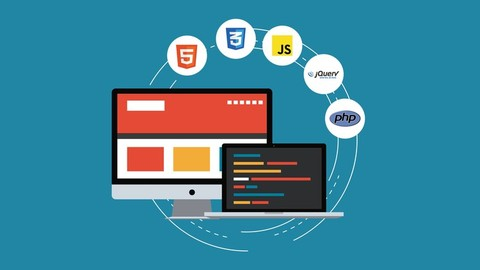

# 💾 Cursos:
---
# Curso Maestro de Python 3: Aprende Desde Cero

*Aprende a programar con clases y objetos, a usar ficheros y bases de datos SQLite, interfaces gráficas y más con Python!*

Bienvenidos al Curso Práctico de Django 2.x, el framework web de referencia para desarrollar backends con Python.

#### Este no es un curso cualquiera, estás ante un máster completo en el que aprenderemos:

  
Seguir leyendo...

  **Dividido en cuatro fases con 130+ lecciones entre presentaciones, apuntes, ejercicios solucionados paso a paso y quizs:**

  - Fundamentos de programación
  - Optimización y manejo de datos
  - Programación Orientada a Objetos
  - Temas avanzados (mirad el el programa para saber más)
  - En muchas lecciones se enseña con ejemplos y ejercicios reales de mi propia experiencia como programador, en lugar de simples ejemplos teóricos.

--- 

# Curso Práctico de Django: Aprende Creando 3 Webs

*Aprende Django 2.x desde cero mientras creas 3 didácticos proyectos y 10 apps reutilizables para futuros desarrollos.*

#### En este curso aprenderemos:

  
Seguir leyendo...

**Proyectos:**

- Web Personal: un proyecto básico de introducción al framework, basado en la creación de una web sencilla con un portafolio dinámico y un panel de administrador para manejar los proyectos del portafolio.
- Web Empresarial: un proyecto intermedio para practicar lo aprendido e introducir nuevos conceptos, basado en realizar la web de presentación de una cafetería con varias secciones dinámicas manejadas desde el panel de administrador.
- Web Playground: un proyecto avanzado y de especialización, centrado puramente en el backend. Aquí aprenderás a manejar la autenticación y el registro de usuarios, a crear secciones internas sólo para usuarios identificados, perfiles de usuario y lo mejor de todo: un sistema de mensajería privada.

**Lo que aprenderás**

- Cómo funciona Django 2 y su MVT basado en Modelos, Vistas y Templates
- A desarrollar una colección de 10 apps reutilizables para tus futuros proyectos.
- A crear tus propios backends, con panel administrable, listos para darles un uso real.
- También aprenderás a desplegar Django en un servidor de producción gratuito en la nube.
- Obtendrás experiencia práctica con proyectos reales, como una web personal o para un negocio.
- Serás un experto en el uso de las CBV, las Vistas Basadas en Clases.
- Cómo gestionar usuarios, autenticación, registro y perfiles utilizando los módulos nativos de Django.
- Aprenderás a crear peticiones asíncronas utilizando la API Fetch de JavaScript
- Te introducirás en el desarrollo guiado por pruebas: el TDD (Test Driven Development).
- Y docenas de funcionalidades más: Tags, Contextos, Formularios, Mixins, CRUD, Paginación, Señales, Managers, Tests...

---
# Master en Python: Aprender Python 3, Django, Flask y Tkinter

*Aprende a programar desde cero con Python 3 y desarrollo web con los frameworks Django 3 y Flask paso a paso (+30 horas)*

#### En este curso aprenderemos:

  
Seguir leyendo...

  - Programación desde cero y paso a paso, sin necesidad de tener conocimientos previos.
  - Python, uno de los lenguajes de programación más populares en la actualidad.
  - POO, Programación Orientada a Objetos en Python.
  - Bases de datos SQL, trabajando en conjunto con nuestros desarrollos.
  - Módulos y frameworks, para dar el salto profesional con Python.
  - Tkinter, para crear aplicaciones de escritorio con interfaz gráfica.
  - Desarrollo web, creando varios proyectos web.
  - Django, el framework de desarrollo web para Python más popular y demandado por las empresas.
  - Flask, el moderno framework para desarrollar aplicaciones web.
  - Habilidades full-stack, haciendo cientos de ejercicios, prácticas y proyectos completos.
  - Si quieres ser programador o desarrollador web profesional, o incluso si ya te dedicas al esto, aprender a trabajar con estas tecnologías y frameworks es casi obligatorio.
  - La metodología de aprendizaje es la ideal:
    - Todo explicado desde cero y paso a paso.
    - Decenas de horas de contenido en clases en vídeo (30 horas y subiendo).
    - Cientos de prácticas y ejercicios.

  **Al finalizar el curso:**
  - Sabrás programar y tendrás conocimientos para aplicarlos a cualquier lenguaje de programación.
  - Sabrás crear aplicaciones de escritorio.
  - Sabrás crear sitios y aplicaciones web.
  - Dominarás Python y sus frameworks más importantes (mencionados anteriormente) para desarrollar proyectos o aplicarlos a proyectos ya existentes.

  Durante las más de 30 horas del curso verás como desarrollar varios proyectos multiplataforma y haremos cientos de ejercicios con todo lo que enseñamos.

  **Algunos de los proyectos que desarrollaremos desde cero:**
  - Una aplicación de linea de comandos con Python y SQL.
  - Una aplicación de escritorio completa con Tkinter.
  - Varias aplicaciones web con Django.
  - Proyectos web con Flask.
  - Trataremos todos los temas paso a paso y poco a poco hasta conseguir un buen nivel en Programación, Python, MySQL, SQLite, POO, Tkinker, Django 3, Flask, etc.

---
# Django with React | An Ecommerce Website

*Construye una plataforma de comercio electrónico desde cero con `React`, `Redux`, `Django` y `Postgres`.*

#### En este curso aprenderemos:

  
Seguir leyendo...

#### En este curso, construiremos una aplicación de comercio electrónico / carrito de la compra completamente personalizada desde cero utilizando Django y REACT con la siguiente funcionalidad...

- Carrito de compras completo.
- Comentarios y valoraciones de productos.
- Carrusel de productos principales.
- Paginación de productos.
- Búsqueda de productos.
- Perfil de usuario con pedidos.
- Gestión de productos por parte del administrador.
- Gestión de usuarios administrativos.
- Página de detalles del pedido del administrador.
- Opción de marcar los pedidos como entregados.
- Proceso de compra (envío, forma de pago, etc.).
- Integración de PayPal / tarjeta de crédito.

#### Este no es un curso de documentación. Se trata de un curso en el que se puede participar y ensuciarse las manos y, al final, tener un proyecto real para utilizar y poner en su cartera. Usted aprenderá lo siguiente al completar este curso:

- React con Componentes Funcionales y Hooks.
- Enrutador React.
- Librería React-Bootstrap UI.
- Cómo estructurar los componentes.
- Estado a nivel de componente y props.
- Gestión del estado global con Redux (Actions & Reducers).
- Uso del estado Redux en los componentes (useDispatch & useSelector).
- Creación de un back end extenso con Express.
- Autenticación JWT (tokens web JSON).
- Manejador de errores personalizado.
- Integración de la API de PayPal.
- Despliegue del proyecto.

*Y mucho más...*

#### Este proyecto es una colaboración con `Brad Traversy` donde tomaremos su curso original de comercio electrónico MEARN Stack y lo construiremos con un backend `Django` en lugar de Node, JS y Express. Brad y yo decidimos que sería divertido rehacer exactamente el mismo proyecto con un backend/API de Django y conectarlo al mismo frontend/diseño de React.

*Mi esperanza es que aprendas no sólo a construir esta aplicación sino a añadirle tus propias características. Aprendemos mejor construyendo y personalizando nuestros propios proyectos.*

---
# Aprende programación básica con PHP

*Aprende las bases de la programación con el lenguaje PHP*

#### En este curso aprenderemos:

  
Seguir leyendo...

##### PHP es uno de los lenguajes de programación del momento, es sin duda el lenguaje en el lado del servidor más utilizado actualmente en el desarrollo de aplicaciones web  y cuenta con múltiples ventajas con respecto a otros.

En este curso irás desde un nivel cero aprendiendo poco a poco los fundamentos básicos de la programación usando PHP.

Al finalizar el curso entenderás como trabajar con los aspectos fundamentales de un lenguaje de programación y con las estructuras de control for, while, if, foreach usando PHP y tendrás la capacidad de seguir profundizando en el aprendizaje del lenguaje.

Trataremos los aspectos más importantes de un lenguaje, trabajo con variables, estructuras de control, parámetros GET, incluso haremos varios ejercicios prácticos.

Si quieres aprender lo básico de la programación con PHP sin dolor, practicando poco a poco, de forma fácil y en poco tiempo ¡este es tu curso!

Échale un vistazo al currículo del curso para ver todos temas que aprenderás.

Únete al curso y sin darte cuenta habrás aprendido las bases de la programación estructurada: ¡¡ Aprende programación básica con PHP !!

Tener las nociones básicas de la programación
Saber usar estructuras de control
Dar los primeros pasos con PHP

*¿Hay requisitos para realizar el curso?*
- HTML
- Trabajar con un sistema operativo

*¿Para quién es este curso?*
- Estudiantes
- Diseñadores
- Apasionados por la web

---
# Desarrollo Web Completo con HTML5, CSS3, JS AJAX PHP y MySQL

#### En este curso aprenderemos:

  
Seguir leyendo...

##### Lo que aprenderás

- Convertir y crear sus propios diseños en páginas web
- Crear páginas web con HTML y CSS
- Escribir código JavaScript y jQuery
- Crear sitios web dínamicos con PHP y MYSQL
- Entender como funciona JavaScript y PHP
- Aplicar a un empleo de Desarrollador Web Junior
- Aprende AJAX, para crear páginas web dínamicas que cargaran información sin recargar la página
- Agregar pagos de PayPal a tus sitios web
- Crear aplicaciones CRUD con PHP y MySQL
- Crear aplicaciones seguras con PHP, Ajax y MySQL
- Crear un área de administración con AdminLTE, PHP y MySQL

---
# 📚 Libros:
# Python API Development Fundamentals

#### Características principales

  
Seguir leyendo...

  - Profundice en el principio de la API RESTful
  - Aprender a construir una aplicación web escalable con la arquitectura de la API RESTfuly el framework Flask.
  - Conozca cuáles son las herramientas y la metodología exactas para probar sus aplicaciones y cómo utilizarlas.

  Lo que aprenderá:
  - Entender el concepto de una API RESTful.
  - Construir una API RESTful usando Flask y la extensión Flask-Restful.
  - Manipular una base de datos usando Flask-SQLAlchemy y Flask-Migrate.
  - Enviar correos electrónicos en texto plano y en formato HTML utilizando la API Mailgun.
  - Implementar una función de paginación utilizando Flask-SQLAlchemy.
  - Utilizar el almacenamiento en caché para mejorar el rendimiento de la API y obtener eficazmente la información más reciente.
  - Desplegar una aplicación en Heroku y probarla con Postman.

  Acerca de:
  Python es un lenguaje flexible que puede utilizarse para mucho más que el desarrollo de scripts. Conociendo el funcionamiento de las APIs RESTful de Python, podrás construir un potente backend para aplicaciones web y aplicaciones móviles usando Python.

  Darás tus primeros pasos construyendo una APIsencilla y aprendiendo cómo la interfaz web del frontend puede comunicarse con el backend. También aprenderás a serializar y deserializar objetos utilizando la librería marshmallow. A continuación, aprenderás a autenticar y autorizar a los usuarios utilizando Flask-JWT. También aprenderás a mejorar tus APIs añadiendo funciones útiles, como el correo electrónico, la carga de imágenes, la búsqueda y la paginación. Terminarás el libro desplegando tus APIsen la nube.

