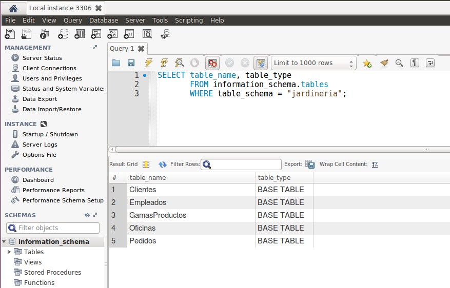
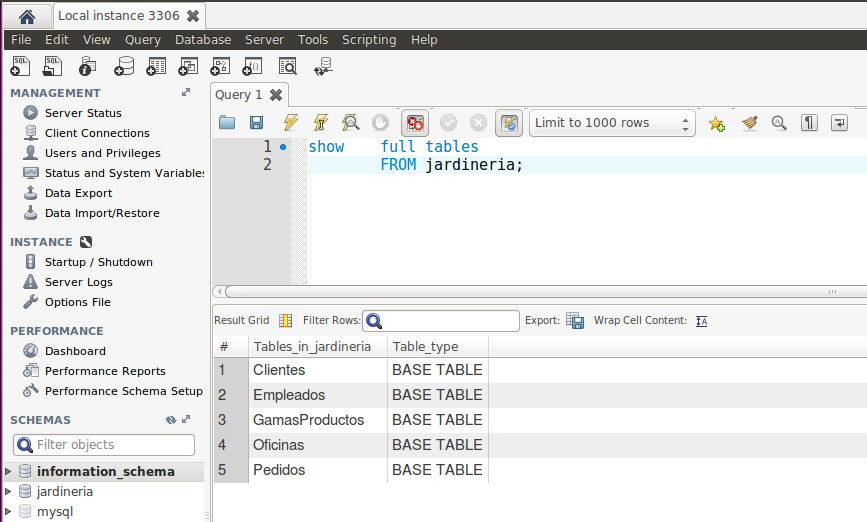
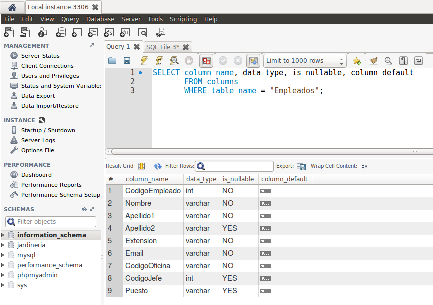
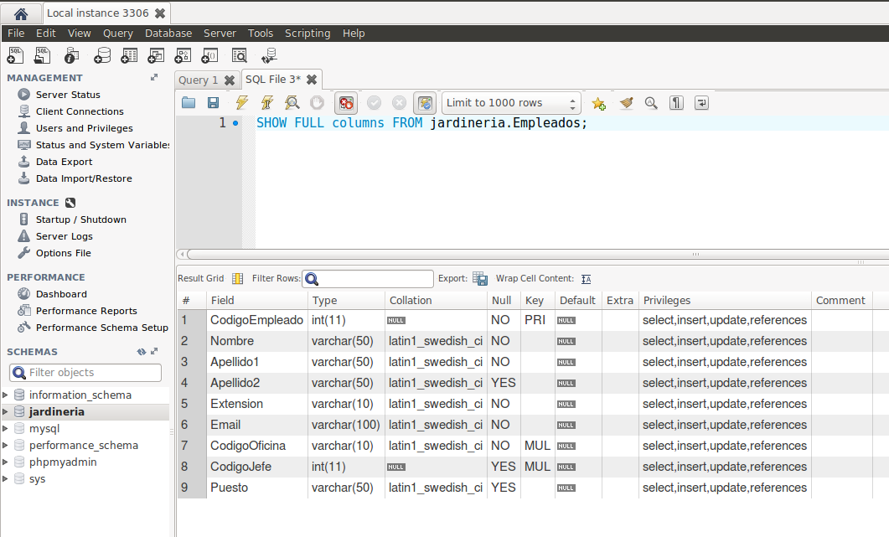

## Estructura del Diccionario de datos
Carlos Javier Oliva Domínguez

-----

- Interrogando la bases de datos Information_schema, extrae información (atributos `table_name`, `table_type`) sobre las tablas que conforman la base de datos `"jardineria"`.

  

- ¿Cuál es el comando SHOW equivalente al anterior?
  

- Repite lo mismo extrayendo la información sobre el esquema de una tabla en particular de la base de datos "jardineria" (atributos `column_name`, `data_type`, `is_nullable`, `column_default`). Usar tabla columns.
  

- ¿Cuál es el comando SHOW equivalente al anterior?
  

- Atendiendo a la base de datos "Information_schema", ¿cuáles son las tablas principales según tu criterio? Puedes ayudarte para ver todas las tablas utilizando Workbench. Para ello ir a preferencias y activar ver los metadatos.

  - Desde mi punto de vista, todas ellas son "principales" puesto que juegan un papel fundamental puesto que nos proporciona acceso a los metadatos de la base de datos, es decir, a los datos acerca de los datos, tales como el nombre de la base de datos o tabla, el tipo de datos de una columna, o permisos de acceso. Entiendo que si alguna faltara el funcionamiento no sería correcto.
