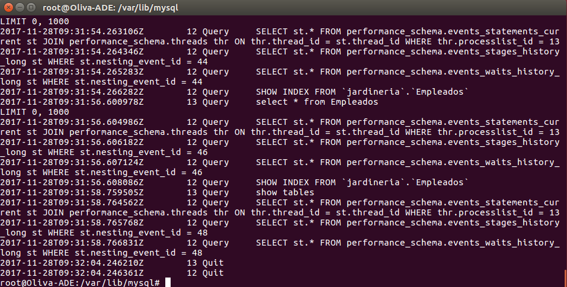

# Ficheros Log
### Ficheros LOG: Error LOG
Carlos Javier Oliva Domínguez

----
El fichero "Error Log" registra problemas encontrados iniciando, ejecutando o parando mysqld.

- Explica qué es y para qué sirve el `"ERROR LOG"`.

  El archivo `error.log` contiene un registro de los tiempos de inicio y apagado de mysqld. Sirve para almacenar mensajes de diagnóstico como errores, advertencias y notas que se producen durante el inicio y el apagado del servidor, y mientras el servidor se está ejecutando.

- Indica al servidor en "my.cnf" que registre los errores en un fichero llamado `"server_error"`.

  

- Reiniciamos el servidor y comprobaremos los mensajes visualizando dicho fichero en la ruta correspondiente.

  Ruta:

  

  Fichero:

  

- Detenemos el servidor abruptamente `systemctl stop mysql.service` y comprobaremos cómo se ha modificado dicho fichero.

  

- Prueba la función `"perror"` incluida en el directorio bin. ¿Cuál es su objeto?

  Veremos el nuevo acontecimiento en el Servidor mediante el archivo de error en cuestión.

  Antes de la función `perror`:

  

  Consulta erronea: Error `1064`

  

  Perror: Error `1064`

  

Como vemos en la imágen anterior, la función `PERROR` nos da una información sobre el error que hemos cometido en la consulta anterior.

### Ficheros LOG: General Query LOG
El fichero `"Global Query  Log"` registra las conexiones establecidas por los clientes y las sentencias ejecutadas por ellos.

- Explica qué es y para qué sirve el "GENERAL QUERY LOG"

  El `Global Query Log`  es un registro general de lo que está haciendo `mysqld`. El servidor escribe información en este registro cuando los clientes se conectan o desconectan, y registra cada instrucción SQL recibida de los clientes.

- Configura MySQL para registrar consultas generales en el fichero denominado "miserver.log".

  

  Guardaremos los cambios:

  

- Comprueba su funcionamiento haciendo que un compañero se conecte a tu servidor y ejecute varias consultas.

  Primeramente vamos a crear un usuario para el compañero Victor.

  

  El compañero Victor se ha conectado al Servidor desde su máquina, podemos ver su dirección IP.

  

- Averigua viendo el fichero "miserver.log" la hora en que se conectó tu compañero y ejecutó las consultas del apartado anterior.

  

- Accede al servidor a través de Workbench. ¿Qué se registra en "general_log"?¿Hay alguna diferencia respecto al cliente mysql ?

  Haremos primeramente un `tail -f` del archivo `miserver.log` para ver su estado actual:

  

  Ahora accederemos desde Workbench y veremos el resultado en a siguiente captura.

  

  Cerraremos el Workbench y accederemos al Servidor mediante consola con `mysql -u root -p` y veremos el resultado.

  Podemos decir que a la hora de acceder mediante consola, la información de los log es mucho más concisa y acotada en comparación cuando accedemos desde Workbench.

  

  Fin de la práctica.
  
