## U1_A3.- Instalación de MySQL Server en Ubuntu
Carlos Javier Oliva Domínguez

----
*En la siguiente práctica vamos a proceder a la instalación de MySQL Server en el Sistema Operativo Ubuntu Desktop 16.4 .*

El primer paso será hacer la instalación base del Servidor desde el repositorio.

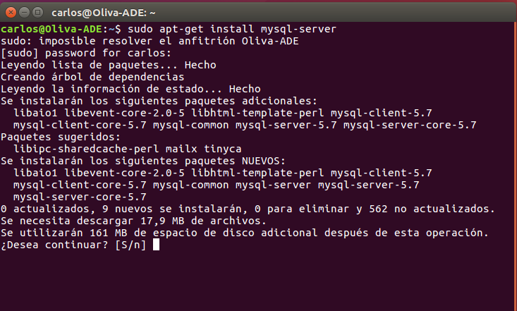

Como parte del proceso de instalación, el asistente, nos pedirá poner una contraseña para el usuario root.

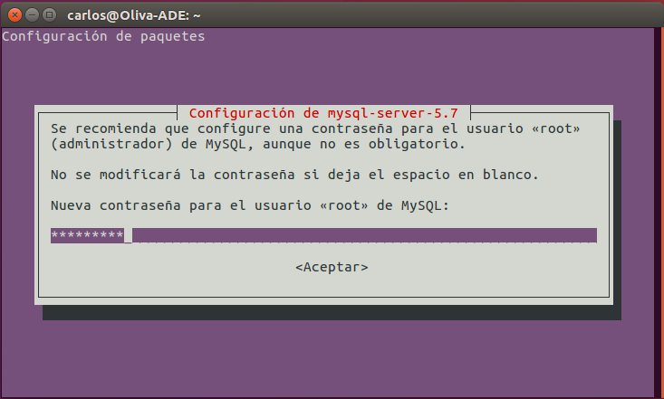

Ahora haremos un reinicio del servicio y comprobaremos que todo esté funcionando correctamente.

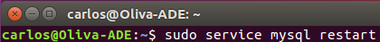

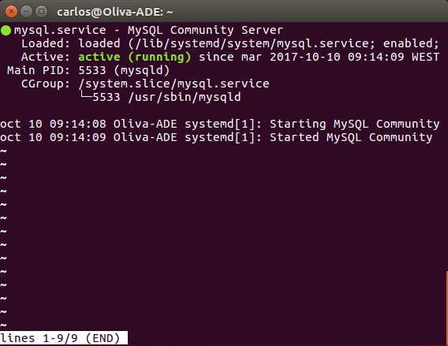

Una vez finalizada la instalación, vamos a instalar el cliente, también desde el gestor de paquetes.

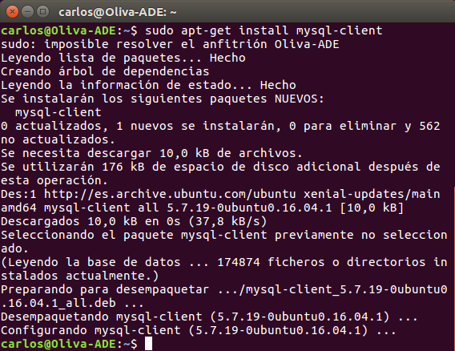

Ahora reiniciaremos el demonio mysqld, que arranca el núcleo de SGBD. Comprobamos que está corriendo el proceso con: `pps aux | grep mysql`.

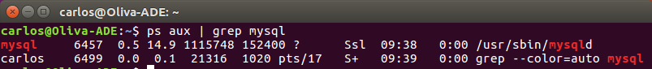

Lo siguiente que haremos será comprobar el funcionamiento del Servidor utilizando el programa cliente del servidor MySQL.

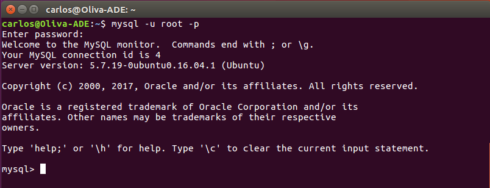

Comprobaremos la seguridad mediante `mysql_secure_installation`.

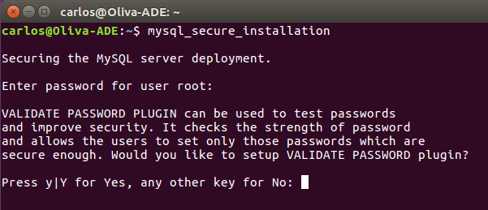

En este punto, podemos determinar la fortaleza de la contraseña.

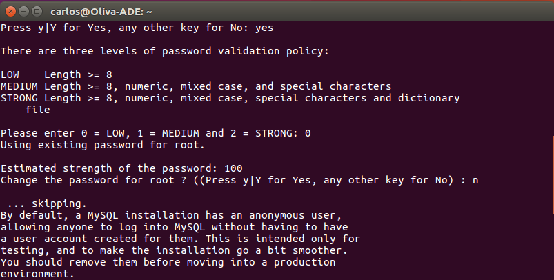

Aquí eliminaremos los usuarios anónimos, para que sea root el único que tenga permitida la conexióna localhost.

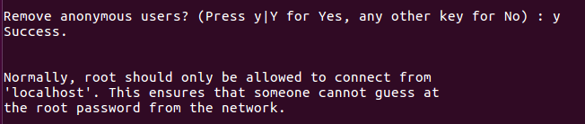

También vamos a desactivar el acceso remoto para el usuario root, con el objetivo de bridnar una mayor seguridad.

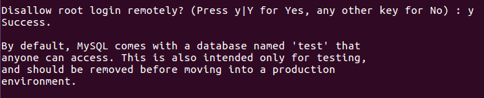

Vamos elegir que no queremos borrar la Base de Datos "test".

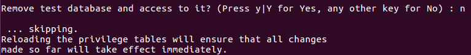

Recargaremos la tabla de privilegios.

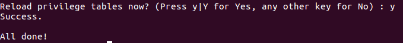

El siguiente punto importante será instalar la aplicación de gestión `Workbench.`

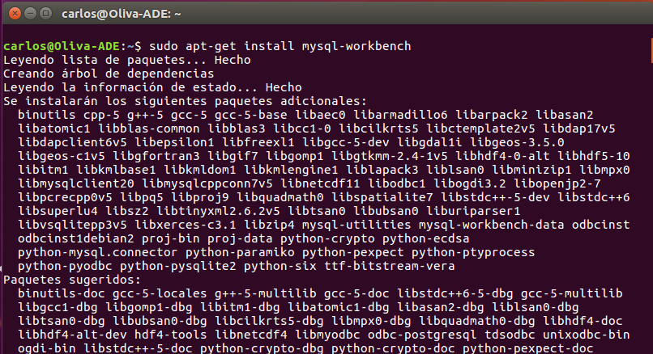

Ahora vamos a instalar `PhpMyAdmin` sobre `Apache2`que nos permitirá administrar nuestras bases de datos desde una interfaz gráfica.

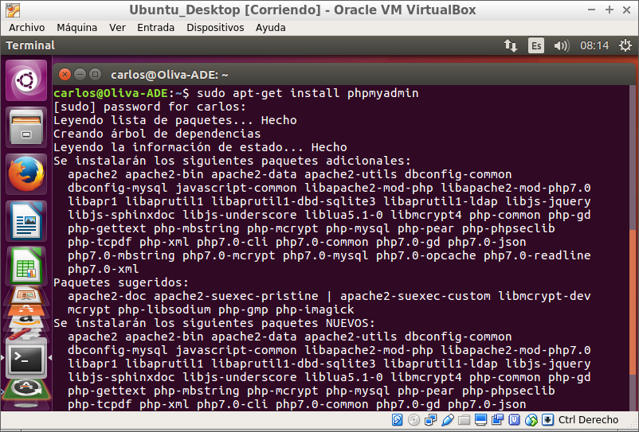

Elegiremos `Apache2` como servidor web.

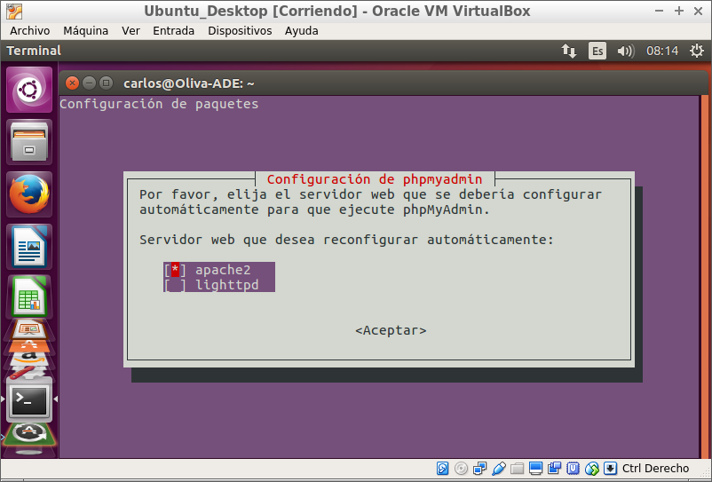

Antes de poder usar `PhpMyAdmin` necesitaremos instalar la base de datos por defecto del propio `PhpMyAdmin` para su correcto funcionamiento.

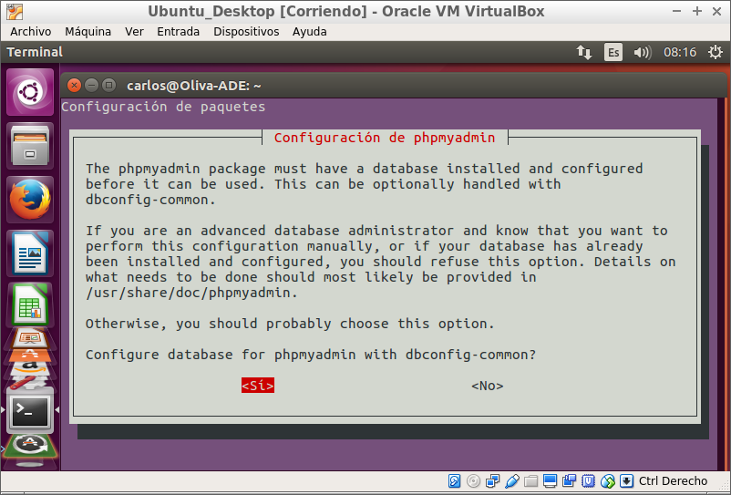

tras los pasos anteriores nos dirigiremos a un navegador web y mediante `localhost/phpmyadmin` accederemos a la interfaz de nuestro Gestor de Bases de Datos.

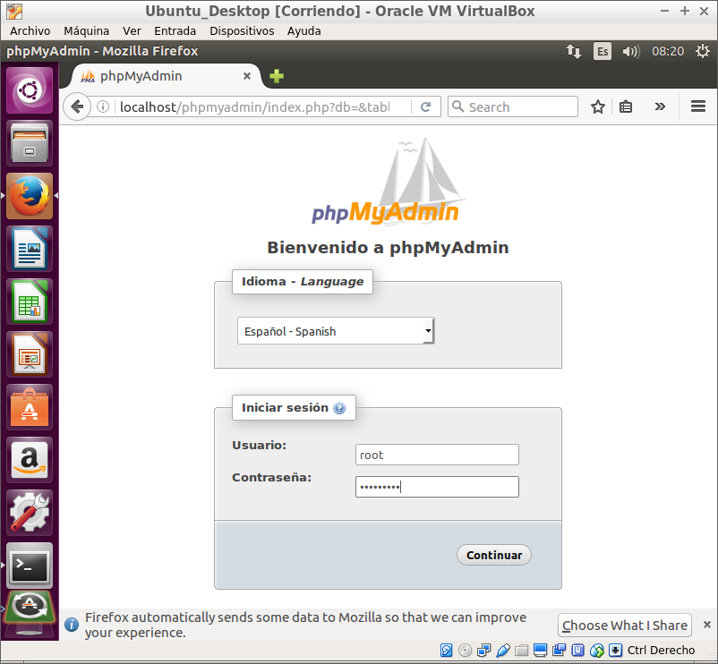

Podemos ver la interfaz con las distintas opciones e información necesarias para la gestión de una Base de Datos.

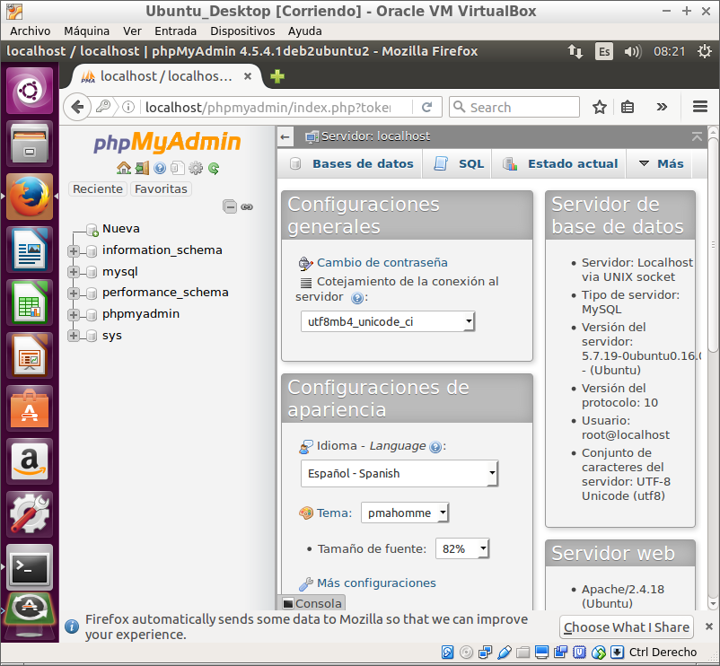

Tras la instalación vamos a indicar las rutas de:
* Direcctorio de instalación.

  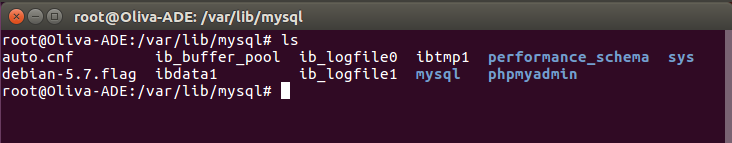

* Directorio y Servicio Demonio.

  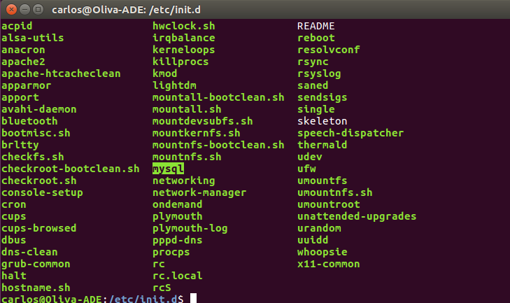

* Directorio de datos.

  

* Fichero `my.cnf` y localización.

  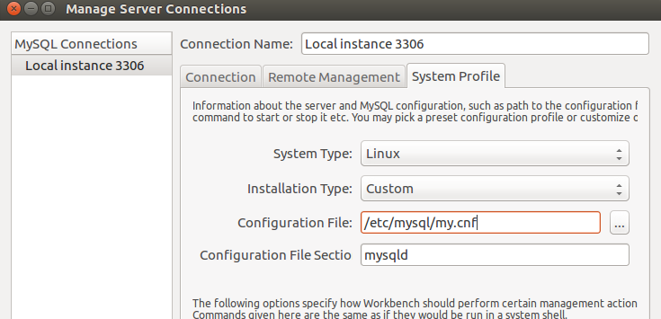

* Veremos que el propietario de la instalación es el usuario `mysql`.

  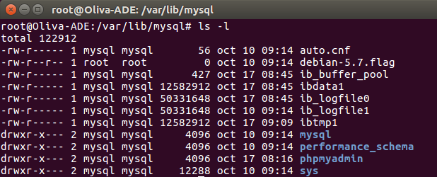

* Aplicaremos el lenguaje Español al archivo de mensajes de error.

  

Tras las configuraciones realizadas, nuestro sistema estará listo para albergar las Bases de Datos que necesitemos y para su correspondiente administración si así fuera preciso.

Fin de la práctica.
