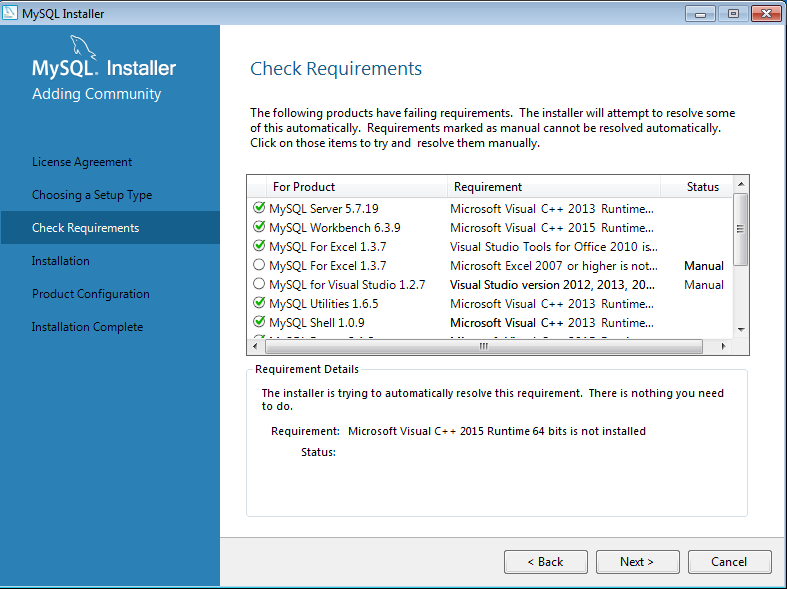
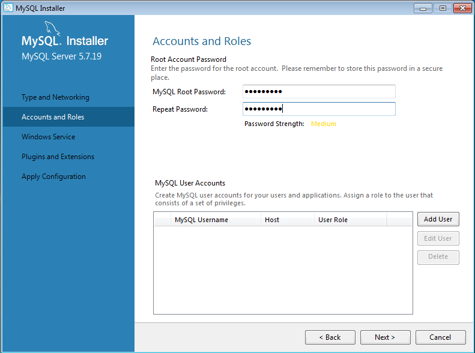
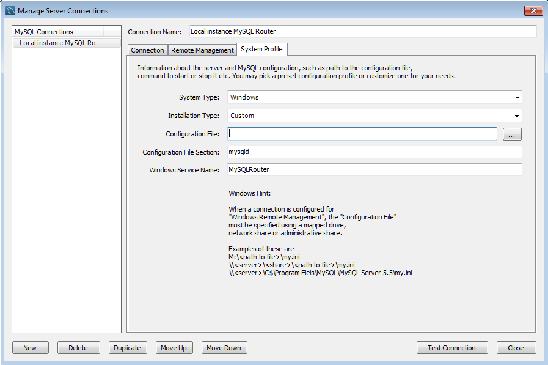

     **U1_A2.-Instalación de MySQL Community sobre Windows**

Carlos Javier Oliva Domínguez
****
*En esta práctica vamos a proceder a la instalación de MySQL Community sobre el sistema operativo Windows.*

Para ello iremos a la página oficial donde descargaremos el instalador.

Tras la ejecución del instalador que hemos descargado con anterioridad nos saldrán una serie de ventanas informativas y de configuración.

El tipo de instalación que elejiremos será "DEVELOPER".

FInalizado el proceso de comprobación de requisitos nos saldrá la ventana de instalación, donde nos muestra los productos que están listos para ser instalados.

En este punto la instalación ha fallado puesto que falta un paquete de Windows necesario para su instalación.

Para solucionar el error de la instalación de MySQL Server vamos a instalar Microsoft Visual 2013, puesto que es un requisito esencial para la instalación del MySQL Server.

En la siguiente ventana vamos a elegir el producto MySQL Server a la lista de productos que van a ser instalados.

Finalizado el proceso anterior, comprobamos que el MySQL Server se ha instalado correctamente.

Tras la instalación de MySQL Server nos toca configurarlo correctamente con las características que deseamos.

Para ello elegimos el método estandar.

Aplicaremos un tipo de configuración "Development Machine" puesto que esta será nuesta máquina de desarrollo. La configuración del puerto será por defecto.

Ahora vamos a añadir una clave para el usuario ROOT.

* *Tenemos la posibilidad de añadir distintos usuarios pero en este caso no los añadiré puesto que no es necesario, podemos acceder con el usuario root más tarde y añadir nuevos usuarios.*

La siguiente ventana nos muestra la configuración del Servicio de Windows, yo he dejado el nombre y las configuraciónes por defecto.

Aquí podemos ver que todos los pasos de configuración han sido ejecutados correctamente.

EN la siguiente imágen vemos el servicio que hemos configurado anteriormente, funcionando de forma correcta en local.

Aquí podemos ver la interface del MySql Server, mostrando en la barra lateral izquierda, las bases de datos que tenemos instaladas en nuestro sistema.

*En mi caso solamente sale una Base de Datos puesto que cuando falló el proceso de instalación y añadí posteriormente el MySQL Server para su instalación, elegí una instalación simple, sin Bases de Datos de prueba.*

A la hora de configurar la aplicación Workbench se me ha presentado un problema con el archivo de configuración, puesto que el sistema no lo había predefinido, tuve que hacerlo manualmente.

Simplemente añadiendo dicho archivo de configuración (`my.ini`) en `Configuration File`.

Una vez definido el archivo de configuración del Workbench tendremos varios parámetros como por ejemplo:
- Configurar las conexiones TCP/IP

  

- Administrar usuarios:

  En este apartado he procedido a la configuración de siertos parámetros del usuario root como (contraseña, account limits, etc.).

  

  También he optado por la creación de un usuario con mi primer apellido como nombre, para tener acceso desde Workbench sobre la base de datos que definamos.

  

Finalmente ejecutamos el "Command Line Client" con el que podremos administrar las Bases de Datos de nuestro sistema mediante consola.

El siguiente paso que haremos será la instalación del xampp pero con los servicios `Apache` y `phpMyAdmin`  únicamente.

Tras la instalación veremos la típica intercace de xampp que nos muestra distintas acciones para el servidor Apache.

Lo siguiente que haremos será localizar el archivo de configuración de phpMyAdmin `config.inc.php`. Desde donde podremos modificar todas las configuraciones referentes a phpMyAdmin.

Vamos a buscar la siguiente línea de texto y pondremos una contraseña al usuario root dentro del gestor de bases de datos phpMyAdmin.

Ahora, dentro de la ruta de phpMyAdmin, buscaremos el script de creación de tablas de la Base de Datos `phpMyAdmin`.

Importamos dicho script a nuestro Workbench y nos muestra los distintos parámetros que tendrá la nueva Base de Datos.

Tras ejecutar el script anterior, podemos comprobar que la Base de Datos de prueba llamada `phpMyAdmin`.

Ahora vamos a crear el usuario pma dentro de phpMyAdmin.

Volveremos al archivo `config.ini.php` y modificaremos los datos del usuario pma.

Finalemente, como podemos ver, nuestro phpMyAdmin se encuentra perfectamente configurado.

Fin de la práctica.
