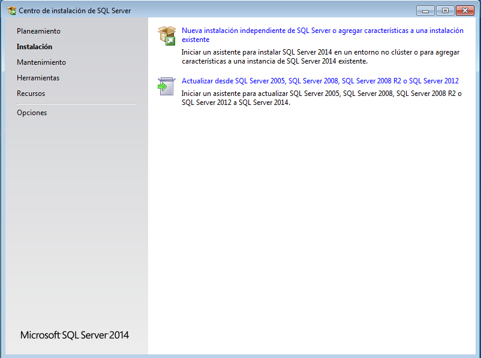
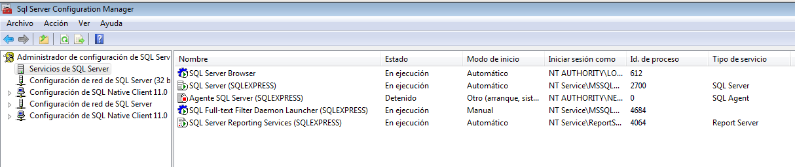

## Instalación de SQL Server 2014 Express
Carlos Javier Oliva Domínguez

----
*Instalación de SQL Server Express 2014 y Management Studio en un servidor Windows 7.*

Comenzaremos con la descarga de `SQL Server 2014 Express`.

Vamos a elegir la versión de 64bit.

El siguiente paso será la instalación del programa, para ello elegiremos `Nueva instalación independiente de SQL Server`.

En este punto vamos a elegir las características que queremos que tenga nuestro SQL Server.

Elegiremos una nueva Instancia y pondremos por nombre `SQLExpress`.

En la siguiente foto nos aparece la configuración del servidor, la dejaremos por defecto.

EN el siguiente apartado podremos configurar el modo de autenticación para acceder al servidor.

En mi caso he elegido `Autenticación de Windows`, pero este modo podremos cambiarlo posteriormente.

Aquí tenemos un resumen de la correcta instalación de los servicios instalados anteriormente.

Finalizada la instalación, se empezará a cargar la configuración de usuario.

Podemos ver las características/herramientas que se han instalado.

Ejecutaremos `Microsoft SQL Server 2014`.

Ahora vamos a loggear en la aplicación. Previamente he entrado, activado y configurado el usuario `sa` para hacer uso de la autenticación `SQL Server`.

Tras entrar podemos ver nuestro servidor SQL.

Ahora vamos a configurar `SQL Server Browser` porque por defecto está detenido, tendremos que activarlo.

Podremos ver que el servicio ha sido activado correctamente.

Ahora vamos a activar la conexión del cliente a nuestro Servidor. Para ello lo configuraremos en `SQL Native Client`.

Lo siguiente será activar el protocolo de SQLExpress `TCP/IP`.

#### Comprobación desde el cliente.
*En este punto vamos a hacer la comprobación, conectándonos desde un cliente a nuestro Servidor SQLExpress y conectándonos a un SQLExpress desde nuestro cliente*

Para ello voy a hacer la conexión a la máquina de mi compañero Oscar Moreira, mediante la dirección ip de su máquina.

Tras iniciar sesión, vemos la información del Servidor del compañero.

Tras esto, el compañero se ha conectado a mi Servidor SQL mediante la ip que le he proporcionado.

Como podemos ver en la imágen anterior, el compañero pudo entrar a mi Servidor SQL y ver la información del mismo.

Fin de la práctica.
