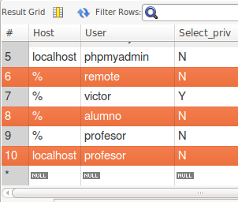
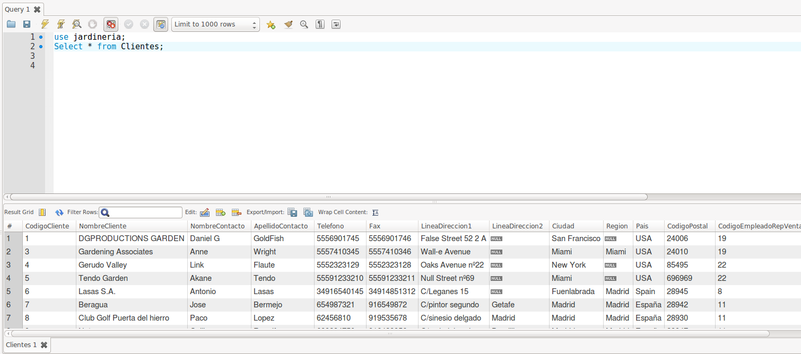
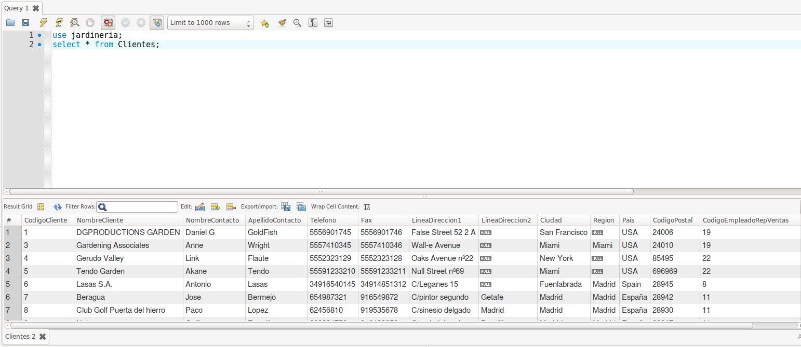

# Práctica Usuarios y Privilegios MySQL
Carlos Javier Oliva Domínguez

----
1. Ejecuta MySQL Workbench y activar la base de datos 'Jardinería'. En caso de que no dispongas de ella, puedes generarla con el script SQL que hay en el moodle. Abrir una nueva ventana de consulta y realizar las siguientes acciones mediante órdenes SQL.

# Anotaciones
    - Mostrar privilegios usuario: `show grants for 'profesor'@'localhost';`

    - Salida:
~~~
      # Grants for profesor@localhost
      'GRANT USAGE ON *.* TO \'profesor\'@\'localhost\''
      'GRANT SELECT ON `jardineria`.* TO \'profesor\'@\'localhost\''
~~~

2. Crear un usuario llamado “alumno” que tenga acceso a las tablas CLIENTES, EMPLEADOS, PRODUCTOS desde cualquier lugar.

    - Crear usuario:

    `CREATE USER 'alumno'@'%'IDENTIFIED BY '1990Carlos#';`

    `%` supone dar acceso desde cualquier lugar.

    - Permisos:
~~~
      GRANT SELECT ON jardineria.Clientes
      TO 'alumno'@'%'
      IDENTIFIED BY '1990Carlos#';

      GRANT SELECT ON
      jardineria.Empleados
      TO 'alumno'@'%';

      GRANT SELECT ON
      jardineria.GamasProductos
      TO 'alumno'@'%';
~~~

    - Nuevos permisos:
~~~
    show grants for 'alumno'@'%';
~~~
    - Salida
~~~
    # Grants for alumno@%
    'GRANT USAGE ON *.* TO \'alumno\'@\'%\''
    'GRANT SELECT ON `jardineria`.`Empleados` TO \'alumno\'@\'%\''
    'GRANT SELECT ON `jardineria`.`Clientes` TO \'alumno\'@\'%\''
    'GRANT SELECT ON `jardineria`.`GamasProductos` TO \'alumno\'@\'%\''
~~~
3. Crear un usuario llamado “profesor” que tenga permiso de lectura a toda la base de datos desde localhost.
    - Crear usuario:

    `CREATE USER 'profesor'@'%'IDENTIFIED BY '1990Carlos#';`

    - Permisos:
~~~
      GRANT SELECT ON jardineria.
      *
      TO '
      profesor'@'localhost';
~~~

4. Comprueba la creación y las características de estos nuevos usuarios consultando la tabla mysql.user.

  - Comando:
    `SELECT * FROM mysql.user;`

  - Salida:

    

  - Comando:
    `SELECT * FROM mysql.tables_priv;`

  - Salida:
~~~
    # Host, Db, User, Table_name, Grantor, Timestamp, Table_priv, Column_priv
    'localhost', 'mysql', 'mysql.session', 'user', 'boot@connecting host', '0000-00-00 00:00:00', 'Select', ''
    'localhost', 'sys', 'mysql.sys', 'sys_config', 'root@localhost', '2017-10-10 09:14:03', 'Select', ''
    '%', 'jardineria', 'alumno', 'Clientes', 'root@localhost', '0000-00-00 00:00:00', 'Select', ''
    '%', 'jardineria', 'alumno', 'Empleados', 'root@localhost', '0000-00-00 00:00:00', 'Select', ''
    '%', 'jardineria', 'alumno', 'GamasProductos', 'root@localhost', '0000-00-00 00:00:00', 'Select', ''
~~~

5. Establecer nuevas conexiones a la instancia de BD con los usuarios 'alumno' y 'profesor' y comprobar sus niveles de acceso respectivo sobre las diferentes tablas de la BD 'jardineria'.

  Comprobación desde alumno:

  

  Comprobación desde profesor:

  

6. Modifica la contraseña de 'alumno'. Comprobar la conexión con la nueva contraseña.
7. Modifica el host desde donde pueda acceder el alumno a una dirección IP determinada (del propio servidor o un cliente). Soluciona los problemas que pueda presentar esta modificación.
8. Comprueba que el usuario alumno puede conectar sólo desde la máquina con la IP asignada.
9. Vuelve a la ventana de root y concede derechos de consulta al usuario alumno sobre la tabla PEDIDOS. Comprueba, mediante una nueva conexión del usuario 'alumno' que tiene este nuevo acceso.
10. Crear un usuario llamado “profesor_cli” con los privilegios de 'profesor' y, también, los privilegios de inserción y borrado en la tabla CLIENTES.
11. Conecta como 'profesor_cli' y comprueba sus privilegios sobre las diferentes tablas de 'jardineria'.
12. Crear un usuario llamado “administrador” que tenga todos los privilegios a todas las bases de datos de nuestro servidor mysql. Este administrador no tendrá la posibilidad de dar privilegios.
13. Crear un usuario llamado “superadmin” con los privilegios anteriores y con posibilidad de conceder privilegios a otros usuarios.
14. Quitar los privilegios al usuario “profesor_cli” para actualizar la tabla CLIENTES.
15. Eliminar todos los privilegios al usuario 'profesor'.
16. Actualizar los privilegios.
17. Muestra los privilegios de usuario 'profesor'.
18. Consulta todos los usuarios existentes.
