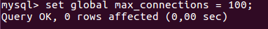

## Fichero de Opciones y variables de servidor   
Carlos Javier Oliva Domínguez

----
Ajustar variables con Ficheros de Opciones.

Cuando queremos que las opciones sean permanentes lo normal es hacer que los programas de MySQL (mysqld entre ellos) puedan leer opciones de inicio desde ficheros de opciones (también llamados ficheros de configuración). Estos proporcionan una forma conveniente de especificar opciones comúnmente usadas. Este fichero determina el funcionamiento de nuestro servidor.

### 1. Ficheros de configuración

Encuentra el fichero `my.ini` o `my.cnf` de tu instalación de MySQL (podría no estar en una ubicación no estándar).

Archivo de configuración en Linux:

Archivo de configuración en Windows:

- ¿Cómo se escribe un comentario en este fichero?
- ¿Y un grupo de opciones?
- ¿Todas las opciones tienen un valor?

Ejecutamos `"mysqld --verbose --help"` desde una consola para ver una lista de las variables del servidor.

Explica que significan y que se consigue con cada una de las variables del siguiente fichero de configuración
~~~
[client]
port=3306
password="telesforo";

[mysqld]
port=3306
key_buffer_size=16M
max_allowed_packet=8M

[mysqldump]
quick
~~~
### 2. Variables del servidor
Si queremos guardar el resultado de una consulta SQL en un fichero de texto, debemos construir la consulta del siguiente modo, ejemplo con un SELECT utilizando INTO OUTFILE :

SELECT * INTO OUTFIELD '/var/lib/mysql-files/volcadosql.txt'
FROM tabla
WHERE ... ;

### 2.1 Mysql

MySQL soporta varios motores de almacenamiento (storage engine)que tratan con distintos tipos de tabla. Los motores de almacenamiento de MySQL incluyen algunos que tratan con tablas transaccionales y otros que no lo hacen. Normalmente se utiliza MyISAM para lecturas rápidas e InnoDB para transacciones e integridad referencial. Si deseamos cambiar el motor por defecto para la creación de nuevas tablas en MySQL, debemos añadir la siguiente línea al ficher my.cnf (Linux) o my.ini (Windows), en este caso sería para poner como motor por defecto MyISAM:
~~~
default-storage-engine=MyIsam

Si quisiéramos poner por defecto InnoDB:

default-storage-engine=InnoDB
~~~
- Define que son las variables del servidor.

  Las variables del Servidor indican cómo está
  configurado un Servidor. Todas ellas tienen valores por defecto. Pueden cambiarse al
  arrancar el servidor usando opciones en la línea de comandos o en ficheros
  de opciones. La mayoría de ellos pueden cambiarse en tiempo de ejecución
  usando el comando SET.

  El servidor mysqld mantiene dos clases
  de variables. Las variables globales afectan las operaciones globales del
  servidor. Las variables de sesión afectan las operaciones para conexiones
  individuales de clientes.

- Usa el comando `"SHOW VARIABLES"` para conocer el valor de todas las variables y enviar el resultado a un fichero.

- Repite lo anterior para mostrar solo las variables relacionadas con el motor "InnoDB".

- Para gestionar variables tenemos, como hemos visto, el comando SHOW "comando":
  - cómo mostrar todos los motores de almacenamiento

    

  - cómo mostrar el estado actual del servidor

    

  - cómo averiguar todos los clientes que están conectados al servidor

    

  - cómo conocer todas las tablas que están abiertas

    

### 2.2 Variables de estado
Define que son las variables de estado.

- Usa el comando `"SHOW STATUS"` para conocer el valor de todas las variables..

  

- Haz que uno o más de tus compañeros se conecte a tu servidor (puede que por cuestión de permisos no os podáis conectar).

  Oscar Moreira se conectará a mi servidor.

- Comprueba quién está conectado usando el comando correspondiente (Pista: es un comando visto SHOW XYZ).

  

- Intenta desconectarlo con el comando `"kill"`.

  

- ¿Cuántas consultas se están ejecutado hasta el momento en tu servidor MYSQL? ¿Y si se trata de consultas lentas?

  

- Un estado informa  el sobre el máximo de conexiones concurrentes que se ha dado en la sesión de trabajo. ¿Cuál es?

- Son aquellas que son modificables en tiempo de ejecución.

### 2.3 Variables dinámicas
- Son aquellas que son modificables en tiempo de ejecución.
- 1. Detalla los posibles atributos que tendría una variable de servidor como `"port"`.

  - Command-Line Format: `--port=#`
  - Name: `port`
  - Variable Scope: `global`
  - Dynamic Variable: `no`
  - Type: `integer`
  - Default: `3306`
  - Min Value: `0`	 
  - Max Value: `65535`

- 2. ¿Cómo podemos saber si una variable es dinámica o no?

  - Si va cambiando con el tiempo, por ejemplo `show status like "%uptime%";`

- 3. ¿Qué hace la variable `"uptime"`?

    - Indica su valor en tu servidor

      

    - ¿Es posible modificar su valor con comando SET?
      - NO

- 4. Localiza la variable que establece el límite de conexiones concurrentes.

  - ¿Cuál es?
    - `max_connections`

  - Modifícala y establece un máximo de 100 conexiones concurrentes.

    
