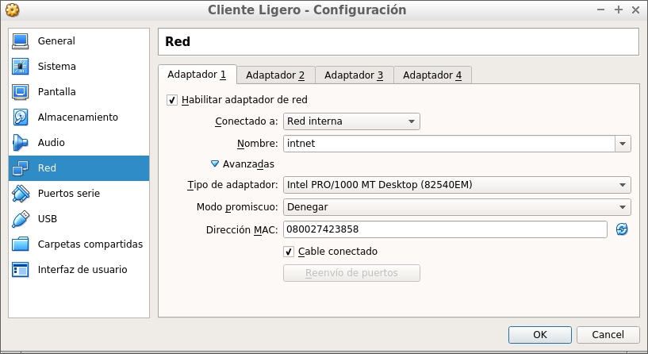

CARLOS JAVIER OLIVA DOMÍNGUEZ 2º ASIR

**1. Clientes ligeros con LTSP/Ubuntu**

Para esta práctica vamos a necesitar:

* 1 máquina virtual con Ubuntu Desktop que vamos a usar de servidor.

* 1 máquina virtual con Ubuntu Desktop que va a actuar como cliente.

**2.0 Máquina Servidor**

Vamos a comenzar las configuraciones del Servidor y para ello tenemos que tener en cuenta lo siguiente.

Debemos usar dos tarjetas de red:

- La primera en `Adaptador Puente` que va a actuar como red `Externa` y va a contar con la siguiente información de red:

  -  Dirección ip: `172.18.6.41`
  -  Máscara de Subred: `255.255.0.0`
  -  Puerta de enlace: `172.18.0.1`
  -  Servidor DNS: `8.8.4.4`

- La segunda en `Red Interna` que va a actuar como red `Interna` y va a contar con la siguiente información de red:

  -  Dirección ip: `192.168.67.1`
  -  Máscara de Subred: `255.255.255.0`

**2.1 Comprobación de configuraciones**

Vamos a incluir una serie de comandos para comprobar las configuraciónes del Servidor.

- Aquí nos mostrará la información de las tarjetas de red:

- Seguidamente comprobamos la `Tabla de Rutas IP` del servidor.

- Con la siguiente linea podemos ver el nombre de la máquina.

**2.2 Creación de usuarios**

Ahora nos disponemos a crear tres usuarios. Para ello vamos a usar nuestro `Primer Apellido` añadiendo un número al final:

Comprobación dentro del Servidor:

**3.0 Instalar el servicio LTSP**

Para comenzar, instalaremos el `OpenSSH-Server` para tener acceso remoto a la máquina.

- Modificamos la configuración del SSH para permitir acceso a root.

- Ahora vamos a instalar el servidor de `Clientes Ligeros`.

**3.1 Creación de la imágen ISO**

- Ahora vamos a crear un imagen del SO a partir del sistema real haciendo `ltsp-build-client`. La imagen del SO se cargará en la memoria de los clientes ligeros.

- Comprobamos que la `imágen ISO` se ha creado satisfactoriamente.

- Consultamos el fichero de configuración `/etc/ltsp/dhcpd.conf`.
- Comprobaremos las rutas de `option root-path /opt/ltsp/amd64` y de `filename /ltsp/amd64/pxelinux.0`.

En este punto modificaremos el valor `range 192.168.67.1XX 192.168.67.2XX`. Donde XX es el número de puesto de cada alumno.

Ahora reiniciaremos el servidor y comprobamos que los siguientes servicios están en marcha.

**4. Preparar MV Cliente**

Crearemos la MV cliente en VirtualBox:

- Sin disco duro y sin unidad de DVD.
- Sólo tiene RAM, floppyTarjeta de red PXE en modo "`red interna`".
- Configurar memoria gráfica a 128MB y habilitar el soporte 3D.

Realizadas las configuraciones de la máquina cliente, pocedemos a arrancarla para comprobar su funcionamiento.

*Hemos llegado al final de la práctica pero hemos tenido problema con el inicio de la máquina cliente, no estamos seguros aún de como solucionar este problema, la pantalla se divide en dos.*

