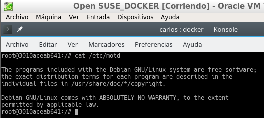

# Docker
Carlos Javier Oliva Domínguez

---
## 1. Introducción

Es muy común que nos encontremos desarrollando una aplicación y llegue el momento que decidamos tomar todos sus archivos y migrarlos ya sea al ambiente de producción, de prueba o simplemente probar su comportamiento en diferentes plataformas y servicios. Para situaciones de este estilo existen herramientas que, entre otras cosas, nos facilitan el embalaje y despliegue de la aplicación, es aquí donde entra en juego Docker.

Esta herramienta nos permite crear lo que ellos denominan contenedores, lo cual son aplicaciones empaquetadas auto-suficientes, muy livianas que son capaces de funcionar en prácticamente cualquier ambiente, ya que tiene su propio sistema de archivos, librerías, terminal, etc.

Docker es una tecnología contenedor de aplicaciones construida sobre LXC.
## 2. Requisitos
Vamos a usar MV OpenSUSE. Nos aseguraremos que tiene una versión del Kernel 3.10 o superior (uname -a).

## 3. Instalación y primeras pruebas
- Ejecutar como superusuario:

    zypper in docker              # Instala docker
    systemctl start docker        # Inicia el servicio
                                  # "docker daemon" hace el mismo efecto

    docker version                # Debe mostrar información del cliente y del servidor
    usermod -a -G docker USERNAME # Añade permisos a nuestro usuario

Instalación:

Versión:

- Salimos de la sesión y volveremos a entrar con nuestro usuario.

  

- Ejecutaremos estos comandos con nuestro usuario para comprobar que todo funciona:

      docker images           # Muestra las imágenes descargadas hasta ahora
      docker ps -a            # Muestra todos los contenedores creados
      docker run hello-world  # Descarga y ejecuta un contenedor con la imagen hello-world
                              # Sólo se muestra unos mensajes en pantalla.

    docker images
    docker ps -a            # El contenedor está estado 'Exited'

## 4. Configuración de la red
Habilitar el acceso a la red externa a los contenedores

Para openSUSE13.2 (cuando el método de configuracion de red es Wicked). Yast -> Dispositivos de red -> Encaminamiento -> Habilitar reenvío IPv4

Reiniciar el equipo para que se apliquen los cambios.

## 5. Creación manual
Nuestro SO base es OpenSUSE, pero vamos a crear un contenedor Debian8, y dentro instalaremos Nginx.

## 5.1 Crear una imagen manualmente
Enlace de interés: Cómo instalar y usar docker
~~~
docker images          # Vemos las imágenes disponibles localmente
docker search debian   # Buscamos en los repositorios de Docker Hub
                       # contenedores con la etiqueta `debian`
~~~

~~~
docker pull debian:8   # Descargamos una imagen `debian:8` en local
docker images
docker ps -a           # Vemos todos los contenedores
docker ps              # Vemos sólo los contenedores en ejecución
~~~

- Vamos a crear un contenedor con nombre con_debian a partir de la imagen debian:8, y ejecutaremos /bin/bash:

`docker run --name=con_debian -i -t debian:8 /bin/bash`

(Estamos dentro del contenedor)
~~~
root@IDContenedor:/# cat /etc/motd            # Comprobamos que estamos en Debian
~~~

`apt-get update`

`apt-get install -y nginx` # Instalamos nginx en el contenedor

`apt-get install -y vim`   # Instalamos editor vi en el contenedor

`/usr/sbin/nginx`          # Iniciamos el servicio nginx

`ps -ef`

- Creamos un fichero HTML (`holamundo.html`).

  `echo "
Hola nombre-del-alumno
" > /var/www/html/holamundo.html`

  

- Creamos tambien un script /root/server.sh con el siguiente contenido:

~~~
  #!/bin/bash

  echo "Booting Nginx!"
  /usr/sbin/nginx &

  echo "Waiting..."
  while(true) do
    sleep 60
  done
~~~

Para que el `script.sh` funcione tendremos que darle permisos de ejecución.

- Ya tenemos nuestro contenedor auto-suficiente de Nginx, ahora debemos crear una nueva imagen con los cambios que hemos hecho, para esto abrimos otra ventana de terminal y busquemos el IDContenedor:

  

- Ahora con esto podemos crear la nueva imagen a partir de los cambios que realizamos sobre la imagen base:

  

~~~
docker ps
~~~

~~~
docker stop con_debian  # Paramos el contenedor
docker ps
docker ps -a           # Vemos el contenedor parado
~~~

~~~
docker rm IDcontenedor # Eliminamos el contenedor
docker ps -a
~~~

## 5.2 Crear contenedor con Nginx
Bien, tenemos una imagen con Nginx instalado, probemos ahora la magia de Docker.

Iniciemos el contenedor de la siguiente manera:
~~~
docker ps
docker ps -a
docker run --name=con_nginx -p 80 -t dvarrui/nginx /root/server.sh
Booting Nginx!
Waiting...
~~~

`docker ps`, nos muestra los contenedores en ejecución. Podemos apreciar que la última columna nos indica que el puerto 80 del contenedor está redireccionado a un puerto local `0.0.0.0.:NNNNNN->80/tcp`

Usaremos el puerto que nos aparece en la siguiente imágen para acceder a la web y comprobar el resultado.

Comprobamos el resultado:

- Paramos el contenedor y lo eliminamos.

`docker ps`

`docker stop con_nginx`

`docker ps -a`

`docker rm con_nginx`

`docker ps -a`

# 6. Crear un contenedor con Dockerfile
Ahora vamos a conseguir el mismo resultado del apartado anterior, pero usando un fichero de configuración, llamado `Dockerfile`

## 6.1 Comprobaciones iniciales:
~~~
docker images
docker ps
docker ps -a
~~~

## 6.2 Preparar ficheros
Crear directorio /home/nombre-alumno/docker06, poner dentro los siguientes ficheros:

`Dockerfile`

`holamundo.html`

`server.sh`

Crear el fichero `Dockerfile` con el siguiente contenido:
FROM debian:8

~~~
MAINTAINER Nombre-del-Alumno 1.0

RUN apt-get update
RUN apt-get install -y apt-utils
RUN apt-get install -y nginx
RUN apt-get install -y vim

COPY holamundo.html /var/www/html
RUN chmod 666 /var/www/html/holamundo.html

COPY server.sh /root
RUN chmod +x /root/server.sh

EXPOSE 80

CMD ["/root/server.sh"]
~~~

`server.sh`

## 6.3 Crear imagen desde el Dockerfile
El fichero `Dockerfile` contiene la información necesaria para construir el contenedor, veamos:
~~~
cd /home/nombre-del-alumno/dockerXX # Entramos al directorio del Dockerfile
docker images                       # Consultamos las imágenes disponibles
~~~

~~~
docker build -t dvarrui/nginx2 .    # Construye imagen a partir del Dockefile
                                    # ¡¡¡OJO el punto final es necesario!!!
~~~

~~~
docker images                       # Debe aparecer nuestra nueva imagen
~~~

## 6.4 Crear contenedor y comprobar
A continuación vamos a crear un contenedor con el nombre `con_nginx2`, a partir de la imagen `carlos/nginx2`, y queremos que este contenedor ejecute el programa `/root/server.sh`.

`docker run --name=con_nginx2 -p 80 -t dvarrui/nginx2 /root/server.sh`

Desde otra terminal hacer `docker ps`, para averiguar el puerto de escucha del servidor Nginx.

Comprobar en el navegador URL: http://localhost:PORTNUMBER

Comprobar en el navegador URL: http://localhost:PORTNUMBER/holamundo.html

# 7. Migrar las imágenes de docker a otro servidor

Crear un imagen de contenedor:

docker ps, muestra los contenedores que tengo en ejecución.

docker commit -p CONTAINERID container06-backup, grabar una imagen de nombre "container06-backup" a partir del contenedor CONTAINERID.
docker images, para comprobar que se ha creado la imagen "container-backup".

Exportar imagen docker a fichero:

docker save -o ~/container06-backup.tar container06-backup, guardamos la imagen "container-backup" en un fichero tar.

Comprobamos resultado:

Importar imagen docker desde fichero:

*"Nos llevamos el tar a otra máquina con docker instalado, y restauramos."*
--Para esta parte he intercambiado la imágen importada con mi compañero Oscar Moreira (**05**)--

`docker load -i ~/container05-backup.tar`, cargamos la imagen docker a partir del fichero tar.

`docker images`, comprobamos que la nueva imagen está disponible.

Fin de la práctica
