## Servidor LDAP - OpenSUSE
Carlos Javier Oliva Domínguez

----
Hay varias herramientas que implementan el protocolo LDAP, por ejemplo: OpenLDAP, 389-DC, Active Directory, etc. En esta guía vamos a instalar y configurar del servidor LDAP con OpenLDAP.

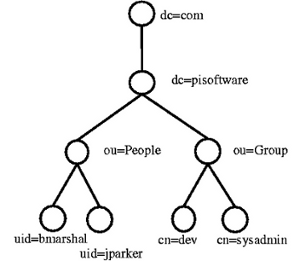

### 1 Preparar la máquina

Vamos a usar una MV OpenSUSE para montar nuestro servidor LDAP con:
~~~
Configuración MV
Nombre equipo: ldap-server06
Además en /etc/hosts añadiremos:
127.0.0.2   ldap-server06.curso1718   ldap-server06
127.0.0.3   oliva06.curso1718         oliva06
~~~
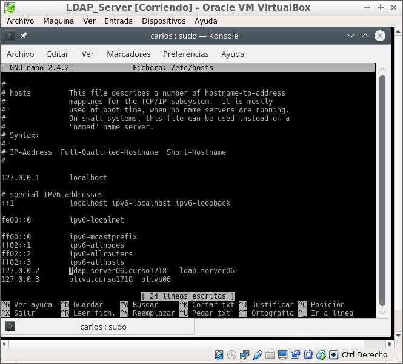

Configuraremos también una ip que identifique nuestro servidor en la red.

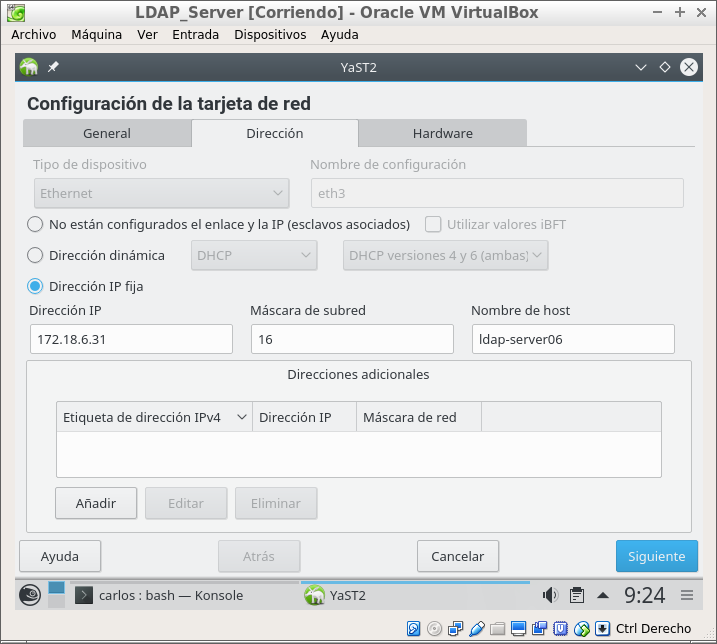

### 1.1 Instalación del Servidor LDAP
Procedemos a la instalación del módulo Yast que sirve para gestionar el servidor LDAP (yast2-auth-server), lo haremos mediante consola.

~~~
sudo zypper install yast2-auth-server
~~~
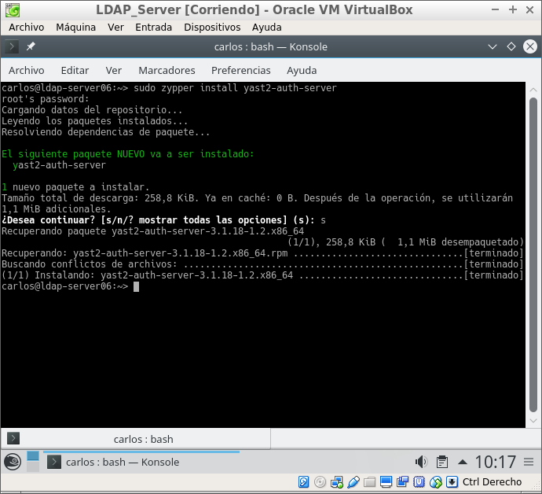

En el proceso de instalación añadiremos también los paquetes:
- openldap2
- krb5-server
- krb5-client

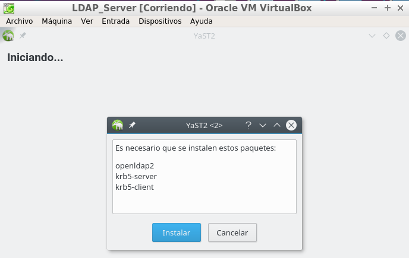

- Iniciar servidor LDAP -> Sí
- Registrar dameon SLP -> No
- Puerto abierto en el cortafuegos -> Sí

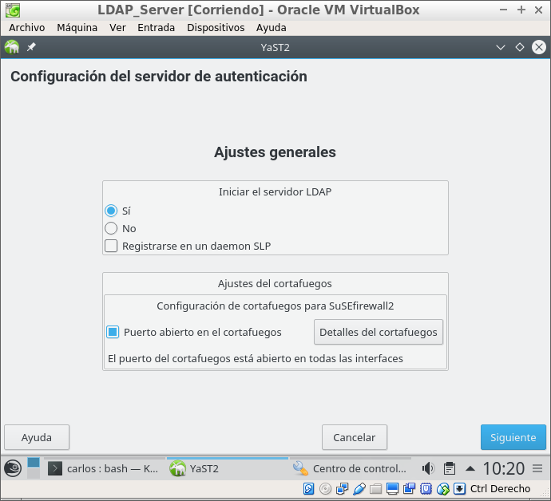

- Tipo de BD -> hdb
- DN base -> dc=oliva06,dc=curso1718.
- DN administrador -> cn=Administrator
- Añadir DN base -> Sí
- Contraseña del administrador
- Directorio de BD -> /var/lib/ldap
- Usar esta BD predeterminada para clientes LDAP -> Sí.

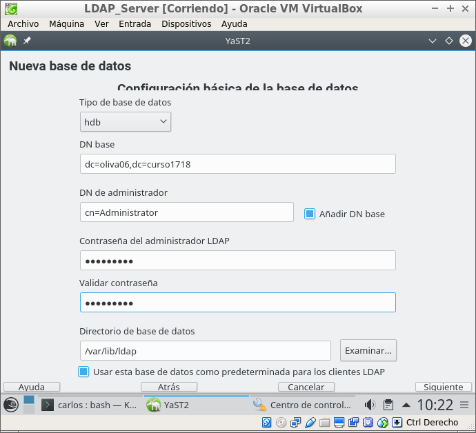

Tenemos un pequeño resumen de las configuraciones que acabamos de hacer.

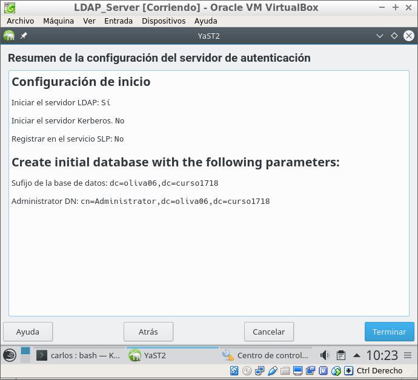

Comprobamos:

- `slaptest -f /etc/openldap/slapd.conf` para comprobar la sintaxis del fichero de configuración.

  

- `systemctl status slapd`, para comprobar el estado del servicio.

  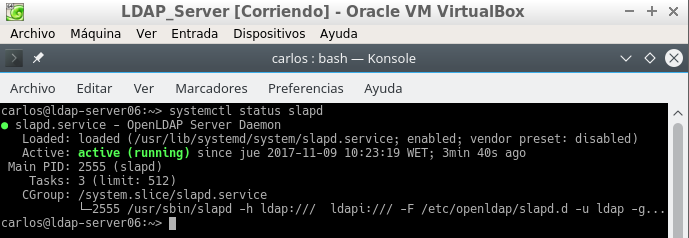

- `systemctl enable slapd`, para activar el servicio automáticamente al reiniciar la máquina.

<<<<<<< HEAD:u2/ldap/README.md
  
=======
  
>>>>>>> a9e004fe090719df9962b767248cc255c0da7ebb:u3/ldap/README.md

- `nmap -Pn localhost | grep -P '389|636'`, para comprobar que el servidor LDAP es accesible desde la red.

  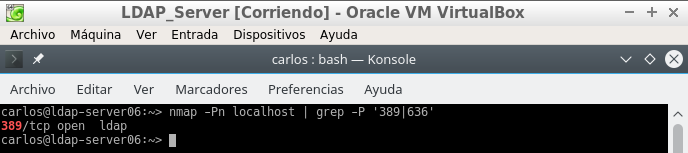

- `slapcat` para comprobar que la base de datos está bien configurada.

  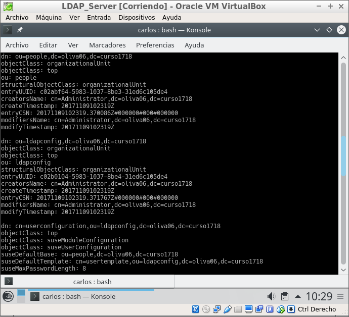

- Podemos comprobar el contenido de la base de datos LDAP usando la herramienta gq. Esta herramienta es un browser LDAP.

- Comprobar que tenemos creadas las unidades organizativas: groups y people.

  

### 1.2 Crear usuarios y grupos LDAP

- Yast -> Usuarios Grupos -> Filtro -> LDAP.
Crear el grupo piratas2 (Estos se crearán dentro de la ou=groups).

  

- Crear los usuarios pirata21, pirata22 (Estos se crearán dentro de la ou=people).

  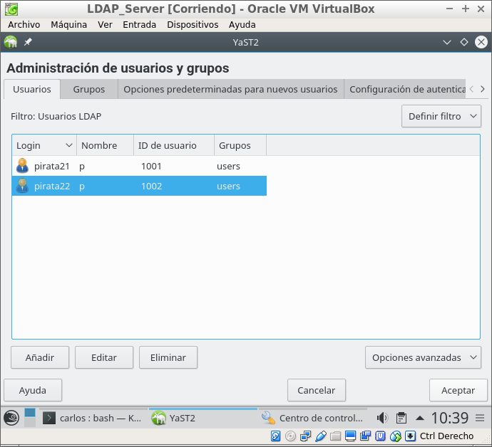

- Usar gq para consultar/comprobar el contenido de la base de datos LDAP.

  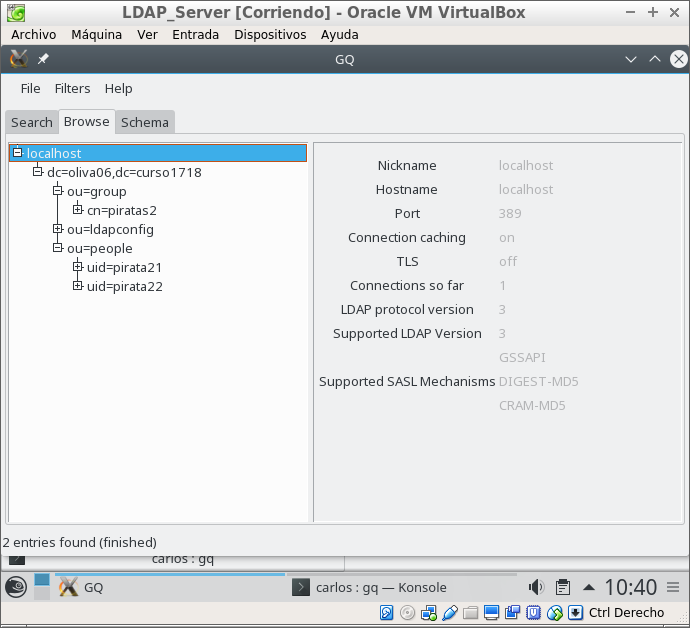

`ldapsearch -x -L -u -t "(uid=pirata21)"`, comando para consultar en la base de datos LDAP la información del usuario con uid concreto.

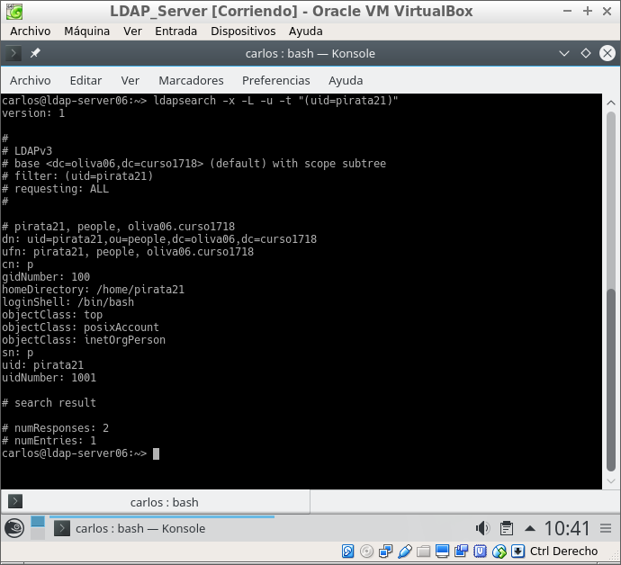

## 2. Cliente LDAP Preparativos

Vamos a otra MV OpenSUSE que actuará como Cliente LDAP:

- Configuración MV:
  - Nombre equipo: ldap-client06
  - Dominio: curso1718

Asegurarse que tenemos definido en el fichero `/etc/hosts` del cliente, el nombre DNS con su IP correspondiente:

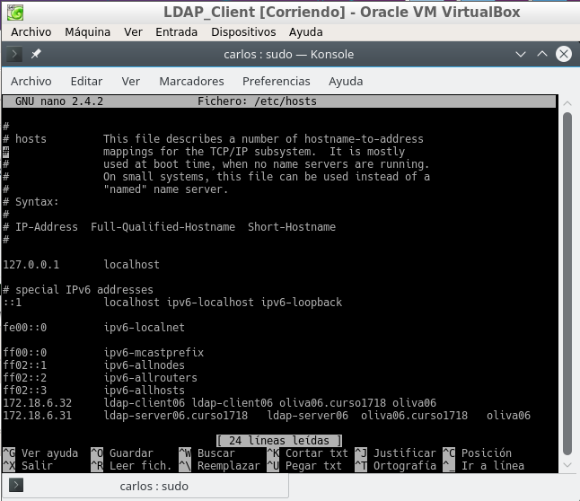

Comprobamos:
Comprobación

- `nmap -Pn ldap-server06 | grep -P '389|636'`, para comprobar que el servidor LDAP es accesible desde el cliente.

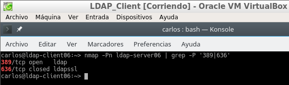

- Usar gq en el cliente para comprobar que se han creado bien los usuarios.

 - File -> Preferencias -> Servidor -> Nuevo
 - URI = ldap://ldap-server06
 - Base DN = dc=david06,dc=curso1718

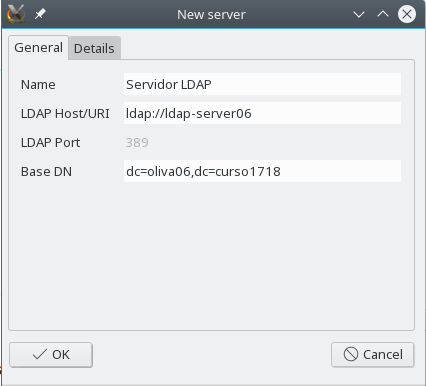

### 2.1 Instalar cliente LDAP

Vamos a configurar de la conexión del cliente con el servidor LDAP.

Debemos instalar el paquete `yast2-auth-client`, que nos ayudará a configurar la máquina para autenticación.
~~~
zsudo zypper install yast2-auth-client
~~~
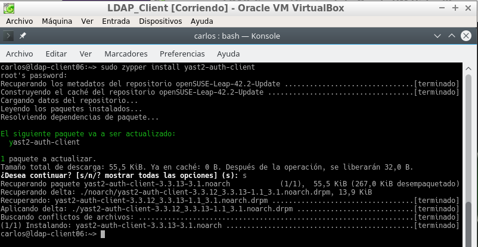

Ir a Yast -> LDAP y cliente Kerberos.

Configurar de la siguiente forma:

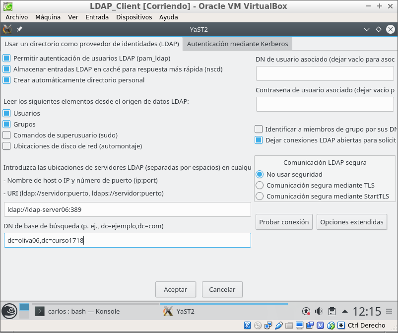

### 2.2 Comprobamos desde el cliente

Vamos a la consola con nuestro usuario normal, y probamos lo siguiente:

- `getent passwd pirata21`

  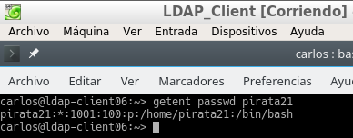

- `getent group piratas2`

  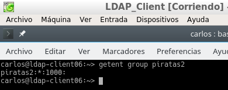

- `id pirata21`

  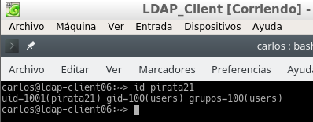

- `finger pirata21`

  

- `cat /etc/passwd | grep pirata21`

  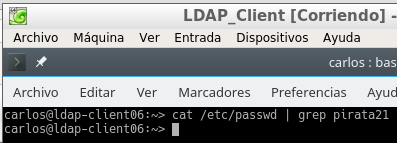

- `cat /etc/group | grep piratas2`

  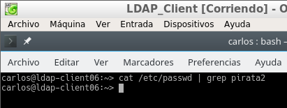

- `su pirata21`

  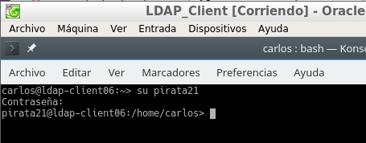

###   2.3 Autenticación
Con autenticacion LDAP prentendemos usar la máquina servidor LDAP, como repositorio centralizado de la información de grupos, usuarios, claves, etc. Desde otras máquinas conseguiremos autenticarnos (entrar al sistema) con los usuarios definidos no en la máquina local, sino en la máquina remota con LDAP. Una especie de Domain Controller.

Entrar en la MV cliente con algún usuario LDAP.

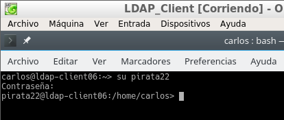
