# Servidor de Impresión en Windows
Carlos Javier Oliva Domínguez

---

Necesitaremos 2 MV:
- 1 Windows Server
- 1 Windows cliente

## 1. Impresora compartida
---

### 1.1 Rol impresión
~~~
Iremos al servidor:
~~~
Instalamos rol de servidor de impresión e incluiremos impresión por Internet.

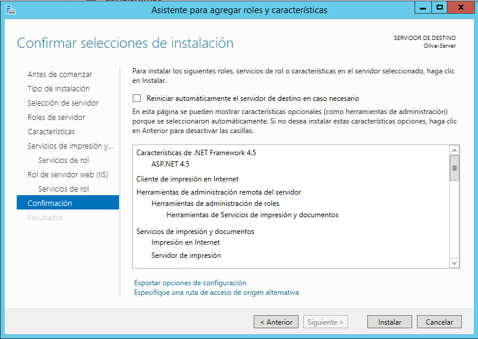

### 1.2 Instalar impresora PDF
Vamos a conectar e instalar localmente una impresora al servidor Windows Server 2012, de modo que esté disponible para ser accedida por los clientes del dominio.

Descargaremos `PDFCreator` en su versión FREE y lo  instalamos.

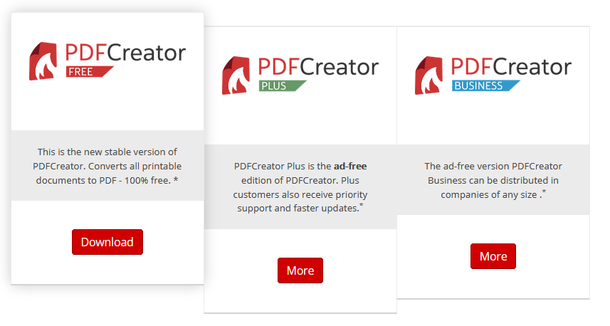

En `PDFCreator`, configuramos en perfiles -> Guardar -> Automático. Ahí también configuraremos  la carpeta destino donde se guardarán nuestros archivos .pdf.

RUTA: `"C:\users\Administrator\Documents\PDF Architect"`

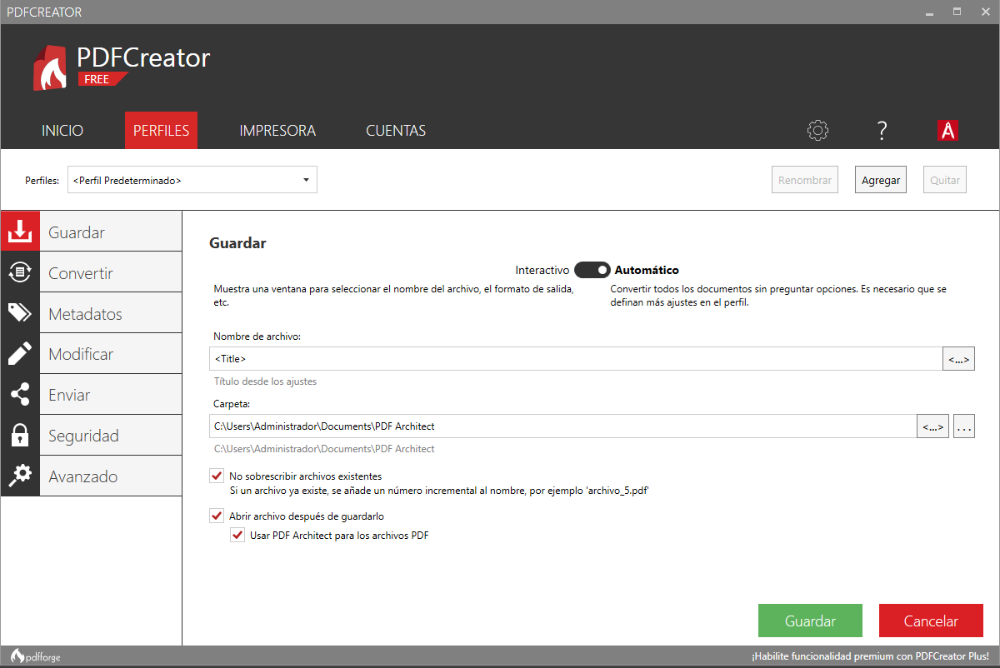

### 1.3 Probar la impresora en local
Ahora vamos a imprimir un archivo desde local y para ello primeramente vamos a crear dicho archivo primeramente, para ello usamos el Bloc de notas x ejemplo.

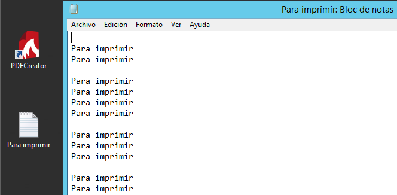

Tras intentar imprimir el documento .txt anterior se nos abrirá automáticamente el archivo que hemos impreso pero convertido a .PDF.

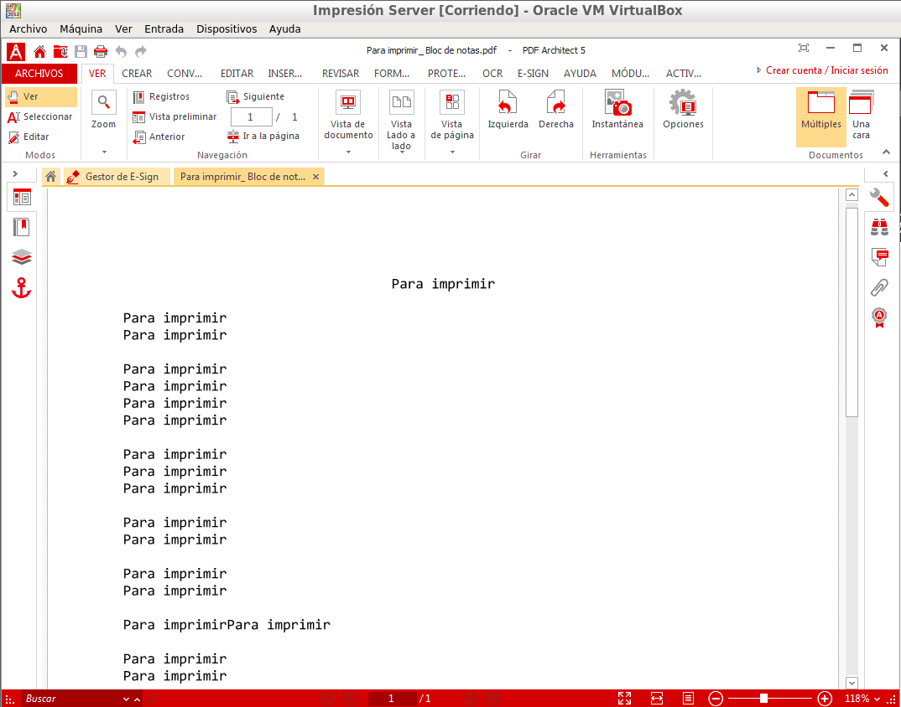

Iremos a la ruta que hemos pre establecido en `PDFCreator` y veremos que el archivo se encuentra allí.

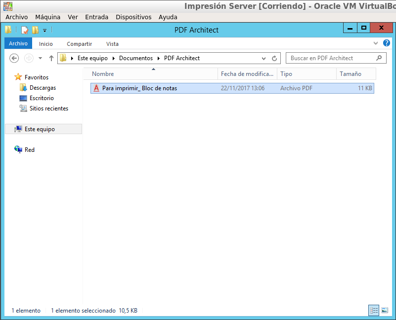

### 1.4 Compartir por red
~~~
Nos dirigimos al servidor:
~~~

`Botón derecho -> Propiedades -> Compartir`

Como nombre del recurso compartido utilizaremos PDFoliva06.

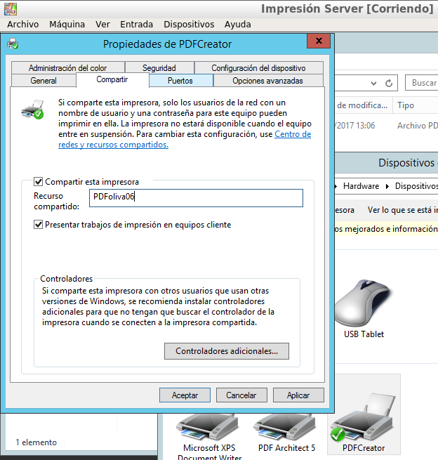

~~~
Vamos al cliente:
~~~

Buscar recursos de red del servidor, para ello pondremos la ip del Servidor en la barra de navegación.

Seleccionamos la impresora y hacemos clic en el  `botón derecho -> conectar`. Introducimos el usuario y la clave del Windows Server.

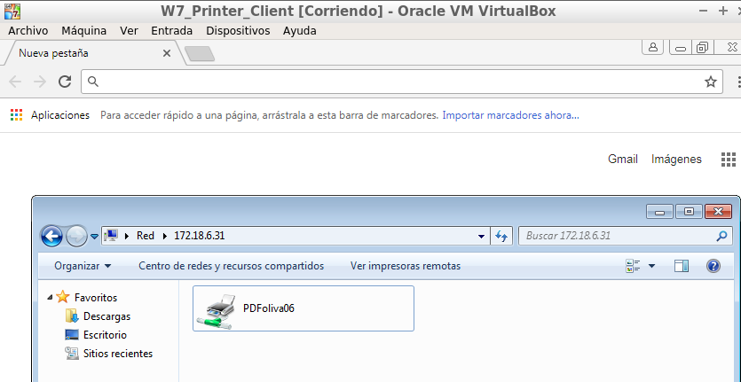

Ya tenemos la impresora remota configurada en el cliente.

Ahora probaremos a imprimir remotamente desde el cliente.

Primeramente vamos a generar un documento .txt con contenido para imprimir.

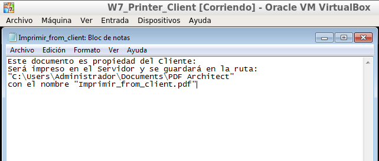

Haremos clic en la opción imprimir y elegiremos la impresora configurada en nuestro Servidor.

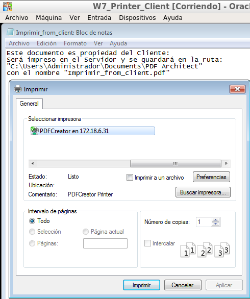

Tras lo anterior, si vamos al Servidor de impresión, veremos que se nos ha abierto el archivo que hemos mandado a imprimir desde el Cliente, pero ya convertido en .PDF.

También veremos que se ha guardado en la ruta por defecto.

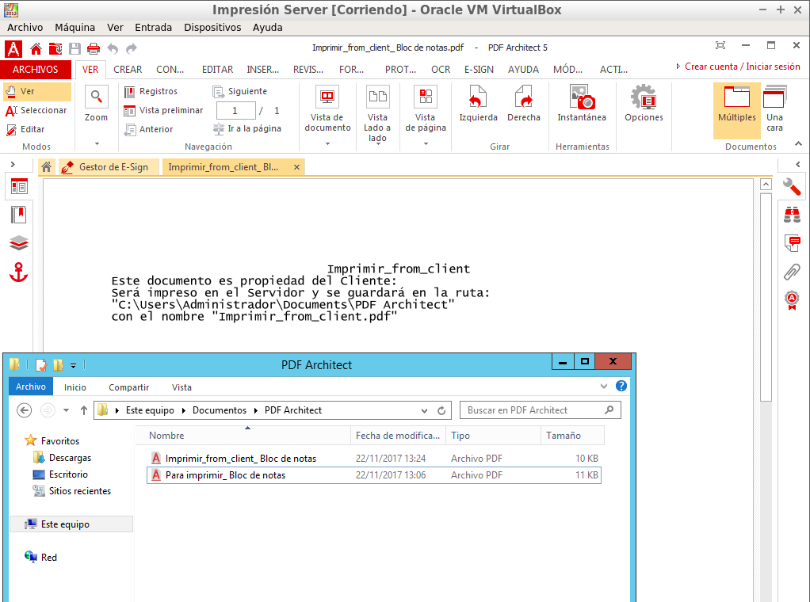

### 2. Acceso Web
*En este apartado realizaremos una configuración para habilitar el acceso web a las impresoras del dominio.*

### 2.1 Característica impresión WEB
~~~
Vamos al servidor.
~~~
Vamos a usar la `Impresión de Internet` que instalamos al principio.

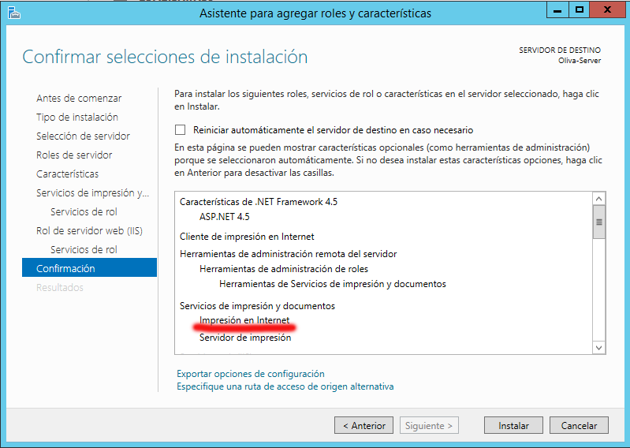

### 2.1 Configurar impresión WEB
~~~
Vamos al cliente.
~~~
Abrimos un navegador Web y ponemos la URL http://172.18.6.31/printers para que aparezca en nuestro navegador un entorno que permite gestionar las impresoras de dicho equipo, previa autenticación como uno de los usuarios habilitados para dicho fin como por ejemplo el "Administrador".

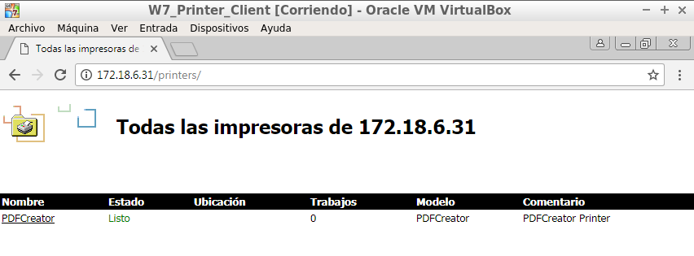

Tras acceder y elegir la impresora, vemos una especie de "panel de control" donde vemos distintas opciones como por ejemplo la URL de ésta, que usaremos para añadirla permanentemente al Cliente.

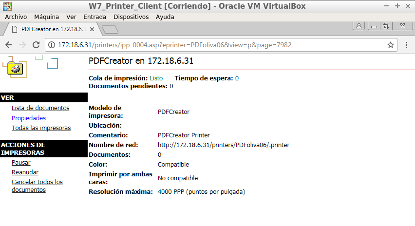

Agregamos la impresora en el cliente utilizando la URL, como se muestra en la siguiente pantalla:

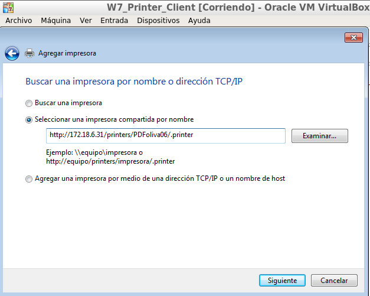

Comprobaremos que se ha añadido correctamente.

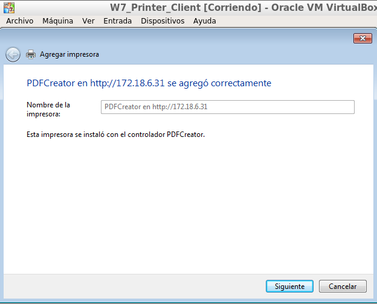

### 2.3 Comprobar desde el navegador

Vamos a realizar seguidamente una prueba sencilla en nuestra impresora de red:

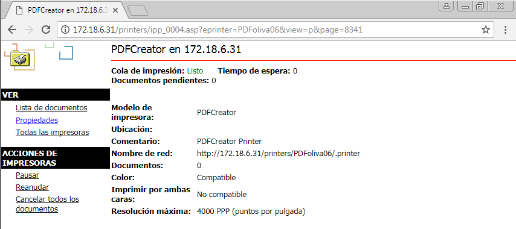

A través del navegador pausaremos todos los trabajos en la impresora.

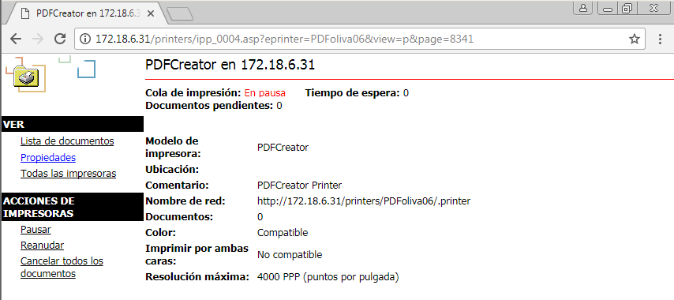

Desde el cliente, enviaremos a imprimir un documento del Bloc de notas en nuestra impresora compartida.

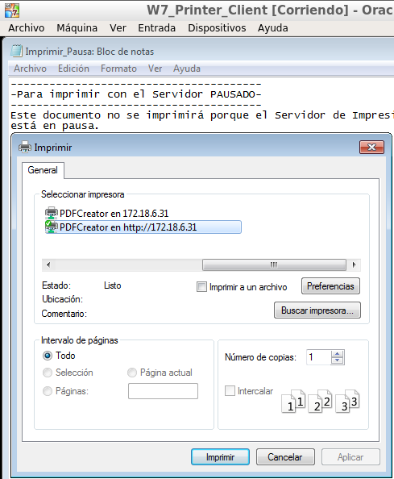

Podremos ver que el Servidor de impresión se encuentra actualemnte en pausa y con un archivo pendiente de impresión.

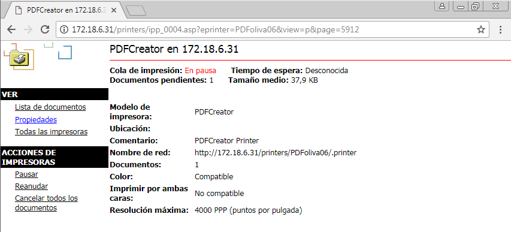

Finalmente pulsaremos en reanudar para que el archivo que el documento que mandamos a imprimir se convierta a PDF.

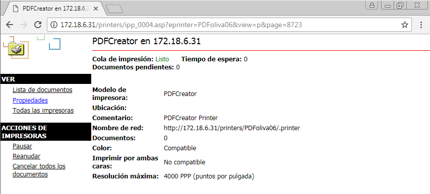

Comprobaremos nuevamente en el Servidor, que se ha convertido a .PDF el archivo en cuestión y que se encuentra en la ruta pre establecida.

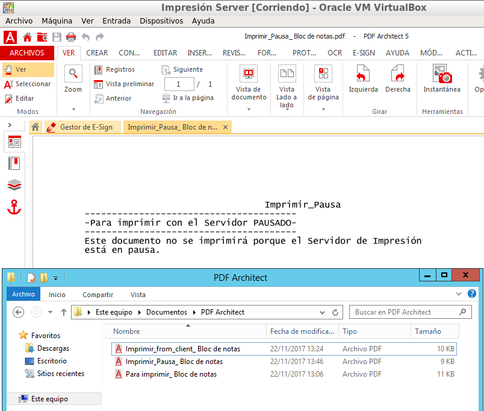

Fin de la práctica.
