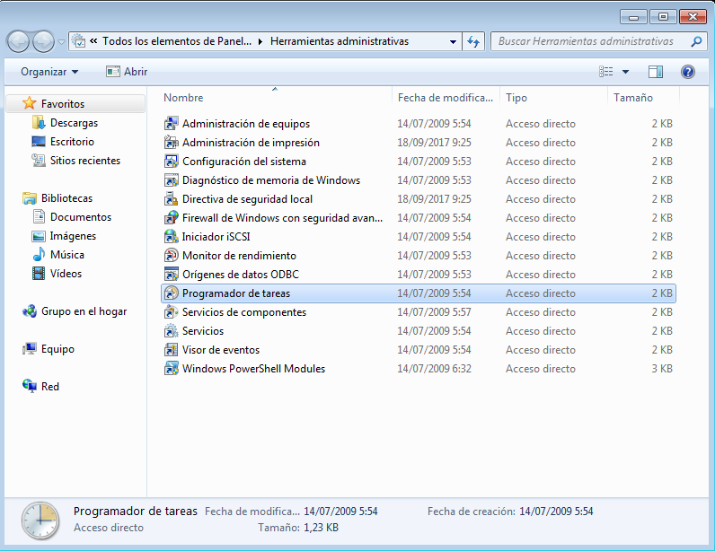

## Tareas programadas
Carlos Javier Oliva Domínguez

-----
#### 1. Windows - Tarea diferida.

Vamos a hacer una tarea diferida con Windows. Una tarea diferida se define para ejecutarse una sola vez en una fecha futura.

Para ello iremos a `Panel de control--->Herramientas administrativas`.   

Ahora abriremos el `Programador de tareas`.    

En el panel lateral tenemos el apartado `Acciones`, haremos clic en `Crear tarea básica`.    

Configuraremos el `Nombre` y una `Descripción` para nuestra tarea.    

En esta primera parte vamos a elegir que se ejecute solamente una vez.    

Configuraremos también la hora en la que queremos que se ejecute la tarea.   

Elegiremos por acción `Iniciar un programa`.    

Por programa, vamos a elejor un archivo txt que he creado en el escritorio. Al ejecutarse la tarea, éste debería abrirse automáticamente.    

Veremos un pequeño resumen de las configuraciones que hemos creado.    

Una vez llegada la hora que configuramos en el `Programador de tareas`, veremos que se ejecuta el txt automáticamente.    

También podemos ver la tarea finalizada en la biblioteca.    

#### 2. Windows - Tarea periódica

La tarea programada se define para ejecutarse periódicamente cada intervalo de tiempo.

Vamos a programar una tarea periódica para apagar el equipo.

El comando para apagar el sistema es `shutdown`.

Primeramente configuraremos el `Nombre` y una `Descripción` para la nueva tarea.    

Elegiremos una ejecución diaria.       

También vamos a elegir la fecha y hora que queremos que se inicie la ejecución y cada cuántos días queremos que se repita.     

Elegimos `Iniciar un programa`.    

Configuramos `shutdown y en argumentos /s.`.    

Vemos un pequeño resumen de las consiguraciones.    

Llegada la hora indicada, vemos que el equipo se apaga automáticamente.    

## 3. SO GNU/Linux - Tarea diferida

Primeramente vamos a comprobar que el Servicio `atd` se encuentra en ejecución.    

Luego comprobaremos que no hay ninguna tarea pendiente mediante el comando `atd`.    

Comprobamos también los permisos, comprobando que nuestro usuario no tiene acceso denegado.     

Configuraremos un Script, con la siguiente información.    

Nuestro directorio debería tener la siguiente estructura.    

Ahora vamos a instalar `Zenity`.     

Vamos a crear una nueva `Tarea diferida`.    

Comprobaremos que tenemos creada la `Tarea programada`.    

Pasado un tiempo veremos la el mensaje que configuramos en el Script, nos aparece en pantalla.    

Miramos que no tenemos ninguna tarea pendiente.    

## 4. GNU/Linux - Tarea periódica
Para las tareas periódicas usaremos el comando crontab.

Primero ejecutaremos `crontab -l` para ver que no hay tareas.    

Ahora vamos a usar el comando `contrab -e` para abrir el editor para la configuración de la nueva tarea.

Vamos a definir una tarea periódica para apagar el pc a una hora en concreto cada cierto tiempo.

Comprobamos el contenido de la orden.    

Podremos comprobar que el sistema se ha apagado automáticamnete en la hora que hemos definido.    

Fín de la práctica.
