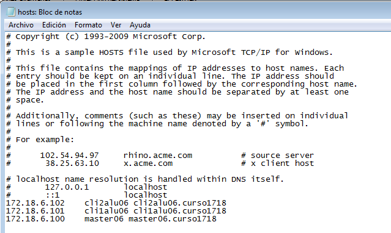
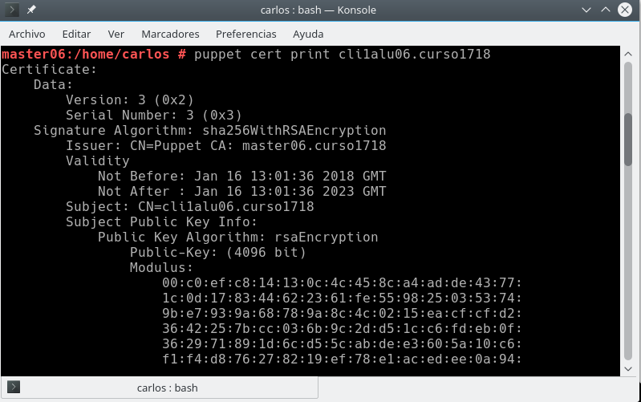
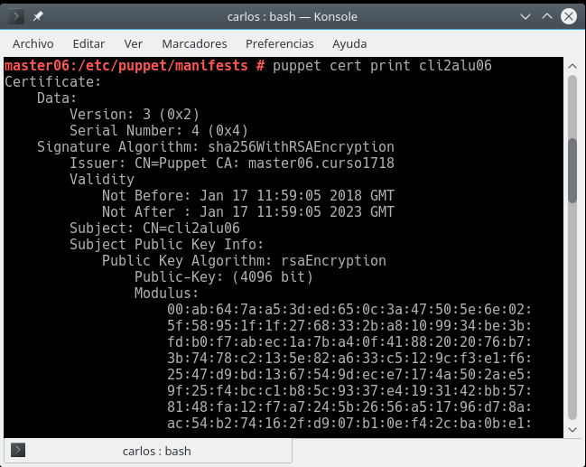

## U5.A5-Puppet
Carlos Javier Oliva Domínguez

-----
#### 1.0 Configuración
Vamos a usar 3 MV's con las siguientes configuraciones:

`MV1 - master:` Dará las órdenes de instalación/configuración a los clientes.
Configuración OpenSUSE.
IP estática 172.AA.XX.100
Nombre del equipo: masterXX
Dominio: curso1718

`MV2 - cliente 1:` recibe órdenes del master.
Configuración OpenSUSE.
IP estática 172.AA.XX.101
Nombre del equipo: cli1aluXX
Dominio: curso1718

`MV3 - client2:` recibe órdenes del master.
Configuración SO Windows 7.
IP estática 172.18.XX.102
Nombre Netbios: cli2aluXX
Nombre del equipo: cli2aluXX

`(AA) corresponde a: Año del curso`.

`(XX) corresponde a: Número del alúmno`.

#### 2.0 Instalando y configuración del servidor
Instalamos Puppet Master en la MV master06:
`zypper install rubygem-puppet-master`.

Comprobamos:
`systemctl enable puppetmaster:` Permitir que el servicio se inicie automáticamente en el inicio de la máquina.

`systemctl start puppetmaster:` Iniciar el servicio.

`systemctl status puppetmaster:` Consultar el estado del servicio.

En este momento debería haberse creado el directorio /etc/puppet/manifests.

Preparamos los ficheros/directorios en el master:
~~~
mkdir /etc/puppet/files
touch /etc/puppet/files/readme.txt
~~~

~~~
mkdir /etc/puppet/manifests
touch /etc/puppet/manifests/site.pp
mkdir /etc/puppet/manifests/classes
touch /etc/puppet/manifests/classes/hostlinux1.pp
~~~

##### 2.1 site.pp
`/etc/puppet/manifests/site.pp` es el fichero principal de configuración de órdenes para los agentes/nodos puppet.

Contenido de nuestro site.pp:
~~~
import "classes/*"

node default {
  include hostlinux1
}
~~~

##### 2.2 hostlinux1.pp
Como podemos tener muchas configuraciones, vamos a separarlas en distintos ficheros para organizarnos mejor, y las vamos a guardar en la ruta `/etc/puppet/manifests/classes`.

Vamos a crear una primera configuración para máquina estándar GNU/Linux.

Contenido de nuestro `hostlinux1.pp`:
~~~
class hostlinux1 {
  package { "tree": ensure => installed }
  package { "traceroute": ensure => installed }
  package { "geany": ensure => installed }
}
~~~

Con `tree /etc/puppet` podemos consultar los ficheros/directorios que tenemos creados hasta el momento.

Comprobar que el directorio /var/lib/puppet tiene usuario/grupo propietario puppet.

Reiniciamos el servicio y comprobamos que el servicio está en ejecución de forma correcta.
systemctl status puppetmaster
netstat -ntap |grep ruby

Consultamos log por si hay errores: `tail /var/log/puppet/*.log`.

Abrir el cortafuegos para el servicio.

#### 3. Instalación y configuración del cliente1
Vamos a instalar y configurar el cliente 1.

`Vamos a la MV cliente 1`.

Instalar el Agente Puppet `zypper install rubygem-puppet`.

El cliente puppet debe ser informado de quien será su master. Para ello, vamos a configurar `/etc/puppet/puppet.conf`:

Desactivaremos los plugin para este agente.

Comprobar que el directorio /var/lib/puppet tiene como usuario/grupo propietario puppet.

systemctl enable puppet: Activar el servicio en cada reinicio de la máquina.

Primero comprobaremos el estado actual:

Luego activaremos el servicio en cada reinicio:

systemctl start puppet: Iniciar el servicio puppet.

systemctl status puppet: Ver el estado del servicio puppet.

netstat -ntap |grep ruby: Muestra los servicios conectados a cada puerto.

#### 4. Certificados
Para que el master acepte a cliente1 como cliente, se deben intercambiar los certificados entre ambas máquinas. Esto sólo hay que hacerlo una vez.

##### 4.1 Aceptar certificado
Vamos a la MV `master`.

Nos aseguramos de que somos el usuario root.
`puppet cert list`, consultamos las peticiones pendientes de unión al master:

Firmamos el Certificado aceptando al nuevo cliente desde el master.

Finalmente haremos un `puppet cert print` para completar el proceso.

##### 4.2 Comprobación
Vamos a comprobar que las órdenes (manifiesto) del master, llega bien al cliente y éste las ejecuta.

Vamos a cliente1
Reiniciamos la máquina y/o el servicio Puppet.

Comprobar que los cambios configurados en Puppet se han realizado.

Nos aseguramos de que somos el usuario root.

Ejecutar comando para forzar la ejecución del agente puppet:

`puppet agent --test`

#### 5. Segunda versión del fichero pp
Ya hemos probado una configuración sencilla en PuppetMaster. Ahora vamos a pasar a configurar algo más complejo.

`Contenido para /etc/puppet/manifests/classes/hostlinux2.pp`:

Modificar /etc/puppet/manifests/site.pp para que se use la configuración de hostlinux2 el lugar de la anterior:
~~~
import "classes/*"

node default {
  include hostlinux2
}
~~~

Ejecutar `tree /etc/puppet` para comprobar ficheros y directorios.

Reiniciar el servicio. Vamos al cliente1;
Comprobar que se han aplicado los cambios solicitados.

#### 6. Cliente puppet Windows
Vamos a configurar Puppet para atender también a clientes Windows.

##### 6.1 Configuración hostwindows3.pp

Vamos a la MV master y crearemos una configuración puppet para las máquinas windows:

El fichero:

`/etc/puppet/manifests/classes/hostwindows3.pp`, incluye el siguiente contenido:
~~~
class hostwindows3 {
  file {'C:\warning.txt':
    ensure => 'present',
    content => "Hola Mundo Puppet!",
  }
}
~~~

Ahora vamos a modificar el fichero site.pp del master, para que tenga en cuenta la configuración de clientes GNU/Linux y clientes Windows, de modo diferenciado:
~~~
import "classes/*"

node 'cli1alu06.curso1718' {
  include hostlinux2
}

node 'cli2alu06' {
  include hostwindows3
}
~~~

En el servidor ejecutamos `tree /etc/puppet`, para confirmar que tenemos los nuevos archivos.

Reiniciamos el servicio PuppetMaster.

Ejecutamos el comando facter, para ver la versión de Puppet que está usando el master.

#### 6.2 Instalar el cliente2 Windows

Ahora vamos a instalar `AgentePuppet` en Windows. Recordar que debemos instalar la `misma versión` en ambos equipos.

Descargamos e instalamos la versión de Agente Puppet para Windows similar al Puppet Master.

Descarga:

Instalación:

El fichero puppet.conf en Windows está en C:\ProgramData\PuppetLabs\puppet\etc\puppet.conf. (ProgramData es una ruta oculta). Revisar que tenga algo como:

Reiniciamos la MV.

Debemos aceptar el Certificado en el master para este nuevo cliente, al igual que hicimos en el apartado anterior.

Primeramente mostramos los Certificados pendientes.

Firmamos el Certificado en cuestión.

Finalmente hacemos un `puppet cert print` para completar el proceso.

##### 6.3 Comprobamos los cambios
Vamos al cliente2.

Ejecutamos el agente puppet.

Comprobamos los cambios, vemos el archivo Warning.txt creado correctamente.

Iniciar consola puppet como administrador y probar los comandos:

`puppet agent --configprint server`, debe mostrar el nombre del servidor puppet.

`puppet agent --server masterXX.curso1718 --test`: Comprobar el estado del agente puppet.

`puppet agent -t --debug --verbose`: Comprobar el estado del agente puppet.

`facter`: Para consultar datos de la máquina windows, como por ejemplo la versión de puppet del cliente.

`puppet resource user nombre-alumno1`: Para ver la configuración puppet del usuario.

puppet resource file c:\Users: Para var la configuración puppet de la carpeta.

#### 7. Configuración hostwindows4.pp
Configuramos en el master el fichero `/etc/puppet/manifests/classes/hostwindows4.pp` para el cliente Windows:
~~~
class hostwindows4 {
  user { 'soldado1':
    ensure => 'present',
    groups => ['Administradores'],
  }

  user { 'aldeano1':
    ensure => 'present',
    groups => ['Usuarios'],
  }
}
~~~
Comprobar que funciona.

Creamos un `site.pp` para el nuevo host.

Reiniciaremos el Servicio Puppet.

Comprobaremos que tenemos creado el usuario `soldado1` como Administrador del Sistema.

#### 8. Configuración personalizada: hostalumno5.pp
Crear un nuevo fichero de configuración para la máquina cliente Windows con el nombre `/etc/puppet/manifests/classes/hostalumno5.pp`.

Incluir configuraciones elegidas por el alumno y probarlas.

Crearemos el usuario `oliva`.

Creamos nuestra propia versión para el archivo `site.pp`.

Comprobamos que el usuario oliva se ha creado y está dentro del grupo Administradores. Además se ha creado el archivo .txt que hemos ordenado en nuestra config puppet.

Fin de la práctica.
