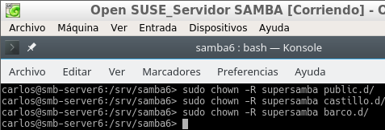
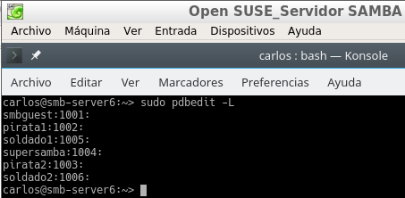

### Samba
Carlos Javier Oliva Domínguez

----
Samba con OpenSUSE y Windows 7.

Vamos a necesitar las siguientes 3 MVs:

MV1: Un servidor GNU/Linux OpenSUSE con IP estática (172.18.6.31).

MV2: Un cliente GNU/Linux OpenSUSE con IP estática (172.18.6.32).

MV3: Un cliente Windows con IP estática (172.18.6.11).

### 1. Servidor Samba (MV1)
#### 1.1 Preparativos

Configuraremos el servidor GNU/Linux. Usar los siguientes valores:

* Nombre de equipo: smb-server6

* Añadiremos en /etc/hosts los equipos smb-cli6a y smb-cli6b.

Capturar salida de los comandos siguientes en el servidor:

* hostname -f
* ip a
* lsblk
* sudo blkid

#### 1.2 Usuarios locales
Vamos al Servidor GNU/Linux, y creamos los siguientes grupos y usuarios:

* Crear los grupos piratas, soldados y todos.

* Crear el usuario smbguest.

Para asegurarnos que nadie puede usar smbguest para entrar en nuestra máquina mediante login, vamos a modificar este usuario y le ponemos como shell /bin/false.

* Dentro del grupo piratas incluir a los usuarios pirata1, pirata2 y supersamba.

* Dentro del grupo soldados incluir a los usuarios soldado1 y soldado2 y supersamba.

* Dentro del grupo todos, poner a todos los usuarios soldados, pitatas, supersamba y a smbguest.

Comprobamos el resultado:

#### 1.3 Crear las carpetas para los futuros recursos compartidos

* Vamos a crear las carpetas de los recursos compartidos con los permisos siguientes:
  * /srv/samba6/public.d
    * Usuario propietario supersamba.
    * Grupo propietario todos.
    * Poner permisos 775.
  * /srv/samba6/castillo.d
    * Usuario propietario supersamba.
    * Grupo propietario soldados.
    * Poner permisos 770.
  * /srv/samba6/barco.d
    * Usuario propietario supersamba.
    * Grupo propietario piratas.
    * Poner permisos 770.

###### Capturas del proceso:

Comando propietario.

Comando grupo propietario.

Comando permisos.

Podemos ver el resultado final, tal como se pide en la práctica.

#### 1.4 Configurar el servidor Samba

* Yast -> Samba Server
  * Workgroup: mar1718

  

  * Sin controlador de dominio.

  

* En la pestaña de Inicio definimos:

  * Iniciar el servicio durante el arranque de la máquina.

  * Ajustes del cortafuegos -> Abrir puertos.

  

#### 1.5 Crear los recursos compartidos de Samba
* Iremos a `/etc/samba/smb.conf` y modificaremos el fichero de configuración con los siguientes datos.

Usaremos el comando `testparm` para comprobar la confiuración.

#### 1.6 Usuarios Samba
Tras la reación de los usuarios en el apartado `1.2 Usuarios locales` toca añadirlos a Samba.

* Con `smbpasswd -a nombreusuario`,  crearemos la clave de Samba para un usuario del sistema.

* Con `pdbedit -L`, comprobaremos la lista de usuarios Samba.

#### 1.7 Reiniciar
* Ahora que hemos terminado con el servidor, hay que reiniciar el servicio para que se lean los cambios de configuración.

* Para ello iremos a la consola de comandos y haremos lo siguiente:

  * Servicio `smb`

    

  * Servicio `nmb`

    

Comandos de comprobación:

* `sudo testparm`   #
Verifica la sintaxis del fichero de configuración del servidor Samba.

* `sudo netstat -tap`   # Vemos que el servicio SMB está a la escucha.

### 2. Windows (MV3 smb-cli6b)
* Configurar el cliente Windows.
Configuramos la dirección  IP que hemos establecido.

* Configuraremos el nombre `smb-cli6b`.

* Configurar el fichero ...\etc\hosts de Windows.

#### 2.1 Cliente Windows GUI
Desde un cliente Windows vamos a acceder a los recursos compartidos del servidor Samba `smb-server6`.

Escribimos \\ip-del-servidor-samba y vemos lo siguiente:

Comprobaremos los accesos de todas las formas posibles.

Como si fuéramos:

`Un pirata:`

En el primer acceso nos pedirá el nombre de usuario y contraseña de un miembro del grupo `barco`.

Comprobamos que podemos acceder a la carpeta con el usuario `pirata1` al recurso `barco`.

Mediante el comando `net use * /d /y`, podemos cerrar las conexión `SMB/CIFS` que se ha realizado desde el cliente al servidor.

`Un soldado:`

En el primer acceso nos pedirá el nombre de usuario y contraseña de un miembro del grupo `castillo`.

Comprobamos que podemos acceder a la carpeta con el usuario `soldado1` al recurso `castillo`.

Comprobaremos resultados con los siguientes comandos:

`smbstatus`, desde el servidor Samba.

`netstat -ntap`, desde el servidor Samba.

`netstat -n`, desde el cliente Windows.

#### 2.2 Cliente Windows comandos
Iremos al cliente Windows para consultar todas las conexiones/recursos conectados hacemos `net use`.

Comprobamos que no tenemos ninguna conexión abierta. En caso de que existiera alguna podríamos cerrarla mediante el comando `net use * /d /y`.

Mediante el comando `net view`, vemos las máquinas (con recursos CIFS) accesibles por la red.

Con el comando `net use S: \\ip-servidor-samba\recurso clave /USER:usuario /p:yes` establece una conexión con el recurso compartido y lo monta en la unidad S. Probemos a montar el recurso barco.

Comprobamos mediante `net use`.

Podemos comprobar que la unidad S la tenemos montada en equipo.

* Comprobamos los resultados con los siguientes comandos:

  * smbstatus, desde el servidor Samba.

  

  * netstat -ntap, desde el servidor Samba.

  

  * netstat -n, desde el cliente Windows.

  

#### 3 Cliente GNU/Linux (MV2 smb-cli6a)

Usaremos nombre `smb-cli6a` y la IP `172.18.6.32`.

Configuraremos también el archivo `/etc/hosts` con la configuración de red del mismo equipo `smb-cli6a`, el Servidor samba `smb-server6` y del Cliente Windows `smb-cli6b`.

Accederemos al recurso prueba del servidor Samba, pulsamos CTRL+L y escribimos smb://ip-del-servidor-samba:

Pondremos usuario y contraseña del recurso `castillo` (establecidos anteriormente).

Comprobamos la creación de una carpeta dentro del recurso `castillo`.

Pondremos usuario y contraseña del recurso `barco` (establecidos anteriormente).

Comprobamos la creación de una carpeta dentro del recurso `barco`.

Comprobaremos que el recurso `public` es de sólo lectura.

Comprobamos los resultados con los siguientes comandos:

`smbstatus`, desde el servidor Samba.

`netstat -ntap`, desde el servidor Samba.

`netstat -ntap`, desde el cliente Linux.

#### 3.2 Cliente GNU/Linux comandos

Vamos a un equipo GNU/Linux `smb-cli6a`. Desde este equipo usaremos comandos para acceder a la carpeta compartida.

Primero comprobar el uso de las siguientes herramientas:
sudo `smbtree`
          # Muestra todos los equipos/recursos de la red SMB/CIFS

`smbclient --list ip-servidor-samba`
    # Muestra los recursos SMB/CIFS de un equipo concreto

- Ahora crearemos en local la carpeta `/mnt/samba06-remoto/castillo`.

 

- MONTAJE: Con el usuario root, usamos el siguiente comando para montar un recurso compartido de Samba Server, como si fuera una carpeta más de nuestro sistema: `mount -t cifs //172.18.6.31/castillo /mnt/samba06-remote/castillo -o username=soldado1`

 

 - COMPROBAR: Ejecutar el comando `df -hT`. Veremos que el recurso ha sido montado.

  

- Comprobando resultados:

  - smbstatus, desde el servidor Samba.
  

 - netstat -ntap, desde el servidor Samba.
  

 - netstat -ntap, desde el cliente Linux.
  

#### 3.3 Montaje automático

Acabamos de acceder a los recursos remotos, realizando un montaje de forma manual (comandos mount/umount). Si reiniciamos el equipo cliente, podremos ver que los montajes realizados de forma manual ya no están (df -hT). Si queremos volver a acceder a los recursos remotos debemos repetir el proceso de montaje manual, a no ser que hagamos una configuración de montaje permanente o automática.

- Para configurar acciones de montaje automáticos cada vez que se inicie el equipo, debemos configurar el fichero `/etc/fstab` y añadir la siguiente línea:

~~~
//smb-server6/public /mnt/samba06-remote/castillo cifs username=soldado1,password=clave 0 0
~~~

- Reiniciaremos el equipo y comprobamos que se realiza el montaje automático al inicio.

#### 4. Preguntas para resolver

- ¿Las claves de los usuarios en GNU/Linux deben ser las mismas que las que usa Samba?

  - Si, dado que Samba usa los usuarios del propio sistema.

- ¿Puedo definir un usuario en Samba llamado soldado3, y que no exista como usuario del sistema?

  - No, puesto que Samba trabaja con los usuarios del sistema.

- ¿Cómo podemos hacer que los usuarios soldado1 y soldado2 no puedan acceder al sistema pero sí al samba? (Consultar /etc/passwd)

  - Al igual que el el apartado [1.2 Usuarios locales](#locales) modificamos los usuarios en cuestión y le ponemos como shell `/bin/false`.

- Añadir el recurso [homes] al fichero smb.conf según los apuntes. ¿Qué efecto tiene?

  - Estaríamos creando un nuevo recurso llamado `homes`.
