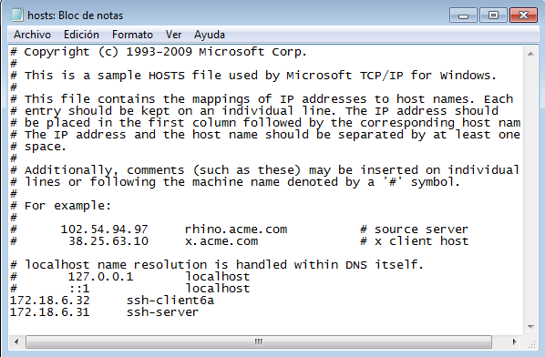
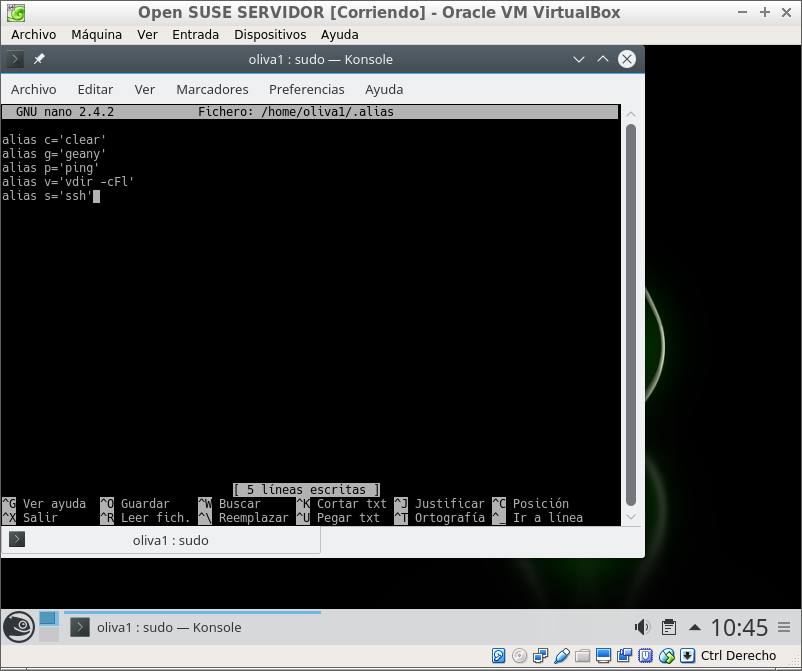
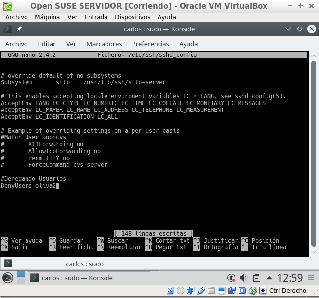

## Acceso remoto SSH
Carlos Javier Oliva Domínguez

---
Para la siguiente práctica vamos a necesitar las siguientes 3 MVs:

* Un servidor GNU/Linux OpenSUSE `(IP 172.18.6.31)`
* Un cliente GNU/Linux OpenSUSE `(IP 172.18.6.32)`
* Un cliente Windows7 `(IP 172.18.6.11)`

### 1. Preparativos
En esta primera parte vamos a hacer unas pequeñas configuraciones dentro de cada máquina para hacer ping directamente con el nombre de la misma.

###### 1.1 Servidor SSH
Primeramente vamos a poner una ip estática a nuestro `ssh-server`.

Seguidamente nos dirigiremos a `/etc/hosts` y añadiremos las direcciones ip y los nombres de las máquinas `ssh-client6a` y `ssh-client6b`.

Crearemos los siguientes usuarios en ssh-server6:

###### 1.2 Cliente OpenSUSE
Primeramente vamos a poner una ip estática a nuestro `ssh-client6a`.

Seguidamente nos dirigiremos a `/etc/hosts` y añadiremos las direcciones ip y los nombres de las máquinas `ssh-server` y `ssh-client6b`.

###### 1.3 Cliente Windows7
Primero configuraciones de las direcciones ip.

Cambiaremos el nombre del cliente de la máquina con Windows7 a `ssh-client6b`.

Seguidamente nos dirigiremos a `C:\\Windows\System32\drivers\etc\`
y modificaremos el archivo `hosts` añadiendo las direcciones ip y los nombres de las máquinas ssh-server y ssh-client6a.

###### 1.4 Comprobaciones
###### 1.4.1 Servidor SSH

Lo primero que haremos será comprobar las configuraciones con los siguientes comandos.

* `ip a` para comprobar ip y máscara.

* `route -n` para comprobar la puerta de enlace predeterminada.

* `ping 8.8.4.4 -i 2` para comprobar la conectividad externa.

* `host www.google.es` para comprobar el servidor DNS.

* `ping ssh-client6a` para comprobar la conectividad con cliente A.

* `ping ssh-client6b para comprobar conectividad con cliente B`.

* `blkid para consultar UUID de la instalación`.

* `lsblk para consultar particiones`

### 2 Instalación del servicio SSH

Primeramente, procederemos a la instalación del servicio SSH en la máquina `ssh-server6`.

### 2.1 Comprobación
Comprobaremos que el proceso está ejecutándose.

Lo comprobaremos también mirando los procesos del sistema.

Mediante el comando netstat -ntap comprobaremos que el servicio está escuchando por el puerto 22.

Ahora, desde el `client6a` comprobamos la conectividad con el servidor haciendo ping a  `ssh-server6`.

También comprobamos que el servicio SSH es visible con `nmap -Pn ssh-server6`.

Primeramente instalaremos el servicio `nmap`.

Como veremos en la siguiente imágen nos muestra que el puerto 22 está abierto.

* El paso anterior me ha dado error, no llegaba a mostrar nada en la terminal, esto se debe al Firewall que bloquea las comunicaciones.

  

* He tenido que ajustar las configuraciones en del Firewall añadiendo una excepción.

  

### 2.2 Conexión SSH desde cliente GNU/Linux

Desde el cliente6a nos conectamos mediante ssh `oliva1@ssh-server6`. Aceptaremos el intercambio de claves:

Dicho intercambio solo se produce una vez, la próxima vez que entremos ya no nos saldrá el mismo mensaje de intercambio de claves.

Comprobaremos el contenido del fichero $HOME/.ssh/known_hosts en el equipo `ssh-client6a`.

#### 2.3 Conexión SSH desde cliente Windows

Para conectarnos al Servidor mediante SSH iremos al client6b (windows) y mediante un cliente ssh conectaremos al servidor ssh con el usuario oliva1.

Confirmar la existencia de los ficheros `sh_host*key y ssh_host*key.pub` en /etc/ssh, ficheros de clave pública/privada que identifican a nuestro servidor frente a nuestros clientes

Modificaremos el fichero de configuración SSH (/etc/ssh/sshd_config) para dejar una única línea: `HostKey /etc/ssh/ssh_host_rsa_key.`

Ahora vamos a generar nuevas claves públicas/privadas para la identificación de nuestro servidor.

Reiniciaremos el servicio SSH: `systemctl restart sshd`.

Comprobamos que el servicio está en ejecución correctamente: `systemctl status sshd`.

Ahora comprobaremos con el usuario `oliva1`.

Y con el usuario `oliva2
`

### 3. Personalización del prompt Bash
[INFO] Esto sólo para servidores GNU/Linux o BSD.

*Personalizar Bash según la documentación, para cambiar el color cuando tenemos activa una sesión SSH.*

Podemos añadir las siguientes líneas al fichero de configuración del usuario oliva1 en la máquina servidor `(Fichero /home/oiva1/.bashrc)`

Además, crearemos el fichero el fichero `/home/oliva1/.alias`, donde pondremos el siguiente contenido:

Ahora nos conectaremos al Servidor `ssh-server6` mediante el Cliente `ssh-client6a` y comprobaremos el resultado de la modificación del prompt.

### 4. Autenticación mediante claves públicas
*El objetivo de este apartado es el de configurar SSH para poder acceder desde una máquina Cliente, usando el usuario oliva4 sin poner password, pero usando claves pública/privada.*

Vamos a la máquina ss-client6a.

¡OJO! No usar el usuario root.

Generaremos un nuevo par de claves para el usuario en /home/carlos/.ssh/id_rsa y /home/carlos/.ssh/id_rsa.pub.

Ahora vamos a copiar la clave pública (id_rsa.pub) del usuario (carlos) de la máquina `ssh-client6a`, al fichero "authorized_keys" del usuario remoto oliva4.

Tras realizar lo anterior podremos acceder a nuestro usuario `oliva4`, desde la máquina `ssh-client6a`, sin necesidad de poner contraseña.

Como podemos ver en la imágen anterior, hemos podido acceder sin la necesidad de poner una contraseña.

Ahora vamos a hacer la prueba pero desde el `ssh-client6b`.

Como podemos comprobar en la imágen anterior, nos ha pedido la contraseña para poder autenticarnos. Esto se debe a que solamente hemos generado y copiado las claves de la máquina `ssh-client6a`.

### 5. Uso de SSH como túnel para X
*Instalaremos en el servidor una aplicación de entorno gráfico (Geany) que no esté en los clientes y posteriormente intentaremos usarla desde los clientes `ssh-client6a` y `ssh-client6b`*.

Lo primero que haremos será instalar la aplicación en el Servidor `ssh-server6`.

Seguidamente consultaremos fichero de configuración /etc/ssh/sshd_config y descomentaremos la opción `X11Forwarding no` y lo activaremos, quedando `X11Forwarding yes`.

Ahora iremos al Cliente `ssh-client6a` y ejecutaremos la aplicación remotamente.

* Para ello usaremos el comando normal, pero añadiremos el parámetro -X, en mayúsculas.

Como podemos comprobar en la imágen anterior, hemos ejecutado Geany en la máquina Cliente `ssh-client6a`, pero que realmente está instalada en la máquina Servidor `ssh-server6`.

### 6. Aplicaciones Windows nativas
*Podemos tener aplicaciones Windows nativas instaladas en ssh-server mediante el emulador WINE.*

El primer paso será instalar el emulador en el Servidor `ssh-server6`.

Comprobamos que la aplicación se ha instalador correctamente en nuestro Servidor `ssh-server6`-

Ahora iremos al cliente `ssh-client6a` y comprobaremos ejecutando la aplicación, sin olvidar el parámetro -X.

### 7. Restricciones de uso
*Vamos a modificar los usuarios del servidor SSH para añadir algunas restricciones de uso del servicio.*

###### Restricción sobre un usuario

Vamos a crear una restricción de uso del SSH para un usuario determinado.

Denegaremos el acceso al usuario `oliva2`. Todo esto desde el usuario local (carlos) en el Servidor `ssh-server6`.

Modificaremos fichero de configuración del servidor SSH `/etc/ssh/sshd_config` para restringir el acceso a determinados usuarios.

Podremos comprobar que al ir en este caso al cliente `ssh-client6a` e intentar acceder al usuario `oliva2` nos sale un error prohibiendonos el acceso.

###### Restricción sobre una aplicación
*Vamos a crear una restricción de permisos sobre determinadas aplicaciones.*

Lo que haremos será crear un grupo de usuarios nuevo `remoteapps` y vamos a incluir el usuario `oliva4` para impedir que pueda usar la aplicación (Geany) en remoto.

Modificaremos los permisos de la carpeta para impedir que los usurios que no pertenezcan al grupo puedan ejecutar el programa.

Podremos comprobar que la conexión es rehusada cuando intentamos acceder a la aplicación con el usuario `oliva4` desde el cliente `ssh-client6a`.

Podemos concluir que la ejecución de la aplicación `Geany` está permitida para todos los clientes excepto para el usuario `oliva4`.

Fin de la práctica...
