## Vagrant y VirtualBox
Carlos Javier Oliva Domínguez

----
# 1. Introducción
Vagrant es una herramienta para la creación y configuración de entornos
de desarrollo virtualizados.

Originalmente se desarrolló para VirtualBox y sistemas de configuración tales
como Chef, Salt y Puppet. Sin embargo desde la versión 1.1 Vagrant es
capaz de trabajar con múltiples proveedores, como VMware, Amazon EC2, LXC, DigitalOcean, etc.2

Aunque Vagrant se ha desarrollado en Ruby se puede usar en multitud de proyectos escritos en otros lenguajes.

# 2. Primeros pasos
## 2.1 Instalar
Haremos la instalación por consola mediante el comando `apt-get install vagrant`.
 Esta parte ha sido realizada por el profesor puesto que la instalación tuvo lugar en la máquina real.

## 2.2. Proyecto
Crearemos un directorio para nuestro proyecto vagrant.

    mkdir mivagrant06
    cd mivagrant06
    vagrant init

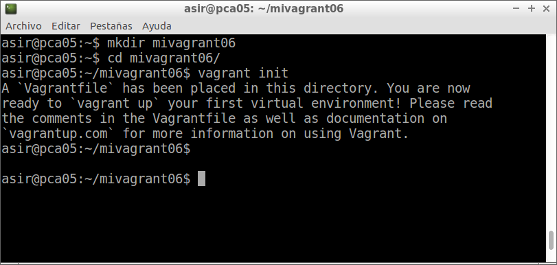

## 2.3 Imagen, caja o box

Ahora necesitamos obtener una imagen(caja, box) de un sistema operativo. Vamos, por ejemplo, a conseguir una imagen de un Ubuntu Precise de 32 bits:

 - `vagrant box add micajaXX_ubuntu_precise32 http://files.vagrantup.com/precise32.box`

 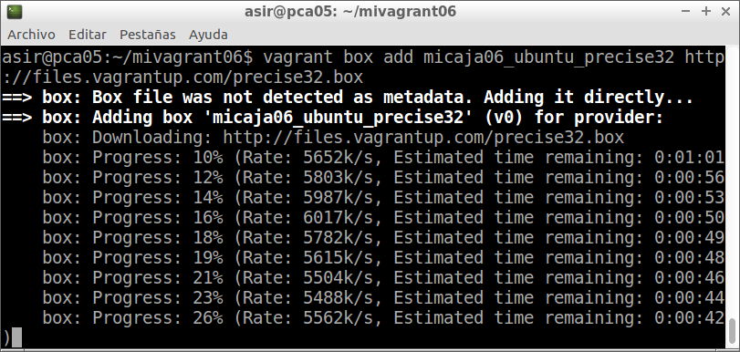

 Proceso finalizado.

 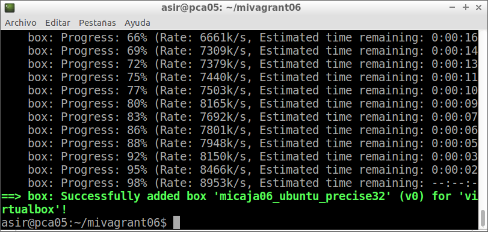
 - `vagrant box list: Lista las cajas/imágenes disponibles actualmente en nuestra máquina.`

 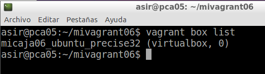

Para usar una caja determinada en nuestro proyecto, modificamos el fichero Vagrantfile (dentro de la carpeta de nuestro proyecto).

 - `Cambiamos la línea config.vm.box = "base" por config.vm.box = "micaja06_ubuntu_precise32".`

 

## 2.4 Iniciar una nueva máquina

Vamos a iniciar una máquina virtual nueva usando Vagrant:

Entramos en la carpeta mivagrant06 e iniciamos la máquina con `vagrant up`.

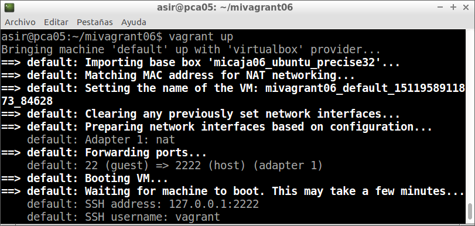

``vagrant ssh``: Conectar/entrar en nuestra máquina virtual usando SSH.

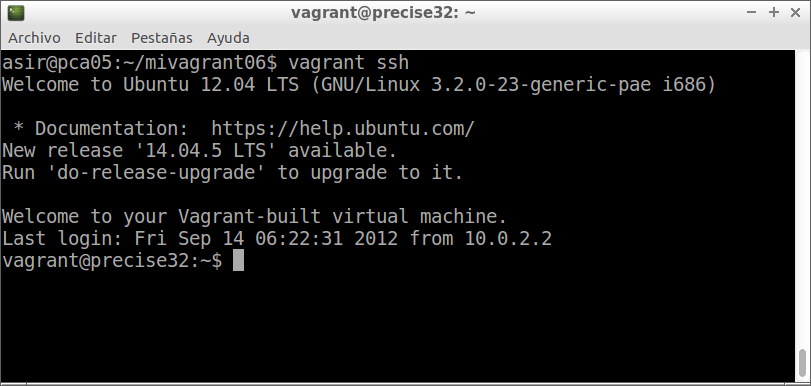

Otros comandos últiles de Vagrant son:

``vagrant suspend``: Suspender la máquina virtual.

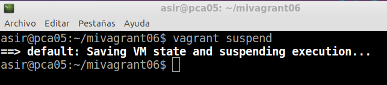

Debemos tener en cuenta que la MV en modo suspendido consume más espacio en disco debido a que el estado de la máquina virtual que suele almacenarse en la RAM se pasa a disco.

``vagrant resume`` : Volver a despertar la máquina virtual.

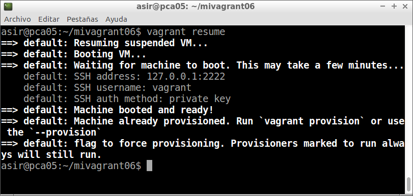

``vagrant halt``: Apagarla la máquina virtual.

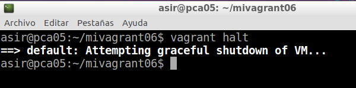

``vagrant status``: Estado actual de la máquina virtual.

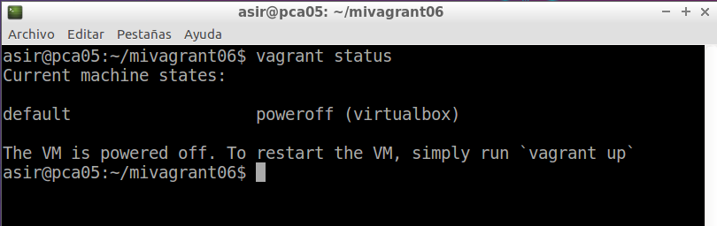

``vagrant destroy``: Para eliminar la máquina virtual (No los ficheros de configuración).

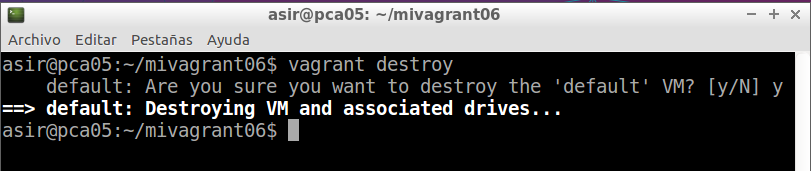

# 3. Configuración del entorno virtual

## 3.1 Carpetas sincronizadas

Para identificar las carpetas compartidas dentro del entorno virtual, usaremos los siguientes comandos:

- vagrant up
  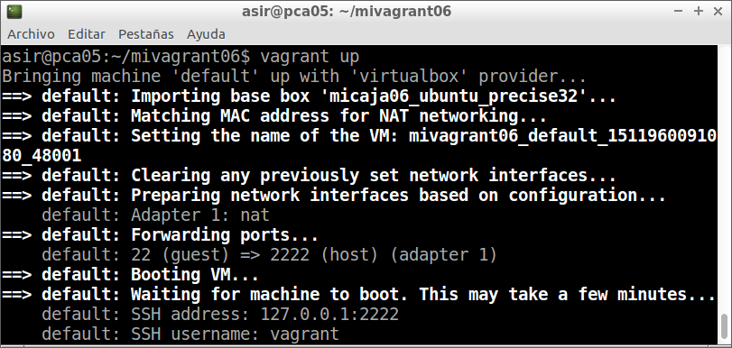

- vagrant ssh
- ls /vagrant
  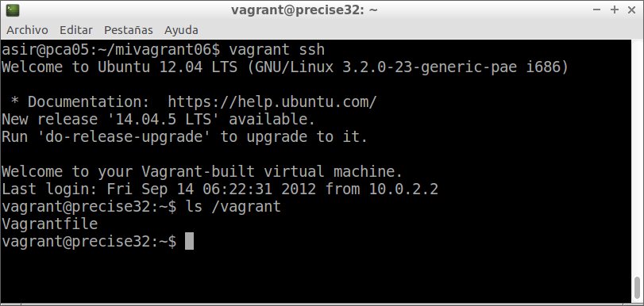

## 3.2 Redireccionamiento de los puertos

Cuando trabajamos con máquinas virtuales, es frecuente usarlas para proyectos enfocados a la web, y para acceder a las páginas es necesario configurar el enrutamiento de puertos.

- vagrant ssh
- apt-get update
- apt-get install apache2

  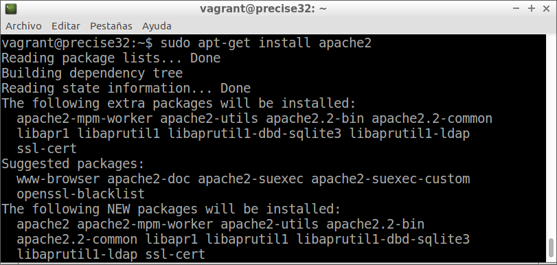

- Modificar el fichero Vagrantfile y añadir la línea `config.vm.network :forwarded_port, host: 4567, guest: 80`.

  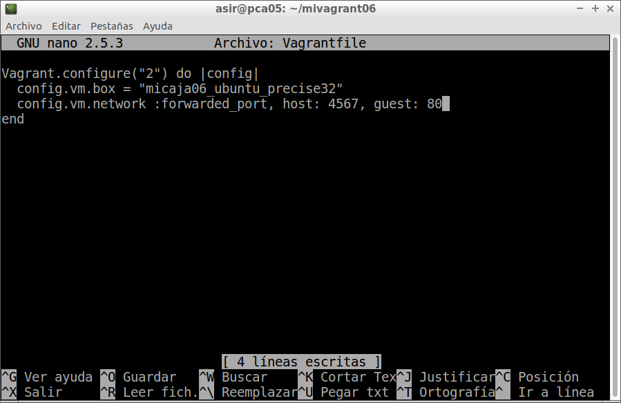

  Esto hará que el puerto `4567` del sistema anfitrión sea enrutado al puerto `80` del ambiente virtualizado.

  

- Para confirmar que hay un servicio a la escucha en `4567`, desde la máquina real podemos ejecutar los siguientes comandos:

  - `nmap -p 4500-4600 localhost, debe mostrar 4567/tcp open tram`.

  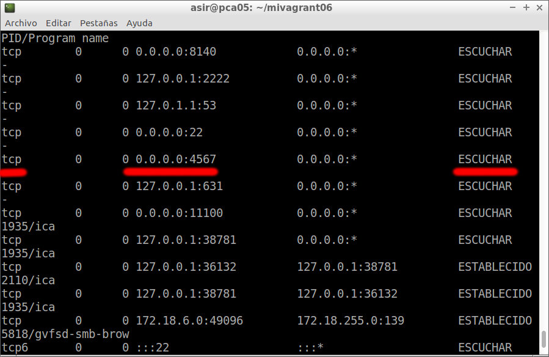

  - En la máquina real, abrimos el navegador web con el URL `http://127.0.0.1:4567`. En realidad estamos accediendo al puerto 80 de nuestro sistema virtualizado.

  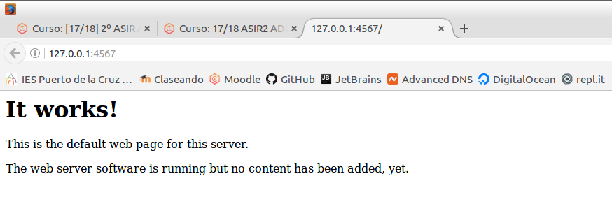

# 4. Ejemplos de configuración Vagrantfile
A continuación se muestran ejemplos de configuración Vagrantfile que NO ES NECESARIO hacer. Sólo es información.

Enlace de interés Tutorial Vagrant. ¿Qué es y cómo usarlo?

Ejemplo para configurar la red:

`config.vm.network "private_network", ip: "192.168.33.10"`

Ejemplo para configurar las carpetas compartidas:

config.vm.synced_folder "htdocs", "/var/www/html"
Ejemplo para configurar la conexión SSH de vagrant a nuestra máquina virtual:

    config.ssh.username = 'root'
    config.ssh.password = 'vagrant'
    config.ssh.insert_key = 'true'
Ejemplo para configurar la ejecución remota de aplicaciones gráficas instaladas en la máquina virtual, mediante SSH:

    config.ssh.forward_agent = true
    config.ssh.forward_x11 = true

# 5.Suministro

Una de los mejores aspectos de Vagrant es el uso de herramientas de suministro. Esto es, ejecutar "una receta" o una serie de scripts durante el proceso de arranque del entorno virtual para instalar, configurar y personalizar un sin fin de aspectos del SO del sistema anfitrión.

Usaremos `vagrant halt`, para apagar la MV.

Y `vagrant destroy`, la destruimos para volver a empezar.

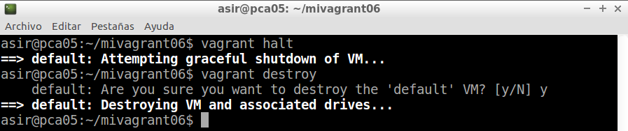
## 5.1 Suministro mediante shell script
Ahora vamos a suministrar a la MV un pequeño script para instalar Apache.

Crear el script `install_apache.sh`, dentro de la carpeta de nuestro proyecto con el siguiente contenido:

    #!/usr/bin/env bash

    apt-get update
    apt-get install -y apache2
    rm -rf /var/www
    ln -fs /vagrant /var/www
    echo "<h1>Actividad de Vagrant</h1>" > /var/www/index.html
    echo "
Curso2017-2018
" >> /var/www/index.html
    echo "
Carlos J. Oliva Dom
" >> /var/www/index.html

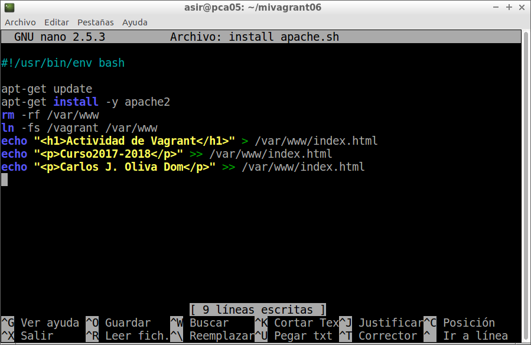

Ahora vamos a indicar a Vagrant que debe ejecutar dentro del entorno virtual un archivo `install_apache.sh`.

Le daremos permisos de ejecución al archivo `install_apache.sh`.

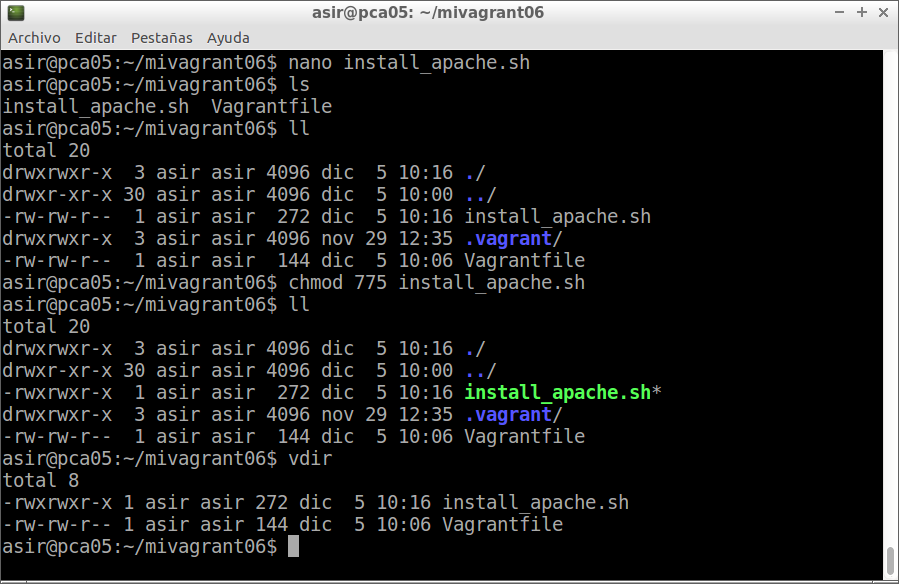

Modificamos `Vagrantfile` y agregamos la siguiente línea a la configuración:

    config.vm.provision :shell, :path => "install_apache.sh"

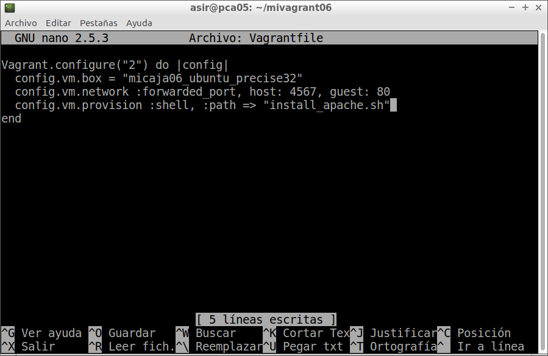

Volvemos a crear la MV.

Podemos usar `vagrant reload` si está en ejecución para que coja el cambio de la configuración.

Para verificar que efectivamente el servidor Apache ha sido instalado e iniciado, abrimos navegador en la máquina real con URL http://127.0.0.1:4567.

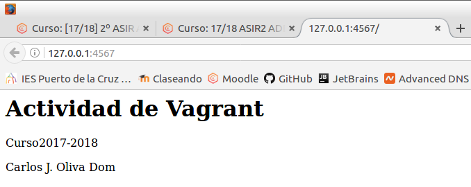

## 5.2 Suministro mediante Puppet
Lo primero que haremos será modificar el archivo `Vagrantfile` de la siguiente forma:

    Vagrant.configure(2) do |config|
      ...
      config.vm.provision "puppet" do |puppet|
        puppet.manifest_file = "default.pp"
      end
     end

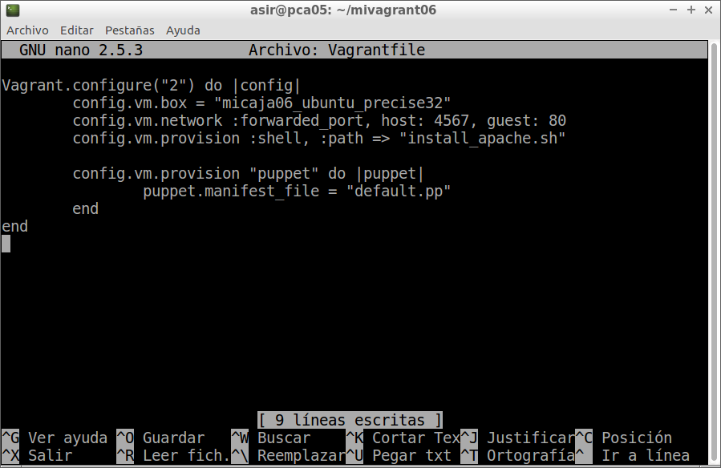

Crearemos un fichero manifests/default.pp, con las órdenes/instrucciones `puppet` para instalar el programa nmap y contendrá lo siguiente:

    package { 'nmap':
      ensure => 'present',
    }

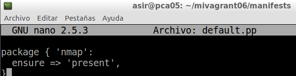

Para que se apliquen los cambios de configuración, haremos lo siguiente:

Parar la MV, destruirla y crearla de nuevo

  - vagrant halt
  - vagrant destroy
  - vagrant up

# 6. Nuestra caja personalizada

En los apartados anteriores hemos descargado una caja/box de un repositorio de Internet, y luego la hemos provisionado para personalizarla. En este apartado vamos a crear nuestra propia caja/box personalizada a partir de una MV de VirtualBox.

## 6.1 Preparar la MV VirtualBox
Lo primero que tenemos que hacer es preparar nuestra máquina virtual con una configuración por defecto, por si queremos publicar nuestro Box, ésto se realiza para seguir un estándar y que todo el mundo pueda usar dicho Box.

- Crear una MV VirtualBox nueva o usar una que ya tengamos.

- Instalar OpenSSH Server en la MV.

 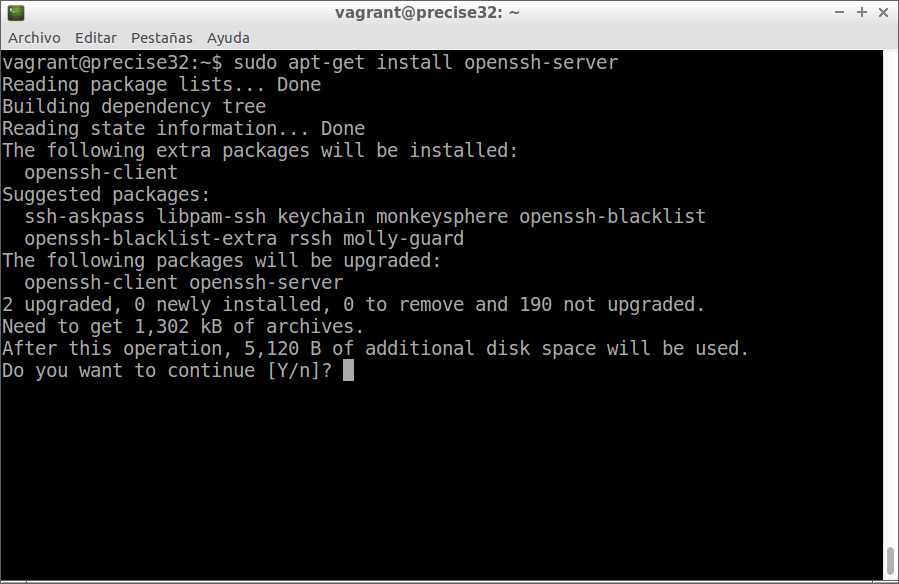

- Crear el usuario `vagrant`, para poder acceder a la máquina virtual por SSH.

  `useradd -m vagrant`

  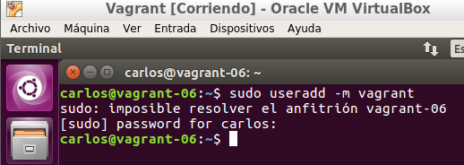

- A este usuario le agregamos una clave pública para autorizar el acceso sin clave desde Vagrant.

 `su - vagrant`

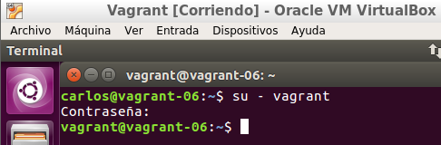

    mkdir .ssh
    wget https://raw.githubusercontent.com/mitchellh/vagrant/master/keys/vagrant.pub -O .ssh/authorized_keys

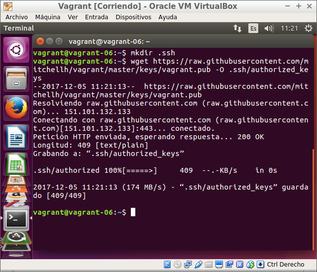

    chmod 700 .ssh
    chmod 600 .ssh/authorized_keys

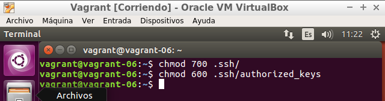

- Pondremos la contraseña `vagrant` al usuario vagrant y al usuario root.

- En el archivo `/etc/sudoers` añadir:

      vagrant ALL=(ALL) NOPASSWD: ALL a /etc/sudoers

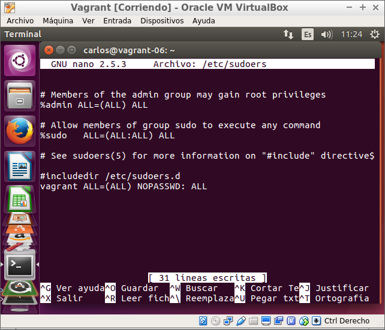

Debemos asegurarnos que tenemos instalado las VirtualBox Guest Additions con una versión compatible con el host anfitrion.

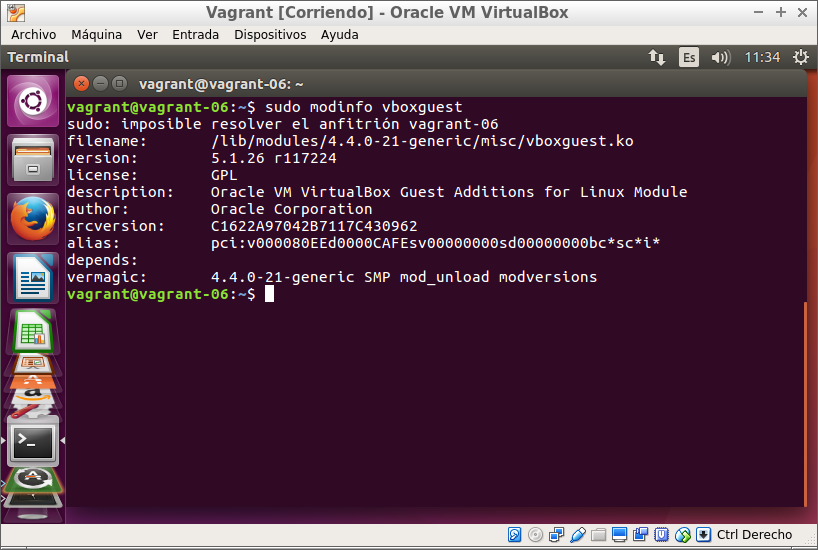

# 6.2 Crear la caja vagrant

Una vez hemos preparado la máquina virtual ya podemos crear el box.

- Vamos a crear una nueva carpeta mivagrant06conmicaja, para este nuevo proyecto vagrant.

- Ejecutamos vagrant init para crear el fichero de configuración nuevo.

  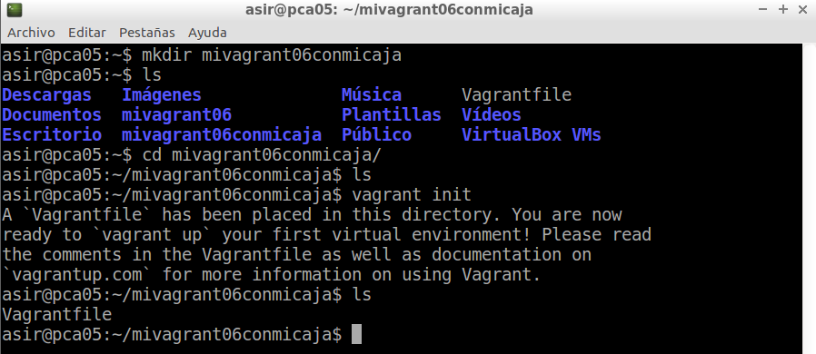

- VBoxManage list vms, comando de VirtualBox que lista las MV que tenemos.

- Crear la caja package.box a partir de la MV.

  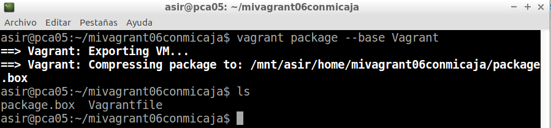

- Muestro la lista de cajas disponibles, pero sólo tengo 1 porque todavía no he incluido la que acabo de crear.

  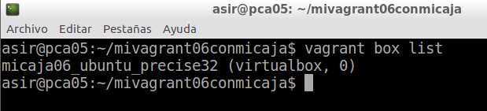

- Modifico el archivo `Vagrantfile`:

  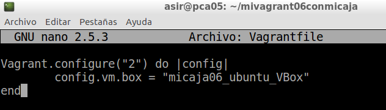

- Finalmente, añado la nueva caja creada por mí al repositorio de vagrant.

  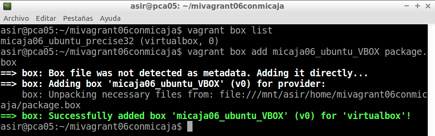

He tenido este problema. Al parecer no se puede descargar el archivo remoto.

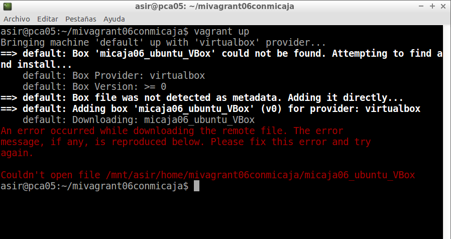

Fin de la práctica.
