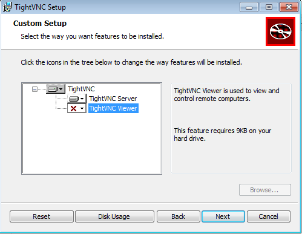

Carlos Javier Javier Oliva Domínguez
# A2: Acceso remoto VNC

*En la siguiente prántica aprenderemos a tener `Acceso remoto` de una máquina a otra, para ello usaremos Windows 7 y OpenSuse.*

- Ambas máquinas tendrán una configuración de red en `Adaptador puente` y direcciones ip estáticas.

---
### 1.0 Windows to Windows
*La primera parte de esta práctica la haremos desde una máquina Windows que actuará como Servidor y otra máquina Windows que actuará como Cliente.*
#### 1.1 Servidor Windows
El primer paso será configurar la dirección ip de forma estática con lo siguiente:
- 172.18.6.11
- 255.255.0.0
- 172.18.0.1

Para empezar instalaremos la aplicación `TightVNC` en el equipo Servidor, es decir, al equipo que vamos a acceder remotamente.

En la siguiente ventana vamos a elegir una instalación `Custom` y desmarcamos la opción `TightVNC Viewer` puesto que estamos configurando el servidor.

En la siguiente pantalla vamos a asignar una contraseña para el:
- `Remote Access` (para acceder desde el cliente)
- `Administrative Access` (para acceder al servidor)

Tras la finalización del paso anterior veremos como se ha instalado la aplicación `TightVNC Server`en la máquina que usaremos como servidor, o en otras palabras, a la que vamos a acceder remotamente.

Desde la siguiente ventana podremos configurar nuestro servidor VNC parámetros como:
- Puerto
- Contraseña
- Acceso desde Web.
- Otros...

-----

#### 1.2 Cliente Windows

Lo primero que haremos será configurar las direcciones ip en forma estática, de la siguiente forma:

- 172.18.6.11
- 255.255.0.0
- 172.18.0.1

Como en el apartado anterior, lo siguiente que haremos será ejecutar el instalador con una configuración `Custom` pero esta vez elegimos la opción `TightVNC Viewer`.

A cntinuación podemos comprobar la instalación de la aplicación TightVNC Viewer en nuestro cliente.

Lo siguiente que haremos será ejecutar la aplicación `TightVNC`en el cliente y pondremos los datos (dirección ip) del servidor.

Como podemos comprobar, hemos accedido desde el Cliente al Servidor mediante la aplicación `TightVNC`.

Para la correcta comprobación del funcionamiento, hemos puesto ambas máquinas una al lado de la otra para una mejor apreciación.

<---A la izquierda tenemos el Cliente.
A la derecha tenemos el Servidor--->.

A modo de comprobación nos dirigiremos al Cliente y mediante el comando `netstat -n` comprobaremos que hay una correcta comunicación entre la máquina Cliente ()`172.18.6.11`) y la máquina Servidor (`172.18.6.10`) mediante el puerto `5900`.

### 2.0 OpenSuse to OpenSuse
*La segunda parte de esta práctica la haremos desde una máquina OpenSuse que actuará como Servidor y otra máquina OpenSuse que actuará como Cliente.*
#### 1.1 Servidor OpenSuse
El primer paso será configurar la dirección ip de forma estática con lo siguiente:
- 172.18.6.31
- 255.255.0.0
- 172.18.0.1

Mediante la aplicación `YaST2` vamos a ejecutar la Administración remota que ya viene incluida en el sistema operativo.

Tendremos en cuenta dos factores:
- Activamos `Permitir administración remota con gestión del sistema.`
- `Puerto abierto en el cortafuegos.`

Tras la ejecución del asistente de `Administración remota` la máquina Servidor se reiniciará y el servicio quedará activado.

El siguiente paso será ejecutar el comando `vncserver` para ejecutar el servicio, éste nos dará un numero identificativo que corresponderá al número de escritorio, este número será usado para acceder posterirmente mediante el puerto 590X, X corresponde al número que nos dará el servidor.

- En nuestro caso ha sido `"3"`.

#### 1.1 Cliente OpenSuse
El primer paso será configurar la dirección ip de forma estática con lo siguiente:
- 172.18.6.32
- 255.255.0.0
- 172.18.0.1

Ahora para poder acceder al servidor nos iremos a una consola y mediante el comando `vncviewer` intentaremos acceder al Servidor para administrarlo remotamente.

En la última parte de la configuración del servidor y  tras ejecutar el comando `vncserver` en el servidor, éste nos suministró el número "3", número que corresponde al escritorio que se va a administrar, y que junto con el puerto, nos permitirá acceder concretamente a ese escritorio. En este caso usaremos `5903.`

Para la correcta comprobación del funcionamiento, hemos puesto ambas máquinas una al lado de la otra para una mejor apreciación.

- netstat -ntap

<---A la izquierda tenemos el Cliente.
A la derecha tenemos el Servidor--->.

### 3.0 Windows to OpenSuse
*En la tercera parte de esta práctica vamos a usar el Servidor de OpenSuse que creamos anteriormente para acceder a él desde el cliente Windows que creamos anteriormente.*

Lo que haremos será ejecutar la aplicación `TightVNC` en el cliente Windows, que ya teníamos configurado, para acceder al Servidor OpenSuse que hemos configurado en el punto anterior.

Introducimos la contraseña que habíamos predefinido en el Servidor.

Ahora podemos comprobar que podemos acceder desde el cliente Windows al Servidor OpenSuse para su correspondiente administración remota.

### 4.0 OpenSuse to Windows
*En la cuarta parte de esta práctica vamos a usar el Servidor de Windows que creamos anteriormente para acceder a él desde el cliente OpenSuse que creamos anteriormente.*

Abriremos una consola y ejecutaremos el comando `vncviewer` e introduciremos la contraseña del servidor Windows.

Ahora podemos comprobar que hemos accedido al Servidor Windows desde el cliente OpenSuse, y podemos adeministrarlo remotamente sin ningún problema.

Fin de la Práctica.
