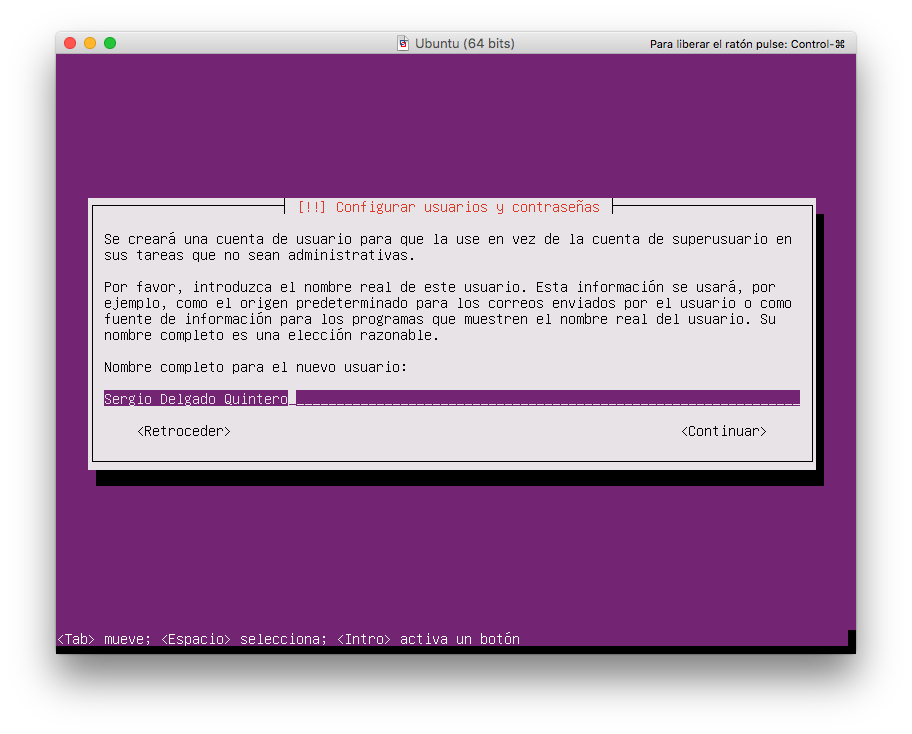
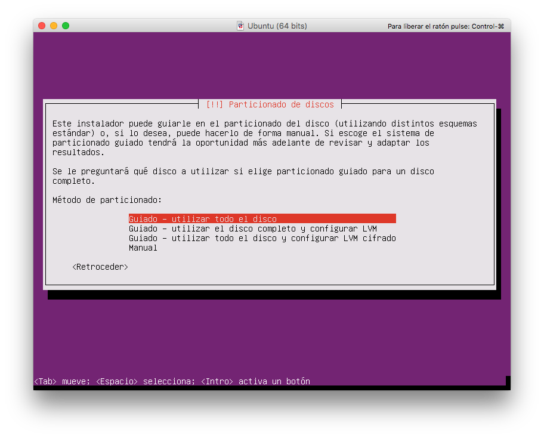

# Máquina de desarrollo

Para trabajar en esta asignatura necesitaremos dos máquinas: **máquina de desarrollo** y **máquina de producción**:

 

## Instalación

Usaremos una *máquina virtual* como *máquina de desarrollo*. Esta máquina tendrá sistema operativo Linux 64 bits, con las siguientes características:

- Distribución: `Ubuntu Xenial Xerus 16.04` (`iso` disponible en `leela`).
- Tamaño del disco duro: 25GB.
- Memoria: 2GB.
- Nombre de la máquina: `imw`
- Nombre de usuario: `alu<expediente>` (ej. *alu3421*)

