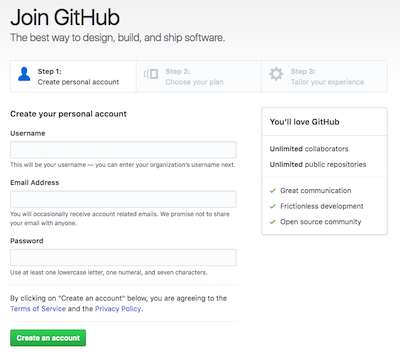
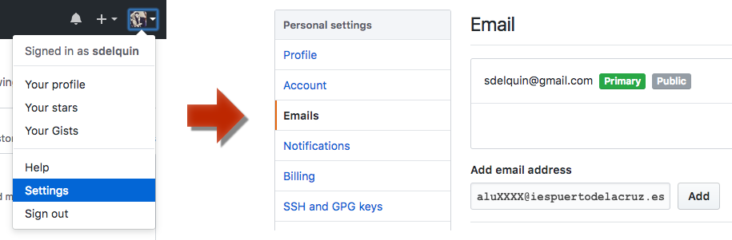
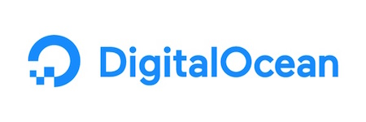
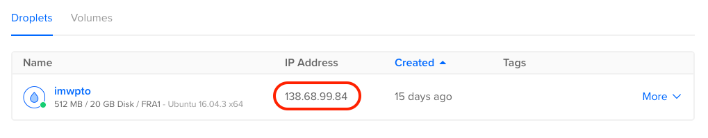
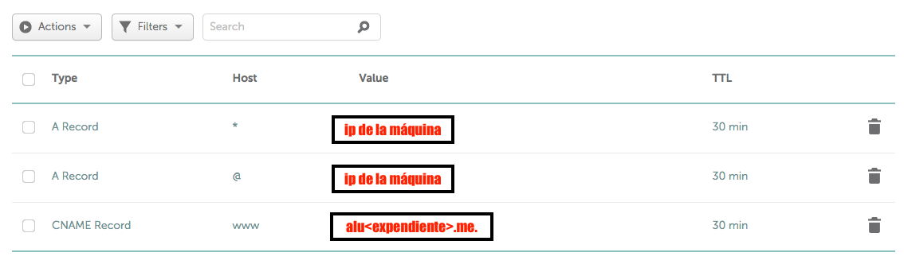

# Máquina de producción

Vamos a intentar tener una máquina en producción a través de los servicios ofrecidos por [Digital Ocean](https://www.digitalocean.com/) . Para ello, vamos a tratar de conseguir crédito solicitando el *Student Developer Pack* de *GitHub*.

## VPN

Dado que todos salimos a internet por la *misma IP pública*, es posible que seamos *baneados* por los servicios que vamos a utilizar, ya que hay demasiados accesos simultáneos, y se podría pensar que somos *robots*. Para solucionar esto, vamos a hacer uso de **VPN**, que crea un túnel para que podamos salir por *otra IP pública*.

Existen múltiples sitios para túneles VPN. Una posibilidad es `TunnelBear`. Instrucciones:

- [Registro en el servicio TunnelBear](https://www.tunnelbear.com/account#/signup) 
- [TunnelBear para Linux](https://www.tunnelbear.com/blog/linux_support/) 
- [TunnelBear para Mac](https://www.tunnelbear.com/apps/mac) 
- [TunnelBear para Windows](https://www.tunnelbear.com/apps/windows) 
- [TunnelBear para Chrome](https://www.tunnelbear.com/apps/browser) 

## Cuenta de correo del centro

En primer lugar necesitamos tener una cuenta de correo del IES Puerto de la Cruz - Telesforo Bravo. Han sido creadas cuentas para todo el alumnado de esta asignatura, en la forma:

> `aluXXXX@iespuertodelacruz.es`  

, donde XXXX es el número de expediente.

Para entrar en la cuenta, accedemos desde una navegador a [gmail.com](https://gmail.com) utilizando las siguientes credenciales:

- USUARIO: **cuenta de correo con dominio incluido**.
- CONTRASEÑA: tu **DNI** con la letra en mayúsculas.

La primera pantalla será la aceptación de las condiciones de Google, mientras que luego nos pedirá una nueva contraseña para el correo, que habrá que repetir dos veces.

En la bandeja de entrada tendremos dos correos, que, en principio, podremos ignorar.

## Cuenta en GitHub

`GitHub` es una plataforma de desarrollo colaborativo para alojar proyectos utilizando el sistema de control de versiones *Git*. [GitHub tiene actualmente cerca de 20 millones de repositorios de código](https://octoverse.github.com/).

 

Necesitamos una cuenta en *GitHub* para poder acceder al *Student Developer Pack*. Para ello nos registramos en su página utilizando el correo del centro.

 

En el caso de que ya tuviéramos cuenta en *GitHub*, tendremos que añadir el correo del instituto como segunda dirección:

 

## Solicitud del `Student Developer Pack`

Accedemos a [la página del `Student Developer Pack` de *GitHub*](https://education.github.com/pack/join).

 

Indicamos que somos estudiantes:

 

Rellenar el formulario teniendo en cuenta lo siguiente:

- **Name**: tu nombre y apellidos.
- **school-issued email address**: tu dirección de correo del centro.
- **School name**: IES Puerto de la Cruz - Telesforo Bravo
- **Graduation year**: 2018
- **How do you plan to use GitHub?**: I want to use GitHub for my lessons at the school, and, of course, for my future code projects.

Si todo va bien, en poco tiempo recibiremos un correo confirmando la aprobación del `Student Developer Pack`.

## Digital Ocean

*Digital Ocean* es un plataforma que da **servicios de hosting**.

Lo primero que debemos hacer es registrarnos en [Digital Ocean](https://cloud.digitalocean.com/registrations/new), utilizando la cuenta de correo del centro.

 

Una vez que completemos el registro, debemos acceder a la [configuración de pagos](https://cloud.digitalocean.com/settings/billing), e introducir el `Promo Code` que sacaremos del `Student Developer Pack`:

 

### Creación de un droplet

Tendremos que crear un **droplet** (*máquina virtual*) con las siguientes características:

- Ubuntu 16.04.3 x64.
- 5$/mo
- 512MB
- 1 CPU
- 20GB SSD disk
- 1000GB transfer
- Datacenter region: Frankfurt
- Hostname: `cloud`

Cuando hayamos terminado este proceso, tendremos una máquina disponible con una *IP pública* apuntando a la misma:

 

Podemos comprobarlo haciendo un ping a la IP que nos hayan asignado en el droplet:

```console
sdelquin@imw:~$ ping -c4 138.68.99.84
PING 138.68.99.84 (138.68.99.84) 56(84) bytes of data.
64 bytes from 138.68.99.84: icmp_seq=1 ttl=54 time=60.9 ms
64 bytes from 138.68.99.84: icmp_seq=2 ttl=54 time=60.7 ms
64 bytes from 138.68.99.84: icmp_seq=3 ttl=54 time=60.7 ms
64 bytes from 138.68.99.84: icmp_seq=4 ttl=54 time=61.0 ms

--- 138.68.99.84 ping statistics ---
4 packets transmitted, 4 received, 0% packet loss, time 3006ms
rtt min/avg/max/mdev = 60.724/60.888/61.071/0.286 ms
sdelquin@imw:~$
```

## Namecheap

*Namecheap* es una plataforma que da **servicios de nombres de dominio**.

 

Antes de nada, es necesario crear una cuenta en [Namecheap](https://www.namecheap.com/myaccount/signup.aspx) utilizando el correo electrónico del centro.

A continuación, regresamos al `Student Developer Pack` y accedemos a la sección de `Namecheap` para poder hacer uso del dominio gratuito. En realidad lo que haremos es autorizar a *Namecheap* a hacer uso de la cuenta de *GitHub*. Todo ello nos llevará a una página en la que podremos crear un dominio gratuito `*.me`.

### Creación de un dominio

El objetivo es crear un dominio que apunte a la máquina que hemos creado en *Digital Ocean*.

> El nombre de dominio deberá ser: `alu<expediente>.me`

Una vez creado el dominio, debemos establecer los DNS apuntando a *Digital Ocean*. Para ello, entramos con nuestras credenciales en *Namecheap*, y accedemos a:

```
Domain List -> Manage -> Advanced DNS
```

Una vez ahí, establecemos los siguientes registros con la IP de la máquina de producción de *Digital Ocean*:



### Propagación de los DNS

Es posible que la propagación de los DNS no sea inmediata, y que, por tanto, no podamos acceder al dominio creado. Podemos comprobar dónde está apuntando el dominio a través de un ping:

```console
sdelquin@imw:~$ ping -c4 imwpto.me
PING imwpto.me (138.68.99.84) 56(84) bytes of data.
64 bytes from cloud (138.68.99.84): icmp_seq=1 ttl=54 time=64.4 ms
64 bytes from cloud (138.68.99.84): icmp_seq=2 ttl=54 time=60.9 ms
64 bytes from cloud (138.68.99.84): icmp_seq=3 ttl=54 time=60.7 ms
64 bytes from cloud (138.68.99.84): icmp_seq=4 ttl=54 time=60.6 ms

--- imwpto.me ping statistics ---
4 packets transmitted, 4 received, 0% packet loss, time 3006ms
rtt min/avg/max/mdev = 60.660/61.693/64.411/1.591 ms
sdelquin@imw:~$
```
