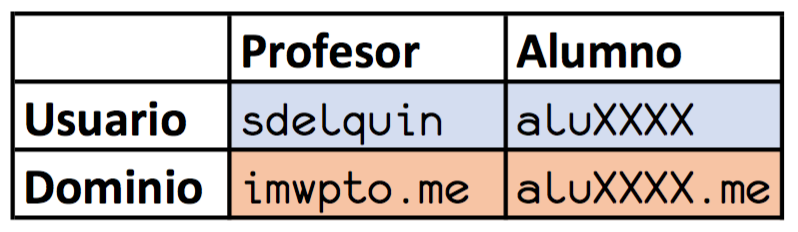

# Configuración de la máquina de producción

## Aclaración sobre usuarios y dominios

 

## Acceso por nombre de dominio

Si en el momento de hacer estos ajustes, aún no tuviéramos acceso a `cloud` a través del dominio `aluXXXX.me`, tendremos que acceder a través de la IP X.X.X.X correspondiente a la máquina de producciónd de *Digital Ocean*.

## Ajuste de locales

Accedemos a la máquina de producción `cloud`:

```console
sdelquin@imw:~$ ssh root@imwpto.me
root@imwpto.me's password:
Welcome to Ubuntu 16.04.3 LTS (GNU/Linux 4.4.0-93-generic x86_64)

 * Documentation:  https://help.ubuntu.com
 * Management:     https://landscape.canonical.com
 * Support:        https://ubuntu.com/advantage

  Get cloud support with Ubuntu Advantage Cloud Guest:
    http://www.ubuntu.com/business/services/cloud

9 packages can be updated.
0 updates are security updates.


Last login: Sun Sep 17 17:11:27 2017 from 79.157.45.93
-bash: warning: setlocale: LC_ALL: cannot change locale (es_ES.UTF-8)
-bash: warning: setlocale: LC_ALL: cannot change locale (es_ES.UTF-8)
root@cloud:~#
```

Para solucionar los *locales*, debemos ejecutar los siguientes comandos:

```console
root@cloud:~# sudo locale-gen es_ES.UTF-8
/bin/bash: warning: setlocale: LC_ALL: cannot change locale (es_ES.UTF-8)
Generating locales (this might take a while)...
  es_ES.UTF-8... done
Generation complete.
root@cloud:~# sudo update-locale LANG=es_ES.UTF-8
root@cloud:~#
```

## Creación de usuario

**Digital Ocean** nos da acceso de `root` a la máquina, pero vamos a crear un usuario distinto. Para ello, debemos ejecutar el siguiente comando pero con el nombre de usuario `alu<expendiente>`.

```console
root@cloud:~# adduser sdelquin
Adding user `sdelquin' ...
Adding new group `sdelquin' (1000) ...
Adding new user `sdelquin' (1000) with group `sdelquin' ...
The home directory `/home/sdelquin' already exists.  Not copying from `/etc/skel'.
Enter new UNIX password:
Retype new UNIX password:
passwd: password updated successfully
Changing the user information for sdelquin
Enter the new value, or press ENTER for the default
    Full Name []: Sergio Delgado Quintero
    Room Number []:
    Work Phone []:
    Home Phone []:
    Other []:
Is the information correct? [Y/n] Y
root@cloud:~#
```

Ahora sólo nos falta dar permisos de `sudo` al usuario creado:

```console
root@cloud:~# adduser sdelquin sudo
Adding user `sdelquin' to group `sudo' ...
Adding user sdelquin to group sudo
Done.
root@cloud:~#
```

## Acceso por SSH (sin password)

Cada vez que queramos entrar a la máquina de producción vía `ssh` nos va a solicitar la contraseña:

```console
sdelquin@imw:~$ ssh imwpto.me
The authenticity of host 'imwpto.me (138.68.99.84)' can't be established.
ECDSA key fingerprint is SHA256:ynI7eMO0tRkftH3hYLuqEki7SohZvPWwFP1epSrOqwM.
Are you sure you want to continue connecting (yes/no)? yes
Warning: Permanently added 'imwpto.me,138.68.99.84' (ECDSA) to the list of known hosts.
sdelquin@imwpto.me's password:
Welcome to Ubuntu 16.04.3 LTS (GNU/Linux 4.4.0-93-generic x86_64)

 * Documentation:  https://help.ubuntu.com
 * Management:     https://landscape.canonical.com
 * Support:        https://ubuntu.com/advantage

  Get cloud support with Ubuntu Advantage Cloud Guest:
    http://www.ubuntu.com/business/services/cloud

9 packages can be updated.
0 updates are security updates.


Last login: Sun Sep 17 18:32:36 2017 from 79.157.45.93
To run a command as administrator (user "root"), use "sudo <command>".
See "man sudo_root" for details.

sdelquin@imw:~$
```

### Creación de claves RSA

En la *máquina de desarrollo* creamos las claves *RSA*:

```console
sdelquin@imw:~$ ssh-keygen -t rsa
Generating public/private rsa key pair.
Enter file in which to save the key (/home/sdelquin/.ssh/id_rsa):
Enter passphrase (empty for no passphrase):
Enter same passphrase again:
Your identification has been saved in /home/sdelquin/.ssh/id_rsa.
Your public key has been saved in /home/sdelquin/.ssh/id_rsa.pub.
The key fingerprint is:
SHA256:n6j6l5HVZBhDDotylXx4nm6nvq0JFJ3x2lgitIC5Bm4 sdelquin@imw
The key's randomart image is:
+---[RSA 2048]----+
|     o..++=o     |
|  . o  =+*+=o    |
| . ...o =+==o    |
|  E oo   o+*.    |
| . .    S+o .    |
|       .ooo..    |
|        o+oo     |
|       .o..o     |
|    .oo. .=o.    |
+----[SHA256]-----+
sdelquin@imw:~$
```

### Copia de clave pública

Ahora copiamos la **clave pública** `id_rsa.pub` a la *máquina de producción*:

```console
sdelquin@imw:~$ ssh-copy-id imwpto.me
/usr/bin/ssh-copy-id: INFO: Source of key(s) to be installed: "/home/sdelquin/.ssh/id_rsa.pub"
/usr/bin/ssh-copy-id: INFO: attempting to log in with the new key(s), to filter out any that are already installed
/usr/bin/ssh-copy-id: INFO: 1 key(s) remain to be installed -- if you are prompted now it is to install the new keys
sdelquin@imwpto.me's password:

Number of key(s) added: 1

Now try logging into the machine, with:   "ssh 'imwpto.me'"
and check to make sure that only the key(s) you wanted were added.

sdelquin@imw:~$
```

Ahora deberíamos poder entrar en la *máquina de producción* sin necesidad de poner nuestra contraseña:

```console
sdelquin@imw:~$ ssh imwpto.me
Welcome to Ubuntu 16.04.3 LTS (GNU/Linux 4.4.0-93-generic x86_64)

 * Documentation:  https://help.ubuntu.com
 * Management:     https://landscape.canonical.com
 * Support:        https://ubuntu.com/advantage

  Get cloud support with Ubuntu Advantage Cloud Guest:
    http://www.ubuntu.com/business/services/cloud

9 packages can be updated.
0 updates are security updates.


Last login: Sun Sep 17 19:05:13 2017 from 79.157.45.93
sdelquin@cloud:~$
```

## Dando un nombre más sencillo

```console
sdelquin@imw:~$ sudo vi /etc/hosts
[sudo] password for sdelquin:
```

Añadir la siguiente información:
```console
138.68.99.84  cloud
```

Ahora podemos acceder a la *máquina de producción* utilizando el nombre `cloud`:

```console
sdelquin@imw:~$ ping cloud
PING cloud (138.68.99.84) 56(84) bytes of data.
64 bytes from cloud (138.68.99.84): icmp_seq=1 ttl=55 time=67.1 ms
64 bytes from cloud (138.68.99.84): icmp_seq=2 ttl=55 time=66.5 ms
^C
--- cloud ping statistics ---
2 packets transmitted, 2 received, 0% packet loss, time 1002ms
rtt min/avg/max/mdev = 66.513/66.834/67.155/0.321 ms
sdelquin@imw:~$
```

```console
sdelquin@imw:~$ ssh cloud
The authenticity of host 'cloud (138.68.99.84)' can't be established.
ECDSA key fingerprint is SHA256:ynI7eMO0tRkftH3hYLuqEki7SohZvPWwFP1epSrOqwM.
Are you sure you want to continue connecting (yes/no)? yes
Warning: Permanently added 'cloud' (ECDSA) to the list of known hosts.
Welcome to Ubuntu 16.04.3 LTS (GNU/Linux 4.4.0-93-generic x86_64)

 * Documentation:  https://help.ubuntu.com
 * Management:     https://landscape.canonical.com
 * Support:        https://ubuntu.com/advantage

  Get cloud support with Ubuntu Advantage Cloud Guest:
    http://www.ubuntu.com/business/services/cloud

Pueden actualizarse 14 paquetes.
0 actualizaciones son de seguridad.


*** System restart required ***
Last login: Thu Sep 21 15:00:03 2017 from 79.154.89.74
sdelquin@cloud:~$
```
