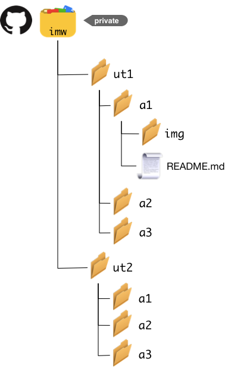

# Repositorio para actividades

Una vez activado el *Student Developer Pack*, ya tendremos la posibilidad de crear repositorios privados ilimitados.

Para la entrega de las actividades de la asignatura, debemos crear un **REPOSITORIO PRIVADO** llamado `imw` con la siguiente estructura de *unidades de trabajo* y *actividades*:

 

En el caso de que hubiera que entregar **informes**, estos se harán en un documento `README.md` con estilo *markdown*. Si hubiera que entregar **código**, el propio código se incluirá en la carpeta correspondiente.
