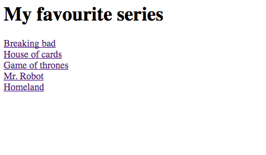

# UT1-A1: Mis series favoritas

La actividad consiste en crear *una página web* que nos enlace a tus 5 series favoritas.

Los requerimientos son los siguientes:

1. La página debe abrirse al acceder a `http://aluXXXX.me/series/`
2. Los enlaces de las series deben ir a su correspondiente página dentro de [IMDB](http://www.imdb.com/)
3. Todos los textos de la página deben estar escritos en **inglés.**
4. La página hay que editarla directamente en la *máquina de producción*, accediendo por *ssh* y utilizando un editor en consola (*nano*, *vi*, ...)
5. No ubicar el sitio web en `/var/www/html`, sino otra localización utilizando un *virtual host*.

## Ejemplo de web



## Posibles mejoras

- Añadir iconos de [Font Awesome](http://fontawesome.io/)
- Añadir fondo de [Subtle Patterns](https://www.toptal.com/designers/subtlepatterns/) 
- Añadir portadas de las series.

## Información a entregar

Se deberá entregar la *url* al commit en el repositorio privado *GitHub* de la asignatura *IMW*, apuntando al `README.md` que contiene un informe detallado de la actividad, donde expliques lo que has hecho, justificando tus decisiones. La *url* debe tener la siguiente estructura:

```
https://github.com/<usuario>/imw/blob/<id del commit>/<ut>/<actividad>/README.md
```

> ⚠️ Al subir la *url*, es importante crear un enlace. Es decir, poner un `href` a la *url* anterior, y no pegar el texto tal cual.
