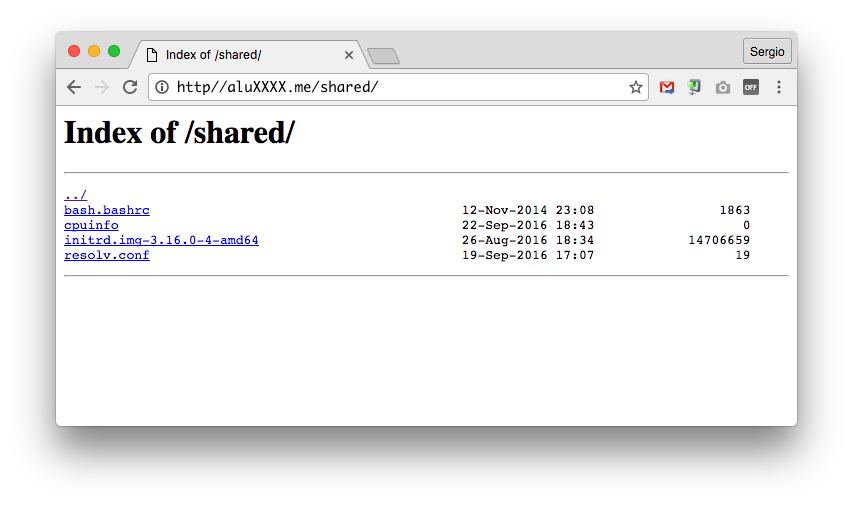

# UT1-A2: Listado de directorios

La actividad consiste en permitir el acceso al contenido de un subdirectorio dentro de la ruta raíz de *Nginx*, enlazando una serie de ficheros desde ahí.

Los requerimientos son los siguientes:

1. Se debe acceder al listado al entrar en **http://aluXXXX.me/shared/**
2. El listado debe contener los siguientes ficheros:
    - `/boot/initrd.img-4.4.0-93-generic` (imagen del kernel)
    - `/etc/resolv.conf` (listado de DNS)
    - `/etc/bash.bashrc` (configuración global de bash)
    - `/proc/cpuinfo` (características de la máquina)

> NOTA: No se permite copiar los ficheros, sólo se podrán usar enlaces simbólicos utilizando el comando `ln -s`

## Salida deseada



## Información a entregar

Se deberá entregar la *url* al commit en el repositorio privado *GitHub* de la asignatura *IMW*, apuntando al `README.md` que contiene un informe detallado de la actividad, donde expliques lo que has hecho, justificando tus decisiones. La *url* debe tener la siguiente estructura:

```
https://github.com/<usuario>/imw/blob/<id del commit>/<ut>/<actividad>/README.md
```

> ⚠️ Al subir la *url*, es importante crear un enlace. Es decir, poner un `href` a la *url* anterior, y no pegar el texto tal cual.
