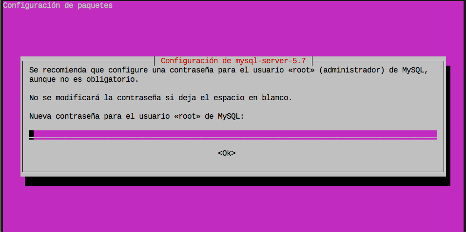
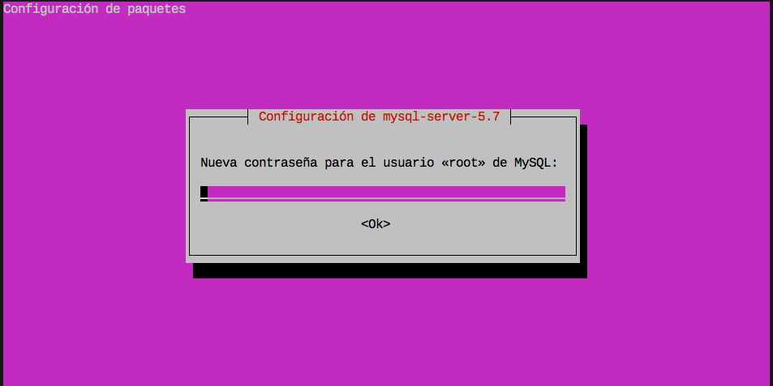

# Base de datos

El sistema gestor de bases de datos que vamos a utilizar es **MySQL**.

 

## Instalación

Para la instalación vamos a usar el paquete preparado para ello:

```console
sdelquin@cloud:~$ sudo apt-get install mysql-server
[sudo] password for sdelquin:
Leyendo lista de paquetes... Hecho
Creando árbol de dependencias
Leyendo la información de estado... Hecho
Se instalarán los siguientes paquetes adicionales:
  libaio1 libcgi-fast-perl libcgi-pm-perl libevent-core-2.0-5 libfcgi-perl libhtml-template-perl
  mysql-client-5.7 mysql-client-core-5.7 mysql-common mysql-server-5.7 mysql-server-core-5.7
Paquetes sugeridos:
  libipc-sharedcache-perl mailx tinyca
Se instalarán los siguientes paquetes NUEVOS:
  libaio1 libcgi-fast-perl libcgi-pm-perl libevent-core-2.0-5 libfcgi-perl libhtml-template-perl
  mysql-client-5.7 mysql-client-core-5.7 mysql-common mysql-server mysql-server-5.7
  mysql-server-core-5.7
0 actualizados, 12 nuevos se instalarán, 0 para eliminar y 22 no actualizados.
Se necesita descargar 18,1 MB de archivos.
Se utilizarán 161 MB de espacio de disco adicional después de esta operación.
¿Desea continuar? [S/n]
Des:1 http://ams2.mirrors.digitalocean.com/ubuntu xenial-updates/main amd64 mysql-common all 5.7.19-0ubuntu0.16.04.1 [15,7 kB]
Des:2 http://ams2.mirrors.digitalocean.com/ubuntu xenial/main amd64 libaio1 amd64 0.3.110-2 [6.356 B]
Des:3 http://ams2.mirrors.digitalocean.com/ubuntu xenial-updates/main amd64 mysql-client-core-5.7 amd64 5.7.19-0ubuntu0.16.04.1 [6.020 kB]
Des:4 http://ams2.mirrors.digitalocean.com/ubuntu xenial-updates/main amd64 mysql-client-5.7 amd64 5.7.19-0ubuntu0.16.04.1 [1.654 kB]
Des:5 http://ams2.mirrors.digitalocean.com/ubuntu xenial-updates/main amd64 mysql-server-core-5.7 amd64 5.7.19-0ubuntu0.16.04.1 [7.588 kB]
Des:6 http://ams2.mirrors.digitalocean.com/ubuntu xenial-updates/main amd64 libevent-core-2.0-5 amd64 2.0.21-stable-2ubuntu0.16.04.1 [70,6 kB]
Des:7 http://ams2.mirrors.digitalocean.com/ubuntu xenial-updates/main amd64 mysql-server-5.7 amd64 5.7.19-0ubuntu0.16.04.1 [2.463 kB]
Des:8 http://ams2.mirrors.digitalocean.com/ubuntu xenial/main amd64 libcgi-pm-perl all 4.26-1 [185 kB]
Des:9 http://ams2.mirrors.digitalocean.com/ubuntu xenial/main amd64 libfcgi-perl amd64 0.77-1build1 [32,3 kB]
Des:10 http://ams2.mirrors.digitalocean.com/ubuntu xenial/main amd64 libcgi-fast-perl all 1:2.10-1 [10,2 kB]
Des:11 http://ams2.mirrors.digitalocean.com/ubuntu xenial/main amd64 libhtml-template-perl all 2.95-2 [60,4 kB]
Des:12 http://ams2.mirrors.digitalocean.com/ubuntu xenial-updates/main amd64 mysql-server all 5.7.19-0ubuntu0.16.04.1 [10,8 kB]
Descargados 18,1 MB en 21s (834 kB/s)
Preconfigurando paquetes ...
```

En este punto, el instalador nos pedirá poner la clave del usuario `root` que gestionará **MySQL**:



Y a continuación repetir la clave:



La instalación continua hasta terminar de configurar todos los paquetes:

```console
Seleccionando el paquete mysql-common previamente no seleccionado.
(Leyendo la base de datos ... 85821 ficheros o directorios instalados actualmente.)
Preparando para desempaquetar .../mysql-common_5.7.19-0ubuntu0.16.04.1_all.deb ...
Desempaquetando mysql-common (5.7.19-0ubuntu0.16.04.1) ...
Seleccionando el paquete libaio1:amd64 previamente no seleccionado.
Preparando para desempaquetar .../libaio1_0.3.110-2_amd64.deb ...
Desempaquetando libaio1:amd64 (0.3.110-2) ...
Seleccionando el paquete mysql-client-core-5.7 previamente no seleccionado.
Preparando para desempaquetar .../mysql-client-core-5.7_5.7.19-0ubuntu0.16.04.1_amd64.deb ...
Desempaquetando mysql-client-core-5.7 (5.7.19-0ubuntu0.16.04.1) ...
Seleccionando el paquete mysql-client-5.7 previamente no seleccionado.
Preparando para desempaquetar .../mysql-client-5.7_5.7.19-0ubuntu0.16.04.1_amd64.deb ...
Desempaquetando mysql-client-5.7 (5.7.19-0ubuntu0.16.04.1) ...
Seleccionando el paquete mysql-server-core-5.7 previamente no seleccionado.
Preparando para desempaquetar .../mysql-server-core-5.7_5.7.19-0ubuntu0.16.04.1_amd64.deb ...
Desempaquetando mysql-server-core-5.7 (5.7.19-0ubuntu0.16.04.1) ...
Seleccionando el paquete libevent-core-2.0-5:amd64 previamente no seleccionado.
Preparando para desempaquetar .../libevent-core-2.0-5_2.0.21-stable-2ubuntu0.16.04.1_amd64.deb ...
Desempaquetando libevent-core-2.0-5:amd64 (2.0.21-stable-2ubuntu0.16.04.1) ...
Procesando disparadores para libc-bin (2.23-0ubuntu9) ...
Procesando disparadores para man-db (2.7.5-1) ...
Configurando mysql-common (5.7.19-0ubuntu0.16.04.1) ...
update-alternatives: utilizando /etc/mysql/my.cnf.fallback para proveer /etc/mysql/my.cnf (my.cnf) en modo automático
Seleccionando el paquete mysql-server-5.7 previamente no seleccionado.
(Leyendo la base de datos ... 85989 ficheros o directorios instalados actualmente.)
Preparando para desempaquetar .../mysql-server-5.7_5.7.19-0ubuntu0.16.04.1_amd64.deb ...
Desempaquetando mysql-server-5.7 (5.7.19-0ubuntu0.16.04.1) ...
Seleccionando el paquete libcgi-pm-perl previamente no seleccionado.
Preparando para desempaquetar .../libcgi-pm-perl_4.26-1_all.deb ...
Desempaquetando libcgi-pm-perl (4.26-1) ...
Seleccionando el paquete libfcgi-perl previamente no seleccionado.
Preparando para desempaquetar .../libfcgi-perl_0.77-1build1_amd64.deb ...
Desempaquetando libfcgi-perl (0.77-1build1) ...
Seleccionando el paquete libcgi-fast-perl previamente no seleccionado.
Preparando para desempaquetar .../libcgi-fast-perl_1%3a2.10-1_all.deb ...
Desempaquetando libcgi-fast-perl (1:2.10-1) ...
Seleccionando el paquete libhtml-template-perl previamente no seleccionado.
Preparando para desempaquetar .../libhtml-template-perl_2.95-2_all.deb ...
Desempaquetando libhtml-template-perl (2.95-2) ...
Seleccionando el paquete mysql-server previamente no seleccionado.
Preparando para desempaquetar .../mysql-server_5.7.19-0ubuntu0.16.04.1_all.deb ...
Desempaquetando mysql-server (5.7.19-0ubuntu0.16.04.1) ...
Procesando disparadores para man-db (2.7.5-1) ...
Procesando disparadores para ureadahead (0.100.0-19) ...
Procesando disparadores para systemd (229-4ubuntu19) ...
Configurando libaio1:amd64 (0.3.110-2) ...
Configurando mysql-client-core-5.7 (5.7.19-0ubuntu0.16.04.1) ...
Configurando mysql-client-5.7 (5.7.19-0ubuntu0.16.04.1) ...
Configurando mysql-server-core-5.7 (5.7.19-0ubuntu0.16.04.1) ...
Configurando libevent-core-2.0-5:amd64 (2.0.21-stable-2ubuntu0.16.04.1) ...
Configurando mysql-server-5.7 (5.7.19-0ubuntu0.16.04.1) ...
update-alternatives: utilizando /etc/mysql/mysql.cnf para proveer /etc/mysql/my.cnf (my.cnf) en modo automático
Renaming removed key_buffer and myisam-recover options (if present)
Configurando libcgi-pm-perl (4.26-1) ...
Configurando libfcgi-perl (0.77-1build1) ...
Configurando libcgi-fast-perl (1:2.10-1) ...
Configurando libhtml-template-perl (2.95-2) ...
Configurando mysql-server (5.7.19-0ubuntu0.16.04.1) ...
Procesando disparadores para libc-bin (2.23-0ubuntu9) ...
Procesando disparadores para systemd (229-4ubuntu19) ...
Procesando disparadores para ureadahead (0.100.0-19) ...
sdelquin@cloud:~$
```

Una vez finalizada la instalación, podemos comprobar que el servicio está corriendo:

```console
sdelquin@cloud:~$ sudo systemctl status mysql
● mysql.service - MySQL Community Server
   Loaded: loaded (/lib/systemd/system/mysql.service; enabled; vendor preset: enabled)
   Active: active (running) since dom 2017-10-01 12:29:25 UTC; 3min 33s ago
 Main PID: 14742 (mysqld)
   CGroup: /system.slice/mysql.service
           └─14742 /usr/sbin/mysqld

oct 01 12:29:24 cloud systemd[1]: Starting MySQL Community Server...
oct 01 12:29:25 cloud systemd[1]: Started MySQL Community Server.
sdelquin@cloud:~$
```

### Uso de memoria

*MySQL* es un proceso (o conjunto de procesos) que consume bastante memoria RAM. Para ver el consumo hacemos:

```console
sdelquin@cloud:~$ ps aux | grep mysql
mysql    14742  0.1 28.0 1115748 140388 ?      Ssl  12:29   0:00 /usr/sbin/mysqld
sdelquin 14864  0.0  0.1  14160   968 pts/0    S+   12:40   0:00 grep --color=auto mysql
sdelquin@cloud:~$
```

Nos podemos fijar que está usando 140388 bytes, es decir, unos **137MB**.

Existe una web que permite tener una aproximación de la memoria que va a usar el servicio *MySQL* en función de ciertos parámetros de configuración: [MySQL Calculator](http://www.mysqlcalculator.com/).

## Acceso al gestor de bases de datos

El comando que nos permite gestionar las bases de datos **MySQL** es, aunque parezca increíble `mysql` 😉 . Nótese que el parámetro `-u` indica el usuario y `-p` indica que se va a acceder a través de contraseña.

```console
sdelquin@cloud:~$ mysql -u root -p
Enter password:
Welcome to the MySQL monitor.  Commands end with ; or \g.
Your MySQL connection id is 5
Server version: 5.7.19-0ubuntu0.16.04.1 (Ubuntu)

Copyright (c) 2000, 2017, Oracle and/or its affiliates. All rights reserved.

Oracle is a registered trademark of Oracle Corporation and/or its
affiliates. Other names may be trademarks of their respective
owners.

Type 'help;' or '\h' for help. Type '\c' to clear the current input statement.

mysql>
```

## Ajuste de codificaciones

*MySQL* maneja una gran cantidad de variables globales, que configuran su comportamiento. Se pueden ver utilizando el comando `show variables;` dentro de una sesión en el intérprete.

Es importante ajustar las codificaciones que utiliza el sistema gestor. Primero vemos el valor que tienen utilizando el siguiente comando:

```sql
mysql> SHOW VARIABLES WHERE Variable_name LIKE 'character\_set\_%' OR Variable_name LIKE 'collation%';
+--------------------------+-------------------+
| Variable_name            | Value             |
+--------------------------+-------------------+
| character_set_client     | utf8              |
| character_set_connection | utf8              |
| character_set_database   | latin1            |
| character_set_filesystem | binary            |
| character_set_results    | utf8              |
| character_set_server     | latin1            |
| character_set_system     | utf8              |
| collation_connection     | utf8_general_ci   |
| collation_database       | latin1_swedish_ci |
| collation_server         | latin1_swedish_ci |
+--------------------------+-------------------+
10 rows in set (0.00 sec)
mysql>
```

Lo que queremos, es que todas las variables de codificación estén fijadas a `utf8mb4`.

El fichero de configuración de **MySQL** se encuentra en: `/etc/mysql/my.cnf`, pero se pueden incluir ficheros de configuración en la ruta: `/etc/mysql/conf.d/`

```console
sdelquin@cloud:~$ sudo vi /etc/mysql/conf.d/utf8mb4.cnf
```

>Contenido
```ini
[client]
default-character-set = utf8mb4
[mysql]
default-character-set = utf8mb4
[mysqld]
character-set-client-handshake = FALSE
character-set-server = utf8mb4
collation-server = utf8mb4_unicode_ci
```

Reiniciamos el servidor:

```console
sdelquin@cloud:~$ sudo systemctl restart mysql
sdelquin@cloud:~$
```

Accedemos de nuevo al intérprete SQL de **MySQL** para comprobar de nuevo las variables:

```sql
mysql> SHOW VARIABLES WHERE Variable_name LIKE 'character\_set\_%' OR Variable_name LIKE 'collation%';
+--------------------------+--------------------+
| Variable_name            | Value              |
+--------------------------+--------------------+
| character_set_client     | utf8mb4            |
| character_set_connection | utf8mb4            |
| character_set_database   | utf8mb4            |
| character_set_filesystem | binary             |
| character_set_results    | utf8mb4            |
| character_set_server     | utf8mb4            |
| character_set_system     | utf8               |
| collation_connection     | utf8mb4_unicode_ci |
| collation_database       | utf8mb4_unicode_ci |
| collation_server         | utf8mb4_unicode_ci |
+--------------------------+--------------------+
10 rows in set (0.00 sec)

mysql> Bye
```

* [x] Ahora sí tenemos todas las variables ajustadas a `utf8mb4`.

## Instalación segura

La instalación por defecto de *MySQL* deja una base de datos de test y algunas cuentas extrañas de usuario, que pueden ser origen de problemas de seguridad. Vamos a intentar solucionar estos problemas usando el comando `mysql_secure_installation`:

```console
sdelquin@cloud:~$ sudo mysql_secure_installation

Securing the MySQL server deployment.

Enter password for user root:

VALIDATE PASSWORD PLUGIN can be used to test passwords
and improve security. It checks the strength of password
and allows the users to set only those passwords which are
secure enough. Would you like to setup VALIDATE PASSWORD plugin?

Press y|Y for Yes, any other key for No: y

There are three levels of password validation policy:

LOW    Length >= 8
MEDIUM Length >= 8, numeric, mixed case, and special characters
STRONG Length >= 8, numeric, mixed case, special characters and dictionary                  file

Please enter 0 = LOW, 1 = MEDIUM and 2 = STRONG: 1
Using existing password for root.

Estimated strength of the password: 50
Change the password for root ? ((Press y|Y for Yes, any other key for No) : n

 ... skipping.
By default, a MySQL installation has an anonymous user,
allowing anyone to log into MySQL without having to have
a user account created for them. This is intended only for
testing, and to make the installation go a bit smoother.
You should remove them before moving into a production
environment.

Remove anonymous users? (Press y|Y for Yes, any other key for No) : y
Success.


Normally, root should only be allowed to connect from
'localhost'. This ensures that someone cannot guess at
the root password from the network.

Disallow root login remotely? (Press y|Y for Yes, any other key for No) : y
Success.

By default, MySQL comes with a database named 'test' that
anyone can access. This is also intended only for testing,
and should be removed before moving into a production
environment.


Remove test database and access to it? (Press y|Y for Yes, any other key for No) : y
 - Dropping test database...
Success.

 - Removing privileges on test database...
Success.

Reloading the privilege tables will ensure that all changes
made so far will take effect immediately.

Reload privilege tables now? (Press y|Y for Yes, any other key for No) : y
Success.

All done!
sdelquin@cloud:~$
```

* [x] Instalación segura completada.

### Política de contraseñas

Con la "segurización" de las contraseñas, se obliga a cumplir con los siguientes criterios:

- La longitud de la contraseña debe ser de 8 o más caracteres.
- Deben incluir, al menos, uno de los siguientes caracteres:
  + Letras en mayúsculas.
  + Letras en minúsculas.
  + Dígitos.
  + Caracteres especiales ("!", "@", "$", etc.).
