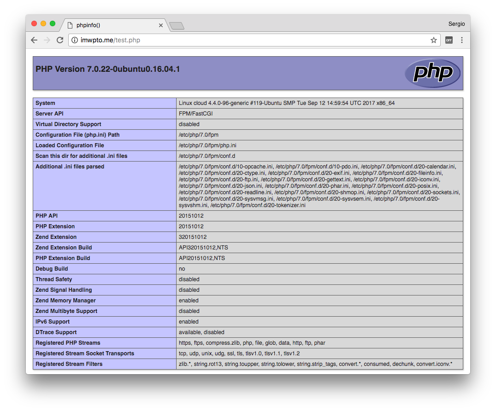

# Configuración de PHP

**PHP** es un lenguaje de programación, ampliamente utilizado en la creación de contenido web.

 

## Instalación

Aunque ya hemos instalado [el servidor web Nginx](../webserver), necesitamos un módulo adicional que procese el lenguaje PHP.

Existen varios módulos de procesamiento de PHP, pero el más usado es [php-fpm](https://php-fpm.org/)  (FastCGI Process Manager). Para su instalación usaremos el paquete `php-fpm` disponible en los repositorios de *apt*:

```console
sdelquin@cloud:~$ sudo apt-get install php-fpm
Leyendo lista de paquetes... Hecho
Creando árbol de dependencias
Leyendo la información de estado... Hecho
Se instalarán los siguientes paquetes adicionales:
  php-common php7.0-cli php7.0-common php7.0-fpm php7.0-json php7.0-opcache php7.0-readline
Paquetes sugeridos:
  php-pear
Se instalarán los siguientes paquetes NUEVOS:
  php-common php-fpm php7.0-cli php7.0-common php7.0-fpm php7.0-json php7.0-opcache php7.0-readline
0 actualizados, 8 nuevos se instalarán, 0 para eliminar y 22 no actualizados.
Se necesita descargar 3.543 kB de archivos.
Se utilizarán 14,1 MB de espacio de disco adicional después de esta operación.
¿Desea continuar? [S/n]
Des:1 http://ams2.mirrors.digitalocean.com/ubuntu xenial/main amd64 php-common all 1:35ubuntu6 [10,8 kB]
Des:2 http://ams2.mirrors.digitalocean.com/ubuntu xenial-updates/main amd64 php7.0-common amd64 7.0.22-0ubuntu0.16.04.1 [843 kB]
Des:3 http://ams2.mirrors.digitalocean.com/ubuntu xenial-updates/main amd64 php7.0-json amd64 7.0.22-0ubuntu0.16.04.1 [16,9 kB]
Des:4 http://ams2.mirrors.digitalocean.com/ubuntu xenial-updates/main amd64 php7.0-opcache amd64 7.0.22-0ubuntu0.16.04.1 [77,1 kB]
Des:5 http://ams2.mirrors.digitalocean.com/ubuntu xenial-updates/main amd64 php7.0-readline amd64 7.0.22-0ubuntu0.16.04.1 [12,8 kB]
Des:6 http://ams2.mirrors.digitalocean.com/ubuntu xenial-updates/main amd64 php7.0-cli amd64 7.0.22-0ubuntu0.16.04.1 [1.287 kB]
Des:7 http://ams2.mirrors.digitalocean.com/ubuntu xenial-updates/universe amd64 php7.0-fpm amd64 7.0.22-0ubuntu0.16.04.1 [1.293 kB]
Des:8 http://ams2.mirrors.digitalocean.com/ubuntu xenial/universe amd64 php-fpm all 1:7.0+35ubuntu6 [2.926 B]
Descargados 3.543 kB en 1s (2.323 kB/s)
Seleccionando el paquete php-common previamente no seleccionado.
(Leyendo la base de datos ... 86141 ficheros o directorios instalados actualmente.)
Preparando para desempaquetar .../php-common_1%3a35ubuntu6_all.deb ...
Desempaquetando php-common (1:35ubuntu6) ...
Seleccionando el paquete php7.0-common previamente no seleccionado.
Preparando para desempaquetar .../php7.0-common_7.0.22-0ubuntu0.16.04.1_amd64.deb ...
Desempaquetando php7.0-common (7.0.22-0ubuntu0.16.04.1) ...
Seleccionando el paquete php7.0-json previamente no seleccionado.
Preparando para desempaquetar .../php7.0-json_7.0.22-0ubuntu0.16.04.1_amd64.deb ...
Desempaquetando php7.0-json (7.0.22-0ubuntu0.16.04.1) ...
Seleccionando el paquete php7.0-opcache previamente no seleccionado.
Preparando para desempaquetar .../php7.0-opcache_7.0.22-0ubuntu0.16.04.1_amd64.deb ...
Desempaquetando php7.0-opcache (7.0.22-0ubuntu0.16.04.1) ...
Seleccionando el paquete php7.0-readline previamente no seleccionado.
Preparando para desempaquetar .../php7.0-readline_7.0.22-0ubuntu0.16.04.1_amd64.deb ...
Desempaquetando php7.0-readline (7.0.22-0ubuntu0.16.04.1) ...
Seleccionando el paquete php7.0-cli previamente no seleccionado.
Preparando para desempaquetar .../php7.0-cli_7.0.22-0ubuntu0.16.04.1_amd64.deb ...
Desempaquetando php7.0-cli (7.0.22-0ubuntu0.16.04.1) ...
Seleccionando el paquete php7.0-fpm previamente no seleccionado.
Preparando para desempaquetar .../php7.0-fpm_7.0.22-0ubuntu0.16.04.1_amd64.deb ...
Desempaquetando php7.0-fpm (7.0.22-0ubuntu0.16.04.1) ...
Seleccionando el paquete php-fpm previamente no seleccionado.
Preparando para desempaquetar .../php-fpm_1%3a7.0+35ubuntu6_all.deb ...
Desempaquetando php-fpm (1:7.0+35ubuntu6) ...
Procesando disparadores para man-db (2.7.5-1) ...
Procesando disparadores para ureadahead (0.100.0-19) ...
Procesando disparadores para systemd (229-4ubuntu19) ...
Configurando php-common (1:35ubuntu6) ...
Configurando php7.0-common (7.0.22-0ubuntu0.16.04.1) ...

Creating config file /etc/php/7.0/mods-available/calendar.ini with new version

Creating config file /etc/php/7.0/mods-available/ctype.ini with new version

Creating config file /etc/php/7.0/mods-available/exif.ini with new version

Creating config file /etc/php/7.0/mods-available/fileinfo.ini with new version

Creating config file /etc/php/7.0/mods-available/ftp.ini with new version

Creating config file /etc/php/7.0/mods-available/gettext.ini with new version

Creating config file /etc/php/7.0/mods-available/iconv.ini with new version

Creating config file /etc/php/7.0/mods-available/pdo.ini with new version

Creating config file /etc/php/7.0/mods-available/phar.ini with new version

Creating config file /etc/php/7.0/mods-available/posix.ini with new version

Creating config file /etc/php/7.0/mods-available/shmop.ini with new version

Creating config file /etc/php/7.0/mods-available/sockets.ini with new version

Creating config file /etc/php/7.0/mods-available/sysvmsg.ini with new version

Creating config file /etc/php/7.0/mods-available/sysvsem.ini with new version

Creating config file /etc/php/7.0/mods-available/sysvshm.ini with new version

Creating config file /etc/php/7.0/mods-available/tokenizer.ini with new version
Configurando php7.0-json (7.0.22-0ubuntu0.16.04.1) ...

Creating config file /etc/php/7.0/mods-available/json.ini with new version
Configurando php7.0-opcache (7.0.22-0ubuntu0.16.04.1) ...

Creating config file /etc/php/7.0/mods-available/opcache.ini with new version
Configurando php7.0-readline (7.0.22-0ubuntu0.16.04.1) ...

Creating config file /etc/php/7.0/mods-available/readline.ini with new version
Configurando php7.0-cli (7.0.22-0ubuntu0.16.04.1) ...
update-alternatives: utilizando /usr/bin/php7.0 para proveer /usr/bin/php (php) en modo automático
update-alternatives: utilizando /usr/bin/phar7.0 para proveer /usr/bin/phar (phar) en modo automático
update-alternatives: utilizando /usr/bin/phar.phar7.0 para proveer /usr/bin/phar.phar (phar.phar) en modo automático

Creating config file /etc/php/7.0/cli/php.ini with new version
Configurando php7.0-fpm (7.0.22-0ubuntu0.16.04.1) ...

Creating config file /etc/php/7.0/fpm/php.ini with new version
Configurando php-fpm (1:7.0+35ubuntu6) ...
Procesando disparadores para systemd (229-4ubuntu19) ...
Procesando disparadores para ureadahead (0.100.0-19) ...
sdelquin@cloud:~$
```

## Configuración

A continuación tenemos que indicarle al servidor web, en este caso **Nginx**, que debe utilizar el módulo `php-fpm` cuando vaya a manejar ficheros `.php`.

El fichero de configuración de **Nginx** está en `/etc/nginx/nginx.conf`. A su vez, existen una serie de ficheros adicionales de configuración colgando de `/etc/nginx/sites-available`. En concreto, debemos editar el fichero de configuración general `/etc/nginx/sites-available/default`:

```console
sdelquin@cloud:~$ sudo vi /etc/nginx/sites-available/default
```

Buscamos la sección de **PHP**:

```nginx
38     # Add index.php to the list if you are using PHP
39     index index.html index.htm index.nginx-debian.html;
       ...
       ...
       ...
52     #location ~ \.php$ {
53     #   include snippets/fastcgi-php.conf;
54     #
55     #   # With php7.0-cgi alone:
56     #   fastcgi_pass 127.0.0.1:9000;
57     #   # With php7.0-fpm:
58     #   fastcgi_pass unix:/run/php/php7.0-fpm.sock;
59     #}
```

Añadimos `index.php` como posible fichero de inicio y descomentamos las líneas que nos interesan, con lo que quedaría así:

```nginx
# Add index.php to the list if you are using PHP
index index.html index.htm index.nginx-debian.html index.php;
...
...
...
location ~ \.php$ {
    include snippets/fastcgi-php.conf;

#   # With php7.0-cgi alone:
#   fastcgi_pass 127.0.0.1:9000;
#   # With php7.0-fpm:
    fastcgi_pass unix:/run/php/php7.0-fpm.sock;
}
```

Ya sólo nos falta recargar el servidor web:

```console
sdelquin@cloud:~$ sudo systemctl reload nginx
sdelquin@cloud:~$
```

## Comprobación de funcionamiento

Si queremos saber el *document root* del servidor web **Nginx**, podemos ver el valor de la variable `root /var/www/html;` dentro de la sección `server` del fichero de configuración general `/etc/nginx/sites-available/default`.

Por tanto, vamos a crear un fichero sencillo en *php* en dicho directorio, para comprobar el funcionamiento:

```console
sdelquin@cloud:~$ sudo vi /var/www/html/test.php
```

> Contenido:
```php
<?php
    phpinfo();
?>    
```

A continuación, accedemos al fichero creado a través de un navegador web:



> ⚠️  Si tuviéramos problemas al acceder a través del nombre de dominio, porque existiera algún *virtual host* configurado con dicho nombre de dominio, podríamos acceder a través de la dirección IP:

```console
sdelquin@imw:~$ ping -c1 imwpto.me
PING imwpto.me (138.68.99.84) 56(84) bytes of data.
64 bytes from cloud (138.68.99.84): icmp_seq=1 ttl=50 time=60.3 ms

--- imwpto.me ping statistics ---
1 packets transmitted, 1 received, 0% packet loss, time 0ms
rtt min/avg/max/mdev = 60.338/60.338/60.338/0.000 ms
sdelquin@imw:~$
```

Podamos probar accediendo a: `http://138.68.99.84/test.php`

* [x] Instalación correcta de PHP.
