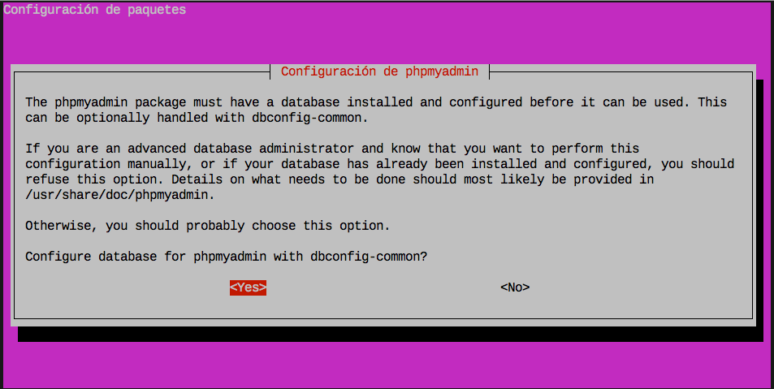

# phpMyAdmin

Si bien es cierto que podemos gestionar nuestras bases de datos **MySQL** desde el intérprete de terminal usando el comando `mysql`, existen otras alternativas con interfaz gráfica de usuario (GUI).

La herramienta más extendida para ello se denomina **phpMyAdmin**. Está implementada en el lenguaje de programación *php* y se accede a través de un servidor web, en nuestro caso **Nginx** que ya hemos configurado para que procese peticiones *php*.

## Instalación

Para su instalación, usaremos el paquete preparado a tal efecto:

```console
sdelquin@cloud:~$ sudo apt-get install phpmyadmin
Leyendo lista de paquetes... Hecho
Creando árbol de dependencias
Leyendo la información de estado... Hecho
Se instalarán los siguientes paquetes adicionales:
  dbconfig-common dbconfig-mysql javascript-common libjs-jquery libjs-sphinxdoc libjs-underscore
  libmcrypt4 php-gd php-gettext php-mbstring php-mcrypt php-mysql php-pear php-phpseclib php-tcpdf
  php-xml php7.0-gd php7.0-mbstring php7.0-mcrypt php7.0-mysql php7.0-xml
Paquetes sugeridos:
  libmcrypt-dev mcrypt php-libsodium php-gmp php-imagick www-browser
Se instalarán los siguientes paquetes NUEVOS:
  dbconfig-common dbconfig-mysql javascript-common libjs-jquery libjs-sphinxdoc libjs-underscore
  libmcrypt4 php-gd php-gettext php-mbstring php-mcrypt php-mysql php-pear php-phpseclib php-tcpdf
  php-xml php7.0-gd php7.0-mbstring php7.0-mcrypt php7.0-mysql php7.0-xml phpmyadmin
0 actualizados, 22 nuevos se instalarán, 0 para eliminar y 22 no actualizados.
Se necesita descargar 12,6 MB/14,0 MB de archivos.
Se utilizarán 54,0 MB de espacio de disco adicional después de esta operación.
¿Desea continuar? [S/n]
Des:1 http://ams2.mirrors.digitalocean.com/ubuntu xenial-updates/universe amd64 php7.0-mbstring amd64 7.0.22-0ubuntu0.16.04.1 [466 kB]
Des:2 http://ams2.mirrors.digitalocean.com/ubuntu xenial/universe amd64 php-mbstring all 1:7.0+35ubuntu6 [1.940 B]
Des:3 http://ams2.mirrors.digitalocean.com/ubuntu xenial-updates/universe amd64 php7.0-mcrypt amd64 7.0.22-0ubuntu0.16.04.1 [14,5 kB]
Des:4 http://ams2.mirrors.digitalocean.com/ubuntu xenial/universe amd64 php-mcrypt all 1:7.0+35ubuntu6 [1.930 B]
Des:5 http://ams2.mirrors.digitalocean.com/ubuntu xenial-updates/main amd64 php7.0-mysql amd64 7.0.22-0ubuntu0.16.04.1 [124 kB]
Des:6 http://ams2.mirrors.digitalocean.com/ubuntu xenial/main amd64 php-mysql all 1:7.0+35ubuntu6 [1.936 B]
Des:7 http://ams2.mirrors.digitalocean.com/ubuntu xenial/universe amd64 php-phpseclib all 2.0.1-1build1 [173 kB]
Des:8 http://ams2.mirrors.digitalocean.com/ubuntu xenial/universe amd64 php-tcpdf all 6.0.093+dfsg-1ubuntu1 [7.881 kB]
Des:9 http://ams2.mirrors.digitalocean.com/ubuntu xenial-updates/universe amd64 phpmyadmin all 4:4.5.4.1-2ubuntu2 [3.934 kB]
Descargados 12,5 MB en 52s (236 kB/s)
Preconfigurando paquetes ...
```

El programa de instalación nos abrirá varios diálogos para configurar nuestro *phpMyAdmin*. En primer lugar nos pregunta por el servidor web que vamos a utilizar. Las dos únicas alternativas que ofrece son:
* `apache2`
* `lighthttpd`

Dado que nosotros utilizamos *Nginx*, lo dejamos en blanco y pulsamos en <kbd>Ok</kbd>:


A continuación el programa de instalación debe crear una base de datos para que *phpMyAdmin* pueda trabajar. Pulsamos el botón <kbd>Yes</kbd>



En la siguiente pantalla nos solicita una contraseña con la que registrar la base de datos en *MySQL*:

> Ojo que tenemos que cumplir con la directiva de seguridad de contraseñas establecidas en el servidor *MySQL*.


Volvemos a repetir la contraseña:


Después de esto, el programa de instalación termina de configurar los paquetes pendientes:

```console
Seleccionando el paquete dbconfig-common previamente no seleccionado.
(Leyendo la base de datos ... 86287 ficheros o directorios instalados actualmente.)
Preparando para desempaquetar .../dbconfig-common_2.0.4ubuntu1_all.deb ...
Desempaquetando dbconfig-common (2.0.4ubuntu1) ...
Seleccionando el paquete dbconfig-mysql previamente no seleccionado.
Preparando para desempaquetar .../dbconfig-mysql_2.0.4ubuntu1_all.deb ...
Desempaquetando dbconfig-mysql (2.0.4ubuntu1) ...
Seleccionando el paquete javascript-common previamente no seleccionado.
Preparando para desempaquetar .../javascript-common_11_all.deb ...
Desempaquetando javascript-common (11) ...
Seleccionando el paquete libjs-jquery previamente no seleccionado.
Preparando para desempaquetar .../libjs-jquery_1.11.3+dfsg-4_all.deb ...
Desempaquetando libjs-jquery (1.11.3+dfsg-4) ...
Seleccionando el paquete libjs-underscore previamente no seleccionado.
Preparando para desempaquetar .../libjs-underscore_1.7.0~dfsg-1ubuntu1_all.deb ...
Desempaquetando libjs-underscore (1.7.0~dfsg-1ubuntu1) ...
Seleccionando el paquete libjs-sphinxdoc previamente no seleccionado.
Preparando para desempaquetar .../libjs-sphinxdoc_1.3.6-2ubuntu1.1_all.deb ...
Desempaquetando libjs-sphinxdoc (1.3.6-2ubuntu1.1) ...
Seleccionando el paquete libmcrypt4 previamente no seleccionado.
Preparando para desempaquetar .../libmcrypt4_2.5.8-3.3_amd64.deb ...
Desempaquetando libmcrypt4 (2.5.8-3.3) ...
Seleccionando el paquete php7.0-gd previamente no seleccionado.
Preparando para desempaquetar .../php7.0-gd_7.0.22-0ubuntu0.16.04.1_amd64.deb ...
Desempaquetando php7.0-gd (7.0.22-0ubuntu0.16.04.1) ...
Seleccionando el paquete php-gd previamente no seleccionado.
Preparando para desempaquetar .../php-gd_1%3a7.0+35ubuntu6_all.deb ...
Desempaquetando php-gd (1:7.0+35ubuntu6) ...
Seleccionando el paquete php7.0-xml previamente no seleccionado.
Preparando para desempaquetar .../php7.0-xml_7.0.22-0ubuntu0.16.04.1_amd64.deb ...
Desempaquetando php7.0-xml (7.0.22-0ubuntu0.16.04.1) ...
Seleccionando el paquete php-xml previamente no seleccionado.
Preparando para desempaquetar .../php-xml_1%3a7.0+35ubuntu6_all.deb ...
Desempaquetando php-xml (1:7.0+35ubuntu6) ...
Seleccionando el paquete php-pear previamente no seleccionado.
Preparando para desempaquetar .../php-pear_1%3a1.10.1+submodules+notgz-6_all.deb ...
Desempaquetando php-pear (1:1.10.1+submodules+notgz-6) ...
Seleccionando el paquete php-gettext previamente no seleccionado.
Preparando para desempaquetar .../php-gettext_1.0.11-2build1_all.deb ...
Desempaquetando php-gettext (1.0.11-2build1) ...
Seleccionando el paquete php7.0-mbstring previamente no seleccionado.
Preparando para desempaquetar .../php7.0-mbstring_7.0.22-0ubuntu0.16.04.1_amd64.deb ...
Desempaquetando php7.0-mbstring (7.0.22-0ubuntu0.16.04.1) ...
Seleccionando el paquete php-mbstring previamente no seleccionado.
Preparando para desempaquetar .../php-mbstring_1%3a7.0+35ubuntu6_all.deb ...
Desempaquetando php-mbstring (1:7.0+35ubuntu6) ...
Seleccionando el paquete php7.0-mcrypt previamente no seleccionado.
Preparando para desempaquetar .../php7.0-mcrypt_7.0.22-0ubuntu0.16.04.1_amd64.deb ...
Desempaquetando php7.0-mcrypt (7.0.22-0ubuntu0.16.04.1) ...
Seleccionando el paquete php-mcrypt previamente no seleccionado.
Preparando para desempaquetar .../php-mcrypt_1%3a7.0+35ubuntu6_all.deb ...
Desempaquetando php-mcrypt (1:7.0+35ubuntu6) ...
Seleccionando el paquete php7.0-mysql previamente no seleccionado.
Preparando para desempaquetar .../php7.0-mysql_7.0.22-0ubuntu0.16.04.1_amd64.deb ...
Desempaquetando php7.0-mysql (7.0.22-0ubuntu0.16.04.1) ...
Seleccionando el paquete php-mysql previamente no seleccionado.
Preparando para desempaquetar .../php-mysql_1%3a7.0+35ubuntu6_all.deb ...
Desempaquetando php-mysql (1:7.0+35ubuntu6) ...
Seleccionando el paquete php-phpseclib previamente no seleccionado.
Preparando para desempaquetar .../php-phpseclib_2.0.1-1build1_all.deb ...
Desempaquetando php-phpseclib (2.0.1-1build1) ...
Seleccionando el paquete php-tcpdf previamente no seleccionado.
Preparando para desempaquetar .../php-tcpdf_6.0.093+dfsg-1ubuntu1_all.deb ...
Desempaquetando php-tcpdf (6.0.093+dfsg-1ubuntu1) ...
Seleccionando el paquete phpmyadmin previamente no seleccionado.
Preparando para desempaquetar .../phpmyadmin_4%3a4.5.4.1-2ubuntu2_all.deb ...
Desempaquetando phpmyadmin (4:4.5.4.1-2ubuntu2) ...
Procesando disparadores para man-db (2.7.5-1) ...
Procesando disparadores para php7.0-fpm (7.0.22-0ubuntu0.16.04.1) ...
Configurando dbconfig-common (2.0.4ubuntu1) ...

Creating config file /etc/dbconfig-common/config with new version
Configurando dbconfig-mysql (2.0.4ubuntu1) ...
Configurando javascript-common (11) ...
Configurando libjs-jquery (1.11.3+dfsg-4) ...
Configurando libjs-underscore (1.7.0~dfsg-1ubuntu1) ...
Configurando libjs-sphinxdoc (1.3.6-2ubuntu1.1) ...
Configurando libmcrypt4 (2.5.8-3.3) ...
Configurando php7.0-gd (7.0.22-0ubuntu0.16.04.1) ...

Creating config file /etc/php/7.0/mods-available/gd.ini with new version
Configurando php-gd (1:7.0+35ubuntu6) ...
Configurando php7.0-xml (7.0.22-0ubuntu0.16.04.1) ...

Creating config file /etc/php/7.0/mods-available/dom.ini with new version

Creating config file /etc/php/7.0/mods-available/simplexml.ini with new version

Creating config file /etc/php/7.0/mods-available/wddx.ini with new version

Creating config file /etc/php/7.0/mods-available/xml.ini with new version

Creating config file /etc/php/7.0/mods-available/xmlreader.ini with new version

Creating config file /etc/php/7.0/mods-available/xmlwriter.ini with new version

Creating config file /etc/php/7.0/mods-available/xsl.ini with new version
Configurando php-xml (1:7.0+35ubuntu6) ...
Configurando php-pear (1:1.10.1+submodules+notgz-6) ...
Configurando php-gettext (1.0.11-2build1) ...
Configurando php7.0-mbstring (7.0.22-0ubuntu0.16.04.1) ...

Creating config file /etc/php/7.0/mods-available/mbstring.ini with new version
Configurando php-mbstring (1:7.0+35ubuntu6) ...
Configurando php7.0-mcrypt (7.0.22-0ubuntu0.16.04.1) ...

Creating config file /etc/php/7.0/mods-available/mcrypt.ini with new version
Configurando php-mcrypt (1:7.0+35ubuntu6) ...
Configurando php7.0-mysql (7.0.22-0ubuntu0.16.04.1) ...

Creating config file /etc/php/7.0/mods-available/mysqlnd.ini with new version

Creating config file /etc/php/7.0/mods-available/mysqli.ini with new version

Creating config file /etc/php/7.0/mods-available/pdo_mysql.ini with new version
Configurando php-mysql (1:7.0+35ubuntu6) ...
Configurando php-phpseclib (2.0.1-1build1) ...
Configurando php-tcpdf (6.0.093+dfsg-1ubuntu1) ...
Configurando phpmyadmin (4:4.5.4.1-2ubuntu2) ...
Determining localhost credentials from /etc/mysql/debian.cnf: succeeded.
dbconfig-common: writing config to /etc/dbconfig-common/phpmyadmin.conf

Creating config file /etc/dbconfig-common/phpmyadmin.conf with new version

Creating config file /etc/phpmyadmin/config-db.php with new version
granting access to database phpmyadmin for phpmyadmin@localhost: success.
verifying access for phpmyadmin@localhost: success.
creating database phpmyadmin: success.
verifying database phpmyadmin exists: success.
populating database via sql...  done.
dbconfig-common: flushing administrative password
sdelquin@cloud:~$
```

## Activación en Nginx

Pero aún no hemos acabado, ya que debemos configurar nuestro **Nginx** para que pueda servir **phpMyAdmin**.

Vamos a crear un *virtual host* para la url `http://phpmyadmin.imwpto.me` que nos permita trabajar con la plataforma:

```console
sdelquin@cloud:~$ sudo vi /etc/nginx/sites-available/phpmyadmin
```

> Contenido
```nginx
server {
    server_name phpmyadmin.imwpto.me;
    index index.php;
    root /usr/share/phpmyadmin;
    location ~ \.php$ {
        include snippets/fastcgi-php.conf;
        fastcgi_pass unix:/run/php/php7.0-fpm.sock;
    }
}
```

Ahora enlazamos el *virtual host* en los sitios disponibles:

```console
sdelquin@cloud:~$ cd /etc/nginx/sites-enabled/
sdelquin@cloud:/etc/nginx/sites-enabled$ sudo ln -s ../sites-available/phpmyadmin
[sudo] password for sdelquin:
sdelquin@cloud:/etc/nginx/sites-enabled$ ls -l
total 0
lrwxrwxrwx 1 root root 34 sep 21 15:09 default -> /etc/nginx/sites-available/default
lrwxrwxrwx 1 root root 24 oct  1 10:37 hello -> ../sites-available/hello
lrwxrwxrwx 1 root root 29 oct  1 16:36 phpmyadmin -> ../sites-available/phpmyadmin
lrwxrwxrwx 1 root root 24 sep 24 13:52 share -> ../sites-available/share
lrwxrwxrwx 1 root root 22 sep 24 17:14 ssl -> ../sites-available/ssl
sdelquin@cloud:/etc/nginx/sites-enabled$
```

Ahora sólo nos queda recargar el servidor web:

```console
sdelquin@cloud:~$ sudo systemctl reload nginx
sdelquin@cloud:~$
```

Con esto, ya podemos acceder a través de un navegador a la dirección en la que hemos configurado nuestro *phpMyAdmin*:


Introducimos el usuario y contraseña `root` del sistema gestor de bases de datos *MySQL*, y ya podremos acceder a la interfaz administrativa:


✅ Instalación de **phpMyAdmin**
