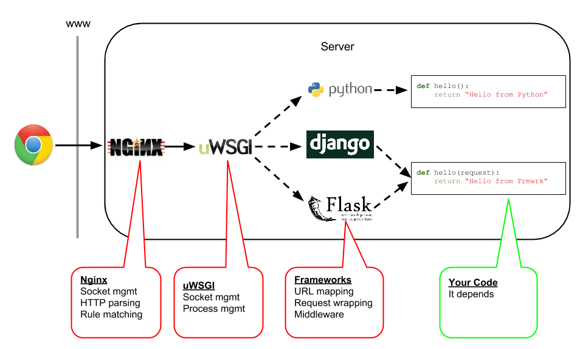
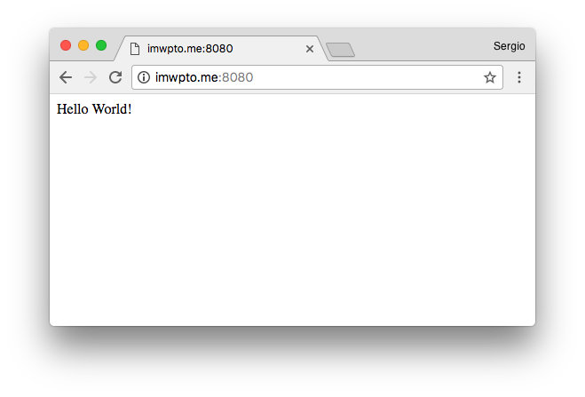
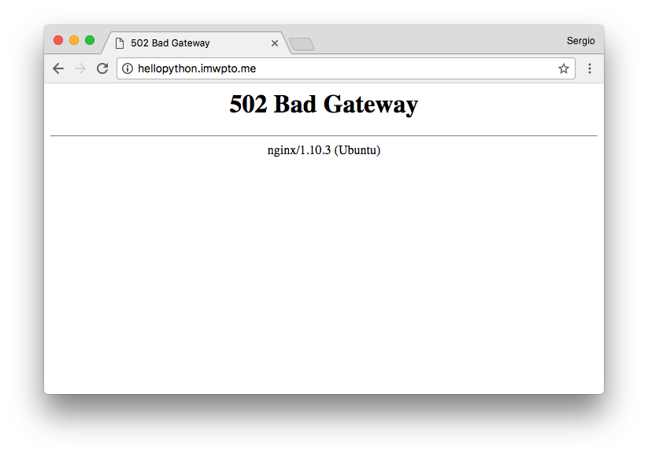
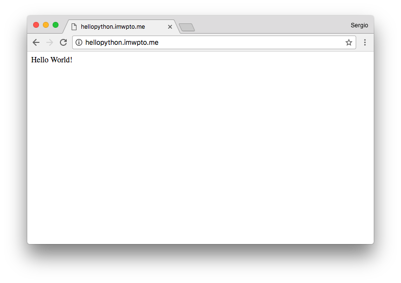

# Configuración de python

El objetivo de esta sección es configurar nuestro servidor web para que responda a peticiones que procesen código *python*.

## Instalación

Lo primero será instalar `Python 3.6`. Dado que esta versión de *python* no está disponible en los repositorios por defecto de *Ubuntu Xenial*, tendremos que añadir repositorios adicionales:

```console
sdelquin@cloud:~$ sudo add-apt-repository ppa:jonathonf/python-3.6
 A plain backport of *just* Python 3.6. System extensions/Python libraries may or may not work.

Don't remove Python 3.5 from your system - it will break.
 More info: https://launchpad.net/~jonathonf/+archive/ubuntu/python-3.6
Press [ENTER] to continue or ctrl-c to cancel adding it

gpg: keyring `/tmp/tmpklduco_0/secring.gpg' created
gpg: keyring `/tmp/tmpklduco_0/pubring.gpg' created
gpg: requesting key F06FC659 from hkp server keyserver.ubuntu.com
gpg: /tmp/tmpklduco_0/trustdb.gpg: trustdb created
gpg: key F06FC659: public key "Launchpad PPA for J Fernyhough" imported
gpg: Total number processed: 1
gpg:               imported: 1  (RSA: 1)
OK
sdelquin@cloud:~$
```

A continuación actualizamos la lista de paquetes:

```console
sdelquin@cloud:~$ sudo apt-get update
Des:1 http://security.ubuntu.com/ubuntu xenial-security InRelease [102 kB]
Des:2 http://ppa.launchpad.net/jonathonf/python-3.6/ubuntu xenial InRelease [18,1 kB]
Des:4 http://ppa.launchpad.net/jonathonf/python-3.6/ubuntu xenial/main amd64 Packages [4.404 B]
Des:5 http://ppa.launchpad.net/jonathonf/python-3.6/ubuntu xenial/main Translation-en [2.028 B]
Obj:3 http://ams2.mirrors.digitalocean.com/ubuntu xenial InRelease
Des:6 http://ams2.mirrors.digitalocean.com/ubuntu xenial-updates InRelease [102 kB]
Des:7 http://ams2.mirrors.digitalocean.com/ubuntu xenial-backports InRelease [102 kB]
Descargados 331 kB en 0s (604 kB/s)
Leyendo lista de paquetes... Hecho
sdelquin@cloud:~$
```

Hecho esto, ya podemos realizar la instalación:

```console
sdelquin@cloud:~$ sudo apt-get install python3.6
Leyendo lista de paquetes... Hecho
Creando árbol de dependencias
Leyendo la información de estado... Hecho
Se instalarán los siguientes paquetes adicionales:
  libpython3.6-minimal libpython3.6-stdlib python3.6-minimal
Paquetes sugeridos:
  python3.6-venv python3.6-doc binutils binfmt-support
Se instalarán los siguientes paquetes NUEVOS:
  libpython3.6-minimal libpython3.6-stdlib python3.6 python3.6-minimal
0 actualizados, 4 nuevos se instalarán, 0 para eliminar y 23 no actualizados.
Se necesita descargar 4.319 kB de archivos.
Se utilizarán 23,5 MB de espacio de disco adicional después de esta operación.
¿Desea continuar? [S/n]
Des:1 http://ppa.launchpad.net/jonathonf/python-3.6/ubuntu xenial/main amd64 libpython3.6-minimal amd64 3.6.2-1~16.04.york0 [600 kB]
Des:2 http://ppa.launchpad.net/jonathonf/python-3.6/ubuntu xenial/main amd64 python3.6-minimal amd64 3.6.2-1~16.04.york0 [1.419 kB]
Des:3 http://ppa.launchpad.net/jonathonf/python-3.6/ubuntu xenial/main amd64 libpython3.6-stdlib amd64 3.6.2-1~16.04.york0 [2.090 kB]
Des:4 http://ppa.launchpad.net/jonathonf/python-3.6/ubuntu xenial/main amd64 python3.6 amd64 3.6.2-1~16.04.york0 [210 kB]
Descargados 4.319 kB en 0s (5.248 kB/s)
Seleccionando el paquete libpython3.6-minimal:amd64 previamente no seleccionado.
(Leyendo la base de datos ... 88856 ficheros o directorios instalados actualmente.)
Preparando para desempaquetar .../libpython3.6-minimal_3.6.2-1~16.04.york0_amd64.deb ...
Desempaquetando libpython3.6-minimal:amd64 (3.6.2-1~16.04.york0) ...
Seleccionando el paquete python3.6-minimal previamente no seleccionado.
Preparando para desempaquetar .../python3.6-minimal_3.6.2-1~16.04.york0_amd64.deb ...
Desempaquetando python3.6-minimal (3.6.2-1~16.04.york0) ...
Seleccionando el paquete libpython3.6-stdlib:amd64 previamente no seleccionado.
Preparando para desempaquetar .../libpython3.6-stdlib_3.6.2-1~16.04.york0_amd64.deb ...
Desempaquetando libpython3.6-stdlib:amd64 (3.6.2-1~16.04.york0) ...
Seleccionando el paquete python3.6 previamente no seleccionado.
Preparando para desempaquetar .../python3.6_3.6.2-1~16.04.york0_amd64.deb ...
Desempaquetando python3.6 (3.6.2-1~16.04.york0) ...
Procesando disparadores para man-db (2.7.5-1) ...
Procesando disparadores para mime-support (3.59ubuntu1) ...
Configurando libpython3.6-minimal:amd64 (3.6.2-1~16.04.york0) ...
Configurando python3.6-minimal (3.6.2-1~16.04.york0) ...
Configurando libpython3.6-stdlib:amd64 (3.6.2-1~16.04.york0) ...
Configurando python3.6 (3.6.2-1~16.04.york0) ...
sdelquin@cloud:~$
```

Vamos ahora a probar que la instalación fue correcta. Ejecutamos lo siguiente:

```console
sdelquin@cloud:~$ python3.6
Python 3.6.2 (default, Jul 20 2017, 08:43:29)
[GCC 5.4.1 20170519] on linux
Type "help", "copyright", "credits" or "license" for more information.
>>> import sys
>>> sys.version
'3.6.2 (default, Jul 20 2017, 08:43:29) \n[GCC 5.4.1 20170519]'
>>> exit()
sdelquin@cloud:~$
```

Se puede observar que la versión de *python* instalada es la `3.6.2`. El problema es que tenemos distintas versiones de *python* en el sistema:

```console
sdelquin@cloud:~$ python -V
Python 2.7.12
sdelquin@cloud:~$ python2 -V
Python 2.7.12
sdelquin@cloud:~$ python3 -V
Python 3.5.2
sdelquin@cloud:~$ python3.6 -V
Python 3.6.2
sdelquin@cloud:~$
```

Para establecer `python 3.6` por defecto, podemos añadir un *alias* en el fichero `~/.bashrc`:

```console
sdelquin@cloud:~$ echo 'alias python=python3.6' >> .bashrc
sdelquin@cloud:~$ tail -1 .bashrc
alias python=python3.6
sdelquin@cloud:~$ source .bashrc
sdelquin@cloud:~$ python
Python 3.6.2 (default, Jul 20 2017, 08:43:29)
[GCC 5.4.1 20170519] on linux
Type "help", "copyright", "credits" or "license" for more information.
>>> exit()
sdelquin@cloud:~$
```

### Librerías de desarrollo para python

Los paquetes de *python* necesitan ciertas librerías para su funcionamiento. Por ello debemos instalar lo siguiente:

```console
sdelquin@cloud:~$ sudo apt-get install python3.6-dev
Leyendo lista de paquetes... Hecho
Creando árbol de dependencias
Leyendo la información de estado... Hecho
Se instalarán los siguientes paquetes adicionales:
  libc-dev-bin libc6-dev libexpat1-dev libpython3.6 libpython3.6-dev linux-libc-dev manpages-dev
Paquetes sugeridos:
  glibc-doc
Se instalarán los siguientes paquetes NUEVOS:
  libc-dev-bin libc6-dev libexpat1-dev libpython3.6 libpython3.6-dev linux-libc-dev manpages-dev
  python3.6-dev
0 actualizados, 8 nuevos se instalarán, 0 para eliminar y 23 no actualizados.
Se necesita descargar 9.481 kB de archivos.
Se utilizarán 43,7 MB de espacio de disco adicional después de esta operación.
¿Desea continuar? [S/n]
Des:1 http://ppa.launchpad.net/jonathonf/python-3.6/ubuntu xenial/main amd64 libpython3.6 amd64 3.6.2-1~16.04.york0 [1.405 kB]
Des:2 http://mirrors.digitalocean.com/ubuntu xenial-updates/main amd64 libc-dev-bin amd64 2.23-0ubuntu9 [68,6 kB]
Des:3 http://mirrors.digitalocean.com/ubuntu xenial-updates/main amd64 linux-libc-dev amd64 4.4.0-96.119 [836 kB]
Des:4 http://ppa.launchpad.net/jonathonf/python-3.6/ubuntu xenial/main amd64 libpython3.6-dev amd64 3.6.2-1~16.04.york0 [2.426 kB]
Des:5 http://mirrors.digitalocean.com/ubuntu xenial-updates/main amd64 libc6-dev amd64 2.23-0ubuntu9 [2.082 kB]
Des:6 http://mirrors.digitalocean.com/ubuntu xenial-updates/main amd64 libexpat1-dev amd64 2.1.0-7ubuntu0.16.04.3 [115 kB]
Des:7 http://mirrors.digitalocean.com/ubuntu xenial/main amd64 manpages-dev all 4.04-2 [2.048 kB]
Des:8 http://ppa.launchpad.net/jonathonf/python-3.6/ubuntu xenial/main amd64 python3.6-dev amd64 3.6.2-1~16.04.york0 [501 kB]
Descargados 9.481 kB en 1s (5.154 kB/s)
Seleccionando el paquete libc-dev-bin previamente no seleccionado.
(Leyendo la base de datos ... 89688 ficheros o directorios instalados actualmente.)
Preparando para desempaquetar .../libc-dev-bin_2.23-0ubuntu9_amd64.deb ...
Desempaquetando libc-dev-bin (2.23-0ubuntu9) ...
Seleccionando el paquete linux-libc-dev:amd64 previamente no seleccionado.
Preparando para desempaquetar .../linux-libc-dev_4.4.0-96.119_amd64.deb ...
Desempaquetando linux-libc-dev:amd64 (4.4.0-96.119) ...
Seleccionando el paquete libc6-dev:amd64 previamente no seleccionado.
Preparando para desempaquetar .../libc6-dev_2.23-0ubuntu9_amd64.deb ...
Desempaquetando libc6-dev:amd64 (2.23-0ubuntu9) ...
Seleccionando el paquete libexpat1-dev:amd64 previamente no seleccionado.
Preparando para desempaquetar .../libexpat1-dev_2.1.0-7ubuntu0.16.04.3_amd64.deb ...
Desempaquetando libexpat1-dev:amd64 (2.1.0-7ubuntu0.16.04.3) ...
Seleccionando el paquete libpython3.6:amd64 previamente no seleccionado.
Preparando para desempaquetar .../libpython3.6_3.6.2-1~16.04.york0_amd64.deb ...
Desempaquetando libpython3.6:amd64 (3.6.2-1~16.04.york0) ...
Seleccionando el paquete libpython3.6-dev:amd64 previamente no seleccionado.
Preparando para desempaquetar .../libpython3.6-dev_3.6.2-1~16.04.york0_amd64.deb ...
Desempaquetando libpython3.6-dev:amd64 (3.6.2-1~16.04.york0) ...
Seleccionando el paquete manpages-dev previamente no seleccionado.
Preparando para desempaquetar .../manpages-dev_4.04-2_all.deb ...
Desempaquetando manpages-dev (4.04-2) ...
Seleccionando el paquete python3.6-dev previamente no seleccionado.
Preparando para desempaquetar .../python3.6-dev_3.6.2-1~16.04.york0_amd64.deb ...
Desempaquetando python3.6-dev (3.6.2-1~16.04.york0) ...
Procesando disparadores para man-db (2.7.5-1) ...
Procesando disparadores para libc-bin (2.23-0ubuntu9) ...
Configurando libc-dev-bin (2.23-0ubuntu9) ...
Configurando linux-libc-dev:amd64 (4.4.0-96.119) ...
Configurando libc6-dev:amd64 (2.23-0ubuntu9) ...
Configurando libexpat1-dev:amd64 (2.1.0-7ubuntu0.16.04.3) ...
Configurando libpython3.6:amd64 (3.6.2-1~16.04.york0) ...
Configurando libpython3.6-dev:amd64 (3.6.2-1~16.04.york0) ...
Configurando manpages-dev (4.04-2) ...
Configurando python3.6-dev (3.6.2-1~16.04.york0) ...
Procesando disparadores para libc-bin (2.23-0ubuntu9) ...
sdelquin@cloud:~$
```

Para la compilación de muchos paquetes, también necesitaremos un compilador de *C*:

```console
sdelquin@cloud:~$ sudo apt install gcc
[sudo] password for sdelquin:
Leyendo lista de paquetes... Hecho
Creando árbol de dependencias
Leyendo la información de estado... Hecho
Se instalarán los siguientes paquetes adicionales:
  binutils gcc-5 libasan2 libatomic1 libcc1-0 libcilkrts5 libgcc-5-dev libitm1 liblsan0 libmpx0
  libquadmath0 libtsan0 libubsan0
Paquetes sugeridos:
  binutils-doc gcc-multilib make autoconf automake libtool flex bison gdb gcc-doc gcc-5-multilib
  gcc-5-doc gcc-5-locales libgcc1-dbg libgomp1-dbg libitm1-dbg libatomic1-dbg libasan2-dbg liblsan0-dbg
  libtsan0-dbg libubsan0-dbg libcilkrts5-dbg libmpx0-dbg libquadmath0-dbg
Se instalarán los siguientes paquetes NUEVOS:
  binutils gcc gcc-5 libasan2 libatomic1 libcc1-0 libcilkrts5 libgcc-5-dev libitm1 liblsan0 libmpx0
  libquadmath0 libtsan0 libubsan0
0 actualizados, 14 nuevos se instalarán, 0 para eliminar y 23 no actualizados.
Se necesita descargar 14,1 MB de archivos.
Se utilizarán 53,6 MB de espacio de disco adicional después de esta operación.
¿Desea continuar? [S/n]
Des:1 http://mirrors.digitalocean.com/ubuntu xenial-updates/main amd64 binutils amd64 2.26.1-1ubuntu1~16.04.4 [2.311 kB]
Des:2 http://mirrors.digitalocean.com/ubuntu xenial-updates/main amd64 libcc1-0 amd64 5.4.0-6ubuntu1~16.04.4 [38,8 kB]
Des:3 http://mirrors.digitalocean.com/ubuntu xenial-updates/main amd64 libitm1 amd64 5.4.0-6ubuntu1~16.04Preparando para desempaquetar .../gcc-5_5.4.0-6ubuntu1~16.04.4_amd64.deb ...
Desempaquetando gcc-5 (5.4.0-6ubuntu1~16.04.4) ...
Seleccionando el paquete gcc previamente no seleccionado.
Preparando para desempaquetar .../gcc_4%3a5.3.1-1ubuntu1_amd64.deb ...
Desempaquetando gcc (4:5.3.1-1ubuntu1) ...
Procesando disparadores para libc-bin (2.23-0ubuntu9) ...
Procesando disparadores para man-db (2.7.5-1) ...
Configurando binutils (2.26.1-1ubuntu1~16.04.4) ...
Configurando libcc1-0:amd64 (5.4.0-6ubuntu1~16.04.4) ...
Configurando libitm1:amd64 (5.4.0-6ubuntu1~16.04.4) ...
Configurando libatomic1:amd64 (5.4.0-6ubuntu1~16.04.4) ...
Configurando libasan2:amd64 (5.4.0-6ubuntu1~16.04.4) ...
Configurando liblsan0:amd64 (5.4.0-6ubuntu1~16.04.4) ...
Configurando libtsan0:amd64 (5.4.0-6ubuntu1~16.04.4) ...
Configurando libubsan0:amd64 (5.4.0-6ubuntu1~16.04.4) ...
Configurando libcilkrts5:amd64 (5.4.0-6ubuntu1~16.04.4) ...
Configurando libmpx0:amd64 (5.4.0-6ubuntu1~16.04.4) ...
Configurando libquadmath0:amd64 (5.4.0-6ubuntu1~16.04.4) ...
Configurando libgcc-5-dev:amd64 (5.4.0-6ubuntu1~16.04.4) ...
Configurando gcc-5 (5.4.0-6ubuntu1~16.04.4) ...
Configurando gcc (4:5.3.1-1ubuntu1) ...
Procesando disparadores para libc-bin (2.23-0ubuntu9) ...
sdelquin@cloud:~$
```

Comprobamos la instalación del compilador `gcc`:

```console
sdelquin@cloud:~$ gcc --version
gcc (Ubuntu 5.4.0-6ubuntu1~16.04.4) 5.4.0 20160609
Copyright (C) 2015 Free Software Foundation, Inc.
This is free software; see the source for copying conditions.  There is NO
warranty; not even for MERCHANTABILITY or FITNESS FOR A PARTICULAR PURPOSE.

sdelquin@cloud:~$
```

### Gestión de paquetes

Existe una herramienta que permite instalar paquetes *python*. Se llama `pip`. Para su instalación hacemos lo siguiente:

```console
sdelquin@cloud:~$ curl -O https://bootstrap.pypa.io/get-pip.py
  % Total    % Received % Xferd  Average Speed   Time    Time     Time  Current
                                 Dload  Upload   Total   Spent    Left  Speed
100 1558k  100 1558k    0     0  6119k      0 --:--:-- --:--:-- --:--:-- 6133k
sdelquin@cloud:~$ sudo -H python3.6 get-pip.py
Requirement already up-to-date: pip in /usr/local/lib/python3.6/dist-packages
sdelquin@cloud:~$
```

### Entornos virtuales

La forma más extendida de trabajar con aplicaciones *python* es usar entornos virtuales (*virtualenvs*). Se trata de un mecanismo para aislar las librerías y crear un ambiente de trabajo independiente.

Primero instalamos el gestor de entornos virtuales:

```console
sdelquin@cloud:~$ sudo -H pip install virtualenv
Collecting virtualenv
  Downloading virtualenv-15.1.0-py2.py3-none-any.whl (1.8MB)
    100% |████████████████████████████████| 1.8MB 570kB/s
Installing collected packages: virtualenv
Successfully installed virtualenv-15.1.0
sdelquin@cloud:~$
```

A continuación creamos un entorno virtual:

```console
sdelquin@cloud:~$ mkdir .virtualenvs
sdelquin@cloud:~$ virtualenv .virtualenvs/hellopython
Using base prefix '/usr'
New python executable in /home/sdelquin/.virtualenvs/hellopython/bin/python3.6
Also creating executable in /home/sdelquin/.virtualenvs/hellopython/bin/python
Installing setuptools, pip, wheel...done.
sdelquin@cloud:~$ source .virtualenvs/hellopython/bin/activate
(hellopython) sdelquin@cloud:~$ python -V
Python 3.6.2
(hellopython) sdelquin@cloud:~$
```

Nótese que cuando hemos activado el entorno virtual, aparece delante del prompt `(hellpython)`, es decir, el nombre del entorno virtual. Para "salir" del entorno virtual, usamos el siguiente comando:

```console
(hellopython) sdelquin@cloud:~$ deactivate
sdelquin@cloud:~$
```

### uWSGI

*uWSGI* es el encargado de procesar las peticiones *http* para aplicaciones con código *python*. Se puede ver como el *php-fpm* de *php*.



Para instalarlo, usamos el gestor de paquetes de python `pip`:

```console
sdelquin@cloud:~$ source .virtualenvs/hellopython/bin/activate
(hellopython) sdelquin@cloud:~$ pip install uwsgi
Collecting uwsgi
  Using cached uwsgi-2.0.15.tar.gz
Building wheels for collected packages: uwsgi
  Running setup.py bdist_wheel for uwsgi ... done
  Stored in directory: /home/sdelquin/.cache/pip/wheels/26/d0/48/e7b0eed63b5d191e89d94e72196aafae93b2b6505a9feafdd9
Successfully built uwsgi
Installing collected packages: uwsgi
Successfully installed uwsgi-2.0.15
(hellopython) sdelquin@cloud:~$
```

> ⚠️  No importa en qué directorio estemos, siempre y cuando el entorno virtual esté activado. Una vez que lo tengamos activado, todos los paquetes que instalemos con `pip` se instalarán en la ruta que hemos especificado para el entorno virtual: en este caso `~/.virtualenvs/hellopython/`.

## Creación del "Hola Mundo"

Lo primero será instalar un mini-framework de desarrollo web denominado `flask`:

```console
(hellopython) sdelquin@cloud:~$ pip install flask
Collecting flask
  Downloading Flask-0.12.2-py2.py3-none-any.whl (83kB)
    100% |████████████████████████████████| 92kB 7.7MB/s
Collecting click>=2.0 (from flask)
  Downloading click-6.7-py2.py3-none-any.whl (71kB)
    100% |████████████████████████████████| 71kB 6.6MB/s
Collecting Jinja2>=2.4 (from flask)
  Downloading Jinja2-2.9.6-py2.py3-none-any.whl (340kB)
    100% |████████████████████████████████| 348kB 4.6MB/s
Collecting itsdangerous>=0.21 (from flask)
  Downloading itsdangerous-0.24.tar.gz (46kB)
    100% |████████████████████████████████| 51kB 7.7MB/s
Collecting Werkzeug>=0.7 (from flask)
  Downloading Werkzeug-0.12.2-py2.py3-none-any.whl (312kB)
    100% |████████████████████████████████| 317kB 3.3MB/s
Collecting MarkupSafe>=0.23 (from Jinja2>=2.4->flask)
  Downloading MarkupSafe-1.0.tar.gz
Building wheels for collected packages: itsdangerous, MarkupSafe
  Running setup.py bdist_wheel for itsdangerous ... done
  Stored in directory: /home/sdelquin/.cache/pip/wheels/fc/a8/66/24d655233c757e178d45dea2de22a04c6d92766abfb741129a
  Running setup.py bdist_wheel for MarkupSafe ... done
  Stored in directory: /home/sdelquin/.cache/pip/wheels/88/a7/30/e39a54a87bcbe25308fa3ca64e8ddc75d9b3e5afa21ee32d57
Successfully built itsdangerous MarkupSafe
Installing collected packages: click, MarkupSafe, Jinja2, itsdangerous, Werkzeug, flask
Successfully installed Jinja2-2.9.6 MarkupSafe-1.0 Werkzeug-0.12.2 click-6.7 flask-0.12.2 itsdangerous-0.24
(hellopython) sdelquin@cloud:~/hellopython$
```

A continuación creamos un pequeño fichero en *python* que va a contener el código de la aplicación web:

```console
(hellopython) sdelquin@cloud:~$ mkdir hellopython
(hellopython) sdelquin@cloud:~$ cd hellopython
(hellopython) sdelquin@cloud:~/hellopython$ vi main.py
```

> Contenido
```python
from flask import Flask
app = Flask(__name__)

@app.route("/")
def hello():
    return "Hello World!"
```

En este punto podemos lanzar el proceso que escuchará peticiones:

```console
(hellopython) sdelquin@cloud:~/hellopython$ uwsgi --socket 0.0.0.0:8080 --protocol=http -w main:app
*** Starting uWSGI 2.0.15 (64bit) on [Sun Oct  1 17:42:53 2017] ***
compiled with version: 5.4.0 20160609 on 01 October 2017 17:40:45
os: Linux-4.4.0-96-generic #119-Ubuntu SMP Tue Sep 12 14:59:54 UTC 2017
nodename: cloud
machine: x86_64
clock source: unix
detected number of CPU cores: 1
current working directory: /home/sdelquin/hellopython
detected binary path: /home/sdelquin/.virtualenvs/hellopython/bin/uwsgi
!!! no internal routing support, rebuild with pcre support !!!
*** WARNING: you are running uWSGI without its master process manager ***
your processes number limit is 1880
your memory page size is 4096 bytes
detected max file descriptor number: 1024
lock engine: pthread robust mutexes
thunder lock: disabled (you can enable it with --thunder-lock)
uwsgi socket 0 bound to TCP address 0.0.0.0:8080 fd 3
Python version: 3.6.2 (default, Jul 20 2017, 08:43:29)  [GCC 5.4.1 20170519]
*** Python threads support is disabled. You can enable it with --enable-threads ***
Python main interpreter initialized at 0x18b13c0
your server socket listen backlog is limited to 100 connections
your mercy for graceful operations on workers is 60 seconds
mapped 72760 bytes (71 KB) for 1 cores
*** Operational MODE: single process ***
WSGI app 0 (mountpoint='') ready in 0 seconds on interpreter 0x18b13c0 pid: 3721 (default app)
*** uWSGI is running in multiple interpreter mode ***
spawned uWSGI worker 1 (and the only) (pid: 3721, cores: 1)
```

Si ahora accedemos con un navegador al puerto 8080 de nuestra máquina de producción, veremos lo siguiente:



> Para detener el proceso `uwsgi` basta con <kbd>CONTROL-C</kbd>.

## Configuración del servidor web

### `uWSGI`

En primer lugar debemos crear un fichero de configuración para *uWSGI*:

```console
sdelquin@cloud:~/hellopython$ vi uwsgi.ini
```

> Contenido
```ini
[uwsgi]
chdir = /home/sdelquin/hellopython
module = main:app
master = true
processes = 1
socket = /tmp/hellopython.sock
chmod-socket = 666
vacuum = true
```

- `chdir`: ruta al directorio del proyecto
- `module`: `<fichero.py>:<callable>
- `master`: `crea un proceso maestro`
- `processes`: número de workers para atender peticiones
- `socket`: ruta hasta el socket
- `chmod-socket`: permisos del socket
- `vacuum`: limpieza del socket al finalizar

Hay que tener en cuenta lo siguiente:

> NOTA: Es importante fijarse que la línea `module = main:app` nos indica que el módulo que se va a ejecutar está en el fichero `main.py` y que se llama `app`. En este caso es una función, pero podría ser cualquier *callable* de *Python*.

Ahora tenemos que crear un pequeño script que será el encargado de activar el entorno virtual de nuestra aplicación y de lanzar el proceso `uwsgi` para que escuche peticiones en el socket especificado:

```console
sdelquin@cloud:~/hellopython$ vi run.sh
```

> Contenido
```bash
#!/bin/bash

source /home/sdelquin/.virtualenvs/hellopython/bin/activate
uwsgi --ini /home/sdelquin/hellopython/uwsgi.ini
```

Ahora le damos permisos de ejecución al script que hemos creado:

```console
sdelquin@cloud:~/hellopython$ vi run.sh
sdelquin@cloud:~/hellopython$ chmod +x run.sh
sdelquin@cloud:~/hellopython$ ls -l run.sh
-rwxrwxr-x 1 sdelquin sdelquin 113 oct  1 17:57 run.sh
sdelquin@cloud:~/hellopython$
```

En este punto, podríamos lanzar el script `run.sh` sin tener que activar el entorno virtual previamente, ya que el propio script realiza esta tarea:

```console
sdelquin@cloud:~/hellopython$ ./run.sh
[uWSGI] getting INI configuration from /home/sdelquin/hellopython/uwsgi.ini
*** Starting uWSGI 2.0.15 (64bit) on [Sun Oct  1 18:00:41 2017] ***
compiled with version: 5.4.0 20160609 on 01 October 2017 17:40:45
os: Linux-4.4.0-96-generic #119-Ubuntu SMP Tue Sep 12 14:59:54 UTC 2017
nodename: cloud
machine: x86_64
clock source: unix
detected number of CPU cores: 1
current working directory: /home/sdelquin/hellopython
detected binary path: /home/sdelquin/.virtualenvs/hellopython/bin/uwsgi
...
...
...
```

> Para detener el script `run.sh` basta con <kbd>CONTROL-C</kbd>.

### `Nginx`

Vamos a crear un *virtual host* para nuestra aplicación *python*. Queremos que responda a peticiones a la url `http://hellopython.imwpto.me`. Para ello haremos lo siguiente:

```console
sdelquin@cloud:~$ sudo vi /etc/nginx/sites-available/hellopython
```

> Contenido
```nginx
server {
    server_name hellopython.imwpto.me;

    location / {
        include uwsgi_params;
        uwsgi_pass unix:/tmp/hellopython.sock;   # socket definido en uwsgi.ini
    }
    
    location /static {
        root /home/sdelquin/hellopython;         # para servir ficheros estáticos
    }
}
```

Enlazamos el *virtual host* para habilitarlo:

```console
sdelquin@cloud:~$ cd /etc/nginx/sites-enabled/
sdelquin@cloud:/etc/nginx/sites-enabled$ sudo ln -s ../sites-available/hellopython
sdelquin@cloud:/etc/nginx/sites-enabled$ ls -l
total 0
lrwxrwxrwx 1 root root 34 sep 21 15:09 default -> /etc/nginx/sites-available/default
lrwxrwxrwx 1 root root 24 oct  1 10:37 hello -> ../sites-available/hello
lrwxrwxrwx 1 root root 30 oct  1 18:06 hellopython -> ../sites-available/hellopython
lrwxrwxrwx 1 root root 29 oct  1 16:36 phpmyadmin -> ../sites-available/phpmyadmin
lrwxrwxrwx 1 root root 24 sep 24 13:52 share -> ../sites-available/share
lrwxrwxrwx 1 root root 22 sep 24 17:14 ssl -> ../sites-available/ssl
sdelquin@cloud:/etc/nginx/sites-enabled$
```

Ahora recargamos el servidor web:

```console
sdelquin@cloud:~$ sudo systemctl reload nginx
sdelquin@cloud:~$
```

En este momento, las peticiones que lleguen a nuestro servidor *Nginx* en la url definida serán derivados a un servicio que debería estar escuchando en el socket `/tmp/hellopython.sock`. Si probamos a acceder en este momento a nuestro servidor web, nos aparece lo siguiente:



Se debe a que nos falta lanzar nuestra aplicación *uWSGI* para que escuche en el socket especificado y devuelva el sencillo *html* que hemos preparado en nuestra aplicación *python*:

```console
sdelquin@hillvalley:~/hellopython$ ./run.sh
[uWSGI] getting INI configuration from /home/sdelquin/hellopython/uwsgi.ini
*** Starting uWSGI 2.0.13.1 (64bit) on [Sun Aug 28 17:13:08 2016] ***
compiled with version: 4.9.2 on 28 August 2016 13:31:54
os: Linux-3.16.0-4-amd64 #1 SMP Debian 3.16.7-ckt25-2+deb8u3 (2016-07-02)
nodename: hillvalley
machine: x86_64
clock source: unix
detected number of CPU cores: 1
current working directory: /home/sdelquin/hellopython
detected binary path: /home/sdelquin/hellopython/env/bin/uwsgi
!!! no internal routing support, rebuild with pcre support !!!
your processes number limit is 1858
your memory page size is 4096 bytes
detected max file descriptor number: 65536
lock engine: pthread robust mutexes
thunder lock: disabled (you can enable it with --thunder-lock)
uwsgi socket 0 bound to UNIX address /tmp/hellopython.sock fd 3
Python version: 2.7.9 (default, Mar  1 2015, 13:01:26)  [GCC 4.9.2]
*** Python threads support is disabled. You can enable it with --enable-threads ***
Python main interpreter initialized at 0xc8aab0
your server socket listen backlog is limited to 100 connections
your mercy for graceful operations on workers is 60 seconds
mapped 363800 bytes (355 KB) for 4 cores
*** Operational MODE: preforking ***
WSGI app 0 (mountpoint='') ready in 0 seconds on interpreter 0xc8aab0 pid: 22091 (default app)
*** uWSGI is running in multiple interpreter mode ***
spawned uWSGI master process (pid: 22091)
spawned uWSGI worker 1 (pid: 22092, cores: 1)
spawned uWSGI worker 2 (pid: 22093, cores: 1)
spawned uWSGI worker 3 (pid: 22094, cores: 1)
spawned uWSGI worker 4 (pid: 22095, cores: 1)
```

Sin parar de ejecutar el comando anterior, volvemos a probar el acceso a través del navegador, y obtenemos lo siguiente:



> Para detener el proceso `uwsgi` basta con <kbd>CONTROL-C</kbd>.

## Supervisor

Para mantener nuestra aplicación "viva" y poder gestionar su arranque/parada de manera sencilla, necesitamos un proceso coordinador. Para este cometido, se ha desarrollado [supervisor](http://supervisord.org/).

### Instalación

```console
sdelquin@cloud:~$ sudo apt-get install supervisor
Leyendo lista de paquetes... Hecho
Creando árbol de dependencias
Leyendo la información de estado... Hecho
Se instalarán los siguientes paquetes adicionales:
  python-meld3
Paquetes sugeridos:
  supervisor-doc
Se instalarán los siguientes paquetes NUEVOS:
  python-meld3 supervisor
0 actualizados, 2 nuevos se instalarán, 0 para eliminar y 23 no actualizados.
Se necesita descargar 284 kB de archivos.
Se utilizarán 1.550 kB de espacio de disco adicional después de esta operación.
¿Desea continuar? [S/n]
Des:1 http://mirrors.digitalocean.com/ubuntu xenial/universe amd64 python-meld3 all 1.0.2-2 [30,9 kB]
Des:2 http://mirrors.digitalocean.com/ubuntu xenial-updates/universe amd64 supervisor all 3.2.0-2ubuntu0.1 [253 kB]
Descargados 284 kB en 0s (966 kB/s)
Seleccionando el paquete python-meld3 previamente no seleccionado.
(Leyendo la base de datos ... 93727 ficheros o directorios instalados actualmente.)
Preparando para desempaquetar .../python-meld3_1.0.2-2_all.deb ...
Desempaquetando python-meld3 (1.0.2-2) ...
Seleccionando el paquete supervisor previamente no seleccionado.
Preparando para desempaquetar .../supervisor_3.2.0-2ubuntu0.1_all.deb ...
Desempaquetando supervisor (3.2.0-2ubuntu0.1) ...
Procesando disparadores para systemd (229-4ubuntu19) ...
Procesando disparadores para ureadahead (0.100.0-19) ...
Procesando disparadores para man-db (2.7.5-1) ...
Configurando python-meld3 (1.0.2-2) ...
Configurando supervisor (3.2.0-2ubuntu0.1) ...
Procesando disparadores para systemd (229-4ubuntu19) ...
Procesando disparadores para ureadahead (0.100.0-19) ...
sdelquin@cloud:~$
```

Comprobamos que el servicio está correctamente instalado y funcionando:

```console
sdelquin@cloud:~$ sudo systemctl status supervisor
● supervisor.service - Supervisor process control system for UNIX
   Loaded: loaded (/lib/systemd/system/supervisor.service; enabled; vendor preset: enabled)
   Active: active (running) since dom 2017-10-01 18:10:40 UTC; 28s ago
     Docs: http://supervisord.org
 Main PID: 4542 (supervisord)
   CGroup: /system.slice/supervisor.service
           └─4542 /usr/bin/python /usr/bin/supervisord -n -c /etc/supervisor/supervisord.conf

oct 01 18:10:40 cloud systemd[1]: Started Supervisor process control system for UNIX.
oct 01 18:10:41 cloud supervisord[4542]: 2017-10-01 18:10:41,324 CRIT Supervisor running as root (no user
oct 01 18:10:41 cloud supervisord[4542]: 2017-10-01 18:10:41,327 WARN No file matches via include "/etc/s
oct 01 18:10:41 cloud supervisord[4542]: 2017-10-01 18:10:41,345 INFO RPC interface 'supervisor' initiali
oct 01 18:10:41 cloud supervisord[4542]: 2017-10-01 18:10:41,346 CRIT Server 'unix_http_server' running w
oct 01 18:10:41 cloud supervisord[4542]: 2017-10-01 18:10:41,350 INFO supervisord started with pid 4542
sdelquin@cloud:~$
```

## Configuración

Para que nuestro programa `hellopython` sea gestionado por *supervisor*, debemos añadir un fichero de configuración:

```console
sdelquin@cloud:~$ sudo vi /etc/supervisor/conf.d/hellopython.conf
```

> Contenido

```ini
[program:hellopython]
user = sdelquin
command = /home/sdelquin/hellopython/run.sh
autostart = true
autorestart = true
stopsignal = INT
killasgroup = true
stderr_logfile = /home/sdelquin/hellopython/hellopython.err.log
stdout_logfile = /home/sdelquin/hellopython/hellopython.out.log
```

### Permitir la gestión de procesos por usuarios no privilegiados

Nos puede interesar que los usuarios no privilegiados controlen sus propios procesos. Para controlar el arranque/parada/consulta de los procesos, existe una herramienta de *supervisor* llamada `supervisorctl`. Si un usuario no privilegiado intenta ejecutarla, pasa lo siguiente:

```console
sdelquin@cloud:~$ supervisorctl status
error: <class 'socket.error'>, [Errno 13] Permission denied: file: /usr/lib/python2.7/socket.py line: 228
sdelquin@cloud:~$
```

Esto es así porque el *socket* que usa *supervisord* para funcionar no permite su lectura a usuarios no privilegiados. Para solucionar esto debemos seguir varios pasos. La idea es crear un grupo `supervisor` en el que incluiremos a todos aquellos "desarrolladores":

```console
sdelquin@cloud:~$ sudo groupadd supervisor
sdelquin@cloud:~$
```

Ahora debemos modificar la configuración inicial de *supervisor*. Hacemos lo siguiente:

```console
sdelquin@cloud:~$ sudo vi /etc/supervisor/supervisord.conf
```

> Cambiar estas dos líneas
```nginx
...
chmod=0770               ; socket file mode (default 0700)
chown=root:supervisor    ; grupo 'supervisor' para usuarios no privilegiados
...
```

> Ojo que las líneas deben acabar con `;`. Tiene que haber al menos un espacio antes del punto y coma.

Reiniciamos el servicios para que surtan efectos los cambios realizados:

```console
sdelquin@cloud:~$ sudo systemctl restart supervisor
sdelquin@cloud:~$
```

Comprobamos que el servicio está funcionando con normalidad:

```console
sdelquin@cloud:~$ sudo systemctl status supervisor
● supervisor.service - Supervisor process control system for UNIX
   Loaded: loaded (/lib/systemd/system/supervisor.service; enabled; vendor preset: enabled)
   Active: active (running) since dom 2017-10-01 18:30:31 UTC; 1s ago
     Docs: http://supervisord.org
  Process: 5517 ExecStop=/usr/bin/supervisorctl $OPTIONS shutdown (code=exited, status=0/SUCCESS)
 Main PID: 5534 (supervisord)
    Tasks: 3
   Memory: 32.3M
      CPU: 598ms
   CGroup: /system.slice/supervisor.service
           ├─5534 /usr/bin/python /usr/bin/supervisord -n -c /etc/supervisor/supervisord.conf
           ├─5539 /bin/bash /home/sdelquin/hellopython/run.sh
           └─5542 uwsgi --ini /home/sdelquin/hellopython/uwsgi.ini

oct 01 18:30:31 cloud systemd[1]: Started Supervisor process control system for UNIX.
oct 01 18:30:31 cloud supervisord[5534]: 2017-10-01 18:30:31,874 CRIT Supervisor running as root (no user
oct 01 18:30:31 cloud supervisord[5534]: 2017-10-01 18:30:31,874 WARN Included extra file "/etc/superviso
oct 01 18:30:31 cloud supervisord[5534]: 2017-10-01 18:30:31,886 INFO RPC interface 'supervisor' initiali
oct 01 18:30:31 cloud supervisord[5534]: 2017-10-01 18:30:31,886 CRIT Server 'unix_http_server' running w
oct 01 18:30:31 cloud supervisord[5534]: 2017-10-01 18:30:31,887 INFO supervisord started with pid 5534
oct 01 18:30:32 cloud supervisord[5534]: 2017-10-01 18:30:32,890 INFO spawned: 'hellopython' with pid 553
sdelquin@cloud:~$
```

> En el caso de que hubieran errores debemos mirar en los ficheros `/var/log/supervisor/supervisord.log` y `/var/log/syslog`.

A continuación tenemos que añadir al usuario de la aplicación (`sdelquin`) al grupo que hemos creado para supervisord (`supervisor`):

```console
sdelquin@cloud:~$ sudo usermod -a -G supervisor sdelquin
sdelquin@cloud:~$
```

> Para que el cambio de grupo sea efectivo, habrá que salir y volver a entrar en la sesión de `sdelquin`.

Ahora, desde la *máquina de producción*, pero con un usuario no privilegiado, vemos que ya podemos hacer uso de la gestión de nuestros procesos:

```console
sdelquin@cloud:~$ supervisorctl status
hellopython                      RUNNING   pid 5539, uptime 0:00:29
sdelquin@cloud:~$
```

En este punto, podemos comprobar que el acceso a la aplicación está funcionando:


## Control de la aplicación

```console
sdelquin@cloud:~$ supervisorctl status
hellopython                      RUNNING   pid 5539, uptime 0:00:29
sdelquin@cloud:~$ supervisorctl stop hellopython
hellopython: stopped
sdelquin@cloud:~$ supervisorctl status hellopython
hellopython                      STOPPED   Oct 01 06:32 PM
sdelquin@cloud:~$ supervisorctl start hellopython
hellopython: started
sdelquin@cloud:~$ supervisorctl status hellopython
hellopython                      RUNNING   pid 5632, uptime 0:00:05
sdelquin@cloud:~$ supervisorctl restart hellopython
hellopython: stopped
hellopython: started
sdelquin@cloud:~$ supervisorctl status hellopython
hellopython                      RUNNING   pid 5648, uptime 0:00:07
sdelquin@cloud:~$
```

Si accedemos al servidor y a la ruta especificada, tendremos disponible nuestra aplicación.

> NOTA: En el caso de que se añadan nuevos procesos que controlar con `supervisor`, tendremos que reiniciar el servicio, tras añadir la nueva configuración `/etc/supervisor/conf.d/<proceso>.conf`. Para ello necesitaremos permisos de superusuario.

> `$ systemctl restart supervisor`
