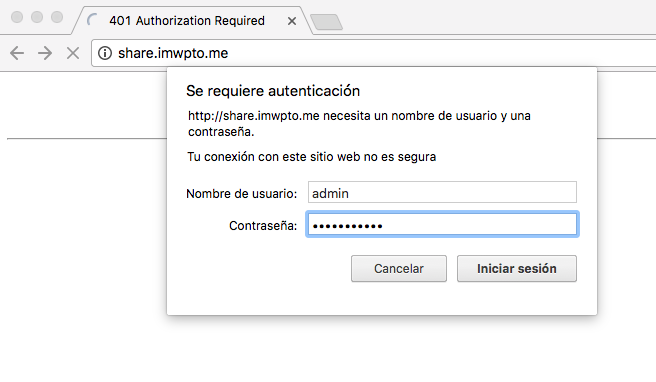
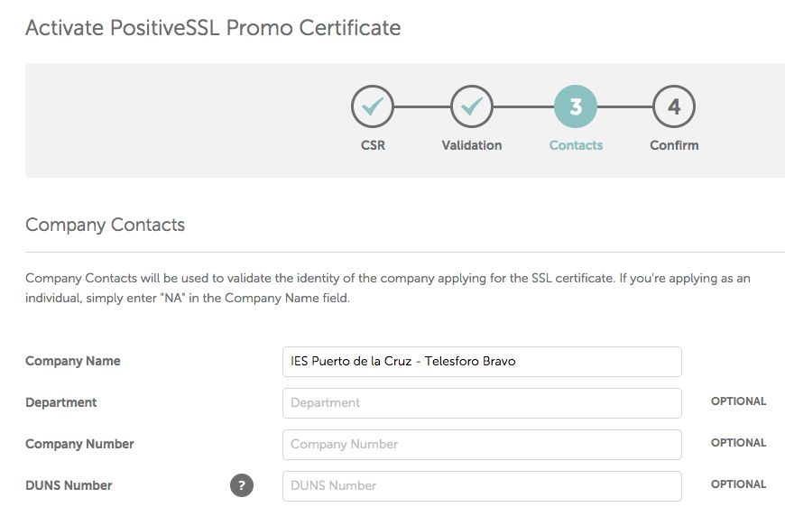

# Servidor Web

[Instalando Nginx](#instalando-nginx)  
[Server y Location](#server-y-location)  
[Rutas destacadas](#rutas-destacadas)  
[Listado de directorios](#listado-de-directorios)  
[Acceso restringido con clave](#acceso-restringido-con-clave)  
[Ficheros de log](#ficheros-de-log)  
[Configurando SSL](#configurando-ssl)  
[Redirecciones](#redirecciones)  
[Variables](#variables)

## Instalando Nginx

El servidor con el que vamos a trabajar será **Nginx**.

 

La instalación del servidor **Nginx** es muy sencilla. Lo único que debemos hacer es utilizar el paquete preparado al efecto.

Lo primero es actualizar la lista de paquetes:

```console
sdelquin@cloud:~$ sudo apt-get update
[sudo] password for sdelquin:
Des:1 http://security.ubuntu.com/ubuntu xenial-security InRelease [102 kB]
Des:2 http://security.ubuntu.com/ubuntu xenial-security/main Sources [91,3 kB]
Des:3 http://security.ubuntu.com/ubuntu xenial-security/main amd64 Packages [354 kB]
Des:4 http://security.ubuntu.com/ubuntu xenial-security/universe amd64 Packages [169 kB]
Obj:5 http://ams2.mirrors.digitalocean.com/ubuntu xenial InRelease
Des:6 http://ams2.mirrors.digitalocean.com/ubuntu xenial-updates InRelease [102 kB]
Des:7 http://ams2.mirrors.digitalocean.com/ubuntu xenial-backports InRelease [102 kB]
Des:8 http://ams2.mirrors.digitalocean.com/ubuntu xenial-updates/main Sources [275 kB]
Des:9 http://ams2.mirrors.digitalocean.com/ubuntu xenial-updates/main amd64 Packages [631 kB]
Des:10 http://ams2.mirrors.digitalocean.com/ubuntu xenial-updates/universe amd64 Packages [536 kB]
Descargados 2.363 kB en 1s (1.595 kB/s)
Leyendo lista de paquetes... Hecho
sdelquin@cloud:~$
```

A continuación instalaremos el paquete `nginx`:

```console
sdelquin@cloud:~$ sudo apt-get install nginx
Leyendo lista de paquetes... Hecho
Creando árbol de dependencias
Leyendo la información de estado... Hecho
El paquete indicado a continuación se instaló de forma automática y ya no es necesario.
  grub-pc-bin
Utilice «sudo apt autoremove» para eliminarlo.
Se instalarán los siguientes paquetes adicionales:
  fontconfig-config fonts-dejavu-core libfontconfig1 libgd3 libjbig0 libjpeg-turbo8 libjpeg8 libtiff5
  libvpx3 libxpm4 libxslt1.1 nginx-common nginx-core
Paquetes sugeridos:
  libgd-tools fcgiwrap nginx-doc ssl-cert
Se instalarán los siguientes paquetes NUEVOS:
  fontconfig-config fonts-dejavu-core libfontconfig1 libgd3 libjbig0 libjpeg-turbo8 libjpeg8 libtiff5
  libvpx3 libxpm4 libxslt1.1 nginx nginx-common nginx-core
0 actualizados, 14 nuevos se instalarán, 0 para eliminar y 15 no actualizados.
Se necesita descargar 3.000 kB de archivos.
Se utilizarán 9.783 kB de espacio de disco adicional después de esta operación.
¿Desea continuar? [S/n]
Des:1 http://ams2.mirrors.digitalocean.com/ubuntu xenial/main amd64 libjpeg-turbo8 amd64 1.4.2-0ubuntu3 [111 kB]
Des:2 http://ams2.mirrors.digitalocean.com/ubuntu xenial/main amd64 libjbig0 amd64 2.1-3.1 [26,6 kB]
Des:3 http://ams2.mirrors.digitalocean.com/ubuntu xenial/main amd64 fonts-dejavu-core all 2.35-1 [1.039 kB]
Des:4 http://ams2.mirrors.digitalocean.com/ubuntu xenial-updates/main amd64 fontconfig-config all 2.11.94-0ubuntu1.1 [49,9 kB]
Des:5 http://ams2.mirrors.digitalocean.com/ubuntu xenial-updates/main amd64 libfontconfig1 amd64 2.11.94-0ubuntu1.1 [131 kB]
Des:6 http://ams2.mirrors.digitalocean.com/ubuntu xenial/main amd64 libjpeg8 amd64 8c-2ubuntu8 [2.194 B]
Des:7 http://ams2.mirrors.digitalocean.com/ubuntu xenial-updates/main amd64 libtiff5 amd64 4.0.6-1ubuntu0.2 [146 kB]
Des:8 http://ams2.mirrors.digitalocean.com/ubuntu xenial/main amd64 libvpx3 amd64 1.5.0-2ubuntu1 [732 kB]
Des:9 http://ams2.mirrors.digitalocean.com/ubuntu xenial-updates/main amd64 libxpm4 amd64 1:3.5.11-1ubuntu0.16.04.1 [33,8 kB]
Des:10 http://ams2.mirrors.digitalocean.com/ubuntu xenial-updates/main amd64 libgd3 amd64 2.1.1-4ubuntu0.16.04.8 [126 kB]
Des:11 http://ams2.mirrors.digitalocean.com/ubuntu xenial-updates/main amd64 libxslt1.1 amd64 1.1.28-2.1ubuntu0.1 [145 kB]
Des:12 http://ams2.mirrors.digitalocean.com/ubuntu xenial-updates/main amd64 nginx-common all 1.10.3-0ubuntu0.16.04.2 [26,6 kB]
Des:13 http://ams2.mirrors.digitalocean.com/ubuntu xenial-updates/main amd64 nginx-core amd64 1.10.3-0ubuntu0.16.04.2 [428 kB]
Des:14 http://ams2.mirrors.digitalocean.com/ubuntu xenial-updates/main amd64 nginx all 1.10.3-0ubuntu0.16.04.2 [3.490 B]
Descargados 3.000 kB en 1s (1.943 kB/s)
Preconfigurando paquetes ...
Seleccionando el paquete libjpeg-turbo8:amd64 previamente no seleccionado.
(Leyendo la base de datos ... 82162 ficheros o directorios instalados actualmente.)
Preparando para desempaquetar .../libjpeg-turbo8_1.4.2-0ubuntu3_amd64.deb ...
Desempaquetando libjpeg-turbo8:amd64 (1.4.2-0ubuntu3) ...
Seleccionando el paquete libjbig0:amd64 previamente no seleccionado.
Preparando para desempaquetar .../libjbig0_2.1-3.1_amd64.deb ...
Desempaquetando libjbig0:amd64 (2.1-3.1) ...
Seleccionando el paquete fonts-dejavu-core previamente no seleccionado.
Preparando para desempaquetar .../fonts-dejavu-core_2.35-1_all.deb ...
Desempaquetando fonts-dejavu-core (2.35-1) ...
Seleccionando el paquete fontconfig-config previamente no seleccionado.
Preparando para desempaquetar .../fontconfig-config_2.11.94-0ubuntu1.1_all.deb ...
Desempaquetando fontconfig-config (2.11.94-0ubuntu1.1) ...
Seleccionando el paquete libfontconfig1:amd64 previamente no seleccionado.
Preparando para desempaquetar .../libfontconfig1_2.11.94-0ubuntu1.1_amd64.deb ...
Desempaquetando libfontconfig1:amd64 (2.11.94-0ubuntu1.1) ...
Seleccionando el paquete libjpeg8:amd64 previamente no seleccionado.
Preparando para desempaquetar .../libjpeg8_8c-2ubuntu8_amd64.deb ...
Desempaquetando libjpeg8:amd64 (8c-2ubuntu8) ...
Seleccionando el paquete libtiff5:amd64 previamente no seleccionado.
Preparando para desempaquetar .../libtiff5_4.0.6-1ubuntu0.2_amd64.deb ...
Desempaquetando libtiff5:amd64 (4.0.6-1ubuntu0.2) ...
Seleccionando el paquete libvpx3:amd64 previamente no seleccionado.
Preparando para desempaquetar .../libvpx3_1.5.0-2ubuntu1_amd64.deb ...
Desempaquetando libvpx3:amd64 (1.5.0-2ubuntu1) ...
Seleccionando el paquete libxpm4:amd64 previamente no seleccionado.
Preparando para desempaquetar .../libxpm4_1%3a3.5.11-1ubuntu0.16.04.1_amd64.deb ...
Desempaquetando libxpm4:amd64 (1:3.5.11-1ubuntu0.16.04.1) ...
Seleccionando el paquete libgd3:amd64 previamente no seleccionado.
Preparando para desempaquetar .../libgd3_2.1.1-4ubuntu0.16.04.8_amd64.deb ...
Desempaquetando libgd3:amd64 (2.1.1-4ubuntu0.16.04.8) ...
Seleccionando el paquete libxslt1.1:amd64 previamente no seleccionado.
Preparando para desempaquetar .../libxslt1.1_1.1.28-2.1ubuntu0.1_amd64.deb ...
Desempaquetando libxslt1.1:amd64 (1.1.28-2.1ubuntu0.1) ...
Seleccionando el paquete nginx-common previamente no seleccionado.
Preparando para desempaquetar .../nginx-common_1.10.3-0ubuntu0.16.04.2_all.deb ...
Desempaquetando nginx-common (1.10.3-0ubuntu0.16.04.2) ...
Seleccionando el paquete nginx-core previamente no seleccionado.
Preparando para desempaquetar .../nginx-core_1.10.3-0ubuntu0.16.04.2_amd64.deb ...
Desempaquetando nginx-core (1.10.3-0ubuntu0.16.04.2) ...
Seleccionando el paquete nginx previamente no seleccionado.
Preparando para desempaquetar .../nginx_1.10.3-0ubuntu0.16.04.2_all.deb ...
Desempaquetando nginx (1.10.3-0ubuntu0.16.04.2) ...
Procesando disparadores para libc-bin (2.23-0ubuntu9) ...
Procesando disparadores para man-db (2.7.5-1) ...
Procesando disparadores para ureadahead (0.100.0-19) ...
Procesando disparadores para ufw (0.35-0ubuntu2) ...
Procesando disparadores para systemd (229-4ubuntu19) ...
Configurando libjpeg-turbo8:amd64 (1.4.2-0ubuntu3) ...
Configurando libjbig0:amd64 (2.1-3.1) ...
Configurando fonts-dejavu-core (2.35-1) ...
Configurando fontconfig-config (2.11.94-0ubuntu1.1) ...
Configurando libfontconfig1:amd64 (2.11.94-0ubuntu1.1) ...
Configurando libjpeg8:amd64 (8c-2ubuntu8) ...
Configurando libtiff5:amd64 (4.0.6-1ubuntu0.2) ...
Configurando libvpx3:amd64 (1.5.0-2ubuntu1) ...
Configurando libxpm4:amd64 (1:3.5.11-1ubuntu0.16.04.1) ...
Configurando libgd3:amd64 (2.1.1-4ubuntu0.16.04.8) ...
Configurando libxslt1.1:amd64 (1.1.28-2.1ubuntu0.1) ...
Configurando nginx-common (1.10.3-0ubuntu0.16.04.2) ...
Configurando nginx-core (1.10.3-0ubuntu0.16.04.2) ...
Configurando nginx (1.10.3-0ubuntu0.16.04.2) ...
Procesando disparadores para libc-bin (2.23-0ubuntu9) ...
Procesando disparadores para systemd (229-4ubuntu19) ...
Procesando disparadores para ureadahead (0.100.0-19) ...
Procesando disparadores para ufw (0.35-0ubuntu2) ...
sdelquin@cloud:~$
```

Con esto, en principio, debería estar instalado el servidor web **Nginx**. Podemos comprobarlo con el siguiente comando:

```console
sdelquin@cloud:~$ sudo systemctl status nginx
● nginx.service - A high performance web server and a reverse proxy server
   Loaded: loaded (/lib/systemd/system/nginx.service; enabled; vendor preset: enabled)
   Active: active (running) since jue 2017-09-21 15:09:21 UTC; 26s ago
 Main PID: 28992 (nginx)
   CGroup: /system.slice/nginx.service
           ├─28992 nginx: master process /usr/sbin/nginx -g daemon on; master_process on
           └─28993 nginx: worker process

sep 21 15:09:21 cloud systemd[1]: Starting A high performance web server and a reverse proxy server...
sep 21 15:09:21 cloud systemd[1]: nginx.service: Failed to read PID from file /run/nginx.pid: Invalid argument
sep 21 15:09:21 cloud systemd[1]: Started A high performance web server and a reverse proxy server.
sdelquin@cloud:~$
```

Para comprobar nuestra instalación de **Nginx**, accedemos al nombre de la máquina:


Igualmente, podemos acceder a la IP de la máquina, y la respuesta debe ser la misma:

```console
sdelquin@imw:~$ ping imwpto.me
PING imwpto.me (138.68.99.84) 56(84) bytes of data.
64 bytes from cloud (138.68.99.84): icmp_seq=1 ttl=55 time=66.0 ms
^C
--- imwpto.me ping statistics ---
1 packets transmitted, 1 received, 0% packet loss, time 0ms
rtt min/avg/max/mdev = 66.050/66.050/66.050/0.000 ms
sdelquin@imw:~$
```


## Rutas destacadas

El directorio *root* por defecto de Nginx es: `/var/www/html`:

```console
sdelquin@cloud:~$ cat /etc/nginx/sites-enabled/default | grep root | head -1
  root /var/www/html;
sdelquin@cloud:~$
```

Si echamos un vistazo, vemos lo siguiente:

```console
sdelquin@cloud:~$ sudo ls -l /var/www/html/
total 4
-rw-r--r-- 1 root root 612 sep 21 15:09 index.nginx-debian.html
sdelquin@cloud:~$
```

Cuando accedemos a nuestra máquina de producción, lo que realmente está pasando es que Nginx trata de buscar un fichero índice en el *root*. De hecho si miramos el contenido del fichero `index.nginx-debian.html` podemos ver que su contenido coincide con lo que nos muestra el servidor web:

```console
sdelquin@cloud:~$ cat /var/www/html/index.nginx-debian.html
<!DOCTYPE html>
<html>
<head>
<title>Welcome to nginx!</title>
<style>
    body {
        width: 35em;
        margin: 0 auto;
        font-family: Tahoma, Verdana, Arial, sans-serif;
    }
</style>
</head>
<body>
<h1>Welcome to nginx!</h1>
<p>If you see this page, the nginx web server is successfully installed and
working. Further configuration is required.</p>

<p>For online documentation and support please refer to
<a href="http://nginx.org/">nginx.org</a>.<br/>
Commercial support is available at
<a href="http://nginx.com/">nginx.com</a>.</p>

<p><em>Thank you for using nginx.</em></p>
</body>
</html>
sdelquin@cloud:~$
```

### Usuario de trabajo de `Nginx`

Cuando el servicio `Nginx` lanza sus procesos, estos se ejecutan utilizando el usuario `www-data` y el grupo `www-data`. Lo podemos ver a continuación:

```console
sdelquin@cloud:~$ sudo systemctl status nginx
● nginx.service - A high performance web server and a reverse proxy server
   Loaded: loaded (/lib/systemd/system/nginx.service; enabled; vendor preset: enabled)
   Active: active (running) since sáb 2017-10-07 11:06:47 UTC; 5min ago
  Process: 9434 ExecStop=/sbin/start-stop-daemon --quiet --stop --retry QUIT/5 --pidfile /run/nginx.pid (code=
  Process: 9444 ExecStart=/usr/sbin/nginx -g daemon on; master_process on; (code=exited, status=0/SUCCESS)
  Process: 9440 ExecStartPre=/usr/sbin/nginx -t -q -g daemon on; master_process on; (code=exited, status=0/SUC
 Main PID: 9448 (nginx)
    Tasks: 2
   Memory: 2.9M
      CPU: 40ms
   CGroup: /system.slice/nginx.service
           ├─9448 nginx: master process /usr/sbin/nginx -g daemon on; master_process on
           └─9449 nginx: worker process

oct 07 11:06:47 cloud systemd[1]: Starting A high performance web server and a reverse proxy server...
oct 07 11:06:47 cloud systemd[1]: nginx.service: Failed to read PID from file /run/nginx.pid: Invalid argument
oct 07 11:06:47 cloud systemd[1]: Started A high performance web server and a reverse proxy server.
sdelquin@cloud:~$ ps aux | grep nginx
root      9448  0.0  0.3 125244  1632 ?        Ss   11:06   0:00 nginx: master process /usr/sbin/nginx -g daemon on; master_process on;
www-data  9449  0.0  1.0 125616  5136 ?        S    11:06   0:00 nginx: worker process
sdelquin  9508  0.0  0.1  14160   976 pts/0    S+   11:12   0:00 grep --color=auto nginx
sdelquin@cloud:~$ groups www-data
www-data : www-data
sdelquin@cloud:~$
```

### Ficheros de configuración

Podríamos decir que Nginx dispone de dos ficheros destacados de configuración:

* `/etc/nginx/nginx.conf`: para las configuraciones del servicio.
* `/etc/nginx/sites-enabled/default`: para las configuraciones del sitio web.

## Server y Location

*Nginx* se configura a través de bloques de mayor nivel llamados `server` (servidor ó *virtual host*) y de `location` (ubicaciones) dentro de esos servidores.


Cada vez que queramos incluir un nuevo *virtual host*, debemos incluir un fichero en la ruta `/etc/nginx/sites-available` y luego enlazar dicho fichero desde la ruta `/etc/nginx/sites-enabled`.

> ⚠️ Todos los `locations` que dependen de un mismo *virtual host (ó dominio)* deben estar en el mismo fichero.

### `hello.imwpto.me`

Supongamos que queremos mostrar una página web que hemos creado en la carpeta *home* del usuario *sdelquin*. Además queremos que se muestre esa página cuando se acceda en el navegador a la *url* `http://hello.imwpto.me/`.

Añadimos el fichero de configuración de *Nginx* que tratará las peticiones que se hagan al nombre de dominio `hello.imwpto.me`:

```console
sdelquin@cloud:~$ sudo vi /etc/nginx/sites-available/hello
```

> Contenido
```nginx
server {
    server_name hello.imwpto.me;
    root /home/sdelquin;
}
```

> ⚠️   En el caso de que no especifiquemos un `root` el que toma por defecto será `/usr/share/nginx/html`. Esto es debido a las variables de configuración en el momento de compilar (`nginx -V`).

A continuación tenemos que enlazar el fichero que hemos creado para que esté disponible desde los `sites-enabled`:

```console
sdelquin@cloud:~$ cd /etc/nginx/sites-enabled/
sdelquin@cloud:/etc/nginx/sites-enabled$ sudo ln -s ../sites-available/hello
sdelquin@cloud:/etc/nginx/sites-enabled$ ls -l
total 0
lrwxrwxrwx 1 root root 34 sep 21 15:09 default -> /etc/nginx/sites-available/default
lrwxrwxrwx 1 root root 27 sep 21 15:22 hello -> ../sites-available/hello
sdelquin@cloud:/etc/nginx/sites-enabled$
```

Por último, tenemos que recargar la configuración de *Nginx* para que los cambios surtan efecto:

```console
sdelquin@cloud:/etc/nginx/sites-enabled$ sudo systemctl reload nginx
sdelquin@cloud:/etc/nginx/sites-enabled$
```

> No es lo mismo *recargar* (`reload`) que *reiniciar* (`restart`).

Ahora ya podemos escribir la página web en nuestro *home*:

```console
sdelquin@cloud:~$ vi index.html
```

> Contenido:
```html
<h1>My first site powered by Nginx</h1>
This is a new website.<br>
Have a good day!
```

Si ahora accedemos desde un navegador, deberíamos ver lo siguiente:


### `hello.imwpto.me/blog/`

Supongamos que ahora queremos, que cuando se acceda a `http://hello.imwpto.me/blog/`, nos muestre la web que vamos a diseñar en el directorio `/home/sdelquin/webapps/blog`. Dado que se trata de un *location* dentro de un *virtual host*, tendremos que utilizar la siguiente directiva:

```console
sdelquin@cloud:~$ sudo vi /etc/nginx/sites-available/hello
```

> Contenido
```nginx
server {
    server_name hello.imwpto.me;
    root /home/sdelquin;
    
    location /blog {
        root /home/sdelquin/webapps;
    }
}
```

Una vez más, recargamos nuestro servidor para que los cambios surtan efecto:

```console
sdelquin@cloud:~$ sudo systemctl reload nginx
sdelquin@cloud:~$
```

Ahora, como usuario `sdelquin`, podemos desarrollar nuestro blog en la ruta `/home/sdelquin/webapps/blog`. Lo típico sería empezar por un fichero `index.html`:

```console
sdelquin@cloud:~$ mkdir -p webapps/blog
sdelquin@cloud:~$ echo "Brand new blog!" > webapps/blog/index.html
sdelquin@cloud:~$
```

Si accedemos mediante un navegador, deberíamos ver algo como lo siguiente:


## Listado de directorios

Existen multitud de parámetros que se pueden configurar para los sitios web que se definen en *Ningx*.

Uno de ellos es `autoindex` y nos permite *listar el contenido del directorio actual*, pudiendo implementar una especie de *FTP* a través del navegador.

Supongamos que tenemos una carpeta `share` en nuestro *HOME* que queremos compartir con una serie de amigos. Vamos a ver cómo lo implementamos usando *Nginx*.

Necesitaremos la utilidad `unzip`. Para ello la instalamos usando `apt-get`:

```console
sdelquin@cloud:~$ sudo apt-get install unzip
[sudo] password for sdelquin:
Leyendo lista de paquetes... Hecho
Creando árbol de dependencias
Leyendo la información de estado... Hecho
El paquete indicado a continuación se instaló de forma automática y ya no es necesario.
  grub-pc-bin
Utilice «sudo apt autoremove» para eliminarlo.
Paquetes sugeridos:
  zip
Se instalarán los siguientes paquetes NUEVOS:
Se utilizarán 530 kB de espacio de disco adicional después de esta operación.
Des:1 http://ams2.mirrors.digitalocean.com/ubuntu xenial/main amd64 unzip amd64 6.0-20ubuntu1 [158 kB]
Descargados 158 kB en 0s (306 kB/s)
Seleccionando el paquete unzip previamente no seleccionado.
(Leyendo la base de datos ... 86094 ficheros o directorios instalados actualmente.)
Preparando para desempaquetar .../unzip_6.0-20ubuntu1_amd64.deb ...
Desempaquetando unzip (6.0-20ubuntu1) ...
Procesando disparadores para mime-support (3.59ubuntu1) ...
Procesando disparadores para man-db (2.7.5-1) ...
Configurando unzip (6.0-20ubuntu1) ...
sdelquin@cloud:~$
```

Ahora descargamos algunas cosas en la carpeta que queremos compartir:

```console
sdelquin@cloud:~$ mkdir share
sdelquin@cloud:~$ cd share
sdelquin@cloud:~/share$ curl -O http://design.ubuntu.com/wp-content/uploads/bcb4/ubuntu-logo-set-web-svg.zip
  % Total    % Received % Xferd  Average Speed   Time    Time     Time  Current
                                 Dload  Upload   Total   Spent    Left  Speed
100 61473  100 61473    0     0   810k      0 --:--:-- --:--:-- --:--:--  822k
sdelquin@cloud:~/share$ unzip ubuntu-logo-set-web-svg.zip
Archive:  ubuntu-logo-set-web-svg.zip
   creating: ubuntu-logo-set-web-svg/
  inflating: ubuntu-logo-set-web-svg/LICENCE.txt
   creating: __MACOSX/
   creating: __MACOSX/ubuntu-logo-set-web-svg/
  inflating: __MACOSX/ubuntu-logo-set-web-svg/._LICENCE.txt
   creating: ubuntu-logo-set-web-svg/SVG/
  inflating: ubuntu-logo-set-web-svg/SVG/photos-1.dropbox.com.url
   creating: __MACOSX/ubuntu-logo-set-web-svg/SVG/
  inflating: __MACOSX/ubuntu-logo-set-web-svg/SVG/._photos-1.dropbox.com.url
  inflating: ubuntu-logo-set-web-svg/SVG/ubuntu_black-orange_hex.svg
  inflating: __MACOSX/ubuntu-logo-set-web-svg/SVG/._ubuntu_black-orange_hex.svg
  inflating: ubuntu-logo-set-web-svg/SVG/ubuntu_black_hex.svg
  inflating: __MACOSX/ubuntu-logo-set-web-svg/SVG/._ubuntu_black_hex.svg
  inflating: ubuntu-logo-set-web-svg/SVG/ubuntu_orange_hex.svg
  inflating: __MACOSX/ubuntu-logo-set-web-svg/SVG/._ubuntu_orange_hex.svg
  inflating: ubuntu-logo-set-web-svg/SVG/ubuntu_white-orange(cof)_hex.svg
  inflating: __MACOSX/ubuntu-logo-set-web-svg/SVG/._ubuntu_white-orange(cof)_hex.svg
  inflating: ubuntu-logo-set-web-svg/SVG/ubuntu_white-orange_hex.svg
  inflating: __MACOSX/ubuntu-logo-set-web-svg/SVG/._ubuntu_white-orange_hex.svg
  inflating: ubuntu-logo-set-web-svg/SVG/ubuntu_white_hex.svg
  inflating: __MACOSX/ubuntu-logo-set-web-svg/SVG/._ubuntu_white_hex.svg
  inflating: __MACOSX/ubuntu-logo-set-web-svg/._SVG
   creating: ubuntu-logo-set-web-svg/SVG_small_use/
  inflating: ubuntu-logo-set-web-svg/SVG_small_use/ubuntu_black-orange_hex_su.svg
   creating: __MACOSX/ubuntu-logo-set-web-svg/SVG_small_use/
  inflating: __MACOSX/ubuntu-logo-set-web-svg/SVG_small_use/._ubuntu_black-orange_hex_su.svg
  inflating: ubuntu-logo-set-web-svg/SVG_small_use/ubuntu_black_hex_su.svg
  inflating: __MACOSX/ubuntu-logo-set-web-svg/SVG_small_use/._ubuntu_black_hex_su.svg
  inflating: ubuntu-logo-set-web-svg/SVG_small_use/ubuntu_orange_hex_su.svg
  inflating: __MACOSX/ubuntu-logo-set-web-svg/SVG_small_use/._ubuntu_orange_hex_su.svg
  inflating: ubuntu-logo-set-web-svg/SVG_small_use/ubuntu_white-orange(cof)_hex_su.svg
  inflating: __MACOSX/ubuntu-logo-set-web-svg/SVG_small_use/._ubuntu_white-orange(cof)_hex_su.svg
  inflating: ubuntu-logo-set-web-svg/SVG_small_use/ubuntu_white-orange_hex_su.svg
  inflating: __MACOSX/ubuntu-logo-set-web-svg/SVG_small_use/._ubuntu_white-orange_hex_su.svg
  inflating: ubuntu-logo-set-web-svg/SVG_small_use/ubuntu_white_hex_su.svg
  inflating: __MACOSX/ubuntu-logo-set-web-svg/SVG_small_use/._ubuntu_white_hex_su.svg
  inflating: __MACOSX/ubuntu-logo-set-web-svg/._SVG_small_use
   creating: ubuntu-logo-set-web-svg/SVG_stacked/
  inflating: ubuntu-logo-set-web-svg/SVG_stacked/ubuntu_black-orange_st_hex.svg
   creating: __MACOSX/ubuntu-logo-set-web-svg/SVG_stacked/
  inflating: __MACOSX/ubuntu-logo-set-web-svg/SVG_stacked/._ubuntu_black-orange_st_hex.svg
  inflating: ubuntu-logo-set-web-svg/SVG_stacked/ubuntu_black_st_hex.svg
  inflating: __MACOSX/ubuntu-logo-set-web-svg/SVG_stacked/._ubuntu_black_st_hex.svg
  inflating: ubuntu-logo-set-web-svg/SVG_stacked/ubuntu_orange_st_hex.svg
  inflating: __MACOSX/ubuntu-logo-set-web-svg/SVG_stacked/._ubuntu_orange_st_hex.svg
  inflating: ubuntu-logo-set-web-svg/SVG_stacked/ubuntu_white-orange(cof)_st_hex.svg
  inflating: __MACOSX/ubuntu-logo-set-web-svg/SVG_stacked/._ubuntu_white-orange(cof)_st_hex.svg
  inflating: ubuntu-logo-set-web-svg/SVG_stacked/ubuntu_white-orange_st_hex.svg
  inflating: __MACOSX/ubuntu-logo-set-web-svg/SVG_stacked/._ubuntu_white-orange_st_hex.svg
  inflating: ubuntu-logo-set-web-svg/SVG_stacked/ubuntu_white_st_hex.svg
  inflating: __MACOSX/ubuntu-logo-set-web-svg/SVG_stacked/._ubuntu_white_st_hex.svg
  inflating: __MACOSX/ubuntu-logo-set-web-svg/._SVG_stacked
  inflating: __MACOSX/._ubuntu-logo-set-web-svg
sdelquin@cloud:~/share$ ls
__MACOSX  ubuntu-logo-set-web-svg  ubuntu-logo-set-web-svg.zip
sdelquin@cloud:~/share$ rm -r __MACOSX/ ubuntu-logo-set-web-svg.zip
sdelquin@cloud:~/share$ chmod -R 755 ubuntu-logo-set-web-svg/
sdelquin@cloud:~/share$
```

Ahora vamos a crear un *virtual host* para servir esta carpeta compartida `share` a través del dominio `share.imwpto.me`:

```console
sdelquin@cloud:~$ sudo vi /etc/nginx/sites-available/share
```

> Contenido
```nginx
server {
    server_name share.imwpto.me;
    root /home/sdelquin/share;
    autoindex on;
}
```

Enlazamos el *virtual host* para que esté disponible:

```console
sdelquin@cloud:~$ cd /etc/nginx/sites-enabled/
sdelquin@cloud:/etc/nginx/sites-enabled$ sudo ln -s ../sites-available/share
sdelquin@cloud:/etc/nginx/sites-enabled$
```

Ahora recargamos el servidor para que los cambios tengan efecto:

```console
sdelquin@cloud:~$ sudo systemctl reload nginx
sdelquin@cloud:~$
```

> NOTA: Hay que tener mucho cuidado con el uso de esta configuración en el `root` de *Nginx*, pues dará acceso al contenido de los subdirectorios que cuelgan de `/var/www/html`

Al acceder al dominio, vemos que podemos *"navegar"* por la carpeta:


Podemos ver el contenido de esta carpeta:


## Acceso restringido con clave

Es posible pedir usuario/clave al acceder a determinadas ubicaciones de nuestro servidor *Nginx*.

Supongamos que queremos tener acceso a la carpeta `/home/sdelquin/share`, pero que no nos interesa que sea pública, sino a través de un usuario/clave.

En primer lugar tendremos que generar el fichero `.htpasswd`. Este fichero tiene una estructura en el que cada línea identifica a un posible usuario en la forma:

```
username:encrypted-password:comment
```

Para generar nuestro *password* encriptado, podemos usar el lenguaje *perl* (que suele instalarse con el sistema base), utilizando el siguiente comando:

```console
sdelquin@cloud:~$ perl -le 'print crypt("restringido", "salt-hash")'
saOQOMmS3k30w
sdelquin@cloud:~$
```

Lo que hemos hecho es encriptar el password `restringido`. Ahora podemos crear el fichero `.htpasswd`. En este caso el nombre de usuario será `admin` y el password es el que hemos creado anteriormente:

```console
sdelquin@cloud:~/share$ echo "admin:saOQOMmS3k30w" > .htpasswd
sdelquin@cloud:~/share$
```

Ahora añadimos el *location* correspondiente a nuestra configuración de *Nginx*:

```console
sdelquin@cloud:~$ sudo vi /etc/nginx/sites-available/share
```

> Contenido
```nginx
server {
    server_name share.imwpto.me;
    root /home/sdelquin/share;
    autoindex on;
    auth_basic "Administrator Login";
    auth_basic_user_file /home/sdelquin/share/.htpasswd;
}
```

Recargamos la configuración de *Nginx* y probamos el acceso. Al acceder a la ruta `http://share.imwpto.me` vemos que nos aparece un cuadro de diálogo preguntándonos por el usuario/clave:


Rellenamos los campos con las credenciales que pusimos anteriormente en el fichero de configuración: `admin` | `restringido`:



Vemos que podemos acceder y se nos muestra el contenido del directorio, que ahora mismo, está vacío:


### Denegando el acceso a determinadas carpetas

Supongamos que queremos prohibir el acceso a la carpeta `private` dentro de `share`. Para ello podemos hacer uso de determinadas sentencias en el fichero de configuración del *virtual host*:

Primero creamos la carpeta privada:

```console
sdelquin@cloud:~/share$ mkdir private
sdelquin@cloud:~/share$ cd private/
sdelquin@cloud:~/share/private$ cat /proc/cpuinfo > cpuinfo.txt
sdelquin@cloud:~/share/private$
```

Ahora denegamos el acceso desde el fichero de configuración:

```console
sdelquin@cloud:~$ sudo vi /etc/nginx/sites-available/share
```

> Contenido
```nginx
server {
    server_name share.imwpto.me;
    root /home/sdelquin/share;
    autoindex on;
    auth_basic "Administrator Login";
    auth_basic_user_file /home/sdelquin/share/.htpasswd;

    location ~ private {
        deny all;
    }
}
```

Recargamos la configuración de *Nginx*. Ahora vemos que el acceso a la carpeta `private` no está permitido, obteniendo un error *403*:


## Ficheros de log

Es importante conocer la ubicación de los *logfiles* de *Nginx*. Por defecto, estos ficheros son los siguientes:

* `/var/log/nginx/access.log`
* `/var/log/nginx/error.log`

### `access.log`

```console
sdelquin@cloud:~$ sudo tail -5 /var/log/nginx/access.log
83.50.205.28 - admin [24/Sep/2017:15:08:28 +0000] "GET /private/ HTTP/1.1" 403 208 "http://share.imwpto.me/" "Mozilla/5.0 (Macintosh; Intel Mac OS X 10_11_6) AppleWebKit/537.36 (KHTML, like Gecko) Chrome/60.0.3112.113 Safari/537.36"
83.50.205.28 - admin [24/Sep/2017:15:08:31 +0000] "GET /ubuntu-logo-set-web-svg/ HTTP/1.1" 200 275 "http://share.imwpto.me/" "Mozilla/5.0 (Macintosh; Intel Mac OS X 10_11_6) AppleWebKit/537.36 (KHTML, like Gecko) Chrome/60.0.3112.113 Safari/537.36"
83.50.205.28 - admin [24/Sep/2017:15:08:48 +0000] "GET / HTTP/1.1" 200 217 "-" "Mozilla/5.0 (Macintosh; Intel Mac OS X 10_11_6) AppleWebKit/537.36 (KHTML, like Gecko) Chrome/60.0.3112.113 Safari/537.36"
83.50.205.28 - admin [24/Sep/2017:15:08:53 +0000] "GET /private/ HTTP/1.1" 403 208 "http://share.imwpto.me/" "Mozilla/5.0 (Macintosh; Intel Mac OS X 10_11_6) AppleWebKit/537.36 (KHTML, like Gecko) Chrome/60.0.3112.113 Safari/537.36"
83.50.205.28 - admin [24/Sep/2017:15:10:05 +0000] "GET /private/ HTTP/1.1" 403 208 "http://share.imwpto.me/" "Mozilla/5.0 (Macintosh; Intel Mac OS X 10_11_6) AppleWebKit/537.36 (KHTML, like Gecko) Chrome/60.0.3112.113 Safari/537.36"
sdelquin@cloud:~$
```

### `error.log`

```console
sdelquin@cloud:~$ sudo tail -5 /var/log/nginx/error.log
2017/09/24 14:54:58 [notice] 17102#17102: signal process started
2017/09/24 15:08:13 [notice] 17403#17403: signal process started
2017/09/24 15:08:28 [error] 17407#17407: *293 access forbidden by rule, client: 83.50.205.28, server: share.imwpto.me, request: "GET /private/ HTTP/1.1", host: "share.imwpto.me", referrer: "http://share.imwpto.me/"
2017/09/24 15:08:53 [error] 17407#17407: *294 access forbidden by rule, client: 83.50.205.28, server: share.imwpto.me, request: "GET /private/ HTTP/1.1", host: "share.imwpto.me", referrer: "http://share.imwpto.me/"
2017/09/24 15:10:05 [error] 17407#17407: *296 access forbidden by rule, client: 83.50.205.28, server: share.imwpto.me, request: "GET /private/ HTTP/1.1", host: "share.imwpto.me", referrer: "http://share.imwpto.me/"
sdelquin@cloud:~$
```

Además, para cada *virtual host* y/o para cada *location*, podemos definir *logfiles* propios. Para hacer esto habría que añadir las siguientes líneas a las secciones correspondientes:

```nginx
server {
    ...
    access_log /path/to/your/access.log;
    error_log /path/to/your/error.log;
    ...
}
```

## Configurando SSL

Cuando queremos que nuestro sitio web use *SSL* (Secure Sockets Layer), necesitamos configurar el servidor web *Nignx* con certificados de seguridad, específicamente creados para nuestro dominio. El procedimiento que se debe seguir para esto se explica a continuación:


Por lo tanto, necesitamos contar con 4 ficheros, más un quinto que se genera a partir de otros dos. Los ficheros serían los siguientes:

- `server.key`: clave privada.
- `server.crs`: solicitud de firma de certificado de seguridad.
- `SSL.crt`: certificado SSL.
- `intermediate.crt`: certificados intermedios.
- `SSL.final.crt`: certificado final resultante de la unión de `SSL.crt` y `intermediate.crt`

> Hoy en día, las entidades certificadoras facilitan la creación de todos estos ficheros, a través de sencillos asistentes. Una vez que obtengamos los citados ficheros, se suelen guardar en `/etc/ssl/`. Ejemplo: [DonDominio](http://dondominio.com)

### Certificado SSL en Namecheap

Vamos a volver a utilizar nuestro [Student Developer Pack](https://education.github.com/pack/offers) para obtener un código de promoción SSL en *Namecheap*:

 

Entramos en el sitio web de *Namecheap* y nos logeamos. A continuación vamos a:

```
Security -> SSL Certificates -> PositiveSSL
```

Aplicamos el código de promoción:

 

Nos quedaría de esta forma:

 

Ahora pulsamos en **Confirm Order**, y en la siguiente pantalla rellenamos la información de contacto. Pulsamos en **Continue** y en la última pantalla pusamos en **Pay Now**.

Al terminar es posible que aparezca una encuesta. La pueden rellenar o cerrar el cuadro de diálogo.

Una vez terminado el proceso de compra/adquisición, pulsamos en el botón **Manage**:


Desde aquí, pulsamos en el botón *ACTIVATE*.

### Activación del certificado SSL

#### Obtención del Certificate Signing Request - CSR

Ejecutamos el siguiente comando:

```console
sdelquin@cloud:~$ openssl req -new -newkey rsa:2048 -nodes -keyout server.key -out server.csr
Generating a 2048 bit RSA private key
.....................................................+++
.+++
writing new private key to 'server.key'
-----
You are about to be asked to enter information that will be incorporated
into your certificate request.
What you are about to enter is what is called a Distinguished Name or a DN.
There are quite a few fields but you can leave some blank
For some fields there will be a default value,
If you enter '.', the field will be left blank.
-----
Country Name (2 letter code) [AU]:ES
State or Province Name (full name) [Some-State]:Santa Cruz de Tenerife
Locality Name (eg, city) []:Puerto de la Cruz
Organization Name (eg, company) [Internet Widgits Pty Ltd]:IES Puerto de la Cruz
Organizational Unit Name (eg, section) []:2ASIR
Common Name (e.g. server FQDN or YOUR name) []:ssl.imwpto.me
Email Address []:sdelquin@iespuertodelacruz.es

Please enter the following 'extra' attributes
to be sent with your certificate request
A challenge password []:
An optional company name []:
sdelquin@cloud:~$ ls
index.html  server.csr  server.key  share  webapps
sdelquin@cloud:~$
```

Con este comando ya hemos obtenido:

- `server.key`: clave privada.
- `server.csr`: solicitud de firma de certificado de seguridad.

#### Activar PositiveSSL


- En el campo **Enter CSR** pondremos el contenido del fichero `server.csr`.
- El campo **Primary Domain** se debería rellenar automáticamente con `ssl.aluXXXX.me`
- En el campo **Server Type** pondremos `Apache, Nginx, cPanel or other`.


Pulsamos en **Submit** y después de comprobar los datos, pulsamos en **Next**:


En el campo **DCV Method** hay que seleccionar `HTTP-based`. Pulsamos en el botón **Next**



En esta pantalla, sólo hay que rellenar los siguientes campos:

- Company Name
- Address
- City
- State/Province
- ZIP/Postal Code
- Country
- Email Address

Pulsamos en **Next** y llegamos a la última pantalla. Ahí pulsamos en **Confirm**.


En esta pantalla pulsamos en `go to Certificate Details page`:


En la siguiente pantalla, desplegamos **EDIT METHODS** y pulsamos en **Download File**.


En la siguiente pantalla, pulsamos en **DOWNLOAD FILE**:


Se nos habrá descargado un fichero con un nombre bastante largo `FB5E7003F04FC4FD5458B99CF87796CA.txt`. Este fichero tendremos que subirlo a la máquina de producción, en concreto a la ruta: `/var/www/html/.well-known/pki-validation`:

```console
sdelquin@imw:~$ ls -l *.txt
-rw-r--r-- 1 sdelquin sdelquin 91 oct  7 12:17 FB5E7003F04FC4FD5458B99CF87796CA.txt
sdelquin@imw:~$ scp FB5E7003F04FC4FD5458B99CF87796CA.txt cloud:
FB5E7003F04FC4FD5458B99CF87796CA.txt                                        100%   91     0.1KB/s   00:00
sdelquin@imw:~$ ssh cloud
Welcome to Ubuntu 16.04.3 LTS (GNU/Linux 4.4.0-96-generic x86_64)

 * Documentation:  https://help.ubuntu.com
 * Management:     https://landscape.canonical.com
 * Support:        https://ubuntu.com/advantage

  Get cloud support with Ubuntu Advantage Cloud Guest:
    http://www.ubuntu.com/business/services/cloud

Pueden actualizarse 45 paquetes.
0 actualizaciones son de seguridad.


Last login: Sat Oct  7 11:00:31 2017 from 83.34.20.244
sdelquin@cloud:~$ sudo mkdir -p /var/www/html/.well-known/pki-validation/
[sudo] password for sdelquin:
sdelquin@cloud:~$ sudo mv FB5E7003F04FC4FD5458B99CF87796CA.txt /var/www/html/.well-known/pki-validation/
sdelquin@cloud:~$
```

Comprobamos que el fichero se puede descargar correctamente. Para ello, ejecutamos lo siguiente:

```console
sdelquin@cloud:~$ curl -O imwpto.me:/var/www/html/.well-known/pki-validation/FB5E7003F04FC4FD5458B99CF87796CA.txt
  % Total    % Received % Xferd  Average Speed   Time    Time     Time  Current
                                 Dload  Upload   Total   Spent    Left  Speed
100   178  100   178    0     0    691      0 --:--:-- --:--:-- --:--:--   689
sdelquin@cloud:~$ ls -l FB5E7003F04FC4FD5458B99CF87796CA.txt
-rw-rw-r-- 1 sdelquin sdelquin 178 oct  7 11:22 FB5E7003F04FC4FD5458B99CF87796CA.txt
sdelquin@cloud:~$
```

Una vez hecho esto, volvemos a la gestión del certificado SSL y pulsamos en **Edit methods**:


Desde ahí, pulsamos en **Save changes / Retry Alt DCV**:


Por último pulsamos en **DONE**.

### Emisión del certificado SSL

Pasados unos minutos deberíamos recibir dos correos con la notificación de que el certificado SSL se ha emitido satisfactoriamente.

En uno de los correos tendremos el fichero adjunto `ssl_imwpto_me.zip`. Desde la *máquina de desarrollo* haremos lo siguiente:

```console
sdelquin@imw:~$ ls
ssl_imwpto_me.zip
sdelquin@imw:~$ unzip ssl_imwpto_me.zip
Archive:  ssl_imwpto_me.zip
  inflating: ssl_imwpto_me.crt
  inflating: ssl_imwpto_me.ca-bundle
  inflating: ssl_imwpto_me.p7b
sdelquin@imw:~$ ls
ssl_imwpto_me.ca-bundle  ssl_imwpto_me.crt  ssl_imwpto_me.p7b  ssl_imwpto_me.zip
sdelquin@imw:~$ cat ssl_imwpto_me.crt ssl_imwpto_me.ca-bundle >> SSL.final.crt
sdelquin@imw:~$ scp SSL.final.crt cloud:
SSL.final.crt                                                   100% 7529     7.4KB/s   00:00
sdelquin@imw:~$
```

En este caso, los ficheros análogos al [diagrama](#configurando-ssl) serían:

- `ssl_imwpto_me.crt` ~ `SSL.crt`
- `sl_imwpto_me.ca-bundle` ~ `intermediate.crt`

Ahora, desde la *máquina de producción* haremos lo siguiente:

```console
sdelquin@cloud:~$ ls
index.html  server.csr  server.key  share  SSL.final.crt  webapps
sdelquin@cloud:~$ sudo mv server.csr /etc/ssl/certs/ssl.imwpto.me.csr
[sudo] password for sdelquin:
sdelquin@cloud:~$ sudo mv server.key /etc/ssl/certs/ssl.imwpto.me.key
sdelquin@cloud:~$ sudo mv SSL.final.crt /etc/ssl/certs/ssl.imwpto.me.crt
sdelquin@cloud:~$ cd /etc/ssl/certs/
sdelquin@cloud:/etc/ssl/certs$ sudo chmod 644 ssl.imwpto.me.crt ssl.imwpto.me.csr
sdelquin@cloud:/etc/ssl/certs$ sudo chmod 600 ssl.imwpto.me.key
sdelquin@cloud:/etc/ssl/certs$ ls -l ssl.imwpto.me.*
-rw-r--r-- 1 root root 7529 sep 24 22:09 ssl.imwpto.me.crt
-rw-r--r-- 1 root root 1127 sep 24 15:59 ssl.imwpto.me.csr
-rw------- 1 root root 1704 sep 24 15:59 ssl.imwpto.me.key
sdelquin@cloud:/etc/ssl/certs$
```

Hemos protegido la *clave privada* `ssl.imwpto.me.key` con permisos de lectura solamente para el `root`.

### Configurando el virtual host para certificado SSL

```console
sdelquin@cloud:~$ sudo vi /etc/nginx/sites-available/ssl
```

> Contenido
```nginx
server {
    listen 443;
    server_name ssl.imwpto.me;

    ssl on;
    ssl_certificate /etc/ssl/certs/ssl.imwpto.me.crt;
    ssl_certificate_key /etc/ssl/certs/ssl.imwpto.me.key;
}
```

Ya sólo nos quedaría enlazar este *virtual host* en `sites-enabled`, y recargar la configuración de *Nginx* para que los cambios surtan efecto.

Ahora accedemos a nuestro *virtual host* desde un navegador, utilizando protocolo `https`, es decir, accederíamos a: `https://ssl.aluXXXX.me`:


Si pulsamos botón derecho sobre la página y luego `Inspeccionar -> Security -> View certificate`, podemos comprobar la autenticidad del certificado y su información asociada:


## Redirecciones

Puede darse el caso de que queramos redireccionar ciertas *urls* a otras. De hecho, podría utilizarse como regla general, el hecho de trabajar siempre sobre la url `https://tudominio.com`.

```nginx
# Redirige de http://tudominio.com a https://tudominio.com
server {  
    listen 80;
    return 301 https://$host$request_uri;
}

# Redirige de http://www.tudominio.com a https://tudominio.com
server {  
    listen 80;
    server_name www.tudominio.com;
    return 301 https://tudominio.com$request_uri;
}

# Redirige de https://www.tudominio.com a https://tudominio.com
server {  
    listen 443;
    server_name www.tudominio.com;
    return 301 $scheme://tudominio.com$request_uri;
}
```

Nótese las variables especiales que se usan en estas configuraciones:

- `$host`: **nombre** de *dominio* al que estamos accediendo.
-  `$request_uri`: **ruta** de la *url* a la que estamos accediendo.

También es importante fijarse en el código de redirección **301**. Se trata de un *status code* que da información al agente que recibe la respuesta. [Códigos de estado HTTP](https://es.wikipedia.org/wiki/Anexo:C%C3%B3digos_de_estado_HTTP). 

### Trabajando siempre con SSL

Vamos a ver cómo configuramos una redirección que nos lleve siempre a `https://ssl.imwpto.me`:

```console
sdelquin@cloud:/etc/nginx/sites-enabled$ cd
sdelquin@cloud:~$ sudo vi /etc/nginx/sites-available/ssl
```

> Contenido
```nginx
server {
    listen 80;
    server_name ssl.imwpto.me;
    return 301 https://$host$request_uri;
}

server {
    listen 443;
    server_name ssl.imwpto.me;

    ssl on;
    ssl_certificate /etc/ssl/certs/SSL.final.crt;
    ssl_certificate_key /etc/ssl/certs/server.key;
}
```

De esta manera, siempre que accedamos a `http://ssl.imwpto.me` se nos hará una redirección a `https://ssl.imwpto.me`.

## Variables

*Nginx* dispone de multitud de **variables de configuración** que podemos usar según nos convengan, dentro de nuestros *virtual hosts*.

[Variables de configuración](http://nginx.org/en/docs/varindex.html)
  
