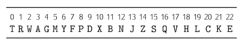

# UT2-A4: Secuenciando!

La actividad consiste en hacer varios programas Python:

## Programa 1

El programa debe cumplir con las siguientes especificaciones:

1. Leer un número de DNI por línea de comandos. (Sólo el número sin letra!)
2. La última letra del DNI puede calcularse a partir de sus números. Para ello sólo tienes que dividir el número por *23*, y quedarte con el resto. El resto es un número entre 0 y 22. La letra que corresponde a cada número la tienes en esta tabla:

3. La salida del programa debe ser el número del DNI más la letra calculada. Todo junto! Es decir, 12345678Y (por ejemplo)

> NOTA: Hacer este programa usando sólo cadenas! No se permite el uso de listas.

### Modo de uso

```console
$> python program1.py 76543789
76543789L
```

## Programa 2

El programa debe cumplir con las siguientes especificaciones:

1. Pon el siguiente código al principio de tu programa:
    ```python
    import random

    NUCLEOBASES = "ATGC"
    DNA_SIZE = 100

    sequence = "".join([random.choice(NUCLEOBASES) for i in range(DNA_SIZE)])
    ```

2. Mostrar por pantalla el número de bases de cada tipo, recorriendo la variable `sequence`. Es decir, habrá que mostrar:

- `Adenine: XX`
- `Guanine: XX`
- `Cytosine: XX`
- `Thymine: XX`

### Modo de uso

```console
$> python program2.py
Adenine: 22
Thymine: 24
Cytosine: 27
Guanine: 27
```

> NOTA: Esta salida puede variar en tu caso, ya que cada vez que se ejecuta el programa se genera una nueva secuencia aleatoria de bases de ADN.

## Programa 3

El programa debe cumplir con las siguientes especificaciones:

1. Leer un número `k` (enteros positivo) y una cadena, por línea de comandos.
2. Emitir un error si el número introducido no es positivo, y salir del programa.
3. Decir cuántas palabras tienen longitud igual a `k`.

### Modo de uso

```console
$> python program3.py 4 "esto es una cadena de prueba para probar mi programa"
Hay 2 palabras de tamaño 4
```

## Programa 4

El programa debe cumplir con las siguientes especificaciones:

1. Leer un número indeterminado de valores flotantes por línea de comandos.
2. Calcular la media de los valores de la lista.
3. Mostrar la media calculada.

### Modo de uso

```console
$> python program4.py 3.4 2.1 6.5 7.3 2.4 9.3 6.1
La media de los valores es: 5.3
```

> No se pueden utilizar funciones predefinidas como `sum`.
> PISTA: `sys.argv` es una lista.

## Información a entregar

Se deberá entregar la *url* al commit en el repositorio privado *GitHub* de la asignatura *IMW*, apuntando a la carpeta que contiene los ficheros de código Python. La *url* debe tener la siguiente estructura:

```
https://github.com/<usuario>/imw/blob/<id del commit>/<ut>/<actividad>/
```

> ⚠️ Al subir la *url*, es importante crear un enlace. Es decir, poner un `href` a la *url* anterior, y no pegar el texto tal cual.
