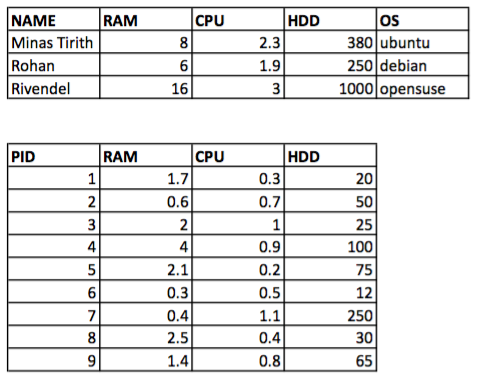

# UT2-A7: Hecho con clase!

La actividad consiste en hacer un programa *python* para gestionar nuestras máquinas virtuales.

En el programa habrá que diseñar una clase `VirtualMachine` con las siguientes características:

+ Atributos
    * `name` (nombre de la máquina)
    * `ram` (expresado en *Gb*)
    * `cpu` (expresado en *Ghz*)
    * `hdd` (expresado en *Gb*)
    * `os`
    * `status`
        - 0: parada.
        - 1: activa.
        - 2: suspendida.
    * `proc` es una lista de diccionarios, donde cada diccionario tendrá los siguientes campos:
        - `pid`: identificador del proceso.
        - `ram`: cantidad de memoria RAM que usa del proceso.
        - `cpu`: cantidad de CPU que usa el proceso.
        - `hdd`: cantidad de HDD que usa el proceso.

+ Métodos
    * Constructor. `def __init__(self, name, ram=1, cpu=1.3, hdd=100, os="debian"):`
        - Guardar los parámetros como atributos del objeto.
        - Fijar el estado a parado.
        - Inicializar la lista de procesos a vacío.
    * Parar la máquina. `def stop(self):`
        - Debe cambiar el estado de la máquina.
        - Inicializar la lista de procesos a vacío.
    * Arrancar la máquina. `def start(self):`
        - Debe cambiar el estado de la máquina.
    * Suspender la máquina. `def suspend(self):`
        - Debe cambiar el estado de la máquina.
    * Reinicar la máquina. `def reboot(self):`
        - Llamada al método de parar la máquina.
        - Llamada al método de arrancar la máquina.
    * Lanzar un proceso. `def run(self, pid, ram, cpu, hdd)`
        - Mostrar mensaje para indicar que se está ejecutando el proceso con el `pid` pasado por argumentos.
        - Insertar un nuevo diccionario en la lista `proc` con los datos del nuevo proceso.
    * Porcentaje de uso de RAM. `def ram_usage(self):`
        - Recorrer la lista de procesos, y sumar la RAM usada.
        - Regla de 3 para sacar el porcentaje sobre la RAM total de la máquina.
        - Debe tener `return`.
    * Porcentaje de uso de CPU. `def cpu_usage(self):`
        - Recorrer la lista de procesos, y sumar la CPU usada.
        - Regla de 3 para sacar el porcentaje sobre la CPU total de la máquina.
        - Debe tener `return`.
    * Porcentaje de uso de HDD. `def hdd_usage(self):`
        - Recorrer la lista de procesos, y sumar la HDD usada.
        - Regla de 3 para sacar el porcentaje sobre la HDD total de la máquina.
        - Debe tener `return`.
    * Representación. `def __str__(self):`
        - Debe tener la forma:  
        `debian <name> [running|stopped|suspended]`  
        `5% RAM used | 10% CPU used | 25% HDD used`

## Probando nuestra clase

### Minas Tirith

1. Crear la máquina virtual "Minas Tirith". Imprimir máquina.
2. Arrancar la máquina. Imprimir máquina.
3. Lanzar procesos 1, 4 y 7. Imprimir máquina.
4. Parar la máquina. Imprimir máquina.

### Rohan

1. Crear la máquina virtual "Rohan". Imprimir máquina.
2. Arrancar la máquina. Imprimir máquina.
3. Lanzar procesos 2, 5 y 8. Imprimir máquina.
4. Parar la máquina. Imprimir máquina.

### Rivendel

1. Crear la máquina virtual "Rivendel". Imprimir máquina.
2. Arrancar la máquina. Imprimir máquina.
3. Lanzar procesos 3, 6 y 9. Imprimir máquina.
4. Parar la máquina. Imprimir máquina.

## Ficheros a entregar

Se deberán subir 2 ficheros:

1. `<fichero>.py` con el código de tu programa.
2. `<fichero>.pdf` con el código fuente de tus programas.
