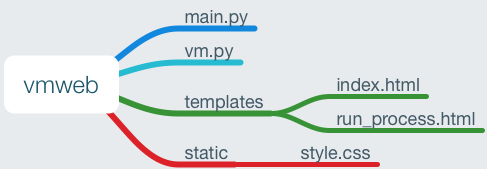
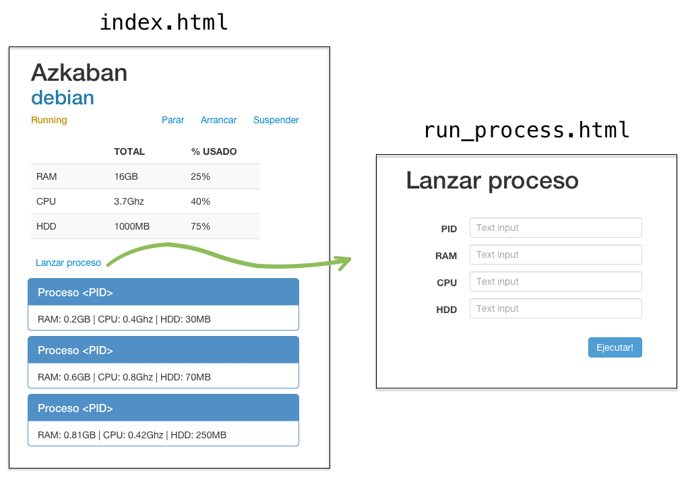

# UT2-A8: Gestionando mi máquina virtual vía web

La actividad consiste en hacer una web con Python para gestionar una máquina virtual.

## Entorno virtual

Crear un entorno virtual con Python que llamaremos `vmweb`.

## Ficheros necesarios



### `main.py`

```python
from flask import Flask
from flask import render_template
from flask import redirect
from flask import request
from vm import VirtualMachine

app = Flask(__name__)
vmachine = VirtualMachine("Azkaban", 16, 3.7, 1000, "debian")


@app.route("/")
def index():
    return render_template("index.html", vmachine=vmachine)


@app.route("/change_status/<new_status>")
def change_status(new_status):
    ...
    return redirect("/")


@app.route("/run_process", methods=["GET", "POST"])
def run_process():
    if request.method == "POST":
        ...
        return redirect("/")
    else:
        return render_template("run_process.html")


if __name__ == "__main__":
    app.run(debug=True)
```

### `vm.py`

Se proporciona el fichero [vm.py](vm.py)

## Wireframes



## Hojas de estilo

Recordar que podemos incorporar código `css` en nuestras plantillas utilizando la siguiente instrucción:

```html
<html>
    <head>
        <title>...</title>
        <link rel="stylesheet" type="text/css" href="/static/style.css"/>
    </head>
    <body>
        ...
    </body>
</html>
```

## Despliegue

Se deberá desplegar la aplicación en el servidor de producción, y deberá estar accesible a través de la url `http://vm.aluXXXX.me`

> NOTA:
> Debido a que estamos utilizando una variable global en nuestro código `vmachine`, para que la aplicación funcione bien en producción, debemos utilizar un único proceso. Por lo tanto, en el fichero `uwsgi.ini` tenemos que especificar `processes=1`.

## Información a entregar

Se deberá entregar la *url* al commit en el repositorio privado *GitHub* de la asignatura *IMW*, apuntando a la carpeta que contiene los [ficheros a entregar](#ficheros-a-entregar). La *url* debe tener la siguiente estructura:

```
https://github.com/<usuario>/imw/blob/<id del commit>/<ut>/<actividad>/
```

> ⚠️ Al subir la *url*, es importante crear un enlace. Es decir, poner un `href` a la *url* anterior, y no pegar el texto tal cual.

## Ficheros a entregar

La carpeta deberá contener, al menos, los siguientes ficheros:

- `main.py`
- `vm.py`
- `index.html`
- `run_process.html`
- `style.css`
- `uwsgi.ini`
- `run.sh`
- `nginx.conf`
- `supervisor.conf`

