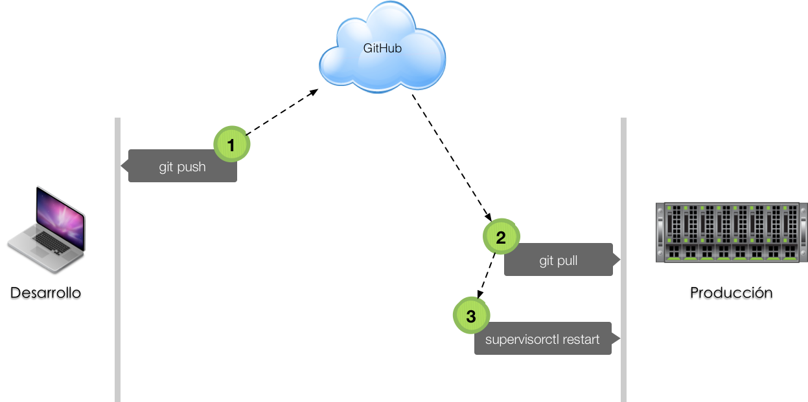

# Despliegue

El **despliegue** es el mecanismo que permite pasar un proyecto de software, desde la *máquina de desarrollo* al *servidor de producción*:

 

## Fabric

Fabric es una librería Python para automatizar tareas a través de SSH para el despliegue de aplicaciones ó para tareas de administración.

### Instalación

En la máquina de desarrollo haremos lo siguiente:

```console
(myweb) sdelquin@imw:~/myweb$ pip install fabric3
Collecting fabric3
  Using cached Fabric3-1.13.1.post1-py3-none-any.whl
Collecting paramiko<3.0,>=2.0 (from fabric3)
  Using cached paramiko-2.4.0-py2.py3-none-any.whl
Collecting six>=1.10.0 (from fabric3)
  Using cached six-1.11.0-py2.py3-none-any.whl
Collecting pyasn1>=0.1.7 (from paramiko<3.0,>=2.0->fabric3)
  Using cached pyasn1-0.4.2-py2.py3-none-any.whl
Collecting bcrypt>=3.1.3 (from paramiko<3.0,>=2.0->fabric3)
  Using cached bcrypt-3.1.4-cp36-cp36m-manylinux1_x86_64.whl
Collecting cryptography>=1.5 (from paramiko<3.0,>=2.0->fabric3)
  Using cached cryptography-2.1.3-cp36-cp36m-manylinux1_x86_64.whl
Collecting pynacl>=1.0.1 (from paramiko<3.0,>=2.0->fabric3)
  Using cached PyNaCl-1.2.0-cp36-cp36m-manylinux1_x86_64.whl
Collecting cffi>=1.1 (from bcrypt>=3.1.3->paramiko<3.0,>=2.0->fabric3)
  Using cached cffi-1.11.2-cp36-cp36m-manylinux1_x86_64.whl
Collecting idna>=2.1 (from cryptography>=1.5->paramiko<3.0,>=2.0->fabric3)
  Using cached idna-2.6-py2.py3-none-any.whl
Collecting asn1crypto>=0.21.0 (from cryptography>=1.5->paramiko<3.0,>=2.0->fabric3)
  Using cached asn1crypto-0.23.0-py2.py3-none-any.whl
Collecting pycparser (from cffi>=1.1->bcrypt>=3.1.3->paramiko<3.0,>=2.0->fabric3)
Installing collected packages: pyasn1, six, pycparser, cffi, bcrypt, idna, asn1crypto, cryptography, pynacl, paramiko, fabric3
Successfully installed asn1crypto-0.23.0 bcrypt-3.1.4 cffi-1.11.2 cryptography-2.1.3 fabric3-1.13.1.post1 idna-2.6 paramiko-2.4.0 pyasn1-0.4.2 pycparser-2.18 pynacl-1.2.0 six-1.11.0
(myweb) sdelquin@imw:~/myweb$
```

### Fichero de despliegue

Vamos a suponer que en la máquina de producción, tenemos el proyecto en `~/myweb`, que ya se ha creado un entorno virtual con las dependencias necesarias y que tenemos una tarea funcionando en `supervisor`.

Dentro de nuestro proyecto, crearemos un fichero denominado `fabfile.py` que contendrá las tareas a realizar por Fabric:

```console
(myweb) sdelquin@imw:~/myweb$ vi fabfile.py
```

> Contenido:
```python
from fabric.api import env, cd, local, run

# nombre de la máquina de producción
env.hosts = ["cloud"]
# env.user
# env.password


def deploy():
    local("git push")
    with cd("~/myweb"):
        run("git pull")
        run("supervisorctl restart myweb")
```

Ahora, para desplegar nuestra aplicación, sólo tendríamos que hacer lo siguiente desde la máquina de desarrollo:

```console
(myweb) sdelquin@imw:~/myweb$ fab deploy
```
