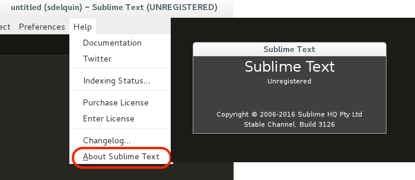
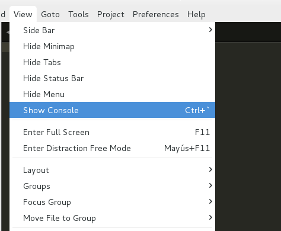
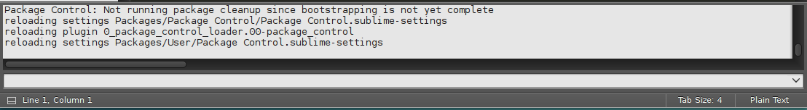
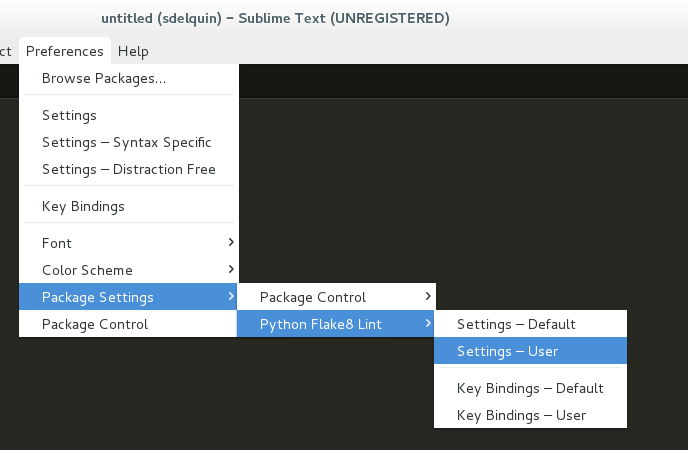

# Preparación del entorno de desarrollo

Cuando programamos, lo hacemos desde la *máquina de desarrollo*. Es ahí donde se codifica y se prueba nuestro software, que posteriormente, pasará a la *máquina de producción*, en un proceso conocido como *despliegue*.

## Instalando Python

### Incluyendo el repositorio para Python 3.6

Necesitamos instalar un paquete previo que nos permita usar la herramienta `add-apt-repository`:

```console
sdelquin@imw:~$ sudo apt install software-properties-common
Leyendo lista de paquetes... Hecho
Preparando para desempaquetar .../xz-utils_5.1.1alpha+20120614-2ubuntu2_amd64.deb ...
Desempaquetando xz-utils (5.1.1alpha+20120614-2ubuntu2) ...
Seleccionando el paquete unattended-upgrades previamente no seleccionado.
Preparando para desempaquetar .../unattended-upgrades_0.90ubuntu0.8_all.deb ...
Desempaquetando unattended-upgrades (0.90ubuntu0.8) ...
Procesando disparadores para dbus (1.10.6-1ubuntu3.3) ...
Procesando disparadores para man-db (2.7.5-1) ...
Procesando disparadores para systemd (229-4ubuntu19) ...
Procesando disparadores para ureadahead (0.100.0-19) ...
Configurando python3-pycurl (7.43.0-1ubuntu1) ...
Configurando python3-software-properties (0.96.20.7) ...
Configurando software-properties-common (0.96.20.7) ...
Configurando xz-utils (5.1.1alpha+20120614-2ubuntu2) ...
update-alternatives: utilizando /usr/bin/xz para proveer /usr/bin/lzma (lzma) en modo automático
Configurando unattended-upgrades (0.90ubuntu0.8) ...

Creating config file /etc/apt/apt.conf.d/50unattended-upgrades with new version
Synchronizing state of unattended-upgrades.service with SysV init with /lib/systemd/systemd-sysv-install...
Executing /lib/systemd/systemd-sysv-install enable unattended-upgrades
Procesando disparadores para dbus (1.10.6-1ubuntu3.3) ...
Procesando disparadores para systemd (229-4ubuntu19) ...
Procesando disparadores para ureadahead (0.100.0-19) ...
sdelquin@imw:~$
```

Ahora añadimos el repositorio que nos dará acceso a instalar Python 3.6:

```console
sdelquin@imw:~$ sudo add-apt-repository ppa:jonathonf/python-3.6
 A plain backport of *just* Python 3.6. System extensions/Python libraries may or may not work.

Don't remove Python 3.5 from your system - it will break.
 Más información: https://launchpad.net/~jonathonf/+archive/ubuntu/python-3.6
Pulse [Intro] para continuar o ctrl-c para cancelar

gpg: anillo «/tmp/tmpmxdxvhia/secring.gpg» creado
gpg: anillo «/tmp/tmpmxdxvhia/pubring.gpg» creado
gpg: solicitando clave F06FC659 de hkp servidor keyserver.ubuntu.com
gpg: /tmp/tmpmxdxvhia/trustdb.gpg: se ha creado base de datos de confianza
gpg: clave F06FC659: clave pública "Launchpad PPA for J Fernyhough" importada
gpg: Cantidad total procesada: 1
gpg:               importadas: 1  (RSA: 1)
OK
sdelquin@imw:~$
```

A continuación actualizamos la lista de paquetes:

```console
sdelquin@imw:~$ sudo apt update
Obj:1 http://security.ubuntu.com/ubuntu xenial-security InRelease
Des:2 http://ppa.launchpad.net/jonathonf/python-3.6/ubuntu xenial InRelease [18,0 kB]
Obj:3 http://es.archive.ubuntu.com/ubuntu xenial InRelease
Des:4 http://ppa.launchpad.net/jonathonf/python-3.6/ubuntu xenial/main amd64 Packages [4.492 B]
Des:5 http://es.archive.ubuntu.com/ubuntu xenial-updates InRelease [102 kB]
Des:6 http://ppa.launchpad.net/jonathonf/python-3.6/ubuntu xenial/main i386 Packages [4.492 B]
Des:7 http://ppa.launchpad.net/jonathonf/python-3.6/ubuntu xenial/main Translation-en [2.028 B]
Des:8 http://es.archive.ubuntu.com/ubuntu xenial-backports InRelease [102 kB]
Des:9 http://es.archive.ubuntu.com/ubuntu xenial-updates/main amd64 Packages [642 kB]
Des:10 http://es.archive.ubuntu.com/ubuntu xenial-updates/main i386 Packages [610 kB]
Des:11 http://es.archive.ubuntu.com/ubuntu xenial-updates/universe amd64 Packages [540 kB]
Des:12 http://es.archive.ubuntu.com/ubuntu xenial-updates/universe i386 Packages [516 kB]
Descargados 2.541 kB en 1s (1.313 kB/s)
Leyendo lista de paquetes... Hecho
Creando árbol de dependencias
Leyendo la información de estado... Hecho
Se pueden actualizar 27 paquetes. Ejecute «apt list --upgradable» para verlos.
sdelquin@imw:~$
```

### Instalación del lenguaje, librerías e intérprete

```console
sdelquin@imw:~$ sudo apt install -y python3.6
Des:4 http://ppa.launchpad.net/jonathonf/python-3.6/ubuntu xenial/main amd64 python3.6 amd64 3.6.3-1ubuntu1~16.04.york1 [217 kB]
Descargados 4.361 kB en 2s (1.527 kB/s)
Seleccionando el paquete libpython3.6-minimal:amd64 previamente no seleccionado.
(Leyendo la base de datos ... 57801 ficheros o directorios instalados actualmente.)
Preparando para desempaquetar .../libpython3.6-minimal_3.6.3-1ubuntu1~16.04.york1_amd64.deb ...
Desempaquetando libpython3.6-minimal:amd64 (3.6.3-1ubuntu1~16.04.york1) ...
Seleccionando el paquete python3.6-minimal previamente no seleccionado.
Preparando para desempaquetar .../python3.6-minimal_3.6.3-1ubuntu1~16.04.york1_amd64.deb ...
Desempaquetando python3.6-minimal (3.6.3-1ubuntu1~16.04.york1) ...
Seleccionando el paquete libpython3.6-stdlib:amd64 previamente no seleccionado.
Preparando para desempaquetar .../libpython3.6-stdlib_3.6.3-1ubuntu1~16.04.york1_amd64.deb ...
Desempaquetando libpython3.6-stdlib:amd64 (3.6.3-1ubuntu1~16.04.york1) ...
Seleccionando el paquete python3.6 previamente no seleccionado.
Preparando para desempaquetar .../python3.6_3.6.3-1ubuntu1~16.04.york1_amd64.deb ...
Desempaquetando python3.6 (3.6.3-1ubuntu1~16.04.york1) ...
Procesando disparadores para man-db (2.7.5-1) ...
Procesando disparadores para mime-support (3.59ubuntu1) ...
Configurando libpython3.6-minimal:amd64 (3.6.3-1ubuntu1~16.04.york1) ...
Configurando python3.6-minimal (3.6.3-1ubuntu1~16.04.york1) ...
Configurando libpython3.6-stdlib:amd64 (3.6.3-1ubuntu1~16.04.york1) ...
Configurando python3.6 (3.6.3-1ubuntu1~16.04.york1) ...
sdelquin@imw:~$
```

Podemos comprobar ahora la instalación de Python 3.6:

```console
sdelquin@imw:~$ python3.6
Python 3.6.3 (default, Oct  6 2017, 08:44:35)
[GCC 5.4.0 20160609] on linux
Type "help", "copyright", "credits" or "license" for more information.
>>>
sdelquin@imw:~$
```

## Fijando Python 3.6 por defecto

```console
sdelquin@imw:~$ echo 'alias python=python3.6' >> .bashrc
sdelquin@imw:~$ tail -1 .bashrc
alias python=python3.6
sdelquin@imw:~$ source .bashrc
sdelquin@imw:~$ python
Python 3.6.3 (default, Oct  6 2017, 08:44:35)
[GCC 5.4.0 20160609] on linux
Type "help", "copyright", "credits" or "license" for more information.
>>> exit()
sdelquin@imw:~$
```

## Librerías de desarrollo para Python

```console
sdelquin@imw:~$ sudo apt install -y python3.6-dev
Leyendo lista de paquetes... Hecho
Creando árbol de dependencias
Leyendo la información de estado... Hecho
Preparando para desempaquetar .../libpython3.6_3.6.3-1ubuntu1~16.04.york1_amd64.deb ...
Desempaquetando libpython3.6:amd64 (3.6.3-1ubuntu1~16.04.york1) ...
Seleccionando el paquete libpython3.6-dev:amd64 previamente no seleccionado.
Preparando para desempaquetar .../libpython3.6-dev_3.6.3-1ubuntu1~16.04.york1_amd64.deb ...
Desempaquetando libpython3.6-dev:amd64 (3.6.3-1ubuntu1~16.04.york1) ...
Seleccionando el paquete manpages-dev previamente no seleccionado.
Preparando para desempaquetar .../manpages-dev_4.04-2_all.deb ...
Desempaquetando manpages-dev (4.04-2) ...
Seleccionando el paquete python3.6-dev previamente no seleccionado.
Preparando para desempaquetar .../python3.6-dev_3.6.3-1ubuntu1~16.04.york1_amd64.deb ...
Desempaquetando python3.6-dev (3.6.3-1ubuntu1~16.04.york1) ...
Procesando disparadores para man-db (2.7.5-1) ...
Procesando disparadores para libc-bin (2.23-0ubuntu9) ...
Configurando libc-dev-bin (2.23-0ubuntu9) ...
Configurando linux-libc-dev:amd64 (4.4.0-97.120) ...
Configurando libc6-dev:amd64 (2.23-0ubuntu9) ...
Configurando libexpat1-dev:amd64 (2.1.0-7ubuntu0.16.04.3) ...
Configurando libpython3.6:amd64 (3.6.3-1ubuntu1~16.04.york1) ...
Configurando libpython3.6-dev:amd64 (3.6.3-1ubuntu1~16.04.york1) ...
Configurando manpages-dev (4.04-2) ...
Configurando python3.6-dev (3.6.3-1ubuntu1~16.04.york1) ...
Procesando disparadores para libc-bin (2.23-0ubuntu9) ...
sdelquin@imw:~$
```

Para la compilación de muchos paquetes, también necesitaremos un compilador de *C*:

```console
sdelquin@imw:~$ sudo apt install -y gcc
Leyendo lista de paquetes... Hecho
Creando árbol de dependencias
Leyendo la información de estado... Hecho
Se instalarán los siguientes paquetes adicionales:
  binutils cpp cpp-5 gcc-5 gcc-5-base libasan2 libatomic1 libcc1-0 libcilkrts5 libgcc-5-dev libgomp1
  libisl15 libitm1 liblsan0 libmpc3 libmpfr4 libmpx0 libquadmath0 libstdc++6 libtsan0 libubsan0
Paquetes sugeridos:
  binutils-doc cpp-doc gcc-5-locales gcc-multilib make autoconf automake libtool flex bison gdb gcc-doc
  gcc-5-multilib gcc-5-doc libgcc1-dbg libgomp1-dbg libitm1-dbg libatomic1-dbg libasan2-dbg liblsan0-dbg
  libtsan0-dbg libubsan0-dbg libcilkrts5-dbg libmpx0-dbg libquadmath0-dbg
Se instalarán los siguientes paquetes NUEVOS:
  binutils cpp cpp-5 gcc gcc-5 libasan2 libatomic1 libcc1-0 libcilkrts5 libgcc-5-dev libgomp1 libisl15
  libitm1 liblsan0 libmpc3 libmpfr4 libmpx0 libquadmath0 libtsan0 libubsan0
Se actualizarán los siguientes paquetes:
  gcc-5-base libstdc++6
2 actualizados, 20 nuevos se instalarán, 0 para eliminar y 25 no actualizados.
Se necesita descargar 23,2 MB de archivos.
Se utilizarán 78,5 MB de espacio de disco adicional después de esta operación.
Des:1 http://es.archive.ubuntu.com/ubuntu xenial/main amd64 libmpfr4 amd64 3.1.4-1 [191 kB]
Des:2 http://es.archive.ubuntu.com/ubuntu xenial/main amd64 libmpc3 amd64 1.0.3-1 [39,7 kB]
Des:3 http://es.archive.ubuntu.com/ubuntu xenial-updates/main amd64 gcc-5-base amd64 5.4.0-6ubuntu1~16.04.5 [17,1 kB]
Des:4 http://es.archive.ubuntu.com/ubuntu xenial-updates/main amd64 libstdc++6 amd64 5.4.0-6ubuntu1~16.04.5 [393 kB]
Des:5 http://es.archive.ubuntu.com/ubuntu xenial-updates/main amd64 binutils amd64 2.26.1-1ubuntu1~16.04.5 [2.311 kB]
Des:6 http://es.archive.ubuntu.com/ubuntu xenial/main amd64 libisl15 amd64 0.16.1-1 [524 kB]
Des:7 http://es.archive.ubuntu.com/ubuntu xenial-updates/main amd64 cpp-5 amd64 5.4.0-6ubuntu1~16.04.5 [7.786 kB]
Des:8 http://es.archive.ubuntu.com/ubuntu xenial/main amd64 cpp amd64 4:5.3.1-1ubuntu1 [27,7 kB]
Des:9 http://es.archive.ubuntu.com/ubuntu xenial-updates/main amd64 libcc1-0 amd64 5.4.0-6ubuntu1~16.04.5 [38,8 kB]
Des:10 http://es.archive.ubuntu.com/ubuntu xenial-updates/main amd64 libgomp1 amd64 5.4.0-6ubuntu1~16.04.5 [55,1 kB]
Des:11 http://es.archive.ubuntu.com/ubuntu xenial-updates/main amd64 libitm1 amd64 5.4.0-6ubuntu1~16.04.5 [27,Procesando disparadores para man-db (2.7.5-1) ...
Configurando libmpfr4:amd64 (3.1.4-1) ...
Configurando libmpc3:amd64 (1.0.3-1) ...
Configurando binutils (2.26.1-1ubuntu1~16.04.5) ...
Configurando libisl15:amd64 (0.16.1-1) ...
Configurando cpp-5 (5.4.0-6ubuntu1~16.04.5) ...
Configurando cpp (4:5.3.1-1ubuntu1) ...
Configurando libcc1-0:amd64 (5.4.0-6ubuntu1~16.04.5) ...
Configurando libgomp1:amd64 (5.4.0-6ubuntu1~16.04.5) ...
Configurando libitm1:amd64 (5.4.0-6ubuntu1~16.04.5) ...
Configurando libatomic1:amd64 (5.4.0-6ubuntu1~16.04.5) ...
Configurando libasan2:amd64 (5.4.0-6ubuntu1~16.04.5) ...
Configurando liblsan0:amd64 (5.4.0-6ubuntu1~16.04.5) ...
Configurando libtsan0:amd64 (5.4.0-6ubuntu1~16.04.5) ...
Configurando libubsan0:amd64 (5.4.0-6ubuntu1~16.04.5) ...
Configurando libcilkrts5:amd64 (5.4.0-6ubuntu1~16.04.5) ...
Configurando libmpx0:amd64 (5.4.0-6ubuntu1~16.04.5) ...
Configurando libquadmath0:amd64 (5.4.0-6ubuntu1~16.04.5) ...
Configurando libgcc-5-dev:amd64 (5.4.0-6ubuntu1~16.04.5) ...
Configurando gcc-5 (5.4.0-6ubuntu1~16.04.5) ...
Configurando gcc (4:5.3.1-1ubuntu1) ...
Procesando disparadores para libc-bin (2.23-0ubuntu9) ...
sdelquin@imw:~$
```

### Gestión de paquetes para Python

Necesitamos instalar el paquete `curl` para poder descargar ficheros de Internet:

```console
sdelquin@imw:~$ sudo apt install -y curl
Se instalarán los siguientes paquetes NUEVOS:
  curl
Se actualizarán los siguientes paquetes:
  libcurl3-gnutls
1 actualizados, 1 nuevos se instalarán, 0 para eliminar y 24 no actualizados.
Se necesita descargar 323 kB de archivos.
Se utilizarán 338 kB de espacio de disco adicional después de esta operación.
Des:1 http://es.archive.ubuntu.com/ubuntu xenial-updates/main amd64 libcurl3-gnutls amd64 7.47.0-1ubuntu2.3 [185 kB]
Des:2 http://es.archive.ubuntu.com/ubuntu xenial-updates/main amd64 curl amd64 7.47.0-1ubuntu2.3 [138 kB]
Descargados 323 kB en 0s (729 kB/s)
(Leyendo la base de datos ... 62698 ficheros o directorios instalados actualmente.)
Preparando para desempaquetar .../libcurl3-gnutls_7.47.0-1ubuntu2.3_amd64.deb ...
Desempaquetando libcurl3-gnutls:amd64 (7.47.0-1ubuntu2.3) sobre (7.47.0-1ubuntu2.2) ...
Seleccionando el paquete curl previamente no seleccionado.
Preparando para desempaquetar .../curl_7.47.0-1ubuntu2.3_amd64.deb ...
Desempaquetando curl (7.47.0-1ubuntu2.3) ...
Procesando disparadores para libc-bin (2.23-0ubuntu9) ...
Procesando disparadores para man-db (2.7.5-1) ...
Configurando libcurl3-gnutls:amd64 (7.47.0-1ubuntu2.3) ...
Configurando curl (7.47.0-1ubuntu2.3) ...
Procesando disparadores para libc-bin (2.23-0ubuntu9) ...
sdelquin@imw:~$
```

Ahora descargamos el fichero de instalación de `pip` y lo ejecutamos:

```console
sdelquin@imw:~$ curl -O https://bootstrap.pypa.io/get-pip.py
  % Total    % Received % Xferd  Average Speed   Time    Time     Time  Current
                                 Dload  Upload   Total   Spent    Left  Speed
100 1558k  100 1558k    0     0  1525k      0  0:00:01  0:00:01 --:--:-- 1527k
sdelquin@imw:~$ sudo -H python3.6 get-pip.py
Collecting pip
  Downloading pip-9.0.1-py2.py3-none-any.whl (1.3MB)
    100% |████████████████████████████████| 1.3MB 739kB/s
Collecting setuptools
  Downloading setuptools-36.6.0-py2.py3-none-any.whl (481kB)
    100% |████████████████████████████████| 481kB 2.4MB/s
Collecting wheel
  Downloading wheel-0.30.0-py2.py3-none-any.whl (49kB)
    100% |████████████████████████████████| 51kB 5.0MB/s
Installing collected packages: pip, setuptools, wheel
Successfully installed pip-9.0.1 setuptools-36.6.0 wheel-0.30.0
sdelquin@imw:~$
```

## Entornos virtuales

La forma más extendida de trabajar con aplicaciones Python es usar entornos virtuales (*virtualenvs*). Se trata de un mecanismo para aislar las librerías y crear un ambiente de trabajo independiente.

Primero instalamos el gestor de entornos virtuales:

```console
sdelquin@imw:~$ sudo -H pip install virtualenv
Collecting virtualenv
  Downloading virtualenv-15.1.0-py2.py3-none-any.whl (1.8MB)
    100% |████████████████████████████████| 1.8MB 784kB/s
Installing collected packages: virtualenv
Successfully installed virtualenv-15.1.0
sdelquin@imw:~$
```

### Mejorando los entornos virtuales

Existe una paquete Python denominado `virtualenvwrapper`, que en realidad es un conjunto de herramientas para gestionar nuestros entornos virtuales, de una manera mucho más sencilla y funcional:

```console
sdelquin@imw:~$ sudo -H pip install virtualenvwrapper
Collecting virtualenvwrapper
  Downloading virtualenvwrapper-4.8.2-py2.py3-none-any.whl
Requirement already satisfied: virtualenv in /usr/local/lib/python3.6/dist-packages (from virtualenvwrapper)
Collecting virtualenv-clone (from virtualenvwrapper)
  Downloading virtualenv-clone-0.2.6.tar.gz
Collecting stevedore (from virtualenvwrapper)
  Downloading stevedore-1.27.1-py2.py3-none-any.whl
Requirement already satisfied: six>=1.9.0 in /usr/lib/python3/dist-packages (from stevedore->virtualenvwrapper)
Collecting pbr!=2.1.0,>=2.0.0 (from stevedore->virtualenvwrapper)
  Downloading pbr-3.1.1-py2.py3-none-any.whl (99kB)
    100% |████████████████████████████████| 102kB 2.1MB/s
Building wheels for collected packages: virtualenv-clone
  Running setup.py bdist_wheel for virtualenv-clone ... done
  Stored in directory: /root/.cache/pip/wheels/24/51/ef/93120d304d240b4b6c2066454250a1626e04f73d34417b956d
Successfully built virtualenv-clone
Installing collected packages: virtualenv-clone, pbr, stevedore, virtualenvwrapper
Successfully installed pbr-3.1.1 stevedore-1.27.1 virtualenv-clone-0.2.6 virtualenvwrapper-4.8.2
sdelquin@imw:~$
```

Vamos a hacer que nuestros entornos virtuales residan en la carpeta `~/.virtualenvs`. Para ello haremos lo siguiente:

```console
sdelquin@imw:~$ mkdir .virtualenvs
sdelquin@imw:~$ vi .bashrc
```

(añadir al final del fichero)

> Contenido
```bash
...
export WORKON_HOME=~/.virtualenvs
export VIRTUALENVWRAPPER_PYTHON=/usr/bin/python3.6
source /usr/local/bin/virtualenvwrapper.sh
```

Guardamos y salimos. A continuación ejecutamos:

```console
sdelquin@imw:~$ source .bashrc
virtualenvwrapper.user_scripts creating /home/sdelquin/.virtualenvs/premkproject
virtualenvwrapper.user_scripts creating /home/sdelquin/.virtualenvs/postmkproject
virtualenvwrapper.user_scripts creating /home/sdelquin/.virtualenvs/initialize
virtualenvwrapper.user_scripts creating /home/sdelquin/.virtualenvs/premkvirtualenv
virtualenvwrapper.user_scripts creating /home/sdelquin/.virtualenvs/postmkvirtualenv
virtualenvwrapper.user_scripts creating /home/sdelquin/.virtualenvs/prermvirtualenv
virtualenvwrapper.user_scripts creating /home/sdelquin/.virtualenvs/postrmvirtualenv
virtualenvwrapper.user_scripts creating /home/sdelquin/.virtualenvs/predeactivate
virtualenvwrapper.user_scripts creating /home/sdelquin/.virtualenvs/postdeactivate
virtualenvwrapper.user_scripts creating /home/sdelquin/.virtualenvs/preactivate
virtualenvwrapper.user_scripts creating /home/sdelquin/.virtualenvs/postactivate
virtualenvwrapper.user_scripts creating /home/sdelquin/.virtualenvs/get_env_details
sdelquin@imw:~$
```

### Creando entornos virtuales con Python

Lo primero sería crear una carpeta en la que pondremos nuestro código:

```console
sdelquin@imw:~$ mkdir test1
sdelquin@imw:~$
```

A continuación creamos el entorno virtual para este proyecto:

```console
sdelquin@imw:~$ mkvirtualenv -a test1 test1
Using base prefix '/usr'
New python executable in /home/sdelquin/.virtualenvs/test1/bin/python3.6
Also creating executable in /home/sdelquin/.virtualenvs/test1/bin/python
Installing setuptools, pip, wheel...done.
virtualenvwrapper.user_scripts creating /home/sdelquin/.virtualenvs/test1/bin/predeactivate
virtualenvwrapper.user_scripts creating /home/sdelquin/.virtualenvs/test1/bin/postdeactivate
virtualenvwrapper.user_scripts creating /home/sdelquin/.virtualenvs/test1/bin/preactivate
virtualenvwrapper.user_scripts creating /home/sdelquin/.virtualenvs/test1/bin/postactivate
virtualenvwrapper.user_scripts creating /home/sdelquin/.virtualenvs/test1/bin/get_env_details
Setting project for test1 to /home/sdelquin/test1
(test1) sdelquin@imw:~/test1$
```

Se puede comprobar que tenemos el entorno virtual activado ya que delante del prompt aparece `(test1)`.

Los siguientes comandos nos permiten activar ó desactivar el entorno virtual:

```console
(test1) sdelquin@imw:~/test1$ deactivate
sdelquin@imw:~/test1$ workon test1
(test1) sdelquin@imw:~/test1$ deactivate
sdelquin@imw:~/test1$ cd
sdelquin@imw:~$ workon test1
(test1) sdelquin@imw:~/test1$
```

> ⚠️  Cuando activamos el entorno virtual, independientemente de donde estemos situados, nos lleva al directorio de trabajo.

### Ejecutando un programa de prueba

Vamos a hacer un mini programa que calcula el cuadrado de un número:

```console
(test1) sdelquin@imw:~/test1$ vi main.py
```

> Contenido
```python
x = 4
print(x**2)
```

Guardamos, salimos, y ejecutamos:

```console
(test1) sdelquin@imw:~/test1$ python main.py
16
(test1) sdelquin@imw:~/test1$
```

## Instalación del editor de código

Existen multitud de editores de código fuente, e incluso IDEs, pero nosotros vamos a usar **Sublime Text**. Para su instalación ejecutamos lo siguiente:

```console
sdelquin@imw:~$ curl -s https://download.sublimetext.com/sublimehq-pub.gpg | sudo apt-key add -
[sudo] password for sdelquin:
OK

sdelquin@imw:~$ echo "deb https://download.sublimetext.com/ apt/stable/" | sudo tee /etc/apt/sources.list.d/sublime-text.list
deb https://download.sublimetext.com/ apt/stable/
```

Actualizamos el listado de paquetes:

```console
sdelquin@imw:~$ sudo apt update
Obj:1 http://ppa.launchpad.net/jonathonf/python-3.6/ubuntu xenial InRelease
Obj:2 http://es.archive.ubuntu.com/ubuntu xenial InRelease
Des:3 http://es.archive.ubuntu.com/ubuntu xenial-updates InRelease [102 kB]
Des:4 http://security.ubuntu.com/ubuntu xenial-security InRelease [102 kB]
Descargados 2.618 kB en 1s (2.032 kB/s)
Leyendo lista de paquetes... Hecho
Creando árbol de dependencias
Leyendo la información de estado... Hecho
Se pueden actualizar 27 paquetes. Ejecute «apt list --upgradable» para verlos.
sdelquin@imw:~$
```

Instalamos el editor:

```console
sdelquin@imw:~$ sudo apt install -y sublime-text
Leyendo lista de paquetes... Hecho
Creando árbol de dependencias
Leyendo la información de estado... Hecho
Se instalarán los siguientes paquetes NUEVOS:
  sublime-text
0 actualizados, 1 nuevos se instalarán, 0 para eliminar y 27 no actualizados.
Se necesita descargar 8.190 kB de archivos.
Se utilizarán 23,0 MB de espacio de disco adicional después de esta operación.
Des:1 https://download.sublimetext.com apt/stable/ sublime-text 3143 [8.190 kB]
Descargados 8.190 kB en 2s (3.368 kB/s)
Seleccionando el paquete sublime-text previamente no seleccionado.
(Leyendo la base de datos ... 62705 ficheros o directorios instalados actualmente.)
Preparando para desempaquetar .../sublime-text_3143_amd64.deb ...
Desempaquetando sublime-text (3143) ...
Procesando disparadores para mime-support (3.59ubuntu1) ...
Configurando sublime-text (3143) ...
sdelquin@imw:~$
```

Ya podemos usar el editor desde el menú de aplicaciones del escritorio.

### Instalación de `Package Control` para `Sublime Text`

Para ver la versión que tenemos instalada de *Sublime Text*:



Mostrar la consola de *Sublime Text*, pegar el código especificado en https://packagecontrol.io/installation (**SUBLIME TEXT 3**) y pulsar ENTER:



Después de la instalación, deberían ver algo así:



### Ajustes del editor

De cara a mejorar nuestra experiencia de usuario, debemos fijar algunos ajustes en Sublime Text. Para ello debemos ir a <kbd>Preferences -> Settings</kbd>, y luego en la **VENTANA DE LA DERECHA** debemos sustituir lo que hay por lo siguiente:

```python
{
    "color_scheme": "Packages/User/Monokai (Flake8Lint).tmTheme",
    "ignored_packages":
    [
        "Vintage"
    ],
    "scroll_past_end": true,
    "show_encoding": true,
    "show_full_path": true,
    "tab_size": 4,
    "translate_tabs_to_spaces": true,
    "highlight_line": true,
    "ensure_newline_at_eof_on_save": true,
}
```

A continuación guardamos los cambios con <kbd>CONTROL-S</kbd>

### Instalación del *linter* para *Python*

En *Python* disponemos de una *guía de estilo*, que especifica cómo se debe escribir código fuente. Esta guía está definida en el [PEP8](http://www.recursospython.com/pep8es.pdf).

Para que nos sea más fácil la escritura de nuestro código *Python*, existe un paquete en *Sublime Text* que ya nos hace ese trabajo. Se denomina `Python Flake8 Lint`.

Pulsar `Mayús+Ctrl+P` para abrir el *Package Control*. Escribir `Package Control: Install Package`. A continuación buscar el siguiente paquete e instalarlo:

> Python Flake8 Lint

Este paquete permite chequear nuestro código *python* cada vez que guardemos (`CTRL-S`) y mostrar avisos para mejorar aquellas cuestiones sintácticas que no son correctas.

#### Ignorar ciertos errores de Flake8

Existen ciertos errores del módulo `Flake8` que no nos interesa que nos salgan, porque no son especialmente importantes.

Para deshabilitarlos, lo que tenemos que hacer es acceder a los ajustes del paquete `Python Flake8 Lint` de la siguiente manera:



Y a continuación escribir el siguiente código:

```json
{
  "ignore": ["D100", "D101", "D102", "D103", "D105"],
}
```

Luego guardamos el fichero, y ya no tenemos que preocuparnos por los errores con los códigos que hemos especificado.

### Uso de Sublime Text desde línea de comandos

Sublime Text se puede usar desde línea de comandos, lo que nos facilita navegar por el sistema de archivos usando la terminal, y luego abrir el fichero que nos interese. Para ello sólo tenemos que hacer uso del comando `subl`:

```console
sdelquin@imw:~/python$ subl main.py
...
```
