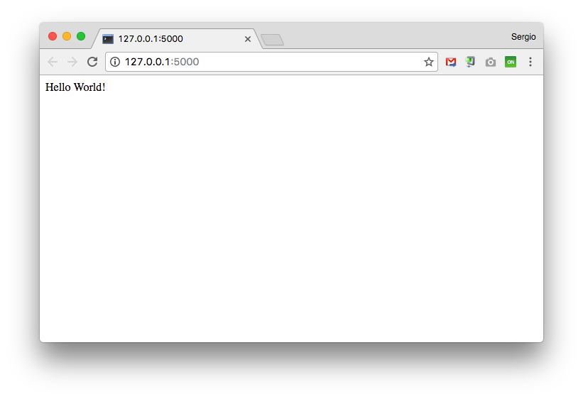

# Flask

[Flask](http://flask.pocoo.org/) es una librería de *python*, que se define como un *microframework* para el desarrollo de aplicaciones web.

## Instalación

Primero, como siempre, creamos un nuevo *entorno virtual*:

```console
sdelquin@imw:~$ mkvirtualenv myweb
Using base prefix '/usr'
New python executable in /home/sdelquin/.virtualenvs/myweb/bin/python3.6
Also creating executable in /home/sdelquin/.virtualenvs/myweb/bin/python
Installing setuptools, pip, wheel...done.
virtualenvwrapper.user_scripts creating /home/sdelquin/.virtualenvs/myweb/bin/predeactivate
virtualenvwrapper.user_scripts creating /home/sdelquin/.virtualenvs/myweb/bin/postdeactivate
virtualenvwrapper.user_scripts creating /home/sdelquin/.virtualenvs/myweb/bin/preactivate
virtualenvwrapper.user_scripts creating /home/sdelquin/.virtualenvs/myweb/bin/postactivate
virtualenvwrapper.user_scripts creating /home/sdelquin/.virtualenvs/myweb/bin/get_env_details
(myweb) sdelquin@imw:~$
```

Ahora instalamos la librería:

```console
(myweb) sdelquin@imw:~$ pip install flask
Collecting flask
  Downloading Flask-0.12.2-py2.py3-none-any.whl (83kB)
    100% |████████████████████████████████| 92kB 1.2MB/s
Collecting Werkzeug>=0.7 (from flask)
  Downloading Werkzeug-0.12.2-py2.py3-none-any.whl (312kB)
    100% |████████████████████████████████| 317kB 2.4MB/s
Collecting itsdangerous>=0.21 (from flask)
  Downloading itsdangerous-0.24.tar.gz (46kB)
    100% |████████████████████████████████| 51kB 4.0MB/s
Collecting click>=2.0 (from flask)
  Downloading click-6.7-py2.py3-none-any.whl (71kB)
    100% |████████████████████████████████| 71kB 3.5MB/s
Collecting Jinja2>=2.4 (from flask)
  Downloading Jinja2-2.10-py2.py3-none-any.whl (126kB)
    100% |████████████████████████████████| 133kB 3.0MB/s
Collecting MarkupSafe>=0.23 (from Jinja2>=2.4->flask)
Building wheels for collected packages: itsdangerous
  Running setup.py bdist_wheel for itsdangerous ... done
  Stored in directory: /home/sdelquin/.cache/pip/wheels/fc/a8/66/24d655233c757e178d45dea2de22a04c6d92766abfb741129a
Successfully built itsdangerous
Installing collected packages: Werkzeug, itsdangerous, click, MarkupSafe, Jinja2, flask
Successfully installed Jinja2-2.10 MarkupSafe-1.0 Werkzeug-0.12.2 click-6.7 flask-0.12.2 itsdangerous-0.24
(myweb) sdelquin@imw:~$
```

## Primera aplicación *Flask*

```console
(myweb) sdelquin@imw:~$ mkdir myweb
(myweb) sdelquin@imw:~$ cd myweb/
(myweb) sdelquin@imw:~/myweb$ vi main.py
```

> Contenido:
> ```python
> from flask import Flask
> 
> app = Flask(__name__)
> 
> @app.route("/")
> def hello():
>     return "Hello World!"
> 
> if __name__ == "__main__":
>     app.run(debug=True)
> ```

Lanzamos nuestra aplicación:

```console
(myweb) sdelquin@imw:~/myweb$ python main.py
 * Running on http://127.0.0.1:5000/ (Press CTRL+C to quit)
 * Restarting with stat
 * Debugger is active!
 * Debugger PIN: 336-454-291
```

Si ahora accedemos en el navegador a la dirección que nos indica `http://127.0.0.1:5000/`



## Mejorando las URLs

El [enrutamiento](http://flask.pocoo.org/docs/0.12/quickstart/#url-building) es el mecanismo que nos permite vincular *URLs* con funciones *python*.

```python
@app.route("/")
def index():
    return "Index Page"

@app.route("/hello")
def hello():
    return "Hello, World"

@app.route("/user/<username>")
def show_user_profile(username):
    return "User {}".format(username)

@app.route("/post/<post_id>")
def show_post(post_id):
    return "Post {}".format(post_id)
```

## Petición POST

Por defecto, *Flask* entiende las peticiones *HTTP* como peticiones tipo *GET*. Si queremos enviar un formulario vía [POST](http://flask.pocoo.org/docs/0.11/quickstart/#http-methods), tenemos que hacer lo siguiente:

```python
from flask import request

@app.route("/login", methods=["GET", "POST"])
def login():
    if request.method == "POST":
        do_the_login(
            request.form["username"],   # el campo del formulario debe tener name="username"
            request.form["password"]    # el campo del formulario debe tener name="password"
        )
    else:
        show_the_login_form()
```

## Plantillas

Para que nuestra aplicación esté bien organizada, tendremos que poner el código de [las plantillas](http://flask.pocoo.org/docs/0.11/quickstart/#rendering-templates) en ficheros separados:

```python
from flask import render_template

@app.route("/hello/<name>")
def hello(name=None):
    return render_template("hello.html", name=name)
```

Las plantillas deben estar dentro de la carpeta `templates`. Con esto, la estructura de nuestra aplicación podría quedar así:

```console
/main.py
/templates
    /hello.html
```

Las plantillas utilizan el lenguaje [Jinja2](http://jinja.pocoo.org/docs/dev/templates/). Vamos a ver cómo sería el código de nuestra plantilla `hello.html`:

```html+jinja
Hola {{ name }}!!
```

Un ejemplo de plantilla algo más elaborada, utilizando un bucle, sería la siguiente:

```html+jinja
<!DOCTYPE html>
<html lang="en">
<head>
    <title>My Webpage</title>
</head>
<body>
    <ul id="navigation">
    
        <li><a href="{{ item.href }}">{{ item.caption }}</a></li>
    
    </ul>

    <h1>My Webpage</h1>
    {{ a_variable }}

    {# a comment #}
</body>
</html>
```
