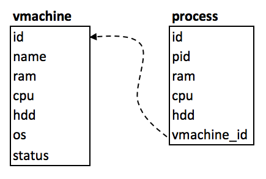

# UT3-A1: Acceso a bases de datos desde Python

Vamos a continuar con la actividad de las *máquinas virtuales*. La idea es almacenar en una base de datos *MySQL* la información siguiente:



## Creación de la base de datos

```sql
mysql> create database vmweb;
Query OK, 1 row affected (0,00 sec)
```

## Creación del usuario y gestión de permisos

```sql
mysql> create user emmet@localhost identified by 'brown';
Query OK, 0 rows affected (0,01 sec)

mysql> grant all privileges on vmweb.* to emmet@localhost;
Query OK, 0 rows affected (0,00 sec)

mysql>
```

## Creación de las tablas

Seleccionamos la base de datos para trabajar:

```sql
mysql> use vmweb;
Database changed
mysql>
```

Y creamos las tablas correspondientes:

```sql
create table vmachine (
    id int not null auto_increment primary key,
    name varchar(256) not null,
    ram float not null,
    cpu float not null,
    hdd float not null,
    os varchar(128) not null,
    status int not null
);

create table process (
    id int not null auto_increment primary key,
    pid int not null,
    ram float not null,
    cpu float not null,
    hdd float not null,
    vmachine_id int not null,
    foreign key (vmachine_id) references vmachine(id)
);
```

## Insertar la máquina virtual

Para poder trabajar con procesos, necesitamos insertar "a mano" la máquina virtual. Para ello, tenemos que entrar en el intérprete de *MySQL*:

```sql
mysql> insert into vmachine (name, ram, cpu, hdd, os, status) values ("Azkaban", 16, 3.7, 1000, "debian", 0);
Query OK, 1 row affected (0,00 sec)

mysql>
```

## Objetivo

Modificar las líneas necesarias de [la solución de la actividad anterior](https://www.dropbox.com/sh/fk3xcksdo1ht40c/AABFhH5Xk4bVC6ybDvJcYotZa?dl=0), para que los datos de la máquina virtual y de los procesos, se escriban y se lean en/desde una base de datos *MySQL*.

[Fichero `mysql.py` de acceso a base de datos](mysql.py) 

## Posible mejora

Ampliar el código para tener en cuenta más de una máquina virtual.

## Información a entregar

Se deberá entregar la *url* al commit en el repositorio privado *GitHub* de la asignatura *IMW*, apuntando a la carpeta que contiene los ficheros que conforman el proyecto. La *url* debe tener la siguiente estructura:

```
https://github.com/<usuario>/imw/blob/<id del commit>/<ut>/<actividad>/
```
