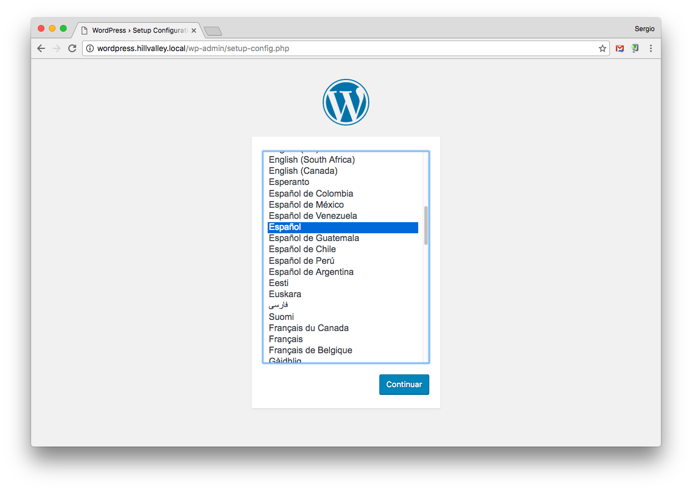
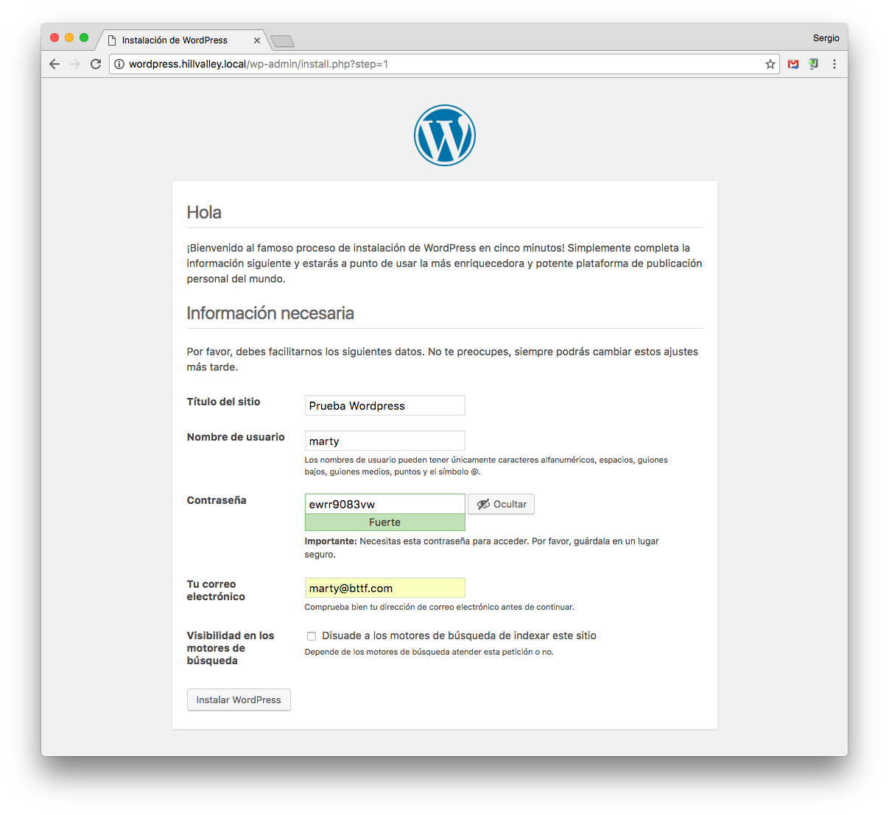
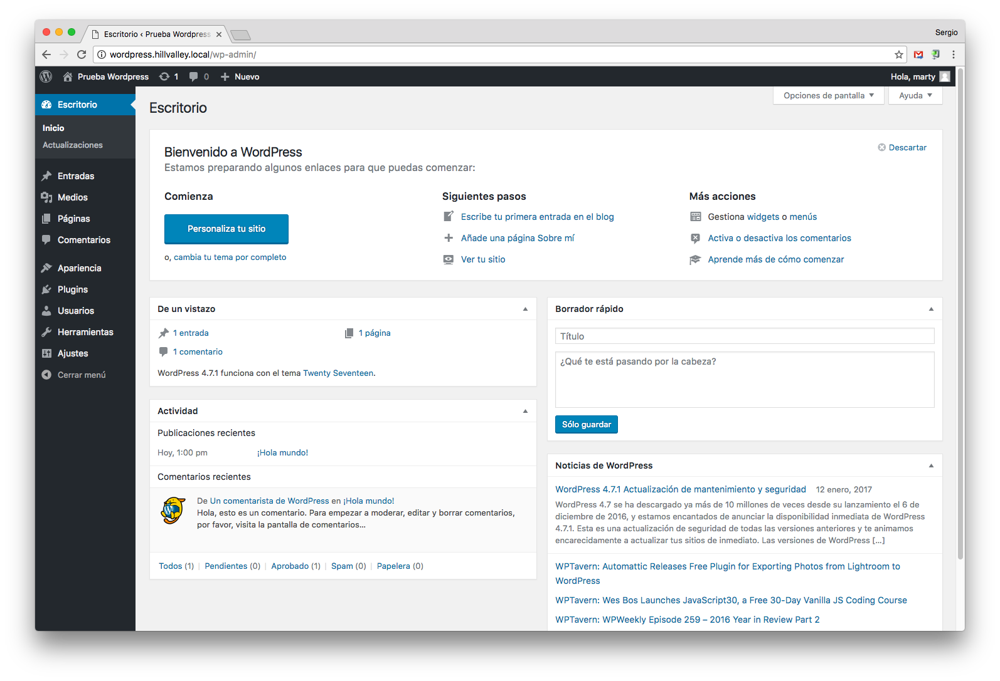

## ¿Por qué Wordpress?

Fuente: [JorgeCastro](https://jorgecastro.mx/14-estadisticas-sorprendentes-sobre-el-uso-de-wordpress/) Marzo-2015

1. 48% de los blogs del top 100 de Technorati están hechos en WordPress.
2. 74.6 millones de sitios están hechos con WordPress
3. Hay 37 millones de búsquedas relacionadas con WordPress al mes
4. Tiene 40 traducciones
5. 22% de los nuevos dominios registrados en Estados Unidos corren en WordPress
6. Wordpress.com tiene más visitas que Amazon Estados Unidos
7. WordPress.com solo tiene 229 empleados
8. Se publican 6 nuevos artículos en WordPress.com cada segundo
9. Tiene el 53.8% del mercado de CMS
10. 29000 plugins
11. 104 versiones
12. 46 millones de descargas en WordPress.org
13. WordPress es más popular con sitios empresariales
14. Akismet es el plugin más popular

## Estructura de la base de datos

El diagrama *Entidad-Relación* de la base de datos de Wordpress 4.4.2 es el siguiente:


## Configuración de la base de datos

*Wordpress* necesita un usuario/contraseña para acceder a una base de datos. Para ello, usaremos el intérprete de *MySQL*:

```console
sdelquin@hillvalley:~$ mysql -u root -p
Enter password:
Welcome to the MySQL monitor.  Commands end with ; or \g.
Your MySQL connection id is 85
Server version: 5.5.50-0+deb8u1 (Debian)

Copyright (c) 2000, 2016, Oracle and/or its affiliates. All rights reserved.

Oracle is a registered trademark of Oracle Corporation and/or its
affiliates. Other names may be trademarks of their respective
owners.

Type 'help;' or '\h' for help. Type '\c' to clear the current input statement.
```

Tenemos que crear la base de datos, el usuario y asignar privilegios:

```sql
mysql> create database wpdatabase;
Query OK, 1 row affected (0.00 sec)

mysql> create user wpuser@localhost identified by 'testing1234';
Query OK, 0 rows affected (0.01 sec)

mysql> grant all privileges on wpdatabase.* to wpuser@localhost;
Query OK, 0 rows affected (0.00 sec)

mysql> exit;
Bye
```

## Descarga de código

Descargamos el código fuente de *Wordpress* desde su página web:

```console
root@hillvalley:~# cd /tmp/
root@hillvalley:/tmp# wget http://wordpress.org/latest.tar.gz
--2016-08-28 23:20:29--  http://wordpress.org/latest.tar.gz
Resolviendo wordpress.org (wordpress.org)... 66.155.40.249, 66.155.40.250
Conectando con wordpress.org (wordpress.org)[66.155.40.249]:80... conectado.
Petición HTTP enviada, esperando respuesta... 301 Moved Permanently
Localización: https://wordpress.org/latest.tar.gz [siguiendo]
--2016-08-28 23:20:30--  https://wordpress.org/latest.tar.gz
Conectando con wordpress.org (wordpress.org)[66.155.40.249]:443... conectado.
Petición HTTP enviada, esperando respuesta... 200 OK
Longitud: 7961192 (7,6M) [application/octet-stream]
Grabando a: “latest.tar.gz”

latest.tar.gz                100%[================================================>]   7,59M  2,84MB/s   en 2,7s

2016-08-28 23:20:33 (2,84 MB/s) - “latest.tar.gz” guardado [7961192/7961192]

root@hillvalley:/tmp#
```

A continuación descomprimimos el código y lo copiamos en `/usr/share`:

```console
root@hillvalley:/tmp# tar -zxvf latest.tar.gz
...
wordpress/wp-includes/update.php
wordpress/wp-includes/comment.php
wordpress/wp-config-sample.php
root@hillvalley:/tmp# cp -r wordpress /usr/share/
root@hillvalley:/tmp# cd
root@hillvalley:~#
```

Ahora tenemos que establecer los permisos necesarios para que el usuario web `www-data` pueda usar estos ficheros:

```console
root@hillvalley:~# chown -R www-data:www-data /usr/share/wordpress/
root@hillvalley:~#
```

## Editar ficheros de configuración

Básicamente, debemos especificar el nombre de la base de datos, el usuario y la contraseña, para que *Wordpress* pueda usarlos:

```console
root@hillvalley:~# cd /usr/share/wordpress/
root@hillvalley:/usr/share/wordpress# cp wp-config-sample.php wp-config.php
root@hillvalley:/usr/share/wordpress# vi wp-config.php
```

> Contenido

> ```php
> ...
> // ** MySQL settings - You can get this info from your web host ** //
> /** The name of the database for WordPress */
> define('DB_NAME', 'wpdatabase');
> 
> /** MySQL database username */
> define('DB_USER', 'wpuser');
> 
> /** MySQL database password */
> define('DB_PASSWORD', 'testing1234');
> 
> /** Database Charset to use in creating database tables. */
> define('DB_CHARSET', 'utf8mb4');
> ...
> ```

## Acceso mediante Nginx

Para que nuestro sitio *Wordpress* sea accesible desde un navegador web, debemos incluir las directivas necesarias en la configuración del servidor web *Nginx*.

Supongamos que queremos acceder a nuestro *Wordpress* desde la url `wordpress.hillvalley.local`. Para ello tendremos que crear un nuevo *virtual host* de la siguiente manera:

```console
root@hillvalley:~# vi /etc/nginx/sites-available/wordpress
```

> Contenido

> ```nginx
> server {
>     server_name wordpress.hillvalley.local;
>     root /usr/share/wordpress;
> 
>     location / {
>         index index.php;
>         try_files $uri $uri/ /index.php?q=$uri&$args;
>     }
> 
>     location ~ \.php$ {
>         include snippets/fastcgi-php.conf;
>         fastcgi_pass unix:/var/run/php5-fpm.sock;
>     }
> }
> ```

Enlazamos la configuración para que el *virtual host* esté disponible:

```console
root@hillvalley:~# cd /etc/nginx/sites-enabled/
root@hillvalley:/etc/nginx/sites-enabled# ln -s ../sites-available/wordpress
root@hillvalley:/etc/nginx/sites-enabled# ls -l wordpress
lrwxrwxrwx 1 root root 28 ene 14 12:52 wordpress -> ../sites-available/wordpress
root@hillvalley:/etc/nginx/sites-enabled#
```

Recargamos el servidor web *Nginx* para que los cambios sean efectivos:

```console
root@hillvalley:~# /etc/init.d/nginx reload
[ ok ] Reloading nginx configuration (via systemctl): nginx.service.
root@hillvalley:~#
```

* [x] `Wordpress` instalado correctamente.

## Configuración del sitio vía web

Ahora podemos acceder a la dirección de nuestro servidor para configurar nuestro *Wordpress* vía web.

Cuando accedemos a `http://wordpress.hillvalley.local` nos redirige a `http://wordpress.hillvalley.local/wp-admin/setup-config.php`:



Elegimos el idioma *Español* y le damos a <kbd>Continuar</kbd>:



Rellenamos los campos que nos piden y pulsamos <kbd>Instalar Wordpress</kbd>:



* [x] `Wordpress` instalado y configurado.

## Límite de tamaño en la subida de archivos

Por defecto, el límite de subida de archivos para aplicaciones *PHP* suele ser bastante bajo, en torno a los 2MB.

Para incrementarlo, debemos hacer lo siguiente, como *root* en la máquina de producción:

```console
root@hillvalley:~# vi /etc/php5/fpm/php.ini
```

Buscar y modificar sólo las siguientes líneas...

> Contenido:
> ```
> upload_max_filesize = 64M
> post_max_size = 64M
> max_execution_time = 300
> ```

Ahora reinciamos el servicio `php-fpm`:

```
root@hillvalley:~# /etc/init.d/php5-fpm restart
[ ok ] Restarting php5-fpm (via systemctl): php5-fpm.service.
root@hillvalley:~#
```

Además de esto, debemos añadir una línea en el fichero de configuración de *Nginx*:

```console
root@hillvalley:~# vi /etc/nginx/nginx.conf
```

> Contenido:
> ```
> http {
>     ...
>     client_max_body_size 64M;
>     ...
> }
> ```

A continuación reiniciamos el servidor web *Nginx* para que tengan efectos los cambios realizados en el fichero de configuración:

```console
root@hillvalley:~# /etc/init.d/nginx restart
[ ok ] Restarting nginx (via systemctl): nginx.service.
root@hillvalley:~#
```

## Seguridad

- Crear contraseñas complicadas (más de 8 caracteres con letras, números y signos de puntuación.).
- No utilizar el nombre de usuario "Admin".
- Limitar los intentos de login fallidos (plugin [Limit Login Attempts](https://wordpress.org/extend/plugins/limit-login-attempts/)).
- Controlar el *spam* (plugin [Akismet](http://wordpress.org/plugins/akismet/))
- No instalar muchos plugins.
- Buscar código malicioso en los archivos de tu *theme*.
- Añadir un firewall.
- Hacer un backup de la instalación periódicamente (plugin [Updraft Plus](http://wordpress.org/plugins/updraftplus/)).
- Mantener actualizados themes, plugins y software de Wordpress.
- Usar un plugin como [iThemes Security](https://wordpress.org/plugins/better-wp-security/).

## Estructura de ficheros

```console
root@hillvalley:/usr/share/wordpress/wp-content# tree -d
.
├── languages
│   ├── plugins
│   └── themes
├── plugins
│   ├── akismet
│   │   ├── _inc
│   │   │   └── img
│   │   └── views
│   └── wordpress-importer
│       └── languages
├── themes
│   ├── twentyfifteen
│   │   ├── css
│   │   ├── genericons
│   │   ├── inc
│   │   └── js
│   ├── twentyseventeen
│   │   ├── assets
│   │   │   ├── css
│   │   │   ├── images
│   │   │   └── js
│   │   ├── inc
│   │   └── template-parts
│   │       ├── footer
│   │       ├── header
│   │       ├── navigation
│   │       ├── page
│   │       └── post
│   └── twentysixteen
│       ├── css
│       ├── genericons
│       ├── inc
│       ├── js
│       └── template-parts
├── upgrade
└── uploads
    └── 2017
        └── 01

38 directories
root@hillvalley:/usr/share/wordpress/wp-content#
```
