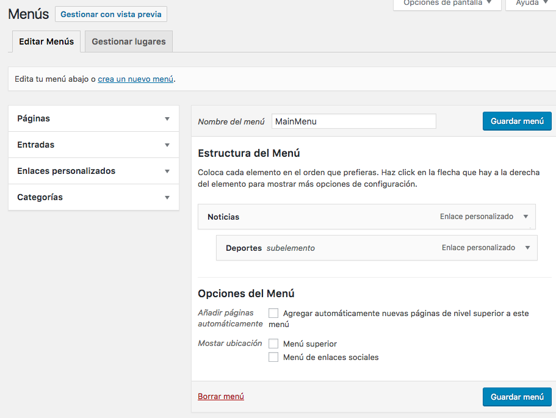
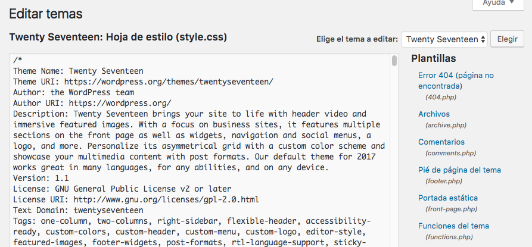

# Apariencia

## Temas

- Permite gestionar los temas de nuestro sitio web.
- Búsqueda de temas.
- Previsualización.
- Activación.

Los temas se pueden buscar en el repositorio "oficial" de `wordpress.org` o bien subirlos como archivo `.zip`:

## Personalizar

La sección de *Personalizar* es muy visual y nos ofrece una serie de menús para modificar el aspecto de nuestra web:

> NOTA: Podrán existir más o menos opciones en esta sección dependiendo del *theme* (tema) que tengamos instalado y activado.

## Widgets

- Un *widget* es un "bloque" que puede contener cualquier tipo de contenido.
- Los widgets por defecto que trae *Wordpress* son los siguientes:
    + Archivos.
    + Buscar.
    + Calendario.
    + Categorías.
    + Comentarios recientes.
    + Entradas recientes.
    + Menú personalizado.
    + Meta.
    + Nube de etiquetas.
    + Páginas.
    + RSS.
    + Texto.
- Mediante "arrastrar y soltar" podemos incluir widgets en las diferentes zonas de nuestra web.

## Menús

- En *Wordpress* se pueden crear tantos menús como se quiera.
- Cada menú se podrá colocar en una zona, según el tema activado.
- Los menús permiten anidamiento.
- Cada elemento de un menú debe ser de uno de los siguientes tipos:
    + Páginas.
    + Entradas.
    + Enlaces personalizados.
    + Categorías.

Si queremos insertar un elemento en el menú, que no tenga ningún contenido, sino que sirva como elemento "padre" de un submenú, tendremos que añadirlo como *Enlace personalizado* y dejar la URL como `#`:

## Cabecera

- La cabecera (ó *header*) se ha convertido en un elemento fundamental de las páginas web.
- *Wordpress* nos permite poner como cabecera un vídeo en formato `.mp4` o una imagen fija, teniendo en cuenta sus dimensiones.

## Editor

Permite editar el código de los ficheros del tema.

