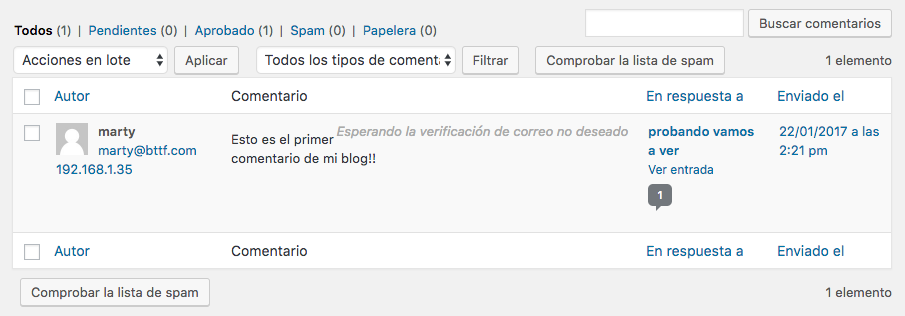
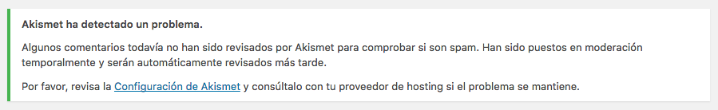
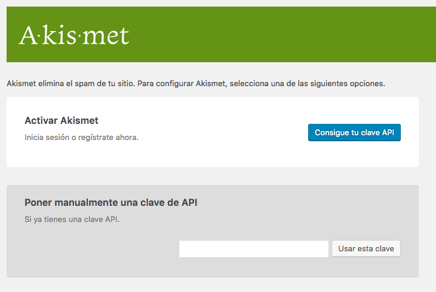
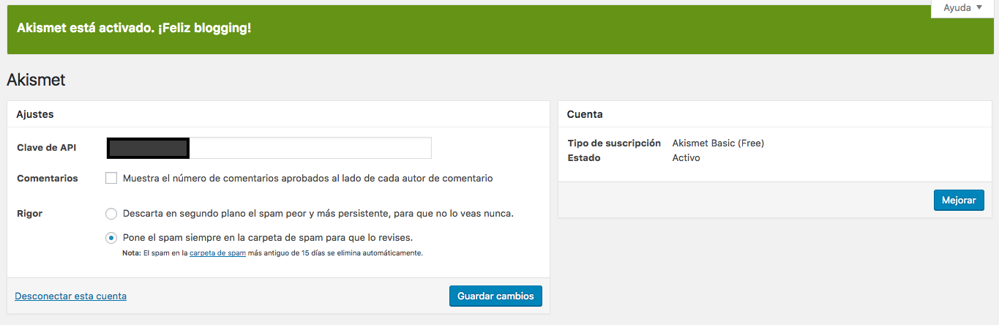

# Comentarios

- Esta sección permite gestionar los comentarios existentes en nuestra web.
- El estado de un comentario puede ser:
    + Pendiente.
    + Aprobado.
    + Spam.
    + Papelera.

## Akismet

El plugin *Akismet* está muy vinculado con la gestión de comentarios, ya que permite identificar el *spam*.

Si nos vamos a la configuración de *Akismet*, nos pedirá activar el plugin, y para ello, necesitaremos una cuenta en `wordpress.org`

Al finalizar el proceso, conseguiremos una *Clave de API*, que introducimos para activar el plugin *Akismet*:

