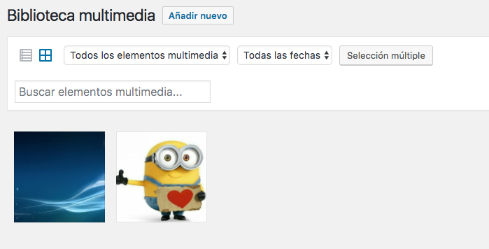

# Biblioteca

- Permite almacenar todos los elementos multimedia de la página.
- Ofrece herramientas de búsqueda, selección y modificación.

## Añadir nuevo elemento

- Nos muestra un desplegable para subir archivos.
- Se puede seleccionar desde el sistema de ficheros, o bien usar *arrastrar y soltar*.

