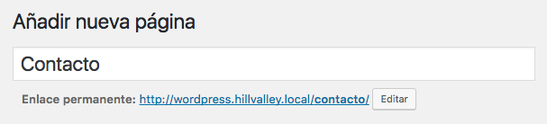
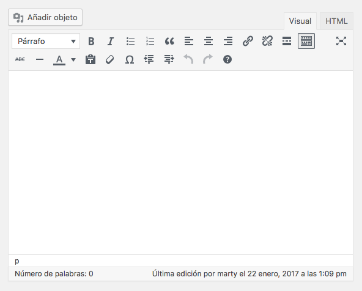
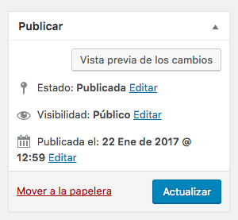
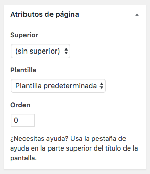
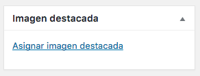

# Páginas

- Contienen información menos "dinámica" que los *posts*.
- Suelen estar enlazadas desde los menús.
- No se incluyen en categorías ni se etiquetan.

## Editor

- Modo visual (*WYSIWYG*).
- Modo HTML.

## Publicar

- Vista previa de los cambios.
- Programar la publicación.
- Editar la fecha de publicación.
- Modificar la visibilidad.

## Atributos de página

- Permite establecer una jerarquía de páginas, que se traduce en las *urls*. Por ejemplo, si establecemos que la página superior de `Dirección` es `Contacto`, la *url* quedaría como: `http://wordpress.hillvalley.local/contacto/direccion/`.
- Permite fijar una plantilla.

## Imagen destacada

- Se suelen utilizar en la difusión de redes sociales, para invitar a la lectura.

