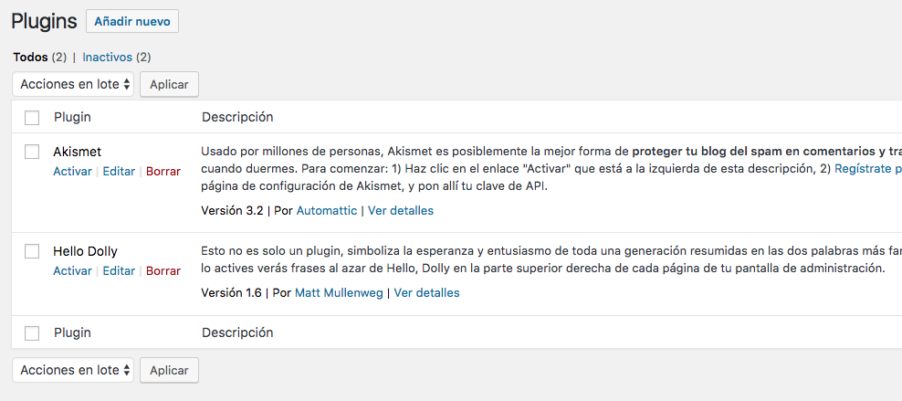
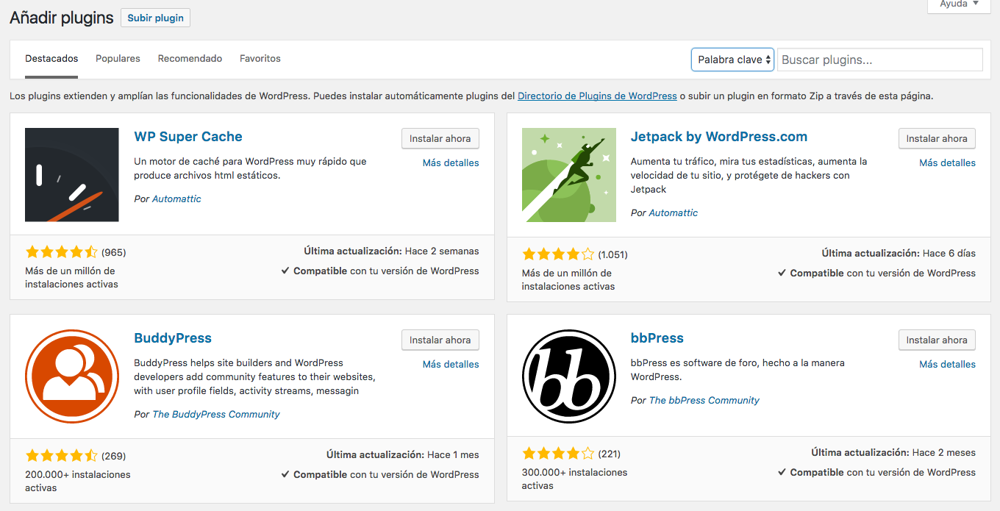
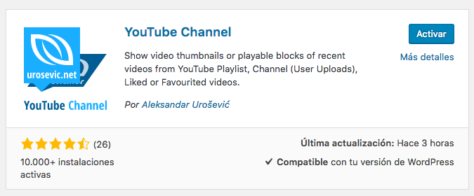

# Plugins

- Los **plugins** en *Wordpress* constituyen uno de los elementos más potentes de su ecosistema.
- Existen una cantidad enorme de plugins para casi cualquier cometido que se pueda imaginar.

## Añadir plugins

Podemos buscar plugins entre:

+ Destacados.
+ Populares.
+ Recomendado.
+ Favoritos.
+ Palabra clave.

## Activación de plugins

Una vez que se ha instalado un *plugin*, hay que activarlo para poder empezar a usarlo:

