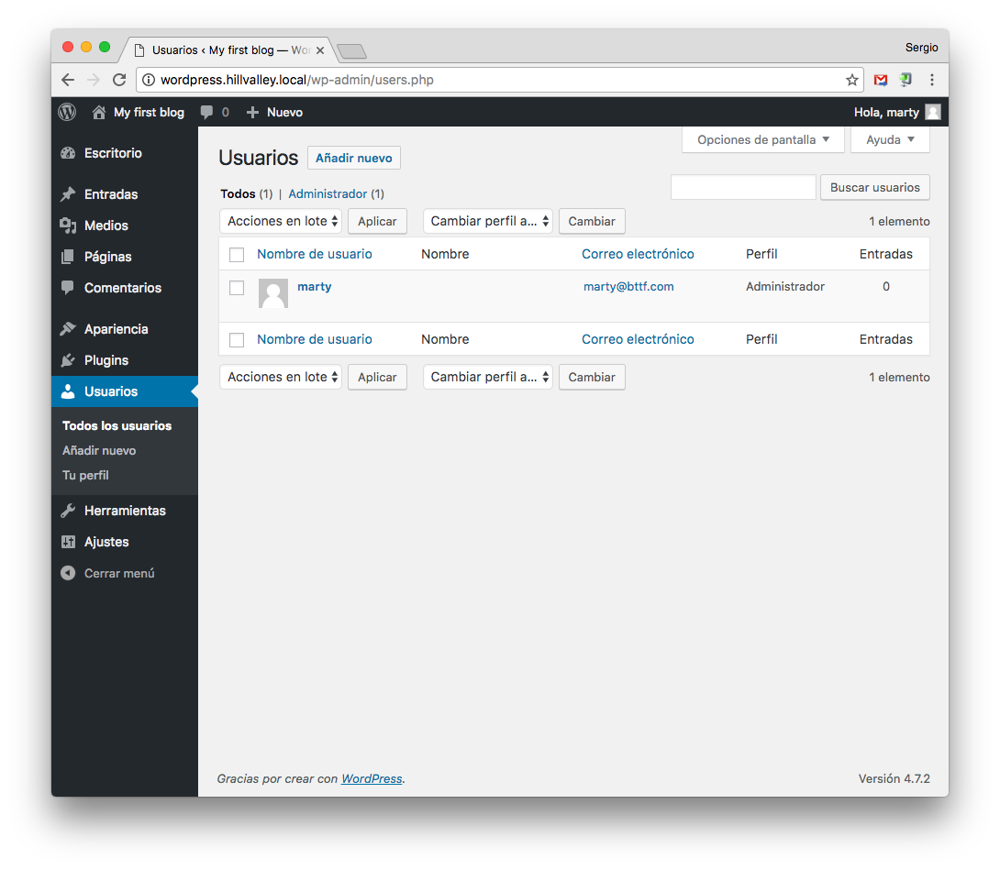

# Usuarios

En el menú lateral de *Wordpress* tenemos la opción de gestionar los usuarios que tienen acceso a la web.

## Todos los usuarios

## Añadir nuevo

Tenemos la opción de establecer una contraseña:

### Roles de usuario

* **Suscriptor**: Este usuario no puede crear contenidos, sólo verlos. Sus capacidades son: ver el panel y editar su propio perfil. Es útil si creamos una web privada en la que la web sólo la pueden ver los usuarios registrados.
* **Colaborador**: Puede crear borradores de contenido pero no publicarlos ya que el administrador debe aprobarlo primero.
* **Autor**: Tiene los privilegios del Colaborador y además puede subir archivos y publicar entradas.
* **Editor**: Tiene todos los privilegios del Autor y además puede editar entradas y páginas, moderar comentarios y modificar categorías y enlaces.
* **Administrador**: Todos los privilegios para administrar la web.

## Tu perfil

