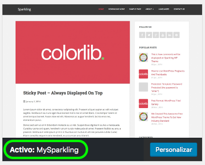
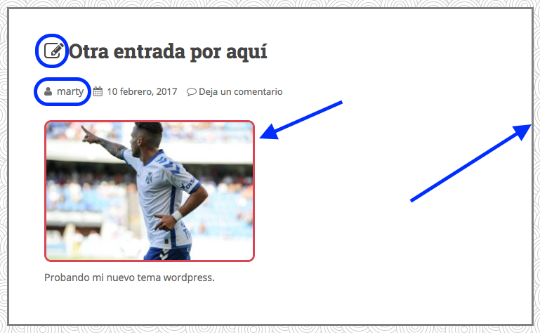
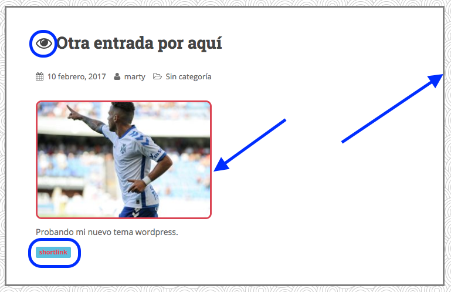
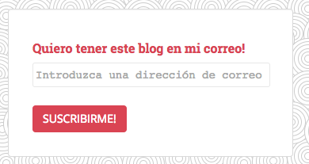
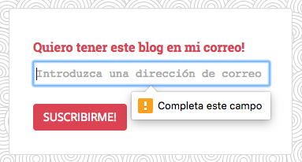
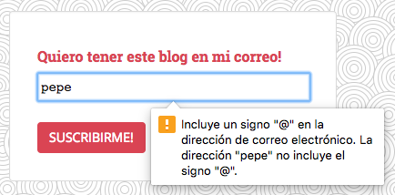
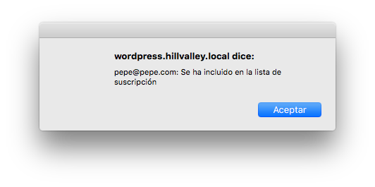
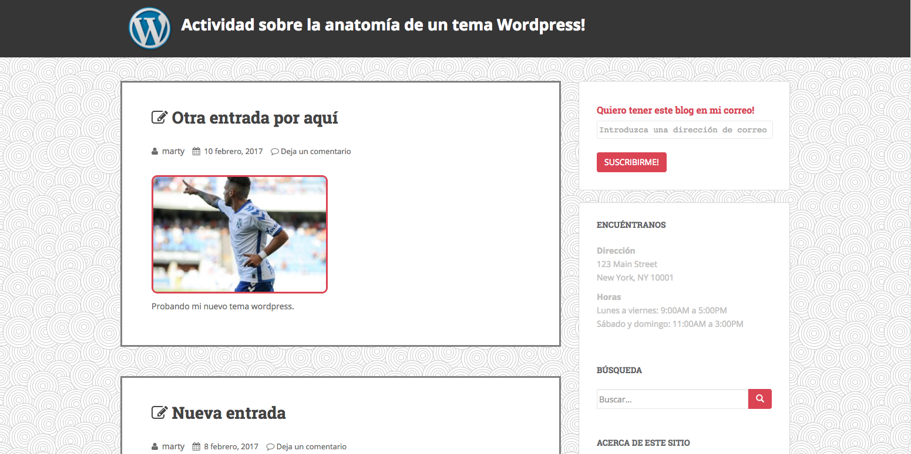

# UT6-A2: Anatomía de un tema Wordpress

La actividad consiste en personalizar un tema de *Wordpress*.

1. Partir de una instalación limpia de Wordpress, o resetearla utilizando algún plugin al efecto.
1. Instalar el tema "Sparkling".
2. Crear un tema hijo llamado "MySparkling" y activarlo. Es necesario que aparezca el nombre del tema en el menú de *Apariencia* de Wordpress.  

3. Poner de fondo de página el siguiente patrón (cogido de la página https://www.toptal.com/designers/subtlepatterns/).

4. En la página inicial de *Wordpress*, las entradas se deben ver de la siguiente manera:  
  
Ojo a los siguientes detalles:
    + Icono antes del título.
    + Autor de la entrada.
    + Borde rojo con esquinas curvas en imágenes.
    + Borde gris a toda la entrada.
5. Una vez que se haga click en cada entrada, se deben ver de la siguiente manera:  
  
Ojo a los siguientes detalles:
    + Icono antes del título.
    + Enlace corto de la entrada.
    + Borde rojo con esquinas curvas en imágenes.
    + Borde gris a toda la entrada.
6. Se debe crear un panel en la barra lateral derecha con esta forma:

7. El panel debe controlar que no se deje el *email* vacío y también que el *email* sea válido:  

8. Al pulsar en *SUSCRIBIRME!* se debe enviar la petición a un fichero `subscribe.php` que debe hacer 3 cosas:
    - Mostrar un *alert* con el siguiente aspecto:  
    
    - Guardar el email pasado por `POST` en un fichero `subscribers.txt`.
    - Redirigir la página a `"/"`. Utilizar: `header("refresh:0;url=/");`
9. Crear una cabecera con el siguiente aspecto:  

    - La imagen debe tener 100px de ancho/alto.
    - La url de la imagen es: http://www.wordpresstrainingandclasses.com/wp-content/uploads/2013/05/wordpress-logo-730x584.png
10. El aspecto global de la web debería ser el siguiente:  

> Todas las modificaciones de estilo deben incluirse bien en el fichero `style.css` ó bien en un nuevo fichero creado para ello. Es decir, no se permiten reglas de estilo dentro de los propios ficheros *php*/*html*.

## Enlaces

- [Añadir líneas a un fichero de texto en PHP](http://stackoverflow.com/a/24972441)
- [Mostrar un `alert` a través de PHP](http://stackoverflow.com/a/13851576)
- [Iconos de Font Awesome](http://fontawesome.io/icons/)
- [Bootstrap](http://getbootstrap.com/)

> Ojo con los permisos de los ficheros. El usuario que utiliza Nginx es `www-data`, por lo tanto debemos asegurarnos que los ficheros tienen permiso de lectura para *"others"*. Lo más fácil sería utilizar la máscara 755.

## Ficheros a entregar

Se debe entregar un informe en PDF explicando las modificaciones que se han hecho, paso por paso, e incluyendo en dicho informe el código (*html, php, css*) que se ha escrito y capturas de pantalla (donde se vea claramente la `url` del navegador).
