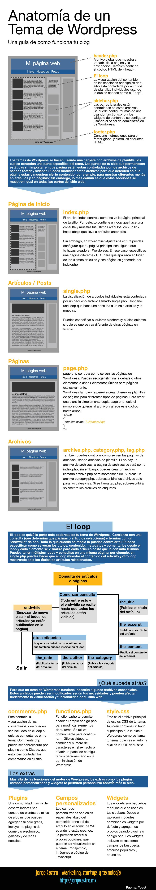

Fuente: [https://jorgecastro.mx/anatomia-de-un-tema-de-wordpress/](https://jorgecastro.mx/anatomia-de-un-tema-de-wordpress/)

## Funciones PHP utilizadas en Wordpress

Las funciones de uso habitual en la creación de plantillas son las siguientes:

* `get_header()`: incluye en el código el archivo de cabecera `header.php`.
* `get_footer()`: incluye en el código el archivo de pie de página `footer.php`.
* `get_sidebar()`: incluye en el código la barra lateral `sidebar.php`.
* `is_home()`: verdadero si está mostrando la página de inicio.
* `have_posts()`: verdadero si aún quedan entradas por recorrer.
* `the_post()`: prepara el siguiente post en el bucle de lectura de entradas.
* `the_content()`: muestra el contenido del post actual.
* `the_title()`: muestra el título del post.
* `the_ID()`: identificador del post actual.
* `the_permalink()`: muestra el permalink del post actual.
* `the_time()`: muestra la fecha y hora del post.
* `the_author()`: muestra el autor del post.
* `the_tags()`: muestra las etiquetas relacionadas con el post.
* `the_category()`: muestra las categorías relacionadas con el post.
* `the_post_thumbnail_url()`: URL a la imagen destacada relacionada con el post.
* `edit_post_link()`: enlace para editar el post.
* `comment_form()`: formulario para escribir un comentario.
* `get_template()`: nombre del tema actual.
* `get_template_directory_uri()`: devuelve la URL al directorio del tema actual de Wordpress.
* `get_stylesheet_uri()`: URL a la hoja de estilos (archivo `style.css`).
* `get_stylesheet_directory_uri()`: devuelve la ruta al directorio de hojas de estilo.
* `get_site_url()`: URL a la raíz de Wordpress.
* `get_posts()`: obtiene un array de posts.

Todas las funciones utilizadas *PHP* utilizadas en código *Wordpress* se pueden encontrar en la referencia que proporciona la página de desarrolladores:
[https://developer.wordpress.org/reference/](https://developer.wordpress.org/reference/)

## Documentación de los ficheros PHP de Wordpress

Podemos consultar en línea la documentación asociada a cada uno de los ficheros *PHP* de un tema Wordpress.

Cada fichero tiene, en su cabecera, una serie de comentarios, entre los que destaca el atributo `@link`, que contiene una URL a la documentación oficial de `wordpress.org`.

Por ejemplo, para el fichero `single.php`, podemos encontrar en su cabecera:

@link [https://developer.wordpress.org/themes/basics/template-hierarchy/#single-post](https://developer.wordpress.org/themes/basics/template-hierarchy/#single-post)

## Creando un tema desde 0

Como *root*, dentro de la carpeta `/usr/share/wordpress/wp-content/themes` creamos una carpeta llamada `custom`.

Creamos los siguientes ficheros:

### `style.css`

```css
#cabecera {
    position: fixed;
    left: 0;
    top: 0;
    width: 100%;
    height: 60px;
    background-color: black;
    color: white;
}

#titulo {
    position: absolute;
    top: 0;
    left: 0;
}

#menu {
    position: absolute;
    top: 10px;
    right: 0;
}

a {
    color: white;
    text-decoration: none;
}

a:hover {
    text-decoration: underline;
}

#cuerpo {
    position: fixed;
    left: 0;
    top: 60px;
    width: 100%;
    bottom: 0;
    background-color: white;
    color: black;
    overflow-y: scroll;
}

#cuerpo h1 {
    margin: 0;
    text-align: center;
    background-color: gray;
    color: white;
}

img {
    float: left;
    margin-right: 5px;
}
```

### `header.php`

```html
<!DOCTYPE html>
<html lang="es">
<head>
    <meta charset="UTF-8">
    <link rel="stylesheet" href="<?=get_stylesheet_uri()?>">
</head>
<body>
<div id="cabecera">
    <div id="titulo">
        <h1><a href="<?=get_site_url()?>">
            Mi blog
        </a></h1>
    </div>
    <div id="menu">
        <a href="<?=get_site_url()?>/sobre-mi">
            Sobre mi</a>
        <a href="<?=get_site_url()?>/mi-localidad">
            Sobre mi localidad</a>
        <a href="<?=get_site_url()?>/wp-admin">
            Administración</a>
    </div>
</div>
```

### `footer.php`

```html
</body>
</html>
```

### `index.php`

```html
<?php get_header(); ?>
<div id="cuerpo">
    <?php
        if (have_posts()) {
            while (have_posts()) {
                the_post();
    ?>
                <h1><?=the_title()?></h1>
    <?php
                the_content();
            }
        }
    ?>
</div>
<?php get_footer(); ?>
```

### `functions.php`

```html
<?php
    add_theme_support('post-thumbnails');
?>
```

### Activación del tema

Una vez hecho esto, ya podemos ir a *Apariencia -> Temas* y seleccionar nuestro flamante tema `custom`.

Nos damos cuenta de que el tema creado no tiene previsualización. Para ello debemos guardar una imagen con el nombre `screenshot.[jpg|png]`.
