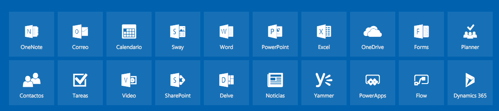

# Office 365

## Acceso

- https://portal.office.com
- https://onedrive.live.com

## Componentes

- OneNote.
    + https://www.onenote.com/notebooks/
- Correo.
    + Outlook.
    + Componentes:
        * Calendario.
        * Contactos.
        * Tareas.
    + https://outlook.office365.com/
- Sway.
    + Gestión de informes.
    + https://sway.com/
- Word.
    + https://office.live.com/start/Word.aspx
- PowerPoint
    + https://office.live.com/start/PowerPoint.aspx
- Excel
    + https://office.live.com/start/Excel.aspx?auth=2
- Forms
    + https://forms.office.com
- Planner.
    + Gestión de equipos de trabajo.
    + https://tasks.office.com
- Yammer.
    + Red social empresarial.
    + https://yammer.com
- PowerApps.
    + Creación de aplicaciones.
    + https://web.powerapps.com
- Flow.
    + Automatizar tareas.
    + https://flow.microsoft.com
- Dynamics 365.
    + Funciones de negocio.
        * Financieras.
        * Ventas.
        * Operaciones.
        * Marketing.
    + https://home.dynamics.com/
