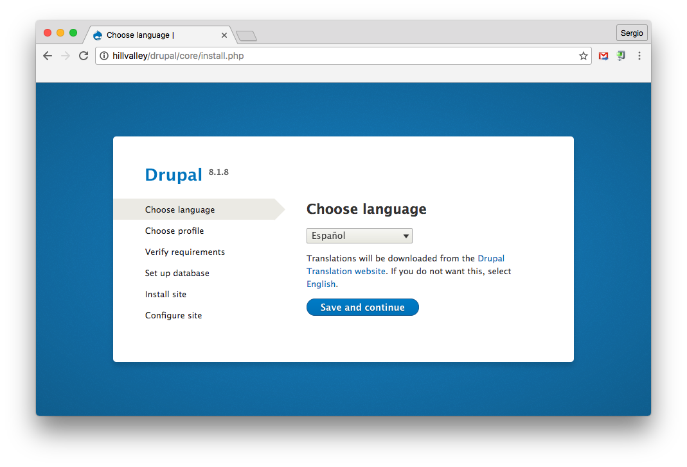
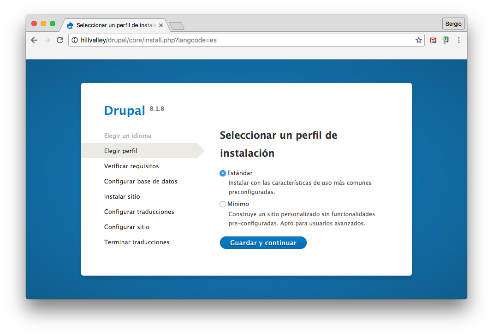
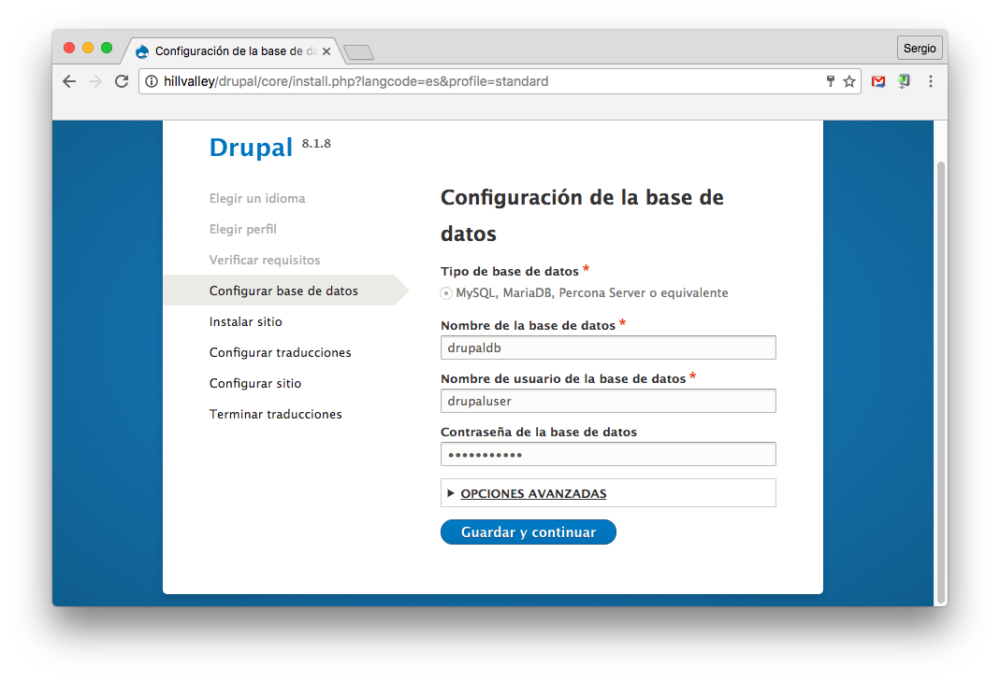
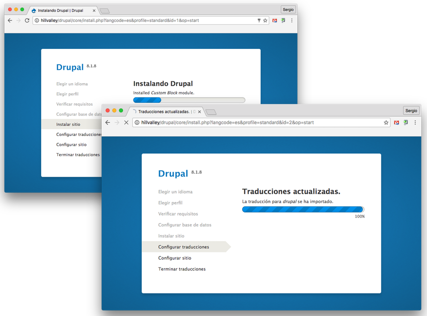
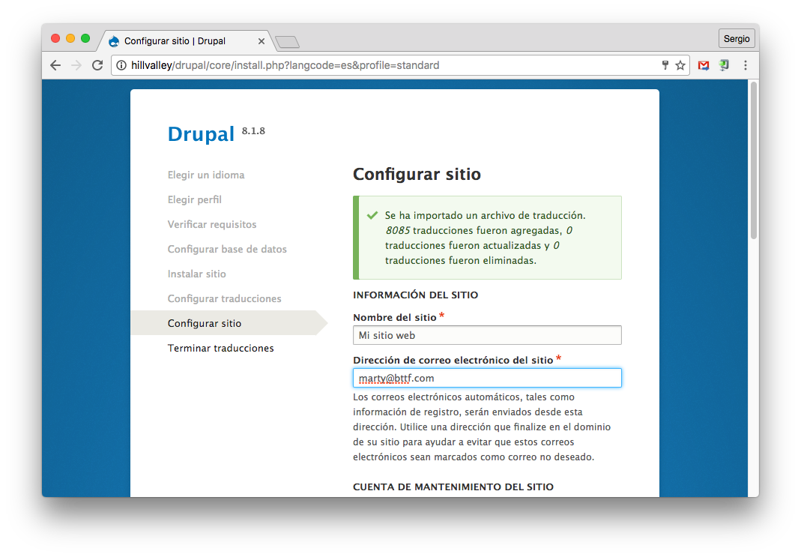
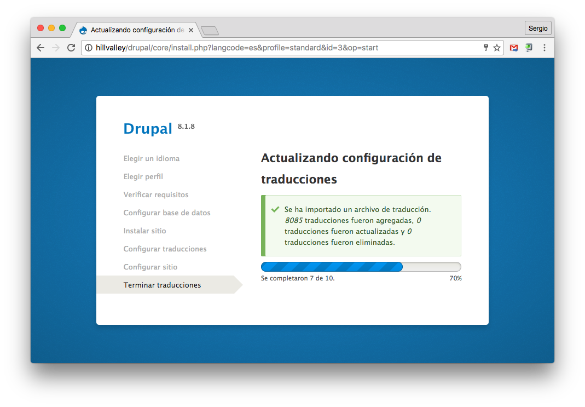
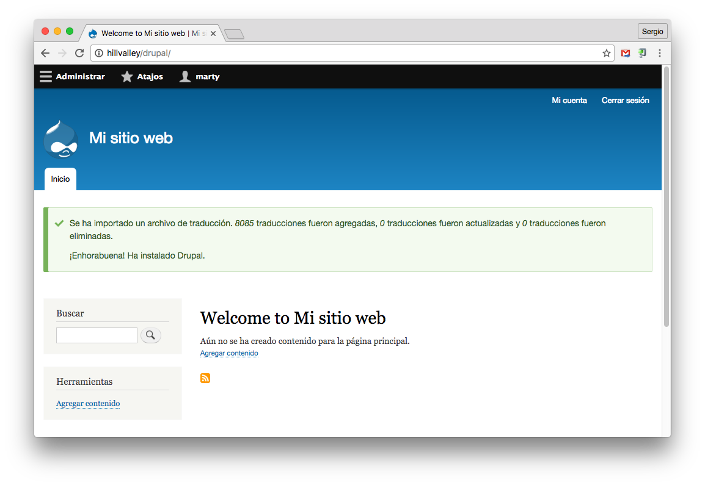

# Configuración de Drupal

Drupal es un CMS de propósito general muy extendido.

## Configuración de la base de datos

*Drupal* necesita un usuario/contraseña para acceder a una base de datos. Para ello, usaremos el intérprete de *MySQL*:

```console
sdelquin@hillvalley:~$ mysql -u root -p
Enter password:
Welcome to the MySQL monitor.  Commands end with ; or \g.
Your MySQL connection id is 85
Server version: 5.5.50-0+deb8u1 (Debian)

Copyright (c) 2000, 2016, Oracle and/or its affiliates. All rights reserved.

Oracle is a registered trademark of Oracle Corporation and/or its
affiliates. Other names may be trademarks of their respective
owners.

Type 'help;' or '\h' for help. Type '\c' to clear the current input statement.
```

Tenemos que crear la base de datos, el usuario y asignar privilegios:

```sql
mysql> create database drupaldb;
Query OK, 1 row affected (0.00 sec)

mysql> create user drupaluser@localhost identified by 'testing1234';
Query OK, 0 rows affected (0.00 sec)

mysql> grant all privileges on drupaldb.* to drupaluser@localhost;
Query OK, 0 rows affected (0.00 sec)

mysql> Bye
```

## Descarga de código

Descargamos el código fuente de *Wordpress* desde su página web:

```console
root@hillvalley:~# cd /tmp/
root@hillvalley:/tmp# wget https://ftp.drupal.org/files/projects/drupal-8.1.8.tar.gz
--2016-08-29 16:47:13--  https://ftp.drupal.org/files/projects/drupal-8.1.8.tar.gz
Resolviendo ftp.drupal.org (ftp.drupal.org)... 151.101.36.68
Conectando con ftp.drupal.org (ftp.drupal.org)[151.101.36.68]:443... conectado.
Petición HTTP enviada, esperando respuesta... 200 OK
Longitud: 12634223 (12M) [application/octet-stream]
Grabando a: “drupal-8.1.8.tar.gz”

drupal-8.1.8.tar.gz          100%[================================================>]  12,05M  10,9MB/s   en 1,1s

2016-08-29 16:47:15 (10,9 MB/s) - “drupal-8.1.8.tar.gz” guardado [12634223/12634223]

root@hillvalley:/tmp#
```

A continuación descomprimimos el código y lo copiamos en `/usr/share`:

```console
root@hillvalley:/tmp# tar -zxvf drupal-8.1.8.tar.gz
...
drupal-8.1.8/LICENSE.txt
drupal-8.1.8/profiles/
drupal-8.1.8/profiles/README.txt
root@hillvalley:/tmp# cp -r drupal-8.1.8 /usr/share/drupal
root@hillvalley:/tmp# cd
root@hillvalley:~#
```

Ahora tenemos que establecer los permisos necesarios para que el usuario web `www-data` pueda usar estos ficheros:

```console
root@hillvalley:~# chown -R www-data:www-data /usr/share/drupal/
root@hillvalley:~#
```

## Fichero de configuración

Es necesario copiar la plantilla del fichero de configuración que nos proporciona *Drupal* y asignar los permisos necesarios, para que el programa de instalación pueda luego modificar los valores pertinentes:

```console
root@hillvalley:~# cd /usr/share/drupal/sites/default/
root@hillvalley:/usr/share/drupal/sites/default# cp default.settings.php settings.php
root@hillvalley:/usr/share/drupal/sites/default# ls -lh
total 72K
-rw-r--r-- 1 www-data www-data 5,9K ago 29 16:48 default.services.yml
-rw-r--r-- 1 www-data www-data  29K ago 29 16:48 default.settings.php
-rw-r--r-- 1 root     root      29K ago 29 17:11 settings.php
root@hillvalley:/usr/share/drupal/sites/default# chown www-data:www-data settings.php
root@hillvalley:/usr/share/drupal/sites/default# ls -lh
total 72K
-rw-r--r-- 1 www-data www-data 5,9K ago 29 16:48 default.services.yml
-rw-r--r-- 1 www-data www-data  29K ago 29 16:48 default.settings.php
-rw-r--r-- 1 www-data www-data  29K ago 29 17:11 settings.php
root@hillvalley:/usr/share/drupal/sites/default#
```

## Acceso mediante Nginx

Para que nuestro sitio *Drupal* sea accesible desde un navegador web, debemos incluir las directivas necesarias en la configuración del servidor web *Nginx*:

```console
root@hillvalley:~# vi /etc/nginx/includes/drupal
```

> Contenido

> ```nginx
> location /drupal/ {
>     root /usr/share/;
>     location ~ ^/drupal/(.+\.php)$ {
>         try_files $uri =404;
>         fastcgi_pass unix:/var/run/php5-fpm.sock;
>         fastcgi_param SCRIPT_FILENAME $document_root$fastcgi_script_name;
>         include /etc/nginx/fastcgi_params;
>     }
> }
> ```

Reiniciamos el servidor web *Nginx* para que los cambios sean efectivos:

```console
root@hillvalley:~# /etc/init.d/nginx reload
[ ok ] Reloading nginx configuration (via systemctl): nginx.service.
root@hillvalley:~#
```

* [x] `Drupal` instalado correctamente.

## Configuración del sitio vía web

Ahora podemos acceder a la dirección de nuestro servidor para configurar nuestro *Drupal* vía web.

Cuando accedemos a `http://hillvalley/drupal` nos redirige a `http://hillvalley/drupal/core/install.php`, y nos aparece la primera pantalla donde debemos elegir el idioma:



En la siguiente pantalla debemos seleccionar el perfil de la instalación. Lo dejamos en "Estándar" y pusamos en <kbd>Guardar y continuar</kbd>:



Ahora tenemos que especificar las credenciales de acceso a la base de datos *MySQL* que hemos creado previamente:



El programa de instalación sigue realizando operaciones. En primer lugar "Instalar sitio" y a continuación "Configurar traducciones":



En la siguiente pantalla nos encontramos la sección *Configurar sitio* donde se nos piden los siguientes datos:

* Nombre del sitio.
* Dirección de correo electrónico del sitio.
* Nombre de usuario: `marty`
* Contraseña: `ewrr9083vw`
* Dirección de correo electrónico.
* Opciones regionales.



Rellenamos todos los campos y pulsamos en <kbd>Guardar y continuar</kbd>. A continuación aparece una pantalla en la que se actualizan las configuraciones de traducción:



Una vez que termina este proceso, ya hemos finalizado con la instalación de *Drupal*. Nos aparece la pantalla principal del sistema:



* [x] Configuración de `Drupal`.
