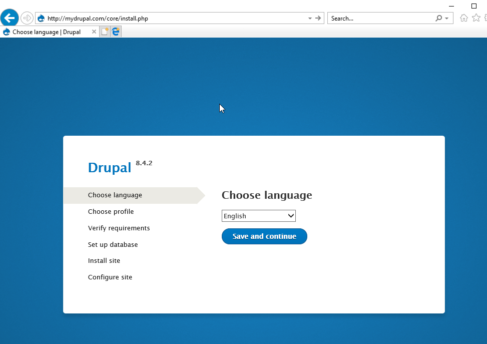
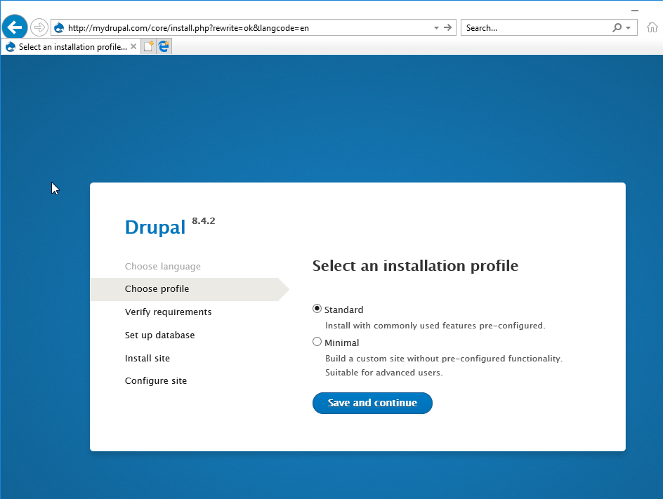
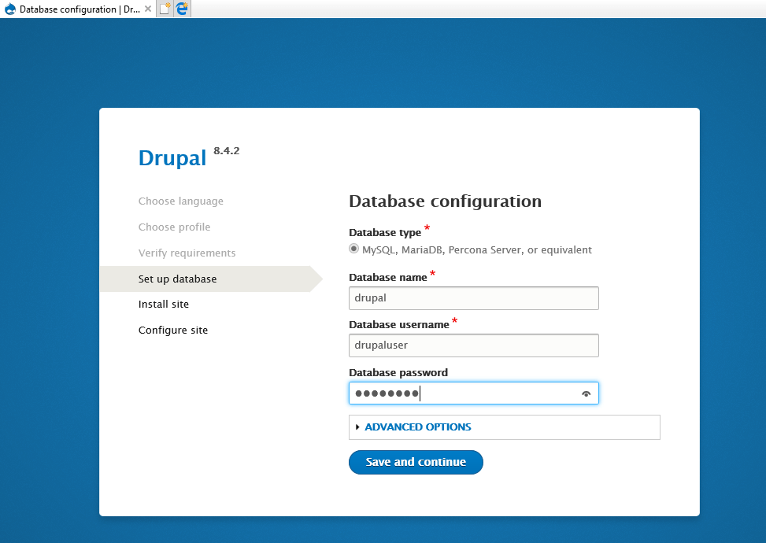

## INSTALL DRUPAL CMS ON UBUNTU 16.04 LTS WITH APACHE2, MARIADB, PHP 7.1 AND LET’S ENCRYPT SSL/TLS

If you know WordPress… then you should also know Drupal. They both helps users create dynamic PHP based websites and blogs.. Although WordPress is # 1 when it comes to CMS, Drupal has some features that are not available to WordPress users..

Drupal is a powerful and popular CMS use by many webmasters to create powerful websites and blogs. If you’re looking open source platform to create dynamic, PHP-based websites and blogs easily may want to take a look at Drupal CMS.

In today’s environments, Drupal is frequently being installed with SSL/TLS encryption so that all traffic to and from the website is protected over HTTPS. Also, websites that use HTTPS may rank better with Google and other search engine providers.

This brief tutorial is going to show students and new users how to install Drupal on Ubuntu 17.04 / 17.10 with Apache2, MariaDB, PHP and Let’s Encrypt support. When you’re done, your website will automatically be configured to use HTTPS for all traffic.

To get started with installing Drupal with Let’s Encrypt support, follow the steps below:

### STEP 1: INSTALL APACHE2
Drupal requires a webserver to function and the second most popular webserver in used today is Apache2. So, go and install Apache2 on Ubuntu by running the commands below:
~~~
sudo apt install apache2
~~~
Next, run the commands below to stop, start and enable Apache2 service to always start up with the server boots.
~~~
sudo systemctl stop apache2.service
sudo systemctl start apache2.service
sudo systemctl enable apache2.service
~~~

### STEP 2: INSTALL MARIADB

Drupal also requires a database server to function.. and MariaDB database server is a great place to start. To install it run the commands below.
~~~
sudo apt-get install mariadb-server mariadb-client
~~~
After installing, the commands below can be used to stop, start and enable MariaDB service to always start up when the server boots.
~~~
sudo systemctl stop mysql.service
sudo systemctl start mysql.service
sudo systemctl enable mysql.service
~~~
After that, run the commands below to secure MariaDB server.
~~~
sudo mysql_secure_installation
~~~
When prompted, answer the questions below by following the guide.
~~~
Enter current password for root (enter for none): Just press the Enter
Set root password? [Y/n]: Y
New password: Enter password
Re-enter new password: Repeat password
Remove anonymous users? [Y/n]: Y
Disallow root login remotely? [Y/n]: Y
Remove test database and access to it? [Y/n]:  Y
Reload privilege tables now? [Y/n]:  Y
Restart MariaDB server
~~~
~~~
sudo systemctl restart mysql.service
~~~
### STEP 3: INSTALL PHP 7.1 AND RELATED MODULES
PHP 7.1 isn’t available on Ubuntu default repositories… in order to install it, you will have to get it from third-party repositories.

Run the commands below to add the below third party repository to upgrade to PHP 7.1

sudo apt-get install software-properties-common
sudo add-apt-repository ppa:ondrej/php
Then update and upgrade to PHP 7.1
~~~
sudo apt update
~~~
Run the commands below to install PHP 7.1 and related modules.
~~~
sudo apt install php7.1 libapache2-mod-php7.1 libapache2-mod-php7.1 php7.1-common php7.1-mbstring php7.1-xmlrpc php7.1-soap php7.1-gd php7.1-xml php7.1-intl php7.1-mysql php7.1-cli php7.1-mcrypt php7.1-ldap php7.1-zip php7.1-curl
~~~
After install PHP, run the commands below to open Apache2 PHP default file.
~~~
sudo nano /etc/php/7.1/apache2/php.ini
~~~
Then change the following lines below in the file and save. You may increase the value to suite your environment.
~~~
file_uploads = On
allow_url_fopen = On
memory_limit = 256M
upload_max_file_size = 64M
max_execution_time = 360
date.timezone = Your timezone
~~~
### STEP 4: CREATE DRUPAL DATABASE
Now that you’ve install all the packages that are required, continue below to start configuring the servers. First run the commands below to create Drupal database.

Run the commands below to logon to the database server. When prompted for a password, type the root password you created above.
~~~
sudo mysql -u root -p

Then create a database called drupal

CREATE DATABASE drupal;

Create a database user called drupaluser with new password

CREATE USER 'drupaluser'@'localhost' IDENTIFIED BY 'new_password_here';

Then grant the user full access to the database.

GRANT ALL ON drupal.* TO 'drupaluser'@'localhost' IDENTIFIED BY 'user_password_here' WITH GRANT OPTION;

Finally, save your changes and exit.

FLUSH PRIVILEGES;
EXIT;
~~~
### STEP 5: DOWNLOAD DRUPAL LATEST RELEASE
Next, visit Drupal site and download the latest package…. or run the commands below to download and extract Drupal content.

After downloading, run the commands below to extract the downloaded file and move it into a new Drupal root directory.
~~~
cd /tmp && cd /tmp && wget https://ftp.drupal.org/files/projects/drupal-8.4.2.tar.gz
tar -zxvf drupal*.gz
sudo mv drupal-8.4.2 /var/www/html/drupal
~~~
Then run the commands below to set the correct permissions for Drupal to function properly.
~~~
sudo chown -R www-data:www-data /var/www/html/drupal/
sudo chmod -R 755 /var/www/html/drupal/
~~~
### STEP 6: CONFIGURE APACHE2 DRUPAL SITE
Finally, configure Apache2 configuration file for Drupal. This file will control how users access Drupal content. Run the commands below to create a new configuration file called drupal.conf
~~~
sudo nano /etc/apache2/sites-available/drupal.conf
~~~
Then copy and paste the content below into the file and save it. Replace the highlighted line with your own domain name and directory root location.
~~~
<VirtualHost *:80>
     ServerAdmin admin@example.com
     DocumentRoot /var/www/html/drupal
     ServerName example.com
     ServerAlias www.example.com

     ErrorLog ${APACHE_LOG_DIR}/error.log
     CustomLog ${APACHE_LOG_DIR}/access.log combined

      <Directory /var/www/html/drupal/>
            Options FollowSymlinks
            AllowOverride All
            Require all granted
      </Directory>

      <Directory /var/www/html/drupal>
            RewriteEngine on
            RewriteBase /
            RewriteCond %{REQUEST_FILENAME} !-f
            RewriteCond %{REQUEST_FILENAME} !-d
            RewriteRule ^(.*)$ index.php?q=$1 [L,QSA]
      </Directory>
</VirtualHost>
~~~
Save the file and exit.

### STEP 7: ENABLE THE DRUPAL SITE
After configuring the VirtualHost above, enable it by running the commands below
~~~
sudo a2ensite drupal.conf
sudo a2enmod rewrite
sudo a2enmod env
sudo a2enmod dir
sudo a2enmod mime
~~~
### STEP 8 : RESTART APACHE2
To load all the settings above, restart Apache2 by running the commands below.
~~~
sudo systemctl restart apache2.service
~~~
### STEP 9: OBTAIN AND CONFIGURE LET’S ENCRYPT SSL CERTIFICATES
Now that the Drupal configuration is done, continue below to get Let’s Encrypt installed and configured. Let’s Encrypt now provides a Apache2 module to automate this process. To get the client/module installed on Ubuntu, run the commands below
~~~
sudo apt-get install python-certbot-apache
~~~

#### Problem installing `python-certbot-apache?`
~~~
E: Unable to locate package python-certbot-apache
~~~
This solution was tested on Ubuntu 16.04.4 Desktop and Apache2. You can also find your System here: https://certbot.eff.org/
~~~
On Ubuntu systems, the Certbot team maintains a PPA. Once you add it to your list of repositories all you'll need to do is apt-get the following packages.

sudo apt-get update
sudo apt-get install software-properties-common
sudo add-apt-repository ppa:certbot/certbot
sudo apt-get update
sudo apt-get install python-certbot-apache
~~~
After that run the commands below to obtain your free Let’s Encrypt SSL/TLS certificate for your site.
~~~
sudo certbot --apache -m admin@example.com -d example.com -d www.example.com
~~~
After running the above commands, you should get prompted to accept the licensing terms. If everything is checked, the client should automatically install the free SSL/TLS certificate and configure the Apache2 site to use the certs.
~~~
Please read the Terms of Service at
https://letsencrypt.org/documents/LE-SA-v1.2-November-15-2017.pdf. You must
agree in order to register with the ACME server at
https://acme-v01.api.letsencrypt.org/directory

--------------------------------------------------
(A)gree/(C)ancel: A
~~~
Choose Yes ( Y ) to share your email address
~~~
Would you be willing to share your email address with the Electronic Frontier
Foundation, a founding partner of the Let's Encrypt project and the non-profit
organization that develops Certbot? We'd like to send you email about EFF and our work to encrypt the web, protect its users and defend digital rights.

(Y)es/(N)o: Y
~~~
This is how easy is it to obtain your free SSL/TLS certificate for your Nginx powered website.
~~~
Please choose whether or not to redirect HTTP traffic to HTTPS, removing HTTP access.

-------------------------------------------------------------------------------
1: No redirect - Make no further changes to the webserver configuration.

2: Redirect - Make all requests redirect to secure HTTPS access. Choose this for
new sites, or if you're confident your site works on HTTPS. You can undo this
change by editing your web server's configuration.
-------------------------------------------------------------------------------
Select the appropriate number [1-2] then [enter] (press 'c' to cancel): 2
~~~

Pick option 2 to redirect all traffic over HTTPS. This is important!

After that, the SSL client should install the cert and configure your website to redirect all traffic over HTTPS.

~~~
Congratulations! You have successfully enabled https://example.com and
https://www.example.com

You should test your configuration at:
https://www.ssllabs.com/ssltest/analyze.html?d=example.com
https://www.ssllabs.com/ssltest/analyze.html?d=www.example.com
--------------------------------------------------
IMPORTANT NOTES:
 - Congratulations! Your certificate and chain have been saved at:
   /etc/letsencrypt/live/example.com/fullchain.pem
   Your key file has been saved at:
   /etc/letsencrypt/live/example.com/privkey.pem
   Your cert will expire on 2018-02-24. To obtain a new or tweaked
   version of this certificate in the future, simply run certbot again
   with the "certonly" option. To non-interactively renew *all* of
   your certificates, run "certbot renew"
 - If you like Certbot, please consider supporting our work by:

   Donating to ISRG / Let's Encrypt:   https://letsencrypt.org/donate
   Donating to EFF:                    https://eff.org/donate-le
~~~
The highlighted code block should be added to your Apache2 Drupal site configuration file automatically by Let’s Encrypt certbot. Your Drupal site is ready to be used over HTTPS.
~~~
<VirtualHost *:80>
     ServerAdmin admin@example.com
     DocumentRoot /var/www/html/drupal/
     ServerName example.com
     ServerAlias www.example.com

     ErrorLog ${APACHE_LOG_DIR}/error.log
     CustomLog ${APACHE_LOG_DIR}/access.log combined

      <Directory /var/www/html/drupal/>
            Options FollowSymlinks
            AllowOverride All
            Require all granted
      </Directory>

       <Directory /var/www/html/drupal/>
            RewriteEngine on
            RewriteBase /
            RewriteCond %{REQUEST_FILENAME} !-f
            RewriteCond %{REQUEST_FILENAME} !-d
            RewriteRule ^(.*)$ index.php?q=$1 [L,QSA]
       </Directory>
RewriteEngine on
RewriteCond %{SERVER_NAME} =example.com [OR]
RewriteCond %{SERVER_NAME} =www.example.com
RewriteRule ^ https://%{SERVER_NAME}%{REQUEST_URI} [END,NE,R=permanent]
</VirtualHost>
~~~
A new configuration file for the domain should also be created named `/etc/apache2/sites-available/drupal-le-ssl.conf`. This is Apache2 SSL module configuration file and should contain the certificate definitions defined in it.
~~~
<IfModule mod_ssl.c>
<VirtualHost *:443>
     ServerAdmin admin@example.com
     DocumentRoot /var/www/html/drupal/
     ServerName example.com
     ServerAlias www.example.com

     ErrorLog ${APACHE_LOG_DIR}/error.log
     CustomLog ${APACHE_LOG_DIR}/access.log combined

     <Directory /var/www/html/drupal/>
            Options FollowSymlinks
            AllowOverride All
            Require all granted
     </Directory>

      <Directory /var/www/html/drupal/>
            RewriteEngine on
            RewriteBase /
            RewriteCond %{REQUEST_FILENAME} !-f
            RewriteCond %{REQUEST_FILENAME} !-d
            RewriteRule ^(.*)$ index.php?q=$1 [L,QSA]
      </Directory>

SSLCertificateFile /etc/letsencrypt/live/example.com/fullchain.pem
SSLCertificateKeyFile /etc/letsencrypt/live/example.com/privkey.pem
Include /etc/letsencrypt/options-ssl-apache.conf
</VirtualHost>
</IfModule>
~~~
After that, open your browser and browse to your domain name to start Drupal configuration wizard. You should see Drupal setup wizard… Please follow the wizard carefully.

https://example.com

Follow the onscreen wizard until you’re done.

Enter the database connection info and continue.

Create your Drupal site admin account and website name.

Finish

Congratulations! You’ve successfully installed Drupal with Let’s Encrypt free SSL certificates.

To setup a process to automatically renew the certificates, add a cron job to execute the renewal process.
~~~
sudo crontab -e
~~~
Then add the line below and save.
~~~
0 1 * * * /usr/bin/certbot renew & > /dev/null
~~~
The cron job will attempt to renew 30 days before expiring

Enjoy!
~~~
Copyright

https://websiteforstudents.com/
~~~
