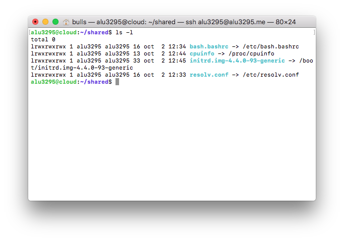

Carlos Javier Oliva Domínguez

**UT1-A2: Listado de directorios**

*Esta actividad consiste en permitir el acceso al contenido de un subdirectorio que llamaremos `shared` dentro de la ruta raíz de Nginx, enlazando una serie de ficheros sobre la información de nuestra máquina.*

Lo primero que haremos será crear una carpeta llamada `shared` en el directorio raíz de nuestro cloud.

- Es aquí donde vamos a enlazar los ficheros que contienen la información de nuestro Servidor.

Lo segundo que haremos será incluir el nuevo Servidor Virtual dentro de la condiguración de nuestro Nginx.

Vamos a incluir dicho Servidor Virtual dentro del archivo `main`, localización donde añadiremos todos los Servidores Virtuales que parten del dominio principal.

- *A este Servidor Virtual le incluiremos la opción `autoindex on;` que nos permitirá listar el contenido del directorio `shared`.*

 * Siguiendo las instrucciones del profesor he creado nuevamente el enlace simbólico puesto que me ha parecido más fácil incluir las configuraciones de los diferentes Servidores Virtuales que tenemos en el dominio principal, en un único archivo, llamado `main`.

Ahora crearemos el enlace simbólico del archivo `main`, que recordemos contiene la información de los Servidores Virtuales de nuestro cloud.

El siguiente paso será enlazar el contenido de los archivos propuestos por el profesor, a la carpeta shared.

Mediante el comando `ln-s` comprobamos que los enlaces simbólicos se han creado correctamente.

También podemos usar el comando `tree` para ver la estructura del directorio shared.

Finalmente, comprobamos el resultado de lo que hemos hecho anteriormente, accediendo a `alu3295.me/shared`. Como podemos ver aparecen los ficheros que hemos enlazado en la carpeta shared.

