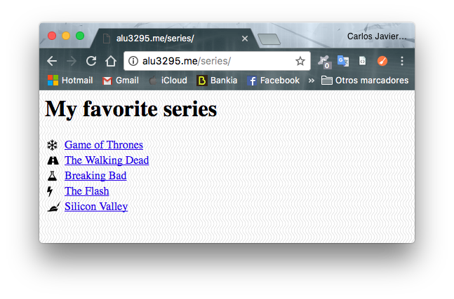

CARLOS JAVIER OLIVA DOMÍNGUEZ

**UT1-A1: Mis series favoritas**

*La sigueinte actividad consiste en la creación de una página web para que nos enlace a nuestras 5 series favoritas, para ello usaremos `Hosts Virtuales`*

**Preparando la página**

Lo primero que haremos será crear una carpeta llamada `series` en el directorio principal de nuestra web.

Lo segundo que haremos será crear un index para que muestre las series que vamos a añadir posteriormente.

En mi caso voy a crear algo sencillo, puesto que no vamos a necesitar una página tan sofisticada para esta práctica, simplemente necesitamos que se muestre una lista con nuestras series favoritas.

A fin de dar un poco de estilo vamos a añadir un fondo que descargaremos del sitio web recomendado por el profesor.

- Aunque primero vamos a crear una carpeta dentro del directorio `series`a la que llamaremos `img`, carpeta en la que guardaremos todas las imágenes que vamos a usar.

- También, vamos a descargar una imágen que vamos a usar de fondo, la descargaremos de la página de recursos proporcionada por el profesor, mediante el comando `wget`.

- También añadiremos estilos al documento en general, a fin de darle una mejor estructura y estilo.

**2.0 Configuración Nginx**

*Una vez terminada la creación del directorio para la página `series` y añadidos sus respectivos archivos, vamos a proceder a habilitar el `Servidor Virtual` dentro de la configuración de `Nginx`.*

Lo primero que haremos será crear un archivo dentro del directorio `sites-available` que contendrá la configuración de nuestra página `series`.

Dicho archivo se llamará `main` y va a contener todas las configuraciones de los `Servidores Virtuales` que tenemos hasta el momento y los que vayamos a crear en el futuro.

* *En este archivo de configuración (main) sólo se van a incluir los servidores en el mismo nivel del dominio principal.*

Dicho archivo está compuesto de la siguiente configuración.

Ahora vamos a hacer un `Enlace simbólico` del archivo main, desde `sites-available` a `sites-enabled`.

Ahora vamos a reiniciar el servicio para que todas las configuraciones tengan efecto.

Finalmente comprobamos el resultado, para ello nos dirigimos `alu3295.me/series`.

Como podemos comprobar las configuraciones efectuadas con anterioridad nos han permitido crear una página dentro de nuestra web con la información de mis series favoritas.
